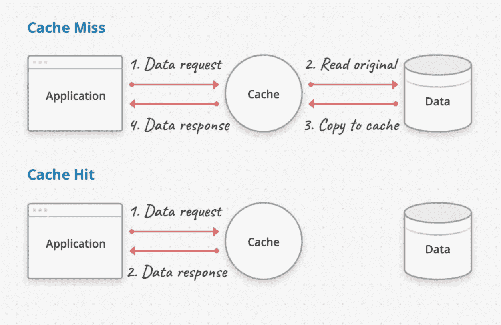
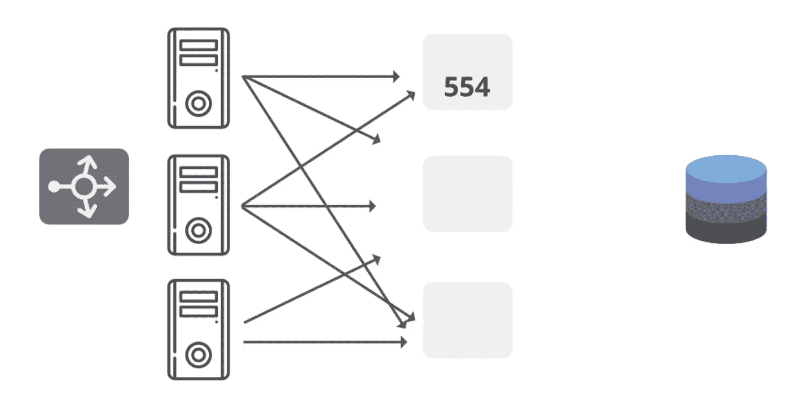
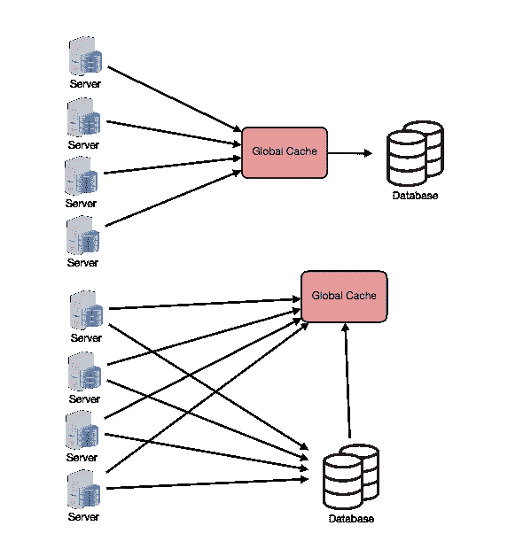
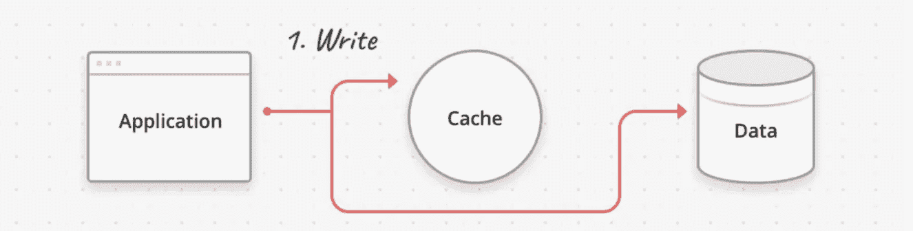
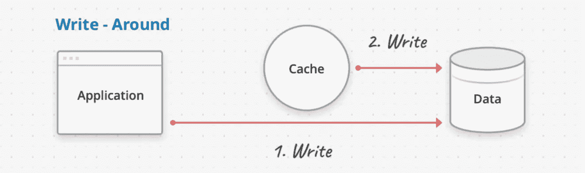
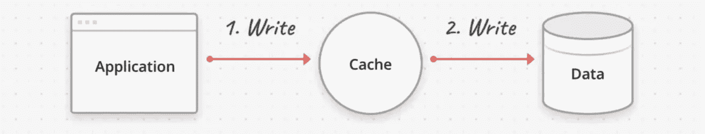

# 系统设计基础:缓存

> 原文：<https://medium.com/geekculture/system-design-basics-caching-46b1614915f8?source=collection_archive---------5----------------------->

## 分布式系统中的缓存介绍

Cache by iData

**什么是缓存？**

缓存是一个小内存、快速访问的本地存储，我们在其中存储频繁访问的数据。缓存是一种将常用应用程序数据的副本存储在更小、更快的内存层中的技术，目的是缩短数据检索时间、提高吞吐量和降低计算成本。

**我们为什么要使用缓存？**

缓存基于局部性原则。这意味着频繁访问的数据被保存在系统附近。这两种位置是:

*   **时间局部性**，最近被引用的数据有可能再次被引用(即*基于时间的*局部性)。
    短时间内重复引用相同的数据。
*   **空间局部性**，其中存储在最近引用的数据附近的数据也可能被再次引用(即*基于空间的*局部性)
    它仅指在内存中一起关闭的数据项。存储在一个数组中的数据

**缓存是如何工作的？**

当请求到达系统时，可能有两种情况。如果数据的副本存在于缓存中，这被称为 ***缓存命中*** ，当数据必须从主数据存储中取出时，这被称为 ***缓存未命中*** 。缓存的性能由请求总数中的缓存命中数来衡量。

Working of Cache

**缓存类型**

*   ***应用服务器缓存*** :直接在应用服务器上放置缓存，可以实现响应数据的本地存储。每次向服务发出请求时，服务器都会返回本地缓存的数据(如果存在的话)。如果它不在缓存中，请求节点将从主存储中查询数据。缓存可以位于内存(非常快)和节点的本地磁盘(比访问网络存储更快)。当你有一个分布式系统时，这种缓存的问题就出现了。这导致了大量的缓存缺失，因为每个实例都有自己的缓存，其中不包含其他实例的信息。
*   ***分布式缓存*** :每个节点将拥有整个缓存空间的一部分，然后使用一致性哈希函数将每个请求路由到可以找到缓存请求的地方。
    高速缓存使用一致的散列法进行划分，并且每个请求可以被路由到包含其响应的节点。

Distributed Cache

*   ***全局缓存*** :全局缓存是服务器实例前面的单个缓存。这对于所有实例都是通用的，如果数据不在缓存中，它会从主存储中获取数据。它增加了延迟，但具有显著提高缓存性能的优势。

Global cache in a distributed system

*   ***CDN*** : CDN(内容分发网络)用于提供大量静态内容的地方。响应可以是 HTML 文件、CSS 文件、JavaScript 文件、图片、视频等。首先，向 CDN 请求数据，如果存在，那么数据将被返回。如果没有，CDN 将查询后端服务器，然后在本地缓存。

**缓存写入策略**

**缓存策略**是一组规则，它定义了数据将如何从缓存中加载(和逐出)。缓存由数据副本组成，因此是临时存储，因此在写入时，我们需要决定何时写入缓存，何时写入主数据存储。

最常见的缓存写入策略如下:

*   ***直写缓存*** :在这种方案下，数据同时写入缓存和对应的数据库。缓存可确保快速检索，并且由于数据是同时写入缓存和主数据存储中的，因此具有完全的一致性。
    然而，由于每个写入操作都必须执行两次，因此会导致更多延迟。

Write Through Caching

*   ***写绕缓存*** :在写绕缓存中，数据直接写入主数据存储。缓存反过来检查主数据存储，以保持自身同步。这里有一个缺点，缓存有时可能落后于主存储，但主数据存储始终保持一致，抵消了增加的延迟。

Write around caching

*   ***回写缓存*** :回写缓存中数据先写入缓存，再写入主数据存储。这里可能有两种情况，要么在缓存后直接更新主存储，要么在删除条目后保留缓存内存(如果缓存内存已满)。在这种情况下，该条目用一个**脏位**标记，以标记数据不同步。
    回写缓存容易丢失数据，应仅在写入速度非常重要的写入密集型操作中使用。

Write Back Caching

**缓存回收策略**

缓存回收策略定义了一组规则，这些规则决定了当缓存已满并且要添加新条目时，必须删除哪些数据。
良好的替换策略将确保缓存数据尽可能与应用相关，也就是说，它利用局部性原则来优化缓存命中。
因此，缓存回收策略只能根据缓存中存储的数据来定义。一些流行的缓存回收算法有:

*   先进先出(FIFO):这个缓存清除缓存中的第一个条目，不管它被调用了多少次
*   最近最少使用(LRU):首先逐出最近最少使用的项目。
*   最近使用(MRU):首先逐出最近使用的项目。
*   最少使用(LFU):统计从高速缓存中读取条目的频率。那些最不常用的首先被丢弃。
*   随机替换(RR):随机选择一个候选物品，并在必要时丢弃它以腾出空间。

**Redis:分布式缓存**

redis

Redis 是内存中的数据存储，最常用作分布式缓存。它提供了各种高效的数据结构，旨在允许快速访问您的数据。在大多数分布式系统中，它被用作缓存机制。

Redis 还可以选择保存到磁盘上，这样，如果服务器重新启动，缓存就不会丢失。Redis 也可以构建在跨多个服务器分布缓存的集群中。从技术上来说，Redis 甚至还可以用作主数据库，尽管我们更经常地将它用作缓存，以减少更多功能丰富的数据库的负载，这些数据库旨在持久存储数据。

Redis 是用 C 语言编写的，所以它不像基于 java 的同类软件如 [Hazelcast](https://hazelcast.com/resources/?topic=caching) 那样具有多线程功能。Redis 的独特之处在于它支持其他数据结构，如排序集、散列集和发布/订阅机制。它还可以通过 lua 脚本进行扩展。它可能是这两种产品中最受欢迎和使用最广泛的。尤其是在 Java 生态系统之外。

恭喜你坚持到最后！在 [*Twitter*](https://twitter.com/bot_pragmatic) ， [Github](https://github.com/abinator-1308/abinator-1308) ， [*Medium*](/@abhinav.as1308) ， [*LinkedIn*](https://www.linkedin.com/in/abinator-1308/) 或 [*Instagram*](https://www.instagram.com/abinator_1308/) 上随意谈论科技或任何很酷的项目。

感谢阅读！

**参考文献**

*   [https://igotanoffer . com/blogs/tech/caching-system-design-interview](https://igotanoffer.com/blogs/tech/caching-system-design-interview)
*   [https://www . geeks forgeeks . org/caching-system-design-concept-for-初学者/](https://www.geeksforgeeks.org/caching-system-design-concept-for-beginners/)
*   [https://www . wwt . com/article/the-power of-distributed-caching-with-redis](https://www.wwt.com/article/the-power-of-distributed-caching-with-redis)
*   [纳伦德拉·L](https://medium.com/u/37d1116a0a41?source=post_page-----46b1614915f8--------------------------------):[https://www.youtube.com/watch?v=DUbEgNw-F9c](https://www.youtube.com/watch?v=DUbEgNw-F9c)
*   [https://www.youtube.com/watch?v=U3RkDLtS7uY](https://www.youtube.com/watch?v=U3RkDLtS7uY)