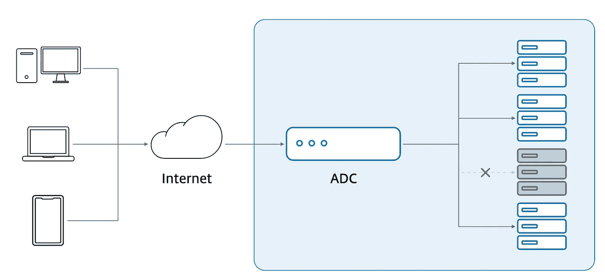
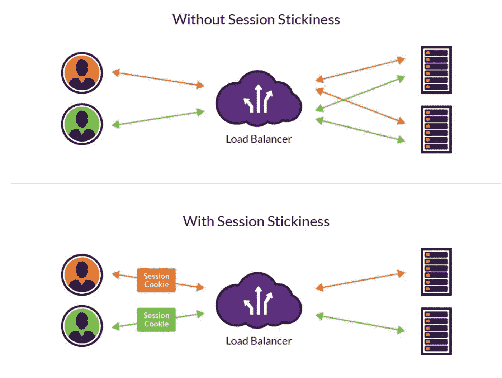
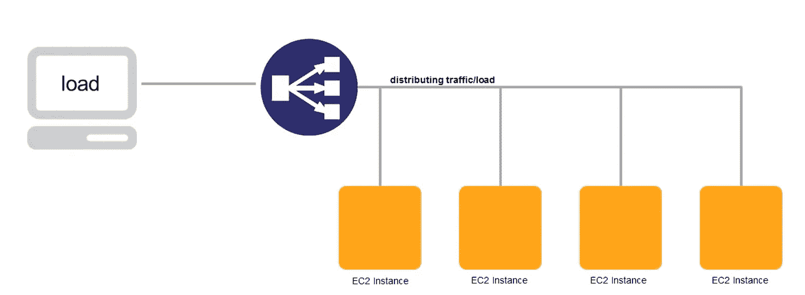
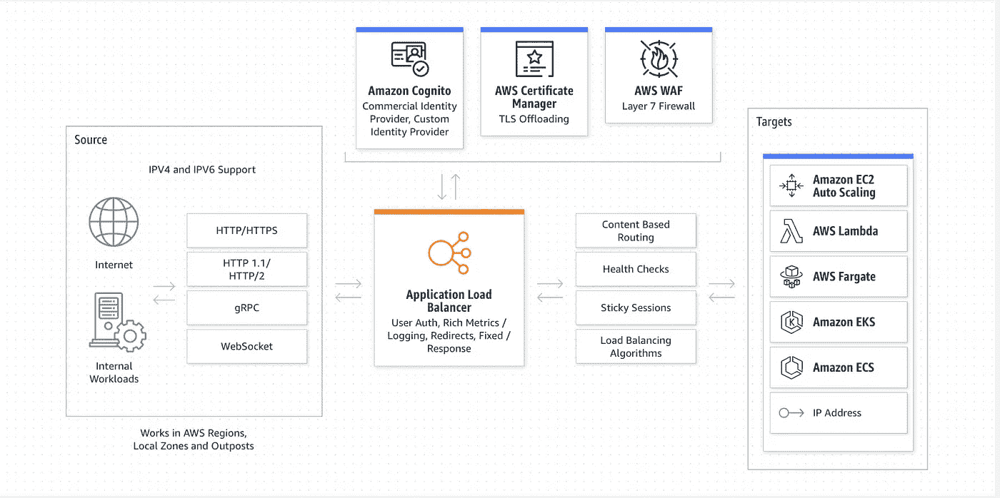
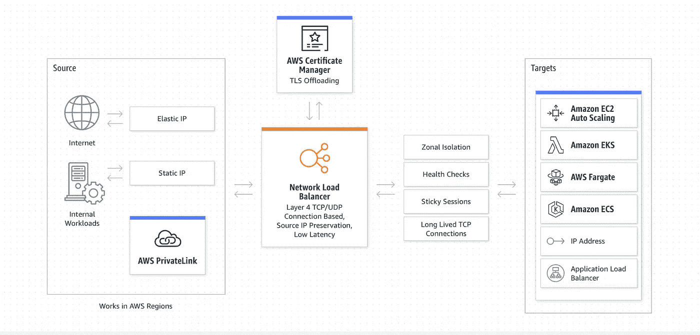
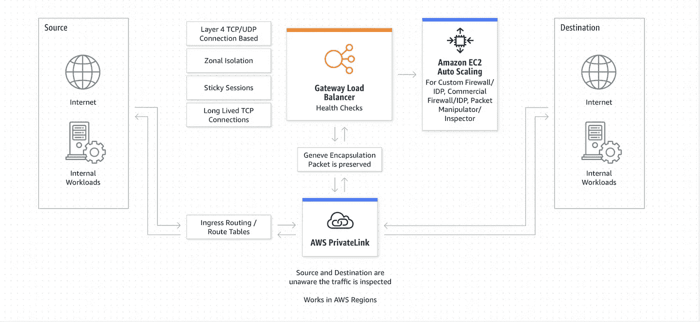

# 系统设计基础:负载平衡器

> 原文：<https://medium.com/geekculture/system-design-basics-load-balancer-5aa1c6b0f88d?source=collection_archive---------4----------------------->

## 面向初学者的负载平衡器介绍

Photo by [Joshua Woroniecki](https://unsplash.com/@joshua_j_woroniecki?utm_source=medium&utm_medium=referral) on [Unsplash](https://unsplash.com?utm_source=medium&utm_medium=referral)

## 什么是负载平衡？

负载平衡指的是有效管理一组服务器之间的流量，也称为*服务器群*或*服务器池*。每个负载平衡器位于客户端设备和后端服务器之间，接收传入的请求，然后将其分发到任何能够满足这些请求的可用服务器。

## **什么是负载平衡器？**

负载平衡器是一种充当反向代理的设备，它将网络或应用程序流量分布在多个后端服务器上。它用于通过提高可用性和性能来增加分布式系统的并发能力。它通过减少与管理和维护应用程序和网络会话相关的服务器负担，以及通过执行特定于应用程序的任务，提高了应用程序的整体性能。

负载平衡器分为两个不同的组:第 4 层和第 7 层。第 4 层对应于网络层(网络和传输层)的负载平衡，优化通过 IP、TCP、FTP 等协议的数据包流。第 7 层工作在应用层，优化 HTTP 请求、API 等。

负载平衡器可以是:

*   分布式系统中运行的物理设备或虚拟实例
*   集成到应用交付控制器(ADC)中，旨在更广泛地提高微服务级别的性能和安全性。
*   几个负载平衡器的聚合，基于系统中的用例运行不同的算法。

Load Balancer in a distributed system

## **负载平衡算法**

用于负载平衡的一些算法有:

*   *:请求以循环方式依次重定向到不同的服务器(一个接一个)*
*   ****最少连接数*** :请求发送到请求数最少的后端服务器。当决定请求应该发送到哪里时，考虑相对的计算能力*
*   ****IP 哈希*** :后端服务器的映射是用客户端 IP 地址完成的。基于客户端请求的 IP，选择后端服务器。这种策略用于某些特定服务器优先于其他服务器的情况。*

## ***粘性会话***

*会话粘性或会话持久性是一种机制，负载平衡器可以通过这种机制将请求耦合到后端系统。这确保了同一会话的不同请求可以由不同的服务器处理，而不会丢失信息。*

**

*Working of Sticky Sessions*

*粘性会话的优点是分布式系统中的服务器之间不需要交互。每个系统都可以独立工作。此外，RAM 高速缓存的利用也带来了更好的响应能力。*

*但是这也不是没有缺点。服务器可能会因会话过多而过载，或者如果服务器在会话中途移动，可能会导致数据丢失。由于一个中央负载平衡器，还会增加延迟。*

## ***弹性负载平衡器***

*一个[**【ELB】**](https://avinetworks.com/product-benefits)弹性负载均衡器可以根据实时流量自动伸缩负载均衡器和应用。ELB 自动在一个或多个可用性区域(az)中的多个目标和虚拟设备之间分发传入的应用流量。*

*它使用系统运行状况检查来了解应用程序池成员(应用程序服务器)的状态，并将流量适当地路由到可用的服务器，管理到高可用性目标的故障切换，或者自动增加容量。*

*随着流量的增加，ELBs 会扩展您的负载平衡器。负载平衡器充当所有传入请求的联系点，监视实例的健康状况可以在它们之间分配负载。*

**

*AWS Elastic Load Balancer*

*弹性负载平衡自动将传入的应用流量分布在多个服务器实例上。它使您能够在应用程序中实现更高级别的容错，无缝地提供分发应用程序流量所需的负载平衡容量。*

*弹性负载平衡检测不健康的实例，并自动将流量重新路由到健康的实例，直到不健康的实例被恢复。客户可以在单个或多个可用性区域内实现弹性负载平衡，以获得更加一致的应用性能。*

*elb 在系统中可以配置为三个级别:*

*   *应用程序负载平衡器:应用程序负载平衡器最适合应用程序级别的负载平衡(HTTP/HTTPS 请求)。它提供了针对现代应用架构交付的高级请求路由，包括微服务和容器。*

**

*Application Load Balancer*

*   *网络负载平衡器:这是在网络层完成的。它最适合于传输控制协议(TCP)、用户数据报协议(UDP)和传输层安全性(TLS)流量的负载平衡，这些流量需要极高的性能。*

**

*Network Load Balancer*

*   *网关负载平衡器:网关负载平衡器使部署、扩展和运行第三方虚拟网络设备变得容易。网关负载平衡器为第三方设备群提供负载平衡和自动扩展，对流量的来源和目的地是透明的。这一功能使其非常适合与安全、网络分析和其他用例的第三方设备配合使用。*

**

*Gateway Load Balancer*

*恭喜你坚持到最后！在 [*Twitter*](https://twitter.com/bot_pragmatic) ， [Github](https://github.com/abinator-1308/abinator-1308) ， [*Medium*](/@abhinav.as1308) ， [*LinkedIn*](https://www.linkedin.com/in/abinator-1308/) 或 [*Instagram*](https://www.instagram.com/abinator_1308/) 上随意谈论技术或任何很酷的项目。*

*感谢阅读！*

***参考文献***

*   *[思杰云](https://medium.com/u/4bbba4c39259?source=post_page-----5aa1c6b0f88d--------------------------------):[https://www . Citrix . com/en-in/solutions/app-delivery-and-security/load-balancing/what-is-load-balancing . html](https://www.citrix.com/en-in/solutions/app-delivery-and-security/load-balancing/what-is-load-balancing.html)*
*   *[Imperva 研究实验室](https://medium.com/u/b9cef89720de?source=post_page-----5aa1c6b0f88d--------------------------------):[https://www . imper va . com/learn/avail ability/sticky-session-persistence-and-cookies/](https://www.imperva.com/learn/availability/sticky-session-persistence-and-cookies/)*
*   *[https://www . F5 . com/services/resources/glossary/load-balancer](https://www.f5.com/services/resources/glossary/load-balancer)*
*   *[https://www.nginx.com/resources/glossary/load-balancing/](https://www.nginx.com/resources/glossary/load-balancing/)*
*   *[https://aws.amazon.com/elasticloadbalancing/](https://aws.amazon.com/elasticloadbalancing/)*
*   *[https://avinetworks.com/glossary/elastic-load-balancer/](https://avinetworks.com/glossary/elastic-load-balancer/)*

**更多内容请看*[*plain English . io*](http://plainenglish.io/)*