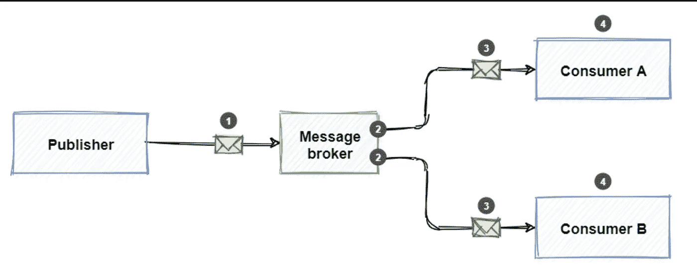
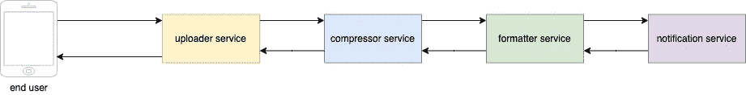
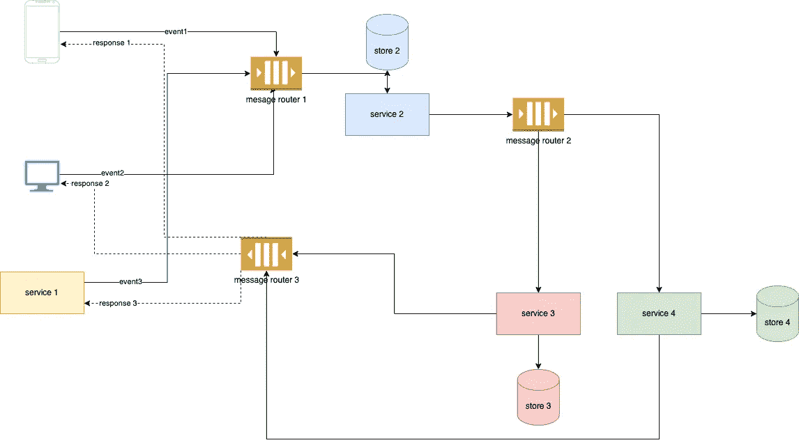
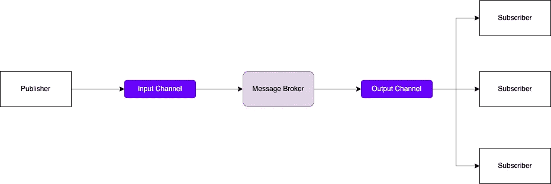

# 系统设计基础:发布/订阅消息

> 原文：<https://medium.com/geekculture/system-design-basics-pub-sub-messaging-88dfd98e67b7?source=collection_archive---------2----------------------->

# **概述**

发布者/订阅者消息传递，或发布/订阅消息传递，是一种异步服务到服务通信的形式，用于无服务器和微服务架构。在发布/订阅模型中，发布到主题的任何消息都会被该主题的所有订阅者立即接收到。发布/订阅消息可用于启用[事件驱动架构](https://aws.amazon.com/event-driven-architecture/)，或分离应用程序以提高性能、可靠性和可扩展性。

Pub/Sub Messaging

# 请求-响应架构的问题

请求-响应体系结构是进行网络调用时最流行和最常用的消息传递系统。ReST 是分布式系统中最常见的消息协议形式之一。客户端发出一个*请求*，由服务器提供一个*响应*。

随着分布式体系结构变得复杂，问题就出现了。多个服务的引入创建了一个强连接组件链。这增加了延迟和等待时间，并且一个组件的故障会导致级联故障。

例如，假设我们有一个 Instagram 卷轴的视频上传服务。您有一个上传服务、一个压缩服务、格式化服务和通知服务，所有这些都使用请求-响应架构进行网络调用。用户上传由上传者服务处理的视频。上传者服务然后触发负责压缩原始视频的压缩器服务。格式器服务然后使用过滤器、音乐等格式化视频。由用户选择。通知服务然后向最终用户提供上传成功的通知。

如果这些系统使用请求-响应消息传递进行交互，随着系统的发展，将会产生一个复杂的连接组件图。用户必须等待，直到每个服务处理请求并提供响应。这将增加延迟。该系统也不能容错，因为任何一项服务的失败都会导致整个链的失败。

# 事件驱动架构

事件驱动架构就是为了解决上述问题而设计的。我们可以通过使用事件来处理信息交换，使系统松散耦合。一个**事件**是一个状态的改变，或者一个更新，就像一个物品被放入电子商务网站的购物车。事件可以携带状态(购买的商品、价格和送货地址)，也可以是标识符(订单已发货的通知)。

事件驱动架构有三个关键组件:事件生产者、事件路由器和事件消费者。生产者向消息路由器发布事件，消息路由器过滤事件并将其推送给消费者。生产者服务和消费者服务是分离的，这允许它们独立地伸缩、更新和部署。

event driven architecture

使用这种架构，我们可以单独扩展每个组件，并使它们具有容错能力。由于消息是异步的，我们不必等待下游服务的响应。

消息路由器或消息代理(在 Kafka 中也称为主题)是一种软件，它使应用程序、系统和服务能够相互通信并交换信息。消息代理通过在正式的消息传递协议之间转换消息来实现这一点。这允许相互依赖的服务直接相互“交谈”,即使它们是用不同的语言编写的或在不同的平台上实现的。

# 发布者-订阅者消息传递

发布者订阅者消息传递，也称为发布者订阅者模式，是一种为交换消息提供框架的消息传递模式。它还允许消息发送者(发布者)和接收者(订阅者)在他们订阅的消息代理上进行松散耦合和伸缩。使用发布/订阅消息的一些常见技术有 RabbitMQ、Kafka、Redis 等。

当消息可用时，发布者会将其发送给订阅者。发布者是向消息代理发送消息的服务。订阅者然后订阅他们感兴趣的消息代理来收听这些消息(类似于用户订阅 YouTube 上的频道)。

Pub-Sub Messaging

发布订阅系统广泛用于我们需要松散耦合/解耦的组件的用例中，这些组件需要单独伸缩。例如:事件通知、分布式缓存、分布式日志等。这些都是这里详细提到的**。**

# *发布-订阅消息的利与弊*

*发布/订阅消息传递有以下好处:*

*   *它分离了仍然需要通信的子系统。子系统可以独立管理，即使一个或多个接收者离线，消息也可以得到适当的管理。这有助于应用程序在负载增加的情况下继续平稳运行，并更有效地处理间歇性故障。*
*   *它增加了可伸缩性并提高了发送方的响应能力。发送方可以快速地将一条消息发送到输入通道，然后返回到其核心处理职责。消息传递基础设施负责确保消息传递给感兴趣的订户。*
*   *它允许延迟或预定的处理。用户可以等到非高峰时段再来取邮件，也可以根据特定的时间表来路由或处理邮件。*
*   *它促进了整个企业中的异步工作流。*

*然而，组件的解耦和消息的异步传输也会导致一些缺点。其中一些是:*

*   *单向通信:发布-订阅系统中的通道被视为单向的。一旦消息被订阅，我们不会向发布者发送确认/回复。*
*   *缺少消息排序:消费者实例接收消息的顺序没有保证，也不一定反映消息创建的顺序。*
*   *没有幂等性:我们需要在应用程序中配置额外的逻辑来处理幂等性。例如，如果一个支付服务为同一笔支付读取了两条消息，那么用户最终会为同一笔交易被收取两次费用。类似地，交易的消息可能在被订阅之前就过期了，并且用户可能不会为该交易付费。*
*   *资源利用过度/利用不足:除非频道/主题设计非常高效，否则资源利用不足/利用过度。*

# *结论*

*当系统中存在解耦/松散连接的组件(如游戏、分布式缓存等)时，发布-订阅消息提供了优势。).在我们需要许多消费者订阅单个发布者(单向系统)的情况下，它们也非常有用。*

*但是这种模式对于可靠性、幂等性和资源利用具有更高优先级的用例也有几个缺点。因此，在设计系统时应该打电话，只有在利大于弊的情况下才使用它进行消息传递。*

*祝贺你坚持到了最后！在[*Twitter*](https://twitter.com/bot_pragmatic)*[*GitHub*](https://github.com/abinator-1308/abinator-1308)*[*Medium*](/@abhinav.as1308)*[*LinkedIn*](https://www.linkedin.com/in/abinator-1308/)*，或者*[*insta gram*](https://www.instagram.com/abinator_1308/)*上随意谈论科技或者任何很酷的项目。*****

**感谢阅读！**

# **参考**

*   **azure Cloud:[https://docs . Microsoft . com/en-us/dot net/architecture/dapr-for-net-developers/publish-subscribe](https://docs.microsoft.com/en-us/dotnet/architecture/dapr-for-net-developers/publish-subscribe)**
*   **[谷歌开发者](https://medium.com/u/991272e72e68?source=post_page-----88dfd98e67b7--------------------------------):【https://www.youtube.com/watch?v=cvu53CnZmGI **
*   **[侯赛因·纳赛尔](https://medium.com/u/e4cbe924ccb?source=post_page-----88dfd98e67b7--------------------------------):[https://www.youtube.com/watch?v=O1PgqUqZKTA](https://www.youtube.com/watch?v=O1PgqUqZKTA)**
*   **高拉夫森:[https://www.youtube.com/watch?v=FMhbR_kQeHw](https://www.youtube.com/watch?v=FMhbR_kQeHw)**
*   **[https://aws.amazon.com/event-driven-architecture/](https://aws.amazon.com/event-driven-architecture/)**
*   **[https://docs . Microsoft . com/en-us/azure/architecture/patterns/publisher-subscriber](https://docs.microsoft.com/en-us/azure/architecture/patterns/publisher-subscriber)**
*   **[https://www.ibm.com/cloud/learn/message-brokers](https://www.ibm.com/cloud/learn/message-brokers)**
*   **[https://ably.com/blog/pub-sub-pattern-examples](https://ably.com/blog/pub-sub-pattern-examples)**