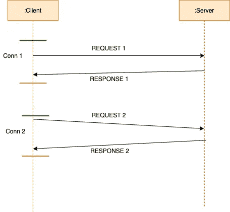
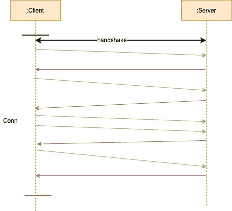

# 系统设计基础:WebSockets

> 原文：<https://medium.com/geekculture/system-design-basics-websockets-80aa2b5d5e52?source=collection_archive---------5----------------------->

## 什么是 WebSockets？它们与传统网络协议有何不同？

**概述**

WebSocket 协议为互联网上的通信创造了新的可能性，并为真正的实时网络打开了大门。

WebSockets 在 2008 年首次被描述，并从 2010 年左右开始享有广泛的浏览器支持。在 WebSockets 出现之前,“实时”web 已经存在，但它很难实现，通常比较慢，并且是通过黑客攻击现有的 web 技术来实现的，这些技术不是为实时应用程序设计的。


WebSocket

**传统的网络交易是如何运作的？**

传统的网络调用(HTTP、REST 等。)以如下方式发生。我们在客户端和服务器之间有一个连接。客户端向服务器发送请求，然后服务器向客户端发回响应。如果客户端想要向服务器发出多个请求，那么将会建立多个连接(串行或并行)。典型的请求-响应服务如下所示:



HTTP Request

为每个请求创建一个单独的连接，该连接在设置响应时结束。

**什么是 WebSockets？**

WebSocket 是服务器和客户端之间通过单一 TCP 连接进行持久实时通信的协议。它提供了一个全双工通信信道，其中数据可以双向发送。

它提供了 **wss** (用于 https)和 **ws** (用于 http)协议来创建 webSockets。wss 协议通过加密的 TLS 连接建立 WebSocket，而 ws 协议使用未加密的连接。此时，网络连接保持打开，可以用来双向发送 WebSocket 消息。



WebSocket Communication Protocol

WebSockets 通常用于需要发送实时连续数据的应用中(股票价格跟踪、日志记录、实时流等)。)或需要双向流媒体时(视频通话、聊天应用等)。)

**WebSocket 通信协议**

*   ***连接*** :客户端与服务器在特定端口建立连接。我们可以利用单个端口来分离 HTTP 服务器和 WebSocket 服务器。一旦创建了 HTTP 服务器，我们就将 WebSocket 服务器绑定到 HTTP 端口。
*   ***WebSocket 握手*** :客户端发送 GET 请求。它类似于普通的 GET 请求，但是在 GET 请求中添加了一个名为 ***的升级头*** 的头。作为响应，服务器返回状态代码 101，这是用于切换协议的代码。这将协议从 HTTP 切换到 WebSocket。
    为了建立 WebSocket 连接，客户端发送 WebSocket 握手请求，服务器返回 WebSocket 握手响应。客户端请求(就像在 HTTP 中一样，每一行都以\r\n 结尾，并且结尾必须有一个额外的空行):

```
GET **/webSocket** **HTTP**/1.1
Host: server.example.com
Upgrade: websocket
Connection: Upgrade
Sec-WebSocket-Key: x3JJHMbDL1EzLkh9GBhXDw==
Sec-WebSocket-Protocol: chat, superchat
Sec-WebSocket-Version: 13
Origin: [http://example.com](http://example.com)
```

服务器返回以下响应:

```
**HTTP**/1.1 101 **Switching Protocols**
Upgrade: websocket
Connection: Upgrade
Sec-WebSocket-Accept: HSmrc0sMlYUkAGmm5OPpG2HaGWk=
Sec-WebSocket-Protocol: chat
```


WebSocket Handshake

*   ***双向消息传递*** :消息可以以任何顺序从服务器和客户端连续发送。
*   ***关闭连接*** :借助 **onclose 事件**可以关闭连接。在 onclose 事件的帮助下标记通信结束后，服务器和客户端之间不能再传输任何消息。

**利弊**

使用 WebSockets 的优点是:

*   ***全双工***:web sockets 最大的优点是握手后保持连接。不需要轮询，因此服务器和客户端可以以最小的开销发送信息。
*   ***兼容 HTTP***:升级头使 WebSockets 兼容 HTTP。这有助于设置代理&,帮助基础设施理解 WebSocket 的存在。
*   ***防火墙友好*** :因为它使用与 HTTP/HTTPS 相同的端口，所以它是防火墙友好的，因为通信是通过单个端口维持的。

然而，WebSockets 带来了一些复杂性:

*   ***代理*** : WebSocket 比较复杂。设置代理，尤其是第 7 层代理，变得非常复杂。这是因为代理破坏了 TCP，因此需要另一个 TCP 连接来维持连接。
*   ***负载均衡*** :由于 WebSockets 没有超时，所以不应该强行终止。如果服务器在缩减过程中关闭，连接将终止，信息不会丢失。数据库需要维护这里的状态，以便在服务器被终止的情况下可以重新建立连接。
*   ***可扩展性*** : WebSockets 是有状态的。这使得扩展变得非常复杂。在保持状态的同时水平扩展应用程序变得非常困难。

**亚马逊 web socket API**

API Gateway 中的 WebSocket API 是与后端 HTTP 端点、Lambda 函数或其他 AWS 服务集成的 WebSocket 路由的集合。您可以使用 API Gateway 特性来帮助您处理 API 生命周期的所有方面，从创建到监控您的生产 API。

API Gateway WebSocket APIs 为您提供了以下方式来将数据从后端服务发送到连接的客户端:

*   集成可以发送一个响应，该响应由您定义的路由响应返回给客户端。
*   您可以使用`@connections` API 来发送 POST 请求。


AWS WebSocket API based Chat Application

**结论**

WebSockets 是在应用程序中实现实时功能的最有趣和最方便的方式之一。它为我们利用全双工通信提供了很大的灵活性。

然而，它也有自己的一套复杂之处，应该只在优势大于劣势时使用。除非双向通信是绝对必要的，否则 HTTP 更可靠。

*祝贺你坚持到了最后！在* [*Twitter*](https://twitter.com/bot_pragmatic) *，*[*GitHub*](https://github.com/abinator-1308/abinator-1308)*，*[*Medium*](/@abhinav.as1308)*，*[*LinkedIn*](https://www.linkedin.com/in/abinator-1308/)*，或者*[*insta gram*](https://www.instagram.com/abinator_1308/)*。*

感谢阅读！

# 参考

*   [技术入门](https://medium.com/u/85b52c85aeb7?source=post_page-----80aa2b5d5e52--------------------------------):[https://www.youtube.com/watch?v=i5OVcTdt_OU](https://www.youtube.com/watch?v=i5OVcTdt_OU)
*   [侯赛因·纳赛尔](https://medium.com/u/e4cbe924ccb?source=post_page-----80aa2b5d5e52--------------------------------):[https://www.youtube.com/watch?v=2Nt-ZrNP22A](https://www.youtube.com/watch?v=2Nt-ZrNP22A)
*   [https://blog . log rocket . com/web sockets-tutorial-how-to-go-real-time-with-node-and-react-8e 4693 fbf 843/](https://blog.logrocket.com/websockets-tutorial-how-to-go-real-time-with-node-and-react-8e4693fbf843/)
*   [https://en.wikipedia.org/wiki/WebSocket](https://en.wikipedia.org/wiki/WebSocket)
*   [https://docs . AWS . Amazon . com/API gateway/latest/developer guide/API gateway-web socket-API . html](https://docs.aws.amazon.com/apigateway/latest/developerguide/apigateway-websocket-api.html)