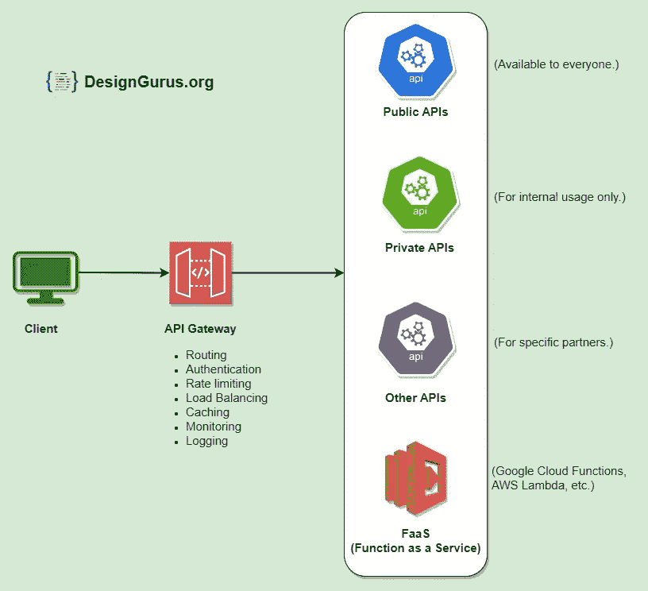

# 系统设计基础:什么是 API 网关？

> 原文：<https://medium.com/geekculture/system-design-basics-what-is-an-api-gateway-b858e9491608?source=collection_archive---------0----------------------->

了解如何在设计中添加 API 网关。

API Gateway

API 网关是一个服务器，充当一组微服务的单一入口点。

它接收客户机请求，将它们转发给适当的微服务，然后将服务器的响应返回给客户机。

API 网关负责路由、认证和速率限制等任务。这使得微服务能够专注于它们各自的任务，并提高系统的整体性能和可扩展性。

# 使用

API 网关在微服务架构中有多种用途，包括:

1.  **路由:**API 网关接收来自客户端的请求，并将它们路由到适当的微服务。这使得客户能够通过单一入口访问各种微服务，简化了整个[系统设计](https://levelup.gitconnected.com/system-design-interview-survival-guide-2023-preparation-strategies-and-practical-tips-ba9314e6b9e3)。
2.  **认证和授权:**API 网关可用于认证客户端，并对微服务实施访问控制策略。这有助于确保只有授权的客户端才能访问微服务，并有助于防止未经授权的访问。
3.  **速率限制:**您可以使用 API 网关对客户端访问微服务进行速率限制。这有助于防止拒绝服务攻击和其他类型的恶意行为。
4.  **负载均衡:**API gateway 可以在多个微服务实例之间分配传入的请求，使系统能够处理更多的请求，提高整体性能和可扩展性。
5.  **缓存:**API 网关可以缓存来自微服务的响应，减少需要转发给微服务的请求数量，提高系统整体性能。
6.  **监控:**API 网关可以收集关于请求和响应的指标和其他数据，从而提供对微服务的性能和行为的有价值的洞察。这有助于识别和诊断问题，并提高系统的整体可靠性和弹性。
7.  **转换**:API 网关可用于将从微服务接收的数据转换成更方便客户端使用的格式。这可能包括在不同数据格式(如 XML 和 JSON)之间转换，或者将来自多个微服务的数据聚合到单个响应中。
8.  **请求和响应验证:**API 网关可用于验证来自微服务的请求和响应，以确保它们符合预期的格式和结构。这有助于防止错误，并确保微服务正常运行。
9.  **服务发现:**API 网关可用于发现可用的微服务及其位置，使客户端无需知道它们的具体地址即可访问它们。这可以更容易地添加新的微服务或对现有的微服务进行更改，而不会影响客户端。
10.  **断路器:**API 网关可用于实现断路器模式，这有助于防止单个微服务故障导致整个系统瘫痪。断路器可以监控微服务的健康状况，并在必要时自动故障转移到备用服务。

# 使用 API 网关的优势

以下是使用 API Gateway 的一些优势:

1.  **提高性能:**通过处理路由和负载平衡等任务，API 网关可以提高系统的整体性能，使其能够处理更多的请求并更快地响应客户端。
2.  **简化的系统设计:**通过为客户端提供单一入口点，API 网关简化了整体系统设计，使客户端更容易访问各种微服务。
3.  **增强的安全性:**API 网关可用于实施认证和访问控制策略，有助于防止未经授权的访问并提高系统的安全性。
4.  **改进的可伸缩性:**API 网关可以在微服务的多个实例之间分配传入的请求，使系统更容易伸缩并处理更多的请求。
5.  **更好的监控和可见性:**API 网关可以收集关于请求和响应的度量和其他数据，从而提供对系统性能和行为的有价值的洞察。这有助于识别和诊断问题，并提高系统的整体可靠性和弹性。

# 使用 API 网关的缺点

使用 API 网关也有一些潜在的缺点，包括:

1.  **复杂性增加:**使用 API 网关会给系统增加一层额外的复杂性，这使得管理和维护更加困难。
2.  **性能开销:**API 网关会引入一些性能开销，因为它向客户端必须经过的请求-响应路径添加了一个额外的层。
3.  **单点故障:**如果设计和实现不当，API 网关可能会成为单点故障。这可能会影响系统的整体可靠性和可用性。

# 结论

总的来说，API 网关提供了一种方便灵活的方式来管理和控制对微服务架构中的微服务的访问。它们使微服务能够专注于各自的任务，并提高系统的整体性能、可伸缩性和可靠性。

➡在“ [**探索系统设计面试**](https://www.designgurus.io/course/grokking-the-system-design-interview)**”****[**探索高级系统设计面试**](https://www.designgurus.io/course/grokking-the-advanced-system-design-interview) 中了解更多关于系统设计面试的信息**

**➡在 Linkedin 上关注我，了解系统设计和编码面试的技巧。**

** [## 系统设计面试:是什么让你与众不同？

### 系统设计面试的目的是评估你从头到尾设计完整系统的能力…

designgurus.org](https://designgurus.org/blog/sys-design-distinguishes)  [## 赢得系统设计面试的完整指南

### 回答任何系统设计面试问题的 7 步流程。系统设计面试问题旨在…

designgurus.org](https://designgurus.org/blog/complete-guide-sys-design)**