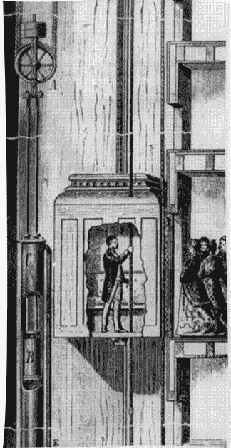
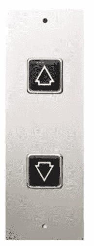
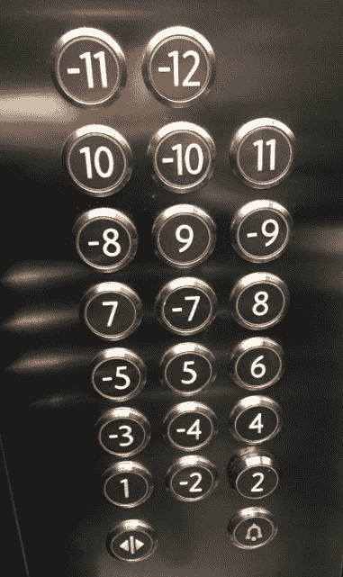
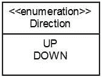
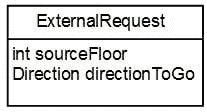
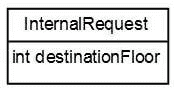
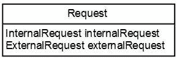
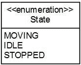
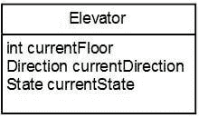
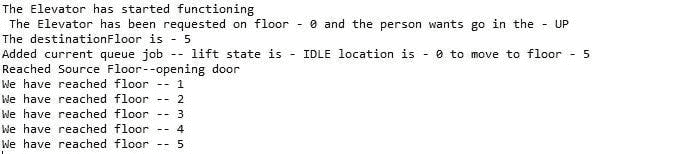

# 系统设计—电梯系统设计面试问题

> 原文：<https://medium.com/geekculture/system-design-elevator-system-design-interview-question-6e8d03ce1b44?source=collection_archive---------0----------------------->

系统设计问题现在是各种组织面试过程中的常规部分。他们测试个人的设计能力，可视化，模拟真实世界的场景，使用正确的数据结构，应用设计模式。这些问题通常是开放式的。通常面试官会要求应聘者使用白板来设计系统。它甚至可能是一种结对编程，面试官也给出他的输入。所需设计方案的深度取决于面试官。如果只涉及课程和解释设计概述，一些面试官可能会满意。有些可能会深入到实现细节中。因此，在本教程中，我们将设计一个电梯系统，并实施实际的解决方案。



录像

本教程我们将分为 5 个部分-

*   讨论我们将如何模拟电梯设计
*   确定所涉及的类别
*   电梯设计规范—迭代 1
*   电梯设计规范—迭代 2
*   电梯设计规范—第三次迭代

# 模拟电梯设计

我们将模拟这个场景-

*   一个人在特定的楼层。假设在一楼。他想去 5 楼。所以他点击了电梯按钮。



*   我们称之为外部请求。该请求将具有用户已经按下按钮的方向和楼层，即源楼层。电梯将检查可用的请求(如果有的话),然后根据某个优先级处理该请求。电梯到达源楼层，即第 0 层或底层。这个人进入电梯。
*   这个人进入电梯。然后，该人按下电梯中的 5 楼按钮，以指示电梯前往 5 楼。



*   这将是内部请求。因此，内部请求将仅具有该人想要去的楼层，即目的地楼层。电梯运行到五楼。然后这个人走出电梯。
*   假设电梯从一楼到五楼，到达一楼。此时，假设二楼的另一个人想向上走。然后，电梯将因这一请求而停止，二楼的人将进入电梯。假设他按了 4 楼的按钮。那么电梯将首先停在 4 楼，这是从二楼进入的人的目的地。后来电梯停在五楼，一楼的人走了出来。
*   假设电梯从一楼到五楼，到达一楼。此时，假设二楼的另一个人想让电梯往下走。那么电梯不会立即为这个请求而停止。电梯将首先到达五楼，一楼的人将从那里出去。电梯然后会去二楼。这个人将进入电梯并按 0。然后电梯将移动到零层。

# 确定所涉及的类别

*   **枚举方向** —该枚举将有两个值 UP 和 DOWN。



*   **类外部请求** —当楼层人员通过按下上行或下行按钮请求乘坐电梯时，他所做出的请求。它将具有字段 enum Direction 和 integer sourceFloor。



*   **类内部要求**——人进入电梯时提出的要求。这个人按下他想去的楼层号码。这将是整数 destinationFloor。



*   **类请求** —这个类将是 ExternalRequest 和 InternalRequest 的封装。我们将把这个请求传递给电梯进行处理。所以这个类将有两个字段——external request 和 InternalRequest。



*   **枚举状态** —该枚举将有三个值:移动、停止和空闲。



*   **电梯** —这个类将代表电梯。它将具有字段 currentFloor、currentState 和 currentDirection。



# 电梯设计规范—迭代 1

在第一次迭代中，我们将创建我们之前确定的类。

```
package com.javastructures;class Elevator {
	private int currentFloor = 0;
	private Direction currentDirection = Direction.UP;
	private State currentState = State.IDLE;
}enum State { MOVING, STOPPED, IDLE}enum Direction { UP, DOWN}class Request implements Comparable<Request> {
	private InternalRequest internalRequest;
	private ExternalRequest externalRequest; public Request(InternalRequest internalRequest, ExternalRequest externalRequest) {
		this.internalRequest = internalRequest;
		this.externalRequest = externalRequest;
	} public InternalRequest getInternalRequest() {
		return internalRequest;
	} public void setInternalRequest(InternalRequest internalRequest) {
		this.internalRequest = internalRequest;
	} public ExternalRequest getExternalRequest() {
		return externalRequest;
	} public void setExternalRequest(ExternalRequest externalRequest) {
		this.externalRequest = externalRequest;
	} @Override
	public int compareTo(Request req) {
		if (this.getInternalRequest().getDestinationFloor() == req.getInternalRequest().getDestinationFloor())
			return 0;
		else if (this.getInternalRequest().getDestinationFloor() > req.getInternalRequest().getDestinationFloor())
			return 1;
		else
			return -1;
	}}class ExternalRequest { private Direction directionToGo;
	private int sourceFloor; public ExternalRequest(Direction directionToGo, int sourceFloor) {
		this.directionToGo = directionToGo;
		this.sourceFloor = sourceFloor;
	} public Direction getDirectionToGo() {
		return directionToGo;
	} public void setDirectionToGo(Direction directionToGo) {
		this.directionToGo = directionToGo;
	} public int getSourceFloor() {
		return sourceFloor;
	} public void setSourceFloor(int sourceFloor) {
		this.sourceFloor = sourceFloor;
	}}class InternalRequest {
	private int destinationFloor; public InternalRequest(int destinationFloor) {
		this.destinationFloor = destinationFloor;
	} public int getDestinationFloor() {
		return destinationFloor;
	} public void setDestinationFloor(int destinationFloor) {
		this.destinationFloor = destinationFloor;
	}}public class TestElevator { public static void main(String args[]) { Elevator elevator = new Elevator();

		//person wants to go in up direction from source floor 0
		ExternalRequest er = new ExternalRequest(Direction.UP, 0);

		//the destination floor is 5
		InternalRequest ir = new InternalRequest(5);  Request request1 = new Request(ir, er); }}
```

# 电梯设计规范—迭代 2

在第二次迭代中，我们将添加启动电梯和处理任何作业(如果可用)的逻辑

```
package com.javastructures;

import java.util.TreeSet;

class Elevator {
	private Direction currentDirection = Direction.UP;
	private State currentState = State.IDLE;
	private int currentFloor = 0;

	**/**
	 * jobs which are being processed
	 */
	private TreeSet<Request> currentJobs = new TreeSet<>();
	/**
	 * up jobs which cannot be processed now so put in pending queue
	 */
	private TreeSet<Request> upPendingJobs = new TreeSet<>();
	/**
	 * down jobs which cannot be processed now so put in pending queue
	 */
	private TreeSet<Request> downPendingJobs = new TreeSet<>();

	public void startElevator() {
		while (true) {

			if (checkIfJob()) {

				if (currentDirection == Direction.UP) {
					Request request = currentJobs.pollFirst();
					processUpRequest(request);
					if (currentJobs.isEmpty()) {
						addPendingDownJobsToCurrentJobs();

					}

				}
				if (currentDirection == Direction.DOWN) {
					Request request = currentJobs.pollLast();
					processDownRequest(request);
					if (currentJobs.isEmpty()) {
						addPendingUpJobsToCurrentJobs();
					}

				}
			}
		}
	}

	public boolean checkIfJob() {

		if (currentJobs.isEmpty()) {
			return false;
		}
		return true;

	}

	private void processUpRequest(Request request) {
		// The elevator is not on the floor where the person has requested it i.e. source floor. So first bring it there.
		int startFloor = currentFloor;
		if (startFloor < request.getExternalRequest().getSourceFloor()) {
			for (int i = startFloor; i <= request.getExternalRequest().getSourceFloor(); i++) {
				try {
					Thread.sleep(1000);
				} catch (InterruptedException e) {
					// TODO Auto-generated catch block
					e.printStackTrace();
				}
				System.out.println("We have reached floor -- " + i);
				currentFloor = i;
			}
		}
		// The elevator is now on the floor where the person has requested it i.e. source floor. User can enter and go to the destination floor.
		System.out.println("Reached Source Floor--opening door");

		startFloor = currentFloor;

		for (int i = startFloor; i <= request.getInternalRequest().getDestinationFloor(); i++) {
			try {
				Thread.sleep(1000);
			} catch (InterruptedException e) {
				// TODO Auto-generated catch block
				e.printStackTrace();
			}
			System.out.println("We have reached floor -- " + i);
			currentFloor = i;
			if (checkIfNewJobCanBeProcessed(request)) {
				break;
			}
		}

	}

	private void processDownRequest(Request request) {

		int startFloor = currentFloor;
		if (startFloor < request.getExternalRequest().getSourceFloor()) {
			for (int i = startFloor; i <= request.getExternalRequest().getSourceFloor(); i++) {
				try {
					Thread.sleep(1000);
				} catch (InterruptedException e) {
					// TODO Auto-generated catch block
					e.printStackTrace();
				}
				System.out.println("We have reached floor -- " + i);
				currentFloor = i;
			}
		}

		System.out.println("Reached Source Floor--opening door");

		startFloor = currentFloor;

		for (int i = startFloor; i >= request.getInternalRequest().getDestinationFloor(); i--) {
			try {
				Thread.sleep(1000);
			} catch (InterruptedException e) {
				// TODO Auto-generated catch block
				e.printStackTrace();
			}
			System.out.println("We have reached floor -- " + i);
			currentFloor = i;
			if (checkIfNewJobCanBeProcessed(request)) {
				break;
			}
		}

	}

	private boolean checkIfNewJobCanBeProcessed(Request currentRequest) {
		if (checkIfJob()) {
			if (currentDirection == Direction.UP) {
				Request request = currentJobs.pollFirst();
				if (request.getInternalRequest().getDestinationFloor() < currentRequest.getInternalRequest()
						.getDestinationFloor()) {
					currentJobs.add(request);
					currentJobs.add(currentRequest);
					return true;
				}
				currentJobs.add(request);

			}

			if (currentDirection == Direction.DOWN) {
				Request request = currentJobs.pollLast();
				if (request.getInternalRequest().getDestinationFloor() > currentRequest.getInternalRequest()
						.getDestinationFloor()) {
					currentJobs.add(request);
					currentJobs.add(currentRequest);
					return true;
				}
				currentJobs.add(request);

			}

		}
		return false;

	}

	private void addPendingDownJobsToCurrentJobs() {
		if (!downPendingJobs.isEmpty()) {
			currentJobs = downPendingJobs;
			currentDirection = Direction.DOWN;
		} else {
			currentState = State.IDLE;
		}

	}

	private void addPendingUpJobsToCurrentJobs() {
		if (!upPendingJobs.isEmpty()) {
			currentJobs = upPendingJobs;
			currentDirection = Direction.UP;
		} else {
			currentState = State.IDLE;
		}

	}

}

class ProcessJobWorker implements Runnable {

	private Elevator elevator;

	ProcessJobWorker(Elevator elevator) {
		this.elevator = elevator;
	}

	@Override
	public void run() {
		/**
		 * start the elevator
		 */
		elevator.startElevator();
	}

}**

class ExternalRequest {

	private Direction directionToGo;
	private int sourceFloor;

	public ExternalRequest(Direction directionToGo, int sourceFloor) {
		this.directionToGo = directionToGo;
		this.sourceFloor = sourceFloor;
	}

	public Direction getDirectionToGo() {
		return directionToGo;
	}

	public void setDirectionToGo(Direction directionToGo) {
		this.directionToGo = directionToGo;
	}

	public int getSourceFloor() {
		return sourceFloor;
	}

	public void setSourceFloor(int sourceFloor) {
		this.sourceFloor = sourceFloor;
	}

}

class InternalRequest {
	private int destinationFloor;

	public InternalRequest(int destinationFloor) {
		this.destinationFloor = destinationFloor;
	}

	public int getDestinationFloor() {
		return destinationFloor;
	}

	public void setDestinationFloor(int destinationFloor) {
		this.destinationFloor = destinationFloor;
	}

}

public class TestElevator {

	public static void main(String args[]) {

		Elevator elevator = new Elevator();

		**/**
		 * Thread for starting the elevator
		 */
		ProcessJobWorker processJobWorker = new ProcessJobWorker(elevator);
		Thread t2 = new Thread(processJobWorker);
		t2.start();

		try {
			Thread.sleep(300);
		} catch (InterruptedException e) {
			// TODO Auto-generated catch block
			e.printStackTrace();
		}**

		ExternalRequest er = new ExternalRequest(Direction.DOWN, 5);

		InternalRequest ir = new InternalRequest(0);

		Request request1 = new Request(ir, er);

	}

}
```

# 电梯设计规范—第三次迭代

在第三次迭代中，我们将添加向电梯添加工作的逻辑

```
package com.javastructures;

import java.util.TreeSet;

class Elevator {
	private Direction currentDirection = Direction.UP;
	private State currentState = State.IDLE;
	private int currentFloor = 0;

	/**
	 * jobs which are being processed
	 */
	private TreeSet<Request> currentJobs = new TreeSet<>();
	/**
	 * up jobs which cannot be processed now so put in pending queue
	 */
	private TreeSet<Request> upPendingJobs = new TreeSet<>();
	/**
	 * down jobs which cannot be processed now so put in pending queue
	 */
	private TreeSet<Request> downPendingJobs = new TreeSet<>();

	public void startElevator() {
		System.out.println("The Elevator has started functioning");
		while (true) {

			if (checkIfJob()) {

				if (currentDirection == Direction.UP) {
					Request request = currentJobs.pollFirst();
					processUpRequest(request);
					if (currentJobs.isEmpty()) {
						addPendingDownJobsToCurrentJobs();

					}

				}
				if (currentDirection == Direction.DOWN) {
					Request request = currentJobs.pollLast();
					processDownRequest(request);
					if (currentJobs.isEmpty()) {
						addPendingUpJobsToCurrentJobs();
					}

				}
			}
		}
	}

	public boolean checkIfJob() {

		if (currentJobs.isEmpty()) {
			return false;
		}
		return true;

	}

	private void processUpRequest(Request request) {

		int startFloor = currentFloor;
		// The elevator is not on the floor where the person has requested it i.e. source floor. So first bring it there.
		if (startFloor < request.getExternalRequest().getSourceFloor()) {
			for (int i = startFloor; i <= request.getExternalRequest().getSourceFloor(); i++) {
				try {
					Thread.sleep(1000);
				} catch (InterruptedException e) {
					// TODO Auto-generated catch block
					e.printStackTrace();
				}
				System.out.println("We have reached floor -- " + i);
				currentFloor = i;
			}
		}
        // The elevator is now on the floor where the person has requested it i.e. source floor. User can enter and go to the destination floor.
		System.out.println("Reached Source Floor--opening door");

		startFloor = currentFloor;

		for (int i = startFloor + 1; i <= request.getInternalRequest().getDestinationFloor(); i++) {
			try {
				Thread.sleep(1000);
			} catch (InterruptedException e) {
				// TODO Auto-generated catch block
				e.printStackTrace();
			}
			System.out.println("We have reached floor -- " + i);
			currentFloor = i;
			if (checkIfNewJobCanBeProcessed(request)) {
				break;
			}
		}

	}

	private void processDownRequest(Request request) {

		int startFloor = currentFloor;
		if (startFloor < request.getExternalRequest().getSourceFloor()) {
			for (int i = startFloor; i <= request.getExternalRequest().getSourceFloor(); i++) {
				try {
					Thread.sleep(1000);
				} catch (InterruptedException e) {
					// TODO Auto-generated catch block
					e.printStackTrace();
				}
				System.out.println("We have reached floor -- " + i);
				currentFloor = i;
			}
		}

		System.out.println("Reached Source Floor--opening door");

		startFloor = currentFloor;

		for (int i = startFloor - 1; i >= request.getInternalRequest().getDestinationFloor(); i--) {
			try {
				Thread.sleep(1000);
			} catch (InterruptedException e) {
				// TODO Auto-generated catch block
				e.printStackTrace();
			}
			System.out.println("We have reached floor -- " + i);
			currentFloor = i;
			if (checkIfNewJobCanBeProcessed(request)) {
				break;
			}
		}

	}

	private boolean checkIfNewJobCanBeProcessed(Request currentRequest) {
		if (checkIfJob()) {
			if (currentDirection == Direction.UP) {
				Request request = currentJobs.pollLast();
				if (request.getInternalRequest().getDestinationFloor() < currentRequest.getInternalRequest()
						.getDestinationFloor()) {
					currentJobs.add(request);
					currentJobs.add(currentRequest);
					return true;
				}
				currentJobs.add(request);

			}

			if (currentDirection == Direction.DOWN) {
				Request request = currentJobs.pollFirst();
				if (request.getInternalRequest().getDestinationFloor() > currentRequest.getInternalRequest()
						.getDestinationFloor()) {
					currentJobs.add(request);
					currentJobs.add(currentRequest);
					return true;
				}
				currentJobs.add(request);

			}

		}
		return false;

	}

	private void addPendingDownJobsToCurrentJobs() {
		if (!downPendingJobs.isEmpty()) {
			System.out.println("Pick a pending down job and execute it by putting in current job");
			currentJobs = downPendingJobs;
			currentDirection = Direction.DOWN;
		} else {
			currentState = State.IDLE;
			System.out.println("The elevator is in Idle state");
		}

	}

	private void addPendingUpJobsToCurrentJobs() {
		if (!upPendingJobs.isEmpty()) {
			System.out.println("Pick a pending up job and execute it by putting in current job");

			currentJobs = upPendingJobs;
			currentDirection = Direction.UP;
		} else {
			currentState = State.IDLE;
			System.out.println("The elevator is in Idle state");

		}

	}

	**public void addJob(Request request) {
		if (currentState == State.IDLE) {
			currentState = State.MOVING;
			currentDirection = request.getExternalRequest().getDirectionToGo();
			currentJobs.add(request);
		} else if (currentState == State.MOVING) {

			if (request.getExternalRequest().getDirectionToGo() != currentDirection) {
				addtoPendingJobs(request);
			} else if (request.getExternalRequest().getDirectionToGo() == currentDirection) {
				if (currentDirection == Direction.UP
						&& request.getInternalRequest().getDestinationFloor() < currentFloor) {
					addtoPendingJobs(request);
				} else if (currentDirection == Direction.DOWN
						&& request.getInternalRequest().getDestinationFloor() > currentFloor) {
					addtoPendingJobs(request);
				} else {
					currentJobs.add(request);
				}

			}

		}

	}

	public void addtoPendingJobs(Request request) {
		if (request.getExternalRequest().getDirectionToGo() == Direction.UP) {
			System.out.println("Add to pending up jobs");
			upPendingJobs.add(request);
		} else {
			System.out.println("Add to pending down jobs");
			downPendingJobs.add(request);
		}
	}

}**

enum State {

	MOVING, STOPPED, IDLE

}

enum Direction {

	UP, DOWN

}

class Request implements Comparable<Request> {
	private InternalRequest internalRequest;
	private ExternalRequest externalRequest;

	public Request(InternalRequest internalRequest, ExternalRequest externalRequest) {
		this.internalRequest = internalRequest;
		this.externalRequest = externalRequest;
	}

	public InternalRequest getInternalRequest() {
		return internalRequest;
	}

	public void setInternalRequest(InternalRequest internalRequest) {
		this.internalRequest = internalRequest;
	}

	public ExternalRequest getExternalRequest() {
		return externalRequest;
	}

	public void setExternalRequest(ExternalRequest externalRequest) {
		this.externalRequest = externalRequest;
	}

	@Override
	public int compareTo(Request req) {
		if (this.getInternalRequest().getDestinationFloor() == req.getInternalRequest().getDestinationFloor())
			return 0;
		else if (this.getInternalRequest().getDestinationFloor() > req.getInternalRequest().getDestinationFloor())
			return 1;
		else
			return -1;
	}

}

class ProcessJobWorker implements Runnable {

	private Elevator elevator;

	ProcessJobWorker(Elevator elevator) {
		this.elevator = elevator;
	}

	@Override
	public void run() {
		/**
		 * start the elevator
		 */
		elevator.startElevator();
	}

}

class AddJobWorker implements Runnable {

	private Elevator elevator;
	private Request request;

	AddJobWorker(Elevator elevator, Request request) {
		this.elevator = elevator;
		this.request = request;
	}

	@Override
	public void run() {

		try {
			Thread.sleep(200);
		} catch (InterruptedException e) {
			// TODO Auto-generated catch block
			e.printStackTrace();
		}
		elevator.addJob(request);
	}

}

class ExternalRequest {

	private Direction directionToGo;
	private int sourceFloor;

	public ExternalRequest(Direction directionToGo, int sourceFloor) {
		this.directionToGo = directionToGo;
		this.sourceFloor = sourceFloor;
	}

	public Direction getDirectionToGo() {
		return directionToGo;
	}

	public void setDirectionToGo(Direction directionToGo) {
		this.directionToGo = directionToGo;
	}

	public int getSourceFloor() {
		return sourceFloor;
	}

	public void setSourceFloor(int sourceFloor) {
		this.sourceFloor = sourceFloor;
	}

	@Override
	public String toString() {
		return " The Elevator has been requested on floor - " + sourceFloor + " and the person wants go in the - "
				+ directionToGo;
	}

}

class InternalRequest {
	private int destinationFloor;

	public InternalRequest(int destinationFloor) {
		this.destinationFloor = destinationFloor;
	}

	public int getDestinationFloor() {
		return destinationFloor;
	}

	public void setDestinationFloor(int destinationFloor) {
		this.destinationFloor = destinationFloor;
	}

	@Override
	public String toString() {
		return "The destinationFloor is - " + destinationFloor;
	}

}

public class TestElevator {

	public static void main(String args[]) {

		Elevator elevator = new Elevator();

		/**
		 * Thread for starting the elevator
		 */
		ProcessJobWorker processJobWorker = new ProcessJobWorker(elevator);
		Thread t2 = new Thread(processJobWorker);
		t2.start();

		try {
			Thread.sleep(3000);
		} catch (InterruptedException e) {
			// TODO Auto-generated catch block
			e.printStackTrace();
		}

		ExternalRequest er = new ExternalRequest(Direction.UP, 0);

		InternalRequest ir = new InternalRequest(5);

		Request request1 = new Request(ir, er);
		 **/**
		 * Pass job to the elevator
		 */
		new Thread(new AddJobWorker(elevator, request1)).start();

		try {
			Thread.sleep(3000);
		} catch (InterruptedException e) {
			// TODO Auto-generated catch block
			e.printStackTrace();
		}** 

	}

}
```

将程序作为 Java 应用程序运行-

