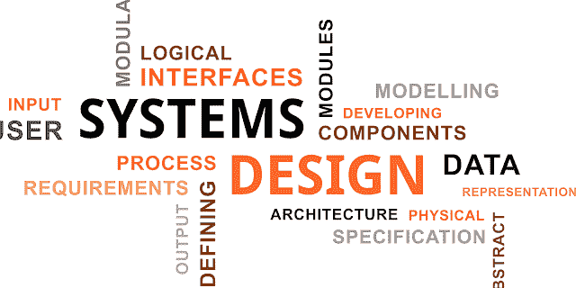
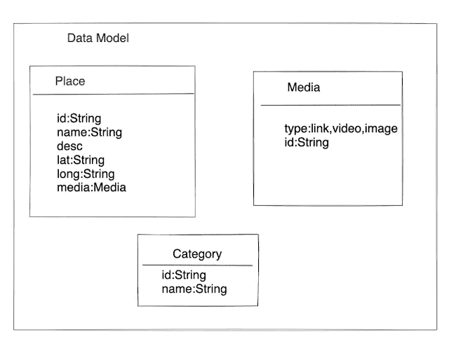
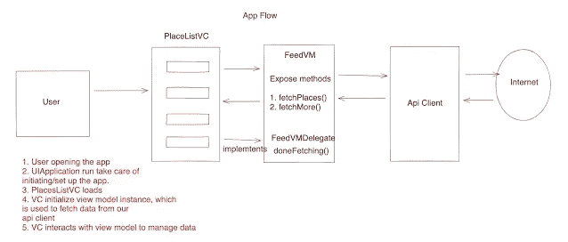

# 移动工程师系统设计面试

> 原文：<https://medium.com/geekculture/system-design-interview-for-mobile-engineers-ce712d6ac2c1?source=collection_archive---------0----------------------->

## 摇滚你的下一个移动系统设计面试。

## 移动系统设计面试终极指南

**简介**

随着你在软件工程领域资历的增加，系统设计面试成为最重要的面试。这次面试的重点是你作为一名工程师从整体水平看待和理解应用程序设计的能力。您应该从一个高层次的视图开始，然后深入研究各个组件。

在本文中，我通过一个例子分享了我解决系统设计面试问题的方法。听起来很有趣？…继续阅读

我发现系统设计面试很有趣，因为它们最现实、最全面，并且涉及到很好的沟通技巧。

**着手解决系统设计问题**

所以我看了不同种类的系统设计面试教程，并制作了自己的定制脚本，这对我这个移动开发人员来说很有意义。无论如何，这是一个全面的清单，这只是对我有用的东西。这里是我用来解决系统设计问题的不同部分的概要。这是我的食谱👇

1.**功能需求** —从定义应用的用例及一些功能开始。

2.**非功能性需求** —定义性能、体验和规模需求。

3.**假设** —定义问题的边界、任何规模约束、您将使用的功能等。

4.**客户端-服务器通信** —定义连接选项，如 HTTP 请求、轮询、服务器端事件。

5. **API 设计** —为您正在构建的特性定义端点。

6.**数据模型** —定义对象的数据模型字段。

7.**应用流程(用例流程)** —定义并浏览您正在设计的功能的用户流程。

8.**性能&工具** —定义您将如何收集数据和指标，以了解应用程序的执行情况—内存利用率、CPU 利用率。

9.ADA——确保你定义了可访问性特征，以及如何让应用程序变得可访问。

10.**国际化** —随着应用程序的国际化发展，你将如何应对？

11.**安全性** —定义如何保护应用程序。

现在，让我们用一个例子来处理一个系统设计问题，来解释我如何使用这个结构。我使用一个名为 [excalidraw](https://excalidraw.com/) 的免费工具来绘制我的组件。你可以使用任何你喜欢的工具来绘制图表。假设你被要求设计一个应用程序，列出你周围有趣的地方。

**设计一个应用程序，列出你周围有趣的地方**

1.**功能需求**

*   显示我周围有趣地方的列表。
*   当我向下滚动时加载更多

2.**非功能需求**

*   该列表应该加载非常快或者具有低延迟
*   列表不应抖动
*   应该可以平滑滚动

3.**假设**

*   日活跃用户有多少？
*   API 是可用的，我们需要明智地使用它们

4.**客户端-服务器通信**

主要有以下客户端与服务器对话的方式/协议。给面试官定义一下，你要用哪一个。对于我们的用例，常规的 http 请求就可以了，但是让我来分享一下所有的选项，以及为什么你会在你的特定情况下使用一个而不是另一个。

*   **常规 HTTP 请求** —这是最常见的用例场景，其中客户端向服务器请求数据/资源。例如，获取提要中的提要条目列表。
*   **轮询** —这种通信方式有以下几种
*   **定期轮询** —客户端可以不断向服务器发出请求以获取最新信息，但很多时候服务器可能没有任何更新。这不仅导致大部分时间的空响应，而且在多次设置 HTTP 连接时浪费资源。
*   **长轮询** —如果我们有一个用例，我们知道我们不会从服务器频繁更新。在这种情况下，我们能做的就是使用长轮询。客户端将建立与服务器的 HTTP 连接，并保持与服务器的连接打开，以便服务器可以在需要推送更新时向客户端推送更新。这样我们就省去了打开和关闭与服务器连接的无用工作。请记住，这个长轮询连接也可能超时，因此我们需要重新启动连接。
*   **WebSockets** —在客户端和服务器都可以发起通信并且客户端和服务器之间不断来回通信的情况下，我们可以使用 WebSockets。这个用例的一个很好的例子就是聊天应用程序。
*   **服务器端事件(SSE)——**客户端与服务器建立持久且长期的连接。服务器使用此连接发送数据。客户端处于监听模式，因为只有服务器可以与客户端通信。如果客户端需要与服务器通信，它需要使用不同的协议。比如说，我们有一个社交媒体应用程序，可以列出朋友的订阅源。但是现在，如果在我们使用应用程序时有更新发生，客户端可以通过服务器端事件(SSE)协议轻松获得这些更新。

**5。API 设计**

API 通过协议相互通信。常见的协议有 SOAP、REST 和 GraphQL。关于这些的细节不是这个博客的一部分，但你可以很容易地搜索。对于我们这里的用例来说，REST 应该没问题，它将适用于大多数其他用例。根据我们的要求，以下几点是明确的:

a)我们需要一个地点列表

b)由于我们列出了附近的地方，我们想到的一件事是 API 调用需要某种位置信息来返回数据。这可以是我们的查询参数。

c)考虑到这是一个移动应用程序，我们没有像台式机或笔记本电脑那样的计算/连接和能力等无限资源，我们需要小心我们应该获取的数据量。因此，如果能够分段获取数据，并在需要时获取更多数据，那就太好了。所以我们需要能够请求数据片段，这就是分页的用武之地。基于偏移量、键集和光标是分页服务器支持的不同类型。如果您还不知道这些，请了解更多信息。

对于我们的用例，我们可以选择其中任何一个，但是要确保您对分页是如何工作的有所了解。我们将选择偏移分页。因此，我们将有一个页码和页数限制来限制资源的数量。考虑到这一点，我们的 API 应该是这样的

得到**——/名额？lat = { }&long = { }&page = { }&page limit = { }**

**6。数据模型**

在这一节中，我们将介绍对我们的用例有意义的潜在数据模型。考虑到我们得到了一个列表，我们的数据模型可能看起来像这样👇

**7。App 流程**

在本节中，我们将讨论应用程序的流程。我们可以使用任何符合您需求的设计模式。可以是 MVC —模型视图控制器、MVVM —模型视图视图模型、MVP —模型视图演示器、VIPER 等。对于我们的简单用例，我使用 MVVM。您应该使用在您的用例中有意义的模式，并且您可以选择捍卫它。

**8。性能**

这是解决您的非功能性需求和任何其他与性能相关的项目的部分。在本节中，我们将讨论所有可以提高应用性能的方法。

a) **显示框架** —感觉有东西在加载，让用户感觉数据加载得更快了。在加载数据时显示一些框架块会对用户体验产生巨大影响

b) **使用尺寸合适的图像**。如果 API 支持高度和宽度作为查询参数，那么您将获取对您的移动设备有意义的资源。用户的眼睛无法分辨图像大小之间的差异，但这对应用程序的性能有着巨大的影响，因为你加载的数据较少。

c) **使用内容交付网络(CDN)** 进行静态图像缓存，帮助更快地交付内容。在我们将 CDN 用于图像和静态内容的用例中，这将缓存位置描述和图像。

d) **在后台线程**上加载数据，这样主线程就不会被阻塞，UI 也不会被卡住。

这些是一些表现良好的做法，还有其他方法，你可以在面试中深入了解。

9.**无障碍**

我们总是希望每个人都能使用我们的应用。为了让它真正具有包容性，我们需要关注应用程序的可访问性。以下是我们在解决可访问性方面可以做的一些事情:

a)对库使用自动检查，例如: [GTXilib](https://github.com/google/GTXiLib) 这样他们可以确保每个 UI 元素都有一个标签，适当的特征，标签不是多余的。

b)确保颜色对比正确

c)每个目标尺寸至少为 44pt

d)添加可访问性标注的自定义调用

e)使用合适的配色方案

f)支持动态字体

我上面说的做法，可以应用到任何手机 app 上。你也可以在谷歌和苹果网站上阅读更多关于可访问性的信息。

**10。国际化/本地化**

应用程序的国际化为其用户提供了本地和个人体验，这对应用程序的使用和采用有很大的帮助。通常，我们可以通过在应用程序中为内容/文本提供不同的本地化字符串文件来支持这一点。您还可以使用高级技术，比如将您的设备区域设置发送到服务器，然后服务器返回本地化文件。根据您的需要，您可以采取不同的途径来实现本地化。这是苹果公司的本地化指南。

**11。安全性**

安全性是一个非常广泛而复杂的话题。作为一名移动应用程序的开发者，我通常会在我的应用程序中遵循一些提示和技巧。这里有一个[链接](https://www.shashankthakur.dev/2020/09/how-to-make-ios-app-secure.html)到一篇详细的文章，您可以在系统设计面试中遵循这篇文章的安全最佳实践。

**结论**

系统设计侧重于我们作为一名工程师从整体水平而非单个部分的本质来看待/理解应用程序设计的能力。在处理系统设计问题时，没有正确或错误的答案。它更多的是知道完成某一组需求的方法和手段。