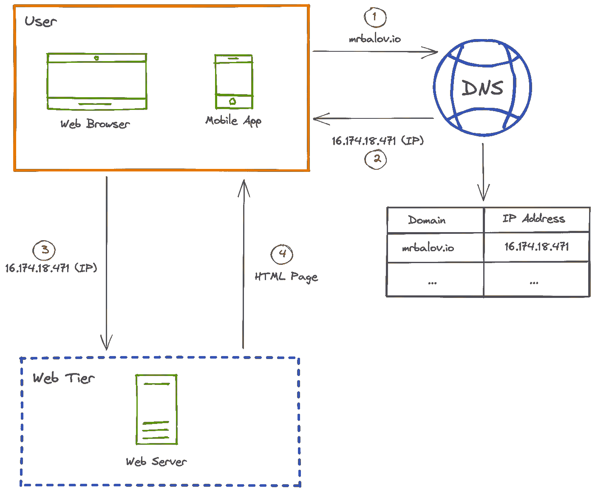
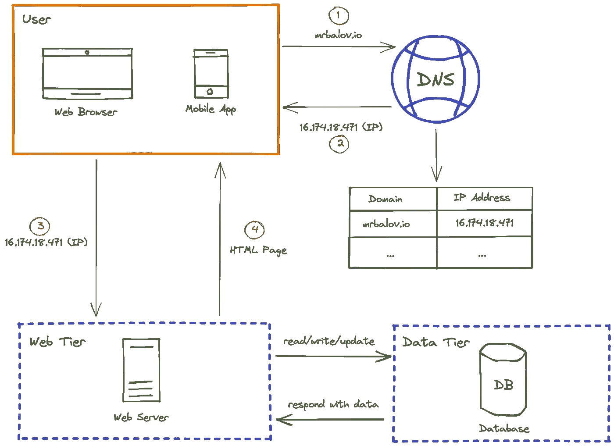
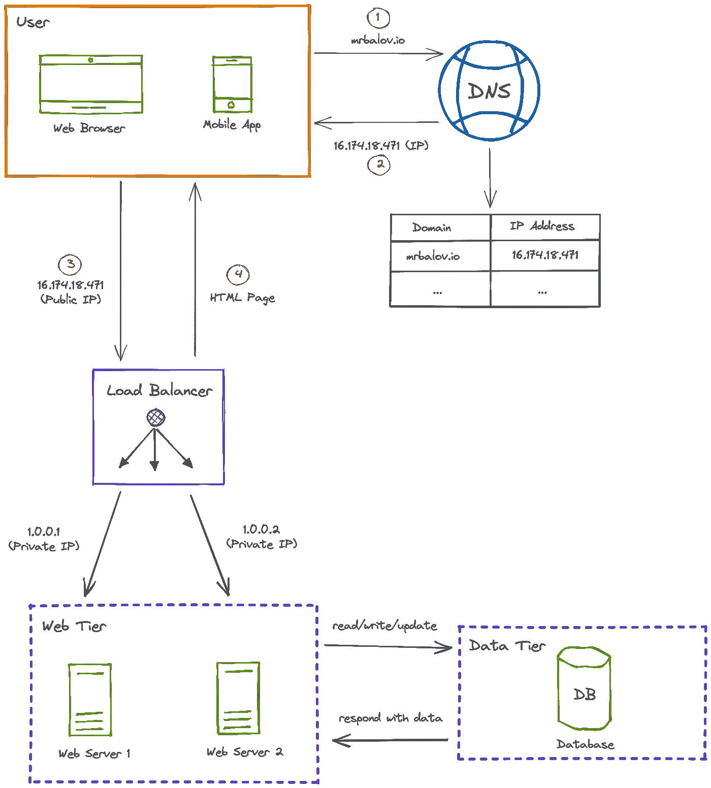
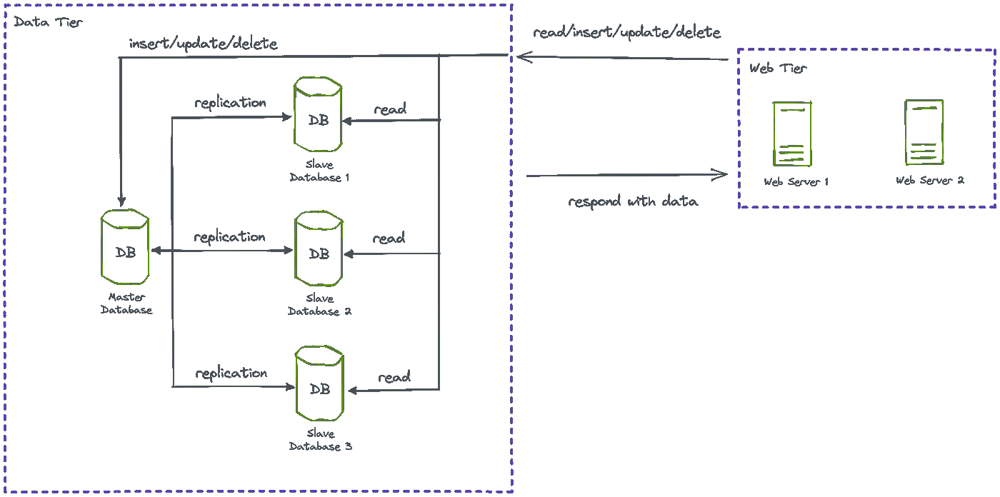
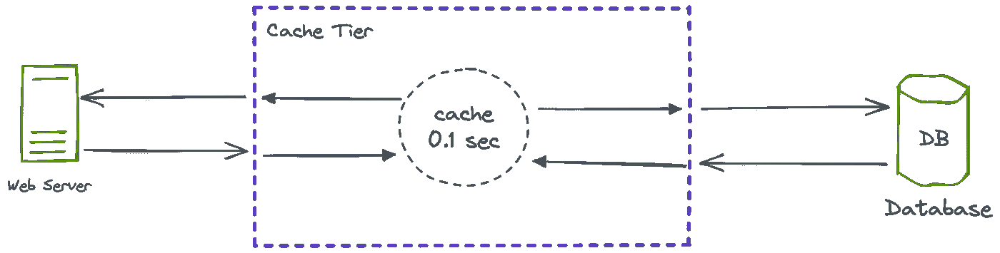

# 系统设计笔记#1。逐步改善。第一部分

> 原文：<https://medium.com/geekculture/system-design-notes-1-gradual-improvement-part-1-e138a407dc4d?source=collection_archive---------6----------------------->

## 如何将系统从单个用户扩展到数百万活跃用户。第 1 部分:负载平衡器、Web 服务器伸缩、数据库复制和缓存。

Photo by [Deva Darshan](https://unsplash.com/@darshan394) from [Unsplash](https://unsplash.com/photos/Jt9syHEhrPE)

这是一系列关于系统设计的笔记。我做这些笔记的主要动机是为了更好地理解系统设计主题。如果您需要复习一些常见的主题或获得主题的大纲，您也会发现它们很有用。

# 单一服务器

这是一些软件项目应该使用的起点。单服务器系统假设您有唯一的 Web 服务器，甚至没有数据库。

Pic. 1\. A Single Server System

这个系统是这样工作的:

1.  用户想要访问“mrbalov.io”网页。浏览器转到 DNS 并检索适当的 IP 地址。
2.  DNS 以“mrbalov.io”域的 IP 地址作为响应。
3.  然后浏览器使用一个 IP 地址到达网络服务器。
4.  Web 服务器用 HTML 页面或 JSON 数据进行响应。

# 数据库ˌ资料库

以前的系统没有存储数据。它唯一做的就是用静态数据来响应:JSON 的 HTML。存储数据(例如，用户、威尔士矮脚狗等)。)，我们需要在系统中添加一个数据库。我们开始吧！

Pic. 2\. A System with Database

有两种类型的可用数据库:

*   关系型(MySQL、PostgreSQL)
*   非关系的，或 NoSQL (Redis，Memcached，MongoDB)

关系数据库对于可能彼此有关系的结构化数据很有用。例如，表“users”可能有一个“corgiId”字段指向“corgis”表中的某个实体。

非关系数据库对于非结构化数据很有用。此外，当要求低延迟时，它们也很有用。或者当数据量很大时。

# 缩放比例

有两种缩放类型:

*   垂直(纵向扩展)
*   水平(横向扩展)

**垂直扩展**意味着您为现有服务器增加更多功能:CPU、RAM 等等。这种方法有几个主要缺点:

*   高成本
*   硬缩放限制
*   单点故障(如果一台服务器出现故障，没有任何东西可以替代它)
*   缺乏冗余(没有“空”的空间来应对不断增长的压力

**水平扩展**是指增加更多同时工作的服务器。这种方法解决了上述问题。但是设置起来可能相当复杂。我们需要解决的第一个问题是路由到正确的服务器。

# 负载平衡器

负载平衡器的目的是在 Web 服务器之间分配连接。

Pic. 3\. A System with Load Balancer

请注意，为了安全起见，负载平衡器使用私有 IP。

这就是负载平衡器如何帮助我们想象的系统:

*   如果其中一个 Web 服务器出现故障，负载平衡器会将流量路由到活动的服务器。
*   当流量突然增加时，更多的 Web 服务器可能会被添加到池中。

因此，现在 Web 层具有以下属性:

*   故障转移—这是一种在 Web 服务器停机时进行恢复的能力。
*   冗余——这是一种类似“空白空间”的东西，允许处理突然增加的流量。

下一步是改进 Web 层。

# 数据库复制

数据库复制意味着拥有一个数据库的多个副本。复制的目的是将读取操作与变异操作(插入、删除、更新)分开。这很有帮助，因为大多数系统都有大量的读取操作，而变异操作要少得多。

主/从方法是最常见的。下图对此进行了描述。

Pic. 4\. A System with Database Replication

数据库复制有以下优点:

*   性能(因为突变的高读取率)
*   可靠性(如果一个数据库失效，还有其他可运行的数据库)
*   可用性(当复制的数据库位于不同位置时)

# 贮藏

这是缩短响应时间的常用技术。我们将在我们想象的系统中添加缓存撕裂，以提高从数据库中读取数据的响应时间。

Pic. 5\. Cache Tier

向系统添加缓存层时，有一些有用的注意事项。

*   当数据被频繁读取时，缓存是有用的。
*   想想**到期策略**。这是数据被缓存的时间。这不应该太短或太长。
*   当缓存层是分布式的时，可能会出现一致性问题。
*   缓存层可能是一个**单点故障** (SPOF)。作为避免这种情况的一种选择，缓存层必须是分布式的。
*   应该考虑**驱逐政策**。这意味着当存储已满时删除冗余数据。一些流行的驱逐政策:最不常用(LFE)，先进先出(先进先出)。

# 中间总结

这是我们现在有的系统图。这不是最终的解决方案。而且，实际上，改进任何系统的过程都是无止境的！在接下来的章节中，我们将改善目前的状况。

Pic. 6\. Intermediate System Diagram. This will be improved soon!

这是“逐步改进”论文的第一部分。在下一部分中，我们将了解 CDN、StatefulStateless Web 层、数据中心、数据库扩展和其他主题。

[未完待续……](/@balovbohdan/system-design-notes-2-gradual-improvement-part-2-874447785c6c)