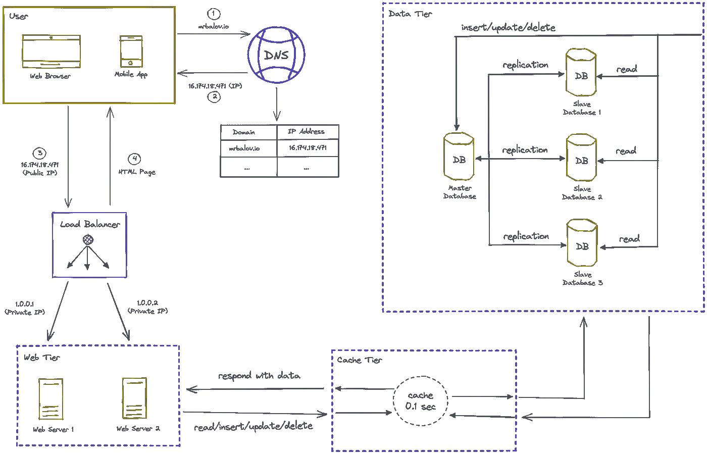
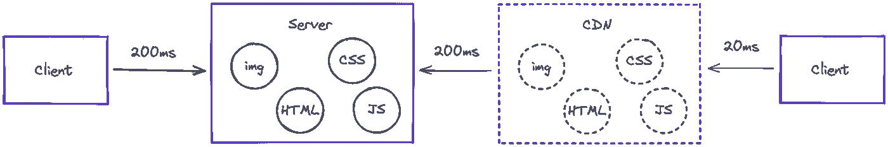
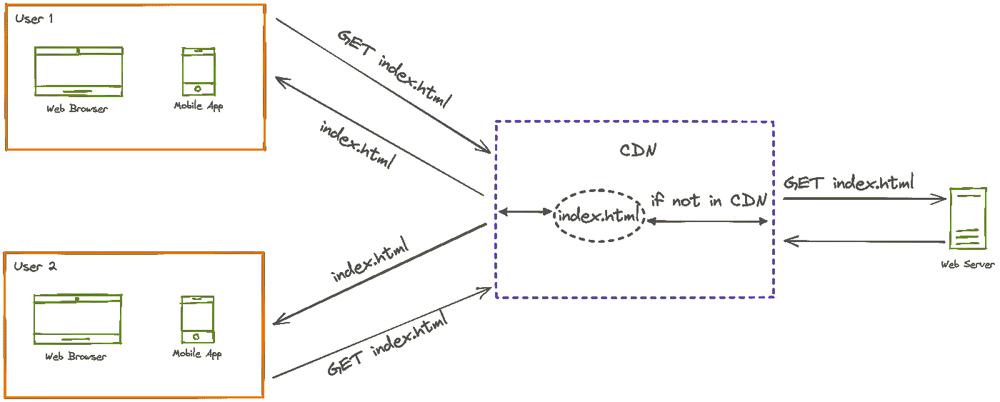
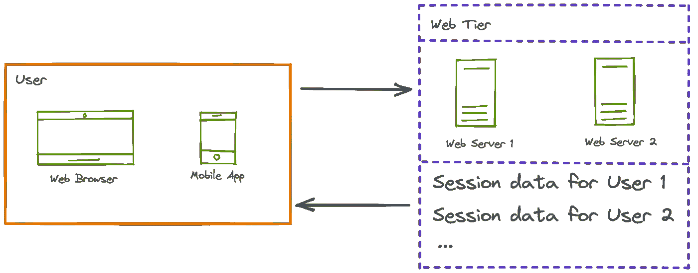
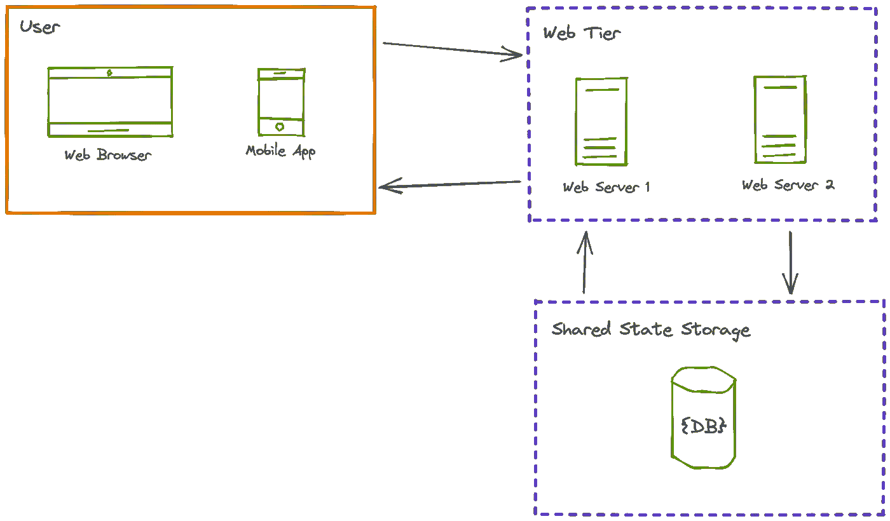
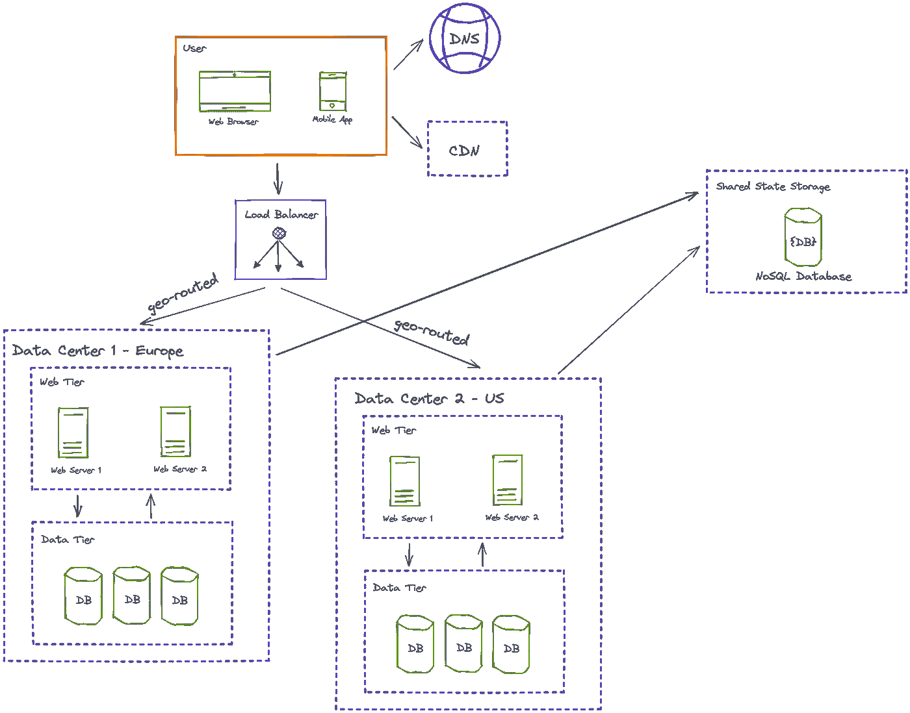
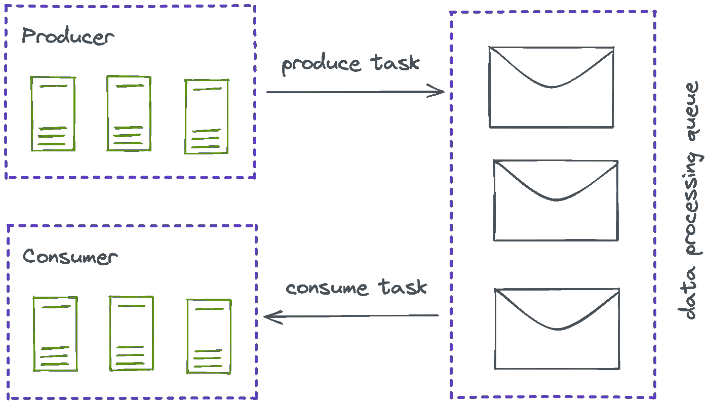
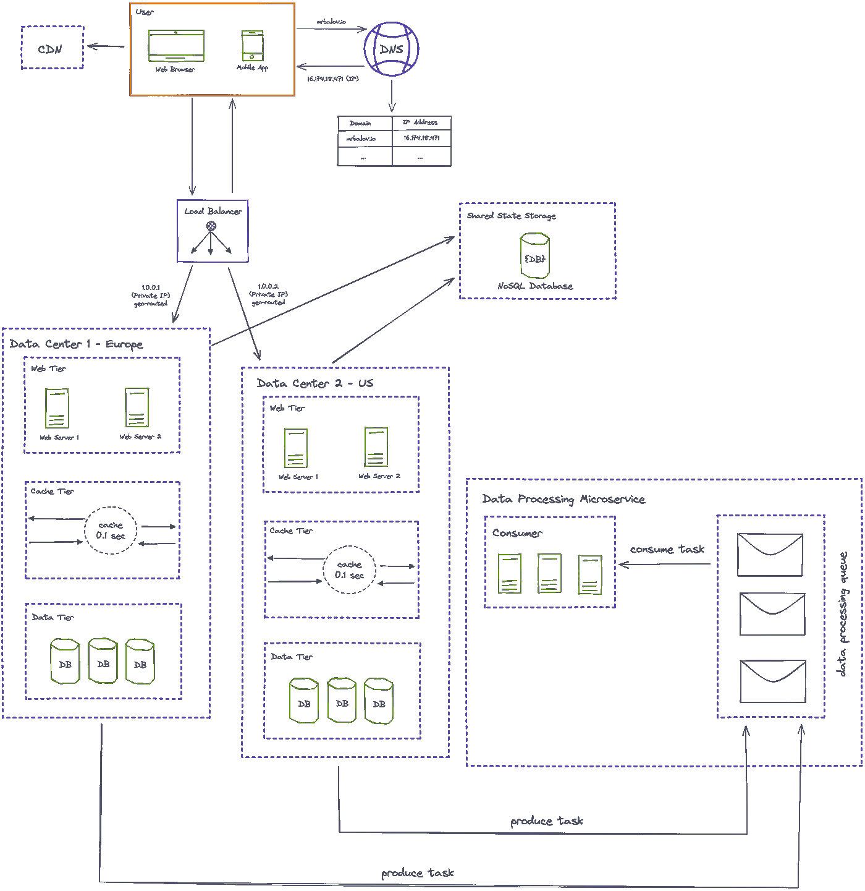

# 系统设计笔记#2。逐步改善。第二部分

> 原文：<https://medium.com/geekculture/system-design-notes-2-gradual-improvement-part-2-874447785c6c?source=collection_archive---------13----------------------->

## 如何将系统从单个用户扩展到数百万活跃用户。第 2 部分:CDN，Web 层架构，异步数据处理和共享状态存储。

Photo by [Ed 259](https://unsplash.com/@ed259) from [Unsplash](https://unsplash.com/photos/xcrI6CPkkJs)

[先前的](/geekculture/system-design-notes-1-gradual-improvement-part-1-e138a407dc4d)

这是系统设计系列的第二部分。今天，我们将了解 CDN、Web Tear 架构、异步数据处理和其他主题。

这就是我们在上一篇文章中停下来的地方:

Pic. 1\. System Design Diagram

让我们继续下去，完善这个系统！

# 加拿大

CDN 代表内容交付网络。我们可以把它想象成 Web 服务器的地理上稀疏的缓存。这对于交付静态内容非常有用，比如图像、音轨甚至 JavaScript 和 HTML。下面你可以找到一张描述 CDN 主要原理的图片。

Pic. 2\. CDN Principle

您可能会发现，全球有多个 cdn 和一台服务器(包含原始静态内容)。当用户第一次获取某个内容项目时，它会在 CDN 中保存一段时间。然后，下一个请求由 CDN 处理，用户不需要再次等待太长时间。也就是说，这就像一个[缓存](/geekculture/system-design-notes-1-gradual-improvement-part-1-e138a407dc4d)。

让我们再看一个例子，展示 CDN 的缓存特性。

Pic. 3\. CDN Principle

这是 Pic 的描述。3:

*   用户 1 请求“index.html”。
*   由于用户 1 是第一个请求该文件的用户，系统从 Web 服务器获取该文件，在 CDN 中保存一段时间，然后将其发送回请求者。
*   用户 2 请求相同的“index.html”。并且该用户与用户 1 在同一地区。
*   由于该文件已经保存在 CDN 中，因此该文件会被快速传递给请求者。

使用 CDN 需要考虑以下几点:

*   CDN 是个很贵的东西。应该找到成本和利润之间的平衡点。
*   找到正确的*到期策略*和*到期超时*可能相当复杂。
*   当 CN 中断时，内容应该保持可用。

# 有状态 Web 层

有状态 Web 层在请求之间存储一些数据。在大多数情况下，这意味着存储会话数据。也许你还记得 PHP 中的“$__SESSION”？😅

这就是我们表示有状态 Web 层的方式:

Pic. 4\. Stateful Web Tier

您可能已经知道，有状态架构不是一个好的解决方案。这很难支持，而且容易出错。

# 无状态 Web 层

在这种架构中，Web 层中没有请求间数据。这样的系统是健壮的和可扩展的。在需要一些状态数据的情况下，应该将其移出 Web 层。一个很好的例子——一个独立的 NoSQL 存储。下面你可以找到一个合适的图表来描述它。

Pic. 5\. Web Tier with a Shared State Storage

现在，我们的系统可以轻松地独立扩展 Web 层和共享状态存储。对于快速增长的系统或流量意外增长的系统，这是一种很好的方法。

# 数据中心

在上一篇文章中，我们讨论了负载平衡器如何帮助我们平衡流量。在本节中，我们将向我们的系统添加一个 geoDNS 路由。这允许考虑用户的地理位置来平衡流量。下面你可以在图表上看到。

Pic. 6\. GeoDNS Routing

有一些问题:

*   从技术角度来看，GeoDNS 路由是一件复杂的事情。
*   多个地区之间的数据同步可能是一个真正的痛苦。
*   部署到几个数据中心不是小事。

但是如果您的系统跨多个地区运行，这是一个值得考虑的方法。此外，如果您使用像 AWS 这样的服务，复杂性会降低。

# 异步任务

想象一下，当您的系统具有处理大量商品销售统计数据并生成近期利润预测的功能。一项相当繁重的任务，不是吗？你会如何设计这个功能？

这里的一个好主意是使用消息队列。它是一个允许生产者(请求数据处理)和消费者(处理数据和构建预测)之间异步通信的元素。让我们看一下图表。

Pic. 7\. Data Processing Queue

我们不打算深入研究这种方法。对于你的具体问题，你可以在网上找到一些利弊。

# 中间总结

这是到目前为止的最终系统图。我们有 GetDNS、数据中心、异步数据处理微服务、CDN 和共享状态存储。看起来非常好！该系统能够根据请求的类型和演进向量进行部分和逐步的扩展。

Pic. 8\. Intermediate System Design

这是“逐步改进”论文的第二部分。在下一篇文章中，我们将了解系统指标和数据库扩展方法。

未完待续…