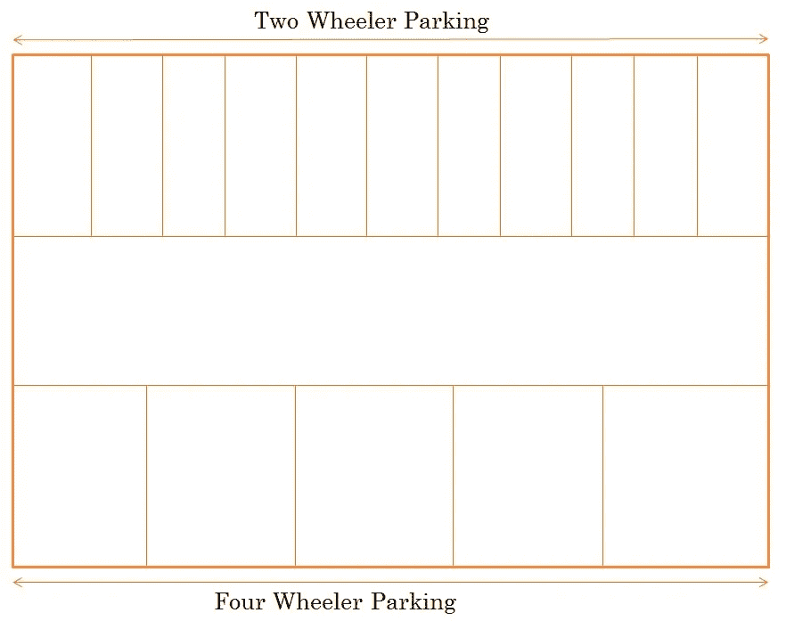
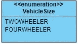
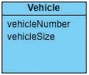
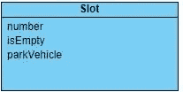
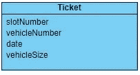
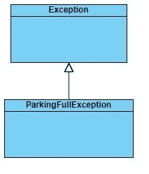
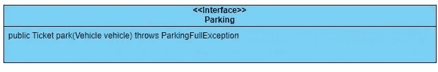
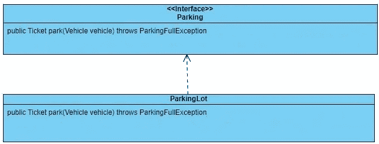
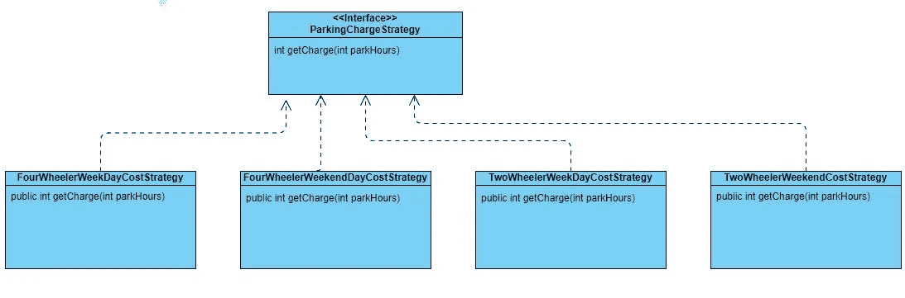

# 系统设计——使用 Java 的停车场设计面试问题

> 原文：<https://medium.com/geekculture/system-design-parking-lot-design-interview-question-using-java-3d1dea4f6a2?source=collection_archive---------0----------------------->

系统设计问题现在是许多组织面试评估过程的一部分。这些问题通常是开放式的，面试官测试应聘者如何处理问题陈述。如果他能分解问题陈述，用面向对象的原则来思考。如果候选人遵循良好的编码实践，如坚实的原则和各种设计原则。在[之前的教程中，我们设计并实现了一个电梯系统](https://www.javastructures.com/design/elevator)。在本教程中，我们将设计一个停车场并实现解决方案。


录像

在本教程中，我们将利用以下设计模式-

*   单一设计模式
*   战略设计模式
*   坚实的设计原则

这个实现我们将分为 3 个部分

*   讨论我们将如何模拟电梯设计
*   停车设计规范—迭代 1 —停车
*   停车设计规范-迭代 2-停车

# 模拟停车场设计

我们将模拟这一场景——要停放的车辆可以是两轮车，也可以是四轮车。



当要停放车辆时，将向车主提供一张罚单。如果没有可用的停车空位，那么将抛出停车满异常。当车辆需要停车时，车主必须提供停车票。
停车费将取决于-

*   如果是周末或工作日
*   如果车辆是两轮车或四轮车

# 停车设计规范—迭代 1 —停车

停车场实现将具有以下域类-

*   **Enum VehicleSize** —该 Enum 将有两个值两轮车和四轮车。



*   创建枚举车辆大小

```
package com.javastructures.model;

public enum VehicleSize{
	TWOWHEELER,  FOURWHEELER;
}
```

**车辆类别** —待停放的车辆。它具有车辆编号和车辆类型，即两轮车或四轮车。



创建域车辆类

```
package com.javastructures.model;

public class Vehicle {

	private String vehicleNumber;
	private VehicleSize vehicleSize;

	public Vehicle(String vehicleNumber, VehicleSize vehicleSize) {
		this.vehicleNumber = vehicleNumber;
		this.vehicleSize = vehicleSize;
	}

	public VehicleSize getVehicleSize() {
		return vehicleSize;
	}

	public void setVehicleSize(VehicleSize vehicleSize) {
		this.vehicleSize = vehicleSize;
	}

	public String getVehicleNumber() {
		return vehicleNumber;
	}

	public void setVehicleNumber(String vehicleNumber) {
		this.vehicleNumber = vehicleNumber;
	}
}
```

**类槽** —该类表示停车场中用于停放车辆的空间。一个停车场将有有限数量的停车位。这个数字将被初始化。停车场有两种类型的插槽-

*   两轮车停车位
*   四个惠勒停车位

每个插槽都有一个唯一的插槽号。



创建域插槽类

```
package com.javastructures.model;

public class Slot {

	private int slotNumber;
	private boolean isEmpty;
	private Vehicle parkVehicle;

	public Slot(int slotNumber) {
		this.slotNumber = slotNumber;
		isEmpty = true;
	}

	public int getSlotNumber() {
		return slotNumber;
	}

	public void setSlotNumber(int slotNumber) {
		this.slotNumber = slotNumber;
	}

	public boolean isEmpty() {
		return isEmpty;
	}

	public void setEmpty(boolean isEmpty) {
		this.isEmpty = isEmpty;
	}

	public Vehicle getParkVehicle() {
		return parkVehicle;
	}

	public void setParkVehicle(Vehicle parkVehicle) {
		this.parkVehicle = parkVehicle;
	}

	public void vacateSlot() {
		parkVehicle = null;
		this.isEmpty = true;
	}

	public void occupySlot(Vehicle parkVehicle) {
		this.parkVehicle = parkVehicle;
		this.isEmpty = false;
	}
}
```

**类票** —一旦车辆被停放，将向车主提供票。它将包含车位号、车辆号、车辆停放时间和车辆大小。



创建域票证类

```
package com.javastructures.model;

import java.util.Date;

public class Ticket {

	private int slotNumber;
	private String vehicleNumber;
	private Date date;
	private VehicleSize vehicleSize;

	public Ticket(int slotNumber, String vehicleNumber, VehicleSize vehicleSize, Date date) {
		super();
		this.slotNumber = slotNumber;
		this.vehicleNumber = vehicleNumber;
		this.date = date;
		this.setVehicleSize(vehicleSize);
	}

	public Date getDate() {
		return date;
	}

	public void setDate(Date date) {
		this.date = date;
	}

	public int getSlotNumber() {
		return slotNumber;
	}

	public void setSlotNumber(int slotNumber) {
		this.slotNumber = slotNumber;
	}

	public String getVehicleNumber() {
		return vehicleNumber;
	}

	public void setVehicleNumber(String vehicleNumber) {
		this.vehicleNumber = vehicleNumber;
	}

	public VehicleSize getVehicleSize() {
		return vehicleSize;
	}

	public void setVehicleSize(VehicleSize vehicleSize) {
		this.vehicleSize = vehicleSize;
	}

	@Override
	public String toString() {
		return "Ticket [slotNumber=" + slotNumber + ", vehicleNumber=" + vehicleNumber + ", date=" + date
				+ ", vehicleSize=" + vehicleSize + "]";
	}

}
```

我们将创建一个名为 ParkingFullException 的自定义异常-



```
package com.javastructures.exception;

public class ParkingFullException extends Exception {
	public ParkingFullException(String message) {
		super(message);
	}
}
```

创建一个名为 Parking 的接口，它将具有 park 方法。



```
package com.javastructures.service;

import com.javastructures.exception.InvalidVehicleNumberException;
import com.javastructures.exception.ParkingFullException;
import com.javastructures.model.Ticket;
import com.javastructures.model.Vehicle;
import com.javastructures.strategy.ParkingChargeStrategy;

public interface Parking {

	public Ticket park(Vehicle vehicle) throws ParkingFullException;

	public int unPark(Ticket ticket, ParkingChargeStrategy parkingCostStrategy) throws InvalidVehicleNumberException;

}
```

最后，我们将实现上述接口来编写停车和退票的逻辑。这个类将是一个单例类。



```
package com.javastructures.service;

import java.util.ArrayList;
import java.util.Date;
import java.util.List;

import exception.InvalidVehicleNumberException;
import exception.ParkingFullException;
import model.Slot;
import model.Ticket;
import model.Vehicle;
import model.VehicleSize;
import strategy.ParkingChargeStrategy;

public class ParkingLot implements Parking {

	private static ParkingLot parkingLot;
	private final List<Slot> twoWheelerSlots;
	private final List<Slot> fourWheelerSlots;

	private ParkingLot() {
		this.twoWheelerSlots = new ArrayList<>();
		this.fourWheelerSlots = new ArrayList<>();
	}

	public static ParkingLot getParkingLot() {
		if (parkingLot == null)
			parkingLot = new ParkingLot();
		return parkingLot;
	}

	public boolean initializeParkingSlots(int numberOfTwoWheelerParkingSlots, int numberOfFourWheelerParkingSlots) {

		for (int i = 1; i <= numberOfTwoWheelerParkingSlots; i++) {
			twoWheelerSlots.add(new Slot(i));
		}

		System.out.printf("Created a two wheeler parking lot with %s slots %n", numberOfTwoWheelerParkingSlots);

		for (int i = 1; i <= numberOfFourWheelerParkingSlots; i++) {
			fourWheelerSlots.add(new Slot(i));
		}

		System.out.printf("Created a four wheeler parking lot with %s slots %n", numberOfFourWheelerParkingSlots);
		return true;
	}

	public Ticket park(Vehicle vehicle) throws ParkingFullException {
		Slot nextAvailableSlot;
		if (vehicle.getVehicleSize().equals(VehicleSize.FOURWHEELER)) {
			nextAvailableSlot = getNextAvailableFourWheelerSlot();
		} else {
			nextAvailableSlot = getNextAvailableTwoWheelerSlot();
		}
		nextAvailableSlot.occupySlot(vehicle);
		System.out.printf("Allocated slot number: %d \n", nextAvailableSlot.getSlotNumber());
		Ticket ticket = new Ticket(nextAvailableSlot.getSlotNumber(), vehicle.getVehicleNumber(),
				vehicle.getVehicleSize(), new Date());
		return ticket;
	}

	private Slot getNextAvailableFourWheelerSlot() throws ParkingFullException {
		for (Slot slot : fourWheelerSlots) {
			if (slot.isEmpty()) {
				return slot;
			}
		}
		throw new ParkingFullException("No Empty Slot available");
	}

	private Slot getNextAvailableTwoWheelerSlot() throws ParkingFullException {
		for (Slot slot : twoWheelerSlots) {
			if (slot.isEmpty()) {
				return slot;
			}
		}
		throw new ParkingFullException("No Empty Slot available");
	}	
}
```

接下来，我们将创建一个类来测试上面的停放逻辑。

```
package com.javastructures;

import com.javastructures.exception.ParkingFullException;
import com.javastructures.model.Ticket;
import com.javastructures.model.Vehicle;
import com.javastructures.model.VehicleSize;
import com.javastructures.service.ParkingLot;

public class TestParking {

	public static void main(String[] args) throws ParkingFullException {
		ParkingLot parkingLot = ParkingLot.getParkingLot();

		parkingLot.initializeParkingSlots(10, 10);

		Vehicle vehicle = new Vehicle("Mh12", VehicleSize.TWOWHEELER);

		Ticket ticket = parkingLot.park(vehicle);
		System.out.println(ticket);

		Vehicle vehicle2 = new Vehicle("Mh13", VehicleSize.TWOWHEELER);

		Ticket ticket2 = parkingLot.park(vehicle2);
		System.out.println(ticket2);

	}

}
```

# 停车场设计规范—第二次迭代

在第一次迭代中，我们实现了停放车辆的代码。在第二次迭代中，我们将实现代码来打开车辆并计算费用。
创建一个名为 InvalidVehicleNumberException 的异常类。如果由于某种原因，在停车场找不到要停车的车辆，就会抛出这个异常。

```
package com.javastructures.exception;

public class InvalidVehicleNumberException extends Exception {
	public InvalidVehicleNumberException(String s) {
		super(s);
	}
}
```

接下来，我们将实现一些类来计算停放车辆的停车费。



创建一个名为 ParkingChargeStrategy 的接口。

```
package com.javastructures.strategy;

public interface ParkingChargeStrategy {
	int getCharge(int parkHours);
}
```

对于这个接口，我们将提供如下四个实现-
如果停放的车辆是四轮车并且在工作日停放。

```
package com.javastructures.strategy;

public class FourWheelerWeekDayChargeStrategy implements ParkingChargeStrategy {

	@Override
	public int getCharge(int parkHours) {
		if (parkHours < 1) {
			return 20;
		}
		return parkHours * 20;
	}
}
```

如果停放的车辆是四轮车并且在周末停放。

```
package com.javastructures.strategy;

public class FourWheelerWeekendChargeStrategy implements ParkingChargeStrategy {
    @Override
    public int getCharge(int parkHours) {
        if (parkHours < 1) {
            return 30;
        }
        return parkHours * 30;
    }
}
```

如果停放的车辆是两轮车并且是在工作日停放的。

```
package com.javastructures.strategy;

public class TwoWheelerWeekDayChargeStrategy implements ParkingChargeStrategy {

	@Override
	public int getCharge(int parkHours) {
		if (parkHours < 1) {
			return 10;
		}
		return parkHours * 10;
	}
}
```

如果停放的车辆是两轮车并且在周末停放。

```
package com.javastructures.strategy;

public class TwoWheelerWeekendChargeStrategy implements ParkingChargeStrategy {
	@Override
	public int getCharge(int parkHours) {
		if (parkHours < 1) {
			return 15;
		}
		return parkHours * 15;
	}
}
```

同样，对于我们已经创建的停放接口，添加一个名为 unpark 的新方法，如下所示

```
package com.javastructures.service;

import com.javastructures.exception.InvalidVehicleNumberException;
import com.javastructures.exception.ParkingFullException;
import com.javastructures.model.Ticket;
import com.javastructures.model.Vehicle;
import com.javastructures.strategy.ParkingChargeStrategy;

public interface Parking {

	public Ticket park(Vehicle vehicle) throws ParkingFullException;

	**public int unPark(Ticket ticket, ParkingChargeStrategy parkingCostStrategy) throws InvalidVehicleNumberException;**

}
```

最后，实现逻辑来打开车辆。

```
package com.javastructures.service;

import java.util.ArrayList;
import java.util.Date;
import java.util.List;

import com.javastructures.exception.InvalidVehicleNumberException;
import com.javastructures.exception.ParkingFullException;
import com.javastructures.model.Slot;
import com.javastructures.model.Ticket;
import com.javastructures.model.Vehicle;
import com.javastructures.model.VehicleSize;
import com.javastructures.strategy.ParkingChargeStrategy;

public class ParkingLot implements Parking {

	private static ParkingLot parkingLot;

	private final List<Slot> twoWheelerSlots;
	private final List<Slot> fourWheelerSlots;

	private ParkingLot() {
		this.twoWheelerSlots = new ArrayList<>();
		this.fourWheelerSlots = new ArrayList<>();
	}

	public static ParkingLot getParkingLot() {
		if (parkingLot == null)
			parkingLot = new ParkingLot();
		return parkingLot;
	}

	public boolean initializeParkingSlots(int numberOfTwoWheelerParkingSlots, int numberOfFourWheelerParkingSlots) {

		for (int i = 1; i <= numberOfTwoWheelerParkingSlots; i++) {
			twoWheelerSlots.add(new Slot(i));
		}

		System.out.printf("Created a two wheeler parking lot with %s slots %n", numberOfTwoWheelerParkingSlots);

		for (int i = 1; i <= numberOfFourWheelerParkingSlots; i++) {
			fourWheelerSlots.add(new Slot(i));
		}

		System.out.printf("Created a four wheeler parking lot with %s slots %n", numberOfFourWheelerParkingSlots);
		return true;
	}

	public Ticket park(Vehicle vehicle) throws ParkingFullException {
		Slot nextAvailableSlot;
		if (vehicle.getVehicleSize().equals(VehicleSize.FOURWHEELER)) {
			nextAvailableSlot = getNextAvailableFourWheelerSlot();
		} else {
			nextAvailableSlot = getNextAvailableTwoWheelerSlot();
		}
		nextAvailableSlot.occupySlot(vehicle);
		System.out.printf("Allocated slot number: %d \n", nextAvailableSlot.getSlotNumber());
		Ticket ticket = new Ticket(nextAvailableSlot.getSlotNumber(), vehicle.getVehicleNumber(),
				vehicle.getVehicleSize(), new Date());
		return ticket;
	}

	private Slot getNextAvailableFourWheelerSlot() throws ParkingFullException {
		for (Slot slot : fourWheelerSlots) {
			if (slot.isEmpty()) {
				return slot;
			}
		}
		throw new ParkingFullException("No Empty Slot available");
	}

	private Slot getNextAvailableTwoWheelerSlot() throws ParkingFullException {
		for (Slot slot : twoWheelerSlots) {
			if (slot.isEmpty()) {
				return slot;
			}
		}
		throw new ParkingFullException("No Empty Slot available");
	}

	**public int unPark(Ticket ticket, ParkingChargeStrategy parkingCostStrategy) throws InvalidVehicleNumberException {
		int costByHours = 0;
		Slot slot;
		try {
			if (ticket.getVehicleSize().equals(VehicleSize.FOURWHEELER)) {
				slot = getFourWheelerSlotByVehicleNumber(ticket.getVehicleNumber());
			} else {
				slot = getTwoWheelerSlotByVehicleNumber(ticket.getVehicleNumber());
			}
			slot.vacateSlot();
			int hours = getHoursParked(ticket.getDate(), new Date());
			costByHours = parkingCostStrategy.getCharge(hours);
			System.out.println(
					"Vehicle with registration " + ticket.getVehicleNumber() + " at slot number " + slot.getSlotNumber()
							+ " was parked for " + hours + " hours and the total charge is " + costByHours);
		} catch (InvalidVehicleNumberException invalidVehicleNumber) {
			System.out.println(invalidVehicleNumber.getMessage());
			throw invalidVehicleNumber;
		}
		return costByHours;
	}

	private int getHoursParked(Date startDate, Date endDate) {
		long secs = (endDate.getTime() - startDate.getTime()) / 1000;
		int hours = (int) (secs / 3600);
		return hours;

	}

	private Slot getFourWheelerSlotByVehicleNumber(String vehicleNumber) throws InvalidVehicleNumberException {
		for (Slot slot : fourWheelerSlots) {
			Vehicle vehicle = slot.getParkVehicle();
			if (vehicle != null && vehicle.getVehicleNumber().equals(vehicleNumber)) {
				return slot;
			}
		}
		throw new InvalidVehicleNumberException("Two wheeler with registration number " + vehicleNumber + " not found");
	}

	private Slot getTwoWheelerSlotByVehicleNumber(String vehicleNumber) throws InvalidVehicleNumberException {
		for (Slot slot : twoWheelerSlots) {
			Vehicle vehicle = slot.getParkVehicle();
			if (vehicle != null && vehicle.getVehicleNumber().equals(vehicleNumber)) {
				return slot;
			}
		}
		throw new InvalidVehicleNumberException("Two wheeler with registration number " + vehicleNumber + " not found");
	}**

}
```

最后，我们将测试解锁逻辑

```
package com.javastructures;

import com.javastructures.exception.ParkingFullException;
import com.javastructures.model.Ticket;
import com.javastructures.model.Vehicle;
import com.javastructures.model.VehicleSize;
import com.javastructures.service.ParkingLot;

public class TestParking {

	public static void main(String[] args) throws ParkingFullException {
		ParkingLot parkingLot = ParkingLot.getParkingLot();

		parkingLot.initializeParkingSlots(10, 10);

		Vehicle vehicle = new Vehicle("Mh12", VehicleSize.TWOWHEELER);

		Ticket ticket = parkingLot.park(vehicle);
		System.out.println(ticket);

		Vehicle vehicle2 = new Vehicle("Mh13", VehicleSize.FOURWHEELER);

		Ticket ticket2 = parkingLot.park(vehicle2);
		System.out.println(ticket2);

		**int cost1 = parkingLot.unPark(ticket2, new TwoWheelerWeekDayChargeStrategy());
		System.out.println(cost1);

		int cost2 = parkingLot.unPark(ticket2, new FourWheelerWeekDayChargeStrategy());
		System.out.println(cost2);**

	}

}
```