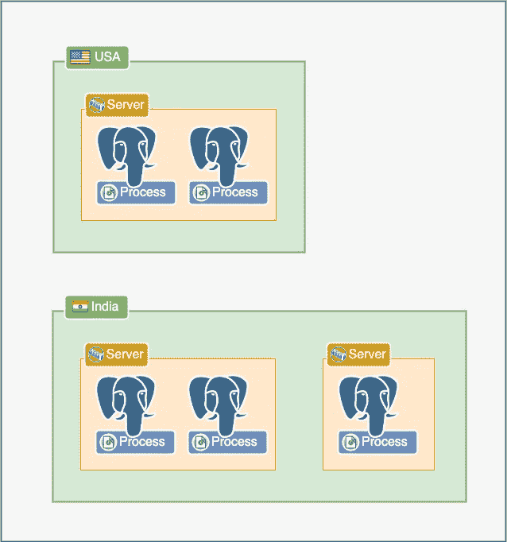
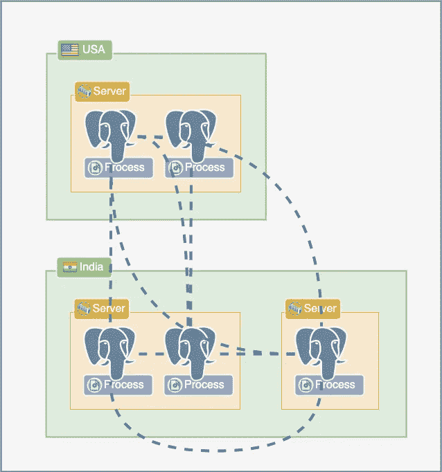
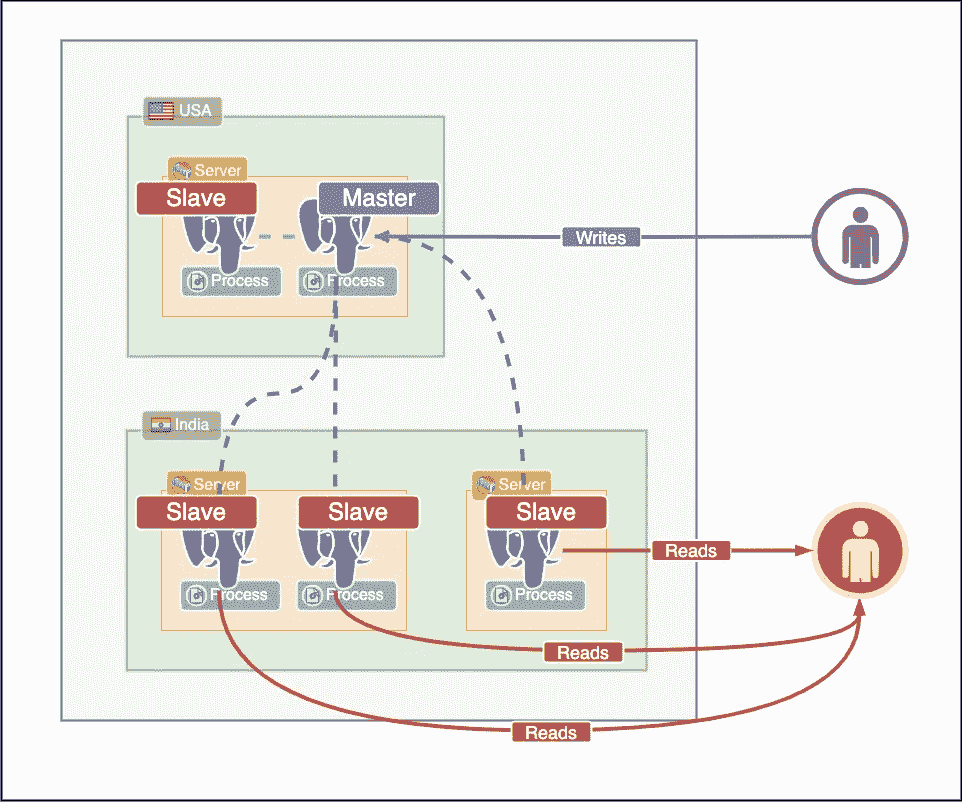
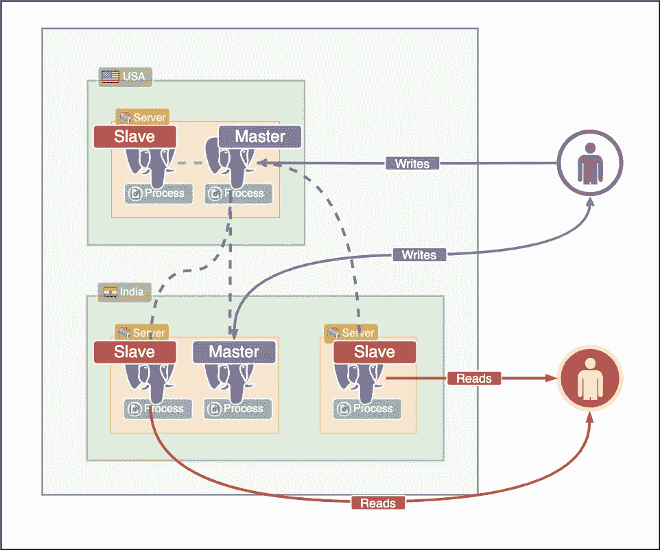
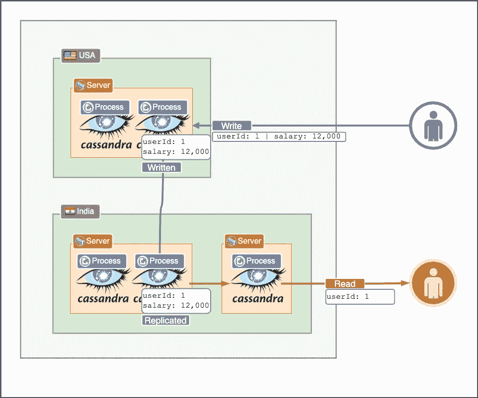
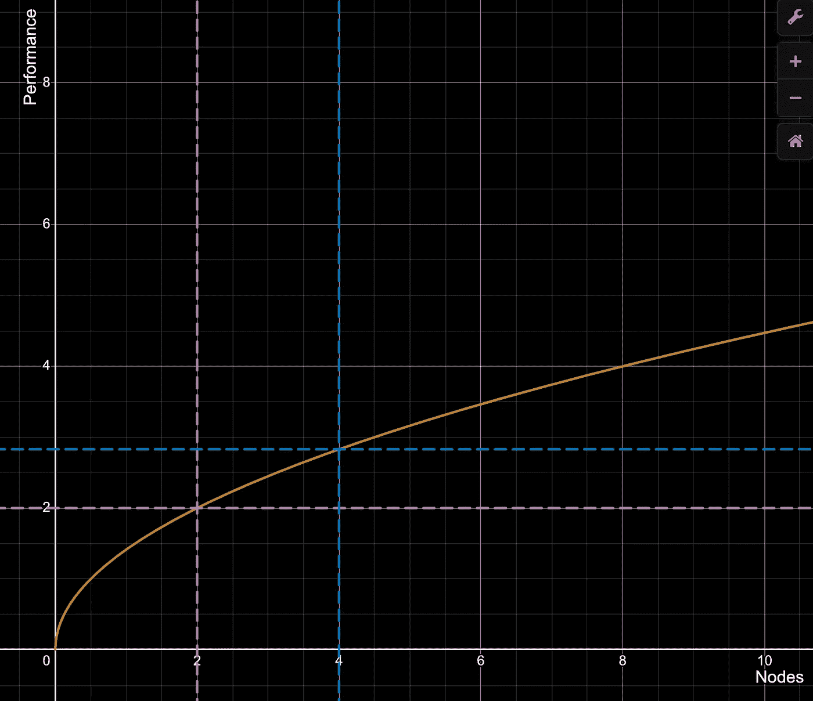
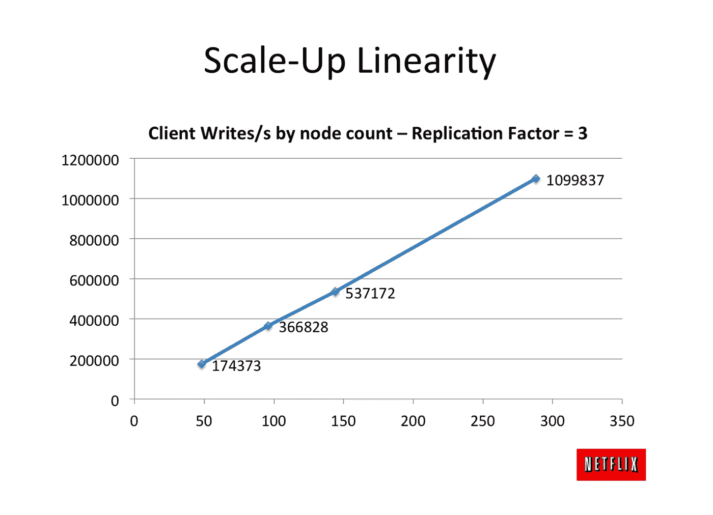

# 系统设计解决方案:何时使用 Cassandra，何时不使用

> 原文：<https://medium.com/geekculture/system-design-solutions-when-to-use-cassandra-and-when-not-to-496ba51ef07a?source=collection_archive---------0----------------------->

# 快速入门:卡珊德拉是什么？

我想大多数软件工程师都知道卡珊德拉。即使他们不理解它，他们至少在他们的软件工程职业生涯中的某个时候，在某些上下文或某些对话中听说过 Cassandra。

对我来说也是如此，直到我开始使用它一点点，并有机会更深入地探索它。

在我开始之前，让我澄清一下，如果你还不知道的话，卡珊德拉有多大。它在 Github 上有 [7.3k+颗星，被苹果、](https://github.com/apache/cassandra) [Discord](https://www.youtube.com/watch?v=86olupkuLlU) 、[动视](https://www.dataversity.net/case-study-cassandra-meets-call-of-duty/)、百思买、[网飞](https://netflixtechblog.com/tagged/cassandra)等玩家使用。不用说，it *显然*有一个它擅长的流行用例。

那是什么？

Cassandra 确实好用如果你想在分布式系统中编写和存储大量数据，不要太在意性能好的 ACID。这似乎有点宽泛，所以让我简单介绍一下 Cassandra 是如何工作的。

Cassandra 最受欢迎的特性之一是它可以作为分布式系统运行。

但这似乎不是 Cassandra 和传统 RDBMS 之间的一个大的区别因素，因为现在大多数数据库都可以在分布式环境中运行。

Cassandra 和关系数据库的不同之处在于 Cassandra 在这个分布式系统中的运行和管理是多么的容易。事实上，人们开玩笑说，将其作为单节点系统运行比作为分布式系统运行更困难。分布式是 Cassandra 的一种内置功能，在单个节点上运行它看起来像是在浪费它的潜力，有点像你在高峰时间在城市交通中使用兰博基尼。

Cassandra 的另一个受欢迎的特点是它作为一个无主系统运行。大多数传统数据库依赖于主节点和从节点。从节点通常用于复制，主节点用于写入。

这通常会增加系统升级的复杂性和难度。当您想要添加更多节点时，您需要决定添加多少主节点和添加多少从节点。添加或删除节点也会给系统带来很多变化。如果一个主节点变得不可用，通常会有一个主节点选举，其中一个新节点成为主节点。

一个依赖于同质节点而没有主节点和从节点之分的系统看起来要简单得多。

让我们更深入地研究一下这些特性。

## 无主复制和高可用性

我想说的第一个是 Cassandra 最受欢迎的功能之一，即它如何复制。如果你在网上任何地方读到关于卡桑德拉的文章，这可能是你首先听到的。那是什么？你为什么要在乎？

传统的 SQL 数据库以两种方式扩展，第一种是复制或主从架构。这个想法很简单，你添加一个副本数据库，它只保存与你的主数据库相同的数据。这些数据库可能作为不同的进程运行在不同的机器上，甚至在世界的不同角落。

它们使用特定的协议相互通信

其中之一是*主*数据库。这个数据库是唯一可以执行写操作的数据库，其他数据库只是复制这个主数据库保存的数据来为客户端服务。

这意味着您有更高的读取能力(由于每个服务器都有自己的内存、CPU 和网络带宽),而写入能力没有变化。

这对大多数应用程序来说是一件好事，因为大多数应用程序倾向于大量读取(想想你读了多少条 tweet，写了多少条 tweet)。

另一种选择是拥有多个主数据库或一个主-主或多主数据库。

这两种解决方案通常都存在巨大的挑战。第一种情况是，有多个副本和一个主数据库，存在单点故障，即主数据库。而且，由于您只有一个主数据库，这也意味着您不能扩展您的写性能。

添加更多的主节点解决了最后一个问题，但是也带来了更多的挑战。想象一下，如果两个用户同时在不同的主数据库的同一行上编写列*薪水*会怎么样！谁来决定哪个数据是正确的！

或者，如果您将一个表存储在一个数据库中，而将另一个表存储在另一个数据库中，您将如何对两个不同数据库中的表执行连接呢？如何在一个服务器的一个表中使用外键来引用另一个数据库中的一个键，甚至可能运行在不同的洲呢？！

数据库中的分片、分区和复制是一个巨大的主题，我可能在这里过于简化了一些事情，所以我将避免深入探讨。但简而言之，即使添加多个主节点，扩展传统的 SQL 数据库也很困难。这是因为 SQL 数据库有复杂严格的要求，比如 ACID、验证等。

除此之外，关系模型很难将数据分别存储在不同的数据库中，比如不能执行连接和拥有外键。

不是说不可能，而是不容易。

那么，卡珊德拉是怎么做到的呢？

它依赖于一个无主模型。在这个模型中，所有节点的行为实际上都是一样的，每个节点都存储数据的一个子集。没有*主*或*从。*

如果您要在数据库中插入一个新行，它将至少转到这些节点中的一个，并被复制到一定数量的节点。

当您请求您的行时，节点*会在彼此之间八卦*以找出谁持有该数据并将其返回给您。事实上，所有节点都可以处理对任何数据的请求，即使它们实际上并不持有这些数据。所有这些实际上都是由集群中的数据库节点管理的，不需要我们的干预。集群中的节点是*感知集群的，*它们知道自己在分布式环境中运行，并且不断地相互交谈(事实上，它们之间的交谈如此之多，以至于这种交谈被称为 [*嚼舌根*](https://en.wikipedia.org/wiki/Gossip_protocol) )。

Redis 也有类似的八卦协议。不久前我也写过关于 Redis 的文章，我在 Redis [这里](/geekculture/horizontally-scaling-writes-with-redis-clusters-a77cdcdf6de2)写了一整篇关于分片的文章。我也有一个我写的 Redis 帖子列表，从解释 Redis 的基础开始，到复制、分片，最后到在 AWS 上部署一个工作生产级 Redis 集群[这里](/@sanilkhurana7/list/redis-88a4c95150fa)。如果你觉得这些帖子有意思，就去看看吧。

很快，你就可以看到 Cassandra 是如何解决我们之前看到的一些问题的。我们不用太担心管理主人和奴隶。整个系统是由同构节点构建的，所以我们只需指定我们想要的节点数量，就可以了。不需要主选举，没有单点故障，并且易于管理和使用。

## 缺乏酸支持

我们已经讨论了一点，当试图提供强酸支持时，关系数据库在分布式环境中如何遭受损失。让我们更深入地探讨一下。

这种分布式环境中的数据库需要不断地相互交换数据，以获得强酸支持。例如，如果您想要强一致性，那么所有节点应该彼此同步，并且应该总是保存相同的数据。如果您需要添加一个新行或对一个节点进行更新，那么它首先需要等待所有节点进行更新，并且所有节点必须一起进行更新。

将数据从一个数据库节点发送到另一个数据库节点可能非常耗时。注意一些节点甚至不在同一个大陆上！

除此之外，网络是复杂的，并因不可靠而臭名昭著。

简单地说，这种持续的数据同步和通信在这样一个分布式系统中是不可靠的，尤其是当您每秒钟收到数千个请求时(如果不是更多的话！)而您的数据库彼此相距数万英里。

这实质上就是对酸进行权衡。

另一方面，卡桑德拉支持弱酸体系。简而言之，它提供了某种程度的原子性、一致性、隔离性和持久性，但不完全是关系数据库能够提供的全套服务。

它提供分区级别的原子性，但是如果写操作在一些节点上成功，而在其他节点上失败，则不提供回滚。此外，根据您如何配置 Cassandra，您的集群可能会处于不一致的状态。因此，节点可能对它们持有的数据有不同意见。

简而言之，它对 ACID 的支持很弱，如果 ACID 对您很重要，您可能应该重新考虑使用 Cassandra。

## 可调一致性

Cassandra 提供了一个可调的一致性模型。在这个模型中，Cassandra 允许开发人员选择他们想要的一致性级别。您可以以可用性为代价，在最终一致性或强一致性之间进行选择。

分布式数据库系统通常分为两类，AP 系统最大化可用性而不是一致性，CP 系统强调一致性而不是可用性。这里没有正确或错误的系统，它只是取决于什么对您的应用程序重要，一致性或可用性。

Cassandra 通常被描述为一个 AP 系统，它被广泛使用的部分原因是它的高可用性。

但是，您可以控制或调整可用性和一致性之间的平衡。正如[上限定理所解释的那样](https://en.wikipedia.org/wiki/CAP_theorem)，在任何系统中两者都不可能实现，所以你唯一能做的就是用一个和另一个进行交易。

控制一致性的方法是使用一致性级别和复制因子。这些规定了数据复制的次数，在响应返回给用户之前必须有多少节点同步写入数据，以及在读取时必须有多少节点返回数据。

深入解释这是如何工作的将是一个完整的帖子，所以我现在会避免更深入地探讨它，简而言之，Cassandra 通常被用作一个最终一致的分布式系统，*但它可以被调整和配置以支持更严格的一致性水平。*

## 高写入性能

由于 Cassandra 群集中通常会有许多节点，并且每个节点都可以执行写操作，因此可以获得良好的写性能。事实上，[这篇网飞的博客文章](https://netflixtechblog.com/benchmarking-cassandra-scalability-on-aws-over-a-million-writes-per-second-39f45f066c9e)解释了他们如何测试它每秒一百万次写入而没有变慢的迹象。

对于关系数据库中的单主多从体系结构，这种级别的写性能是不可能的。如前所述，使用多主系统会带来复杂性。

## 缺少关系模式

Cassandra 不支持复杂的关系模式。因此，它不支持关系数据库中常见的外部密钥、关系和其他功能。

Cassandra 中的表比关系数据库更为赤裸裸。查询也有其独特之处。数据设计也会影响您可以运行的查询及其性能。例如，如果没有资料表的资料分割索引键，就无法(技术上可以，但您*真的*不应该)查询资料表。这个分区密钥是 Cassandra 将用于在多个节点中分发数据的密钥，因此没有分区密钥的查询实际上意味着需要扫描所有节点中的所有行。这似乎不是一件好事，而且对于生产级系统通常是不实际的

在 Cassandra 中，数据建模有很多细微差别，我现在不会深入探讨，但 TLDR 的观点是，在开始为数据建模之前，您需要考虑在系统上运行什么查询。

# 卡桑德拉能解决什么问题？

## 单节点系统的资源约束

如果整个数据库系统运行在单个节点上，则这也意味着它受限于可以连接到单个节点的 CPU 能力、内存和网络带宽。

不用说，这还不算最佳。数据库是笨重的系统，需要打开大量文件，进行大量读写操作，一般来说都非常繁忙和庞大。如果我将一个数据库拟人化，我可能会想到不可思议先生。

这些大家伙只能执行这么多与几吉吉的 RAM。

除此之外，单个节点还意味着单点故障。最终，在某个点上，您的实例将关闭。无论是由于网络分区、运行在实例上的代码中的某个错误，还是 AWS 造成的混乱。如果你的数据库宕机了，而现在又不是 2010 年，应用程序可以脱机运行，那么你的应用程序也将宕机，这意味着你的客户/公司无法盈利，意味着你会在周六凌晨 2 点接到一个电话，打断你宝贵的睡眠。所以简而言之，不要依赖单点失败。

单个节点也是非弹性的。大多数应用程序在一天中的某个时间点获得大量流量，而在其他时间点获得很少流量。这意味着，如果你是一家流媒体服务公司的工程师，人们会在上面看节目和电影，那么你在周五晚上的流量很可能会超过周一下午 3 点的流量。如果您需要一个在周五晚上拥有 16 千兆内存的节点，那么您可能会在周一浪费掉它。

不过，如果可以选择较小的多个节点，则可以在需求上升时添加节点，在需求下降时将其删除。

## 低写入性能

说到写作表现，卡桑德拉确实才华横溢。

无论系统中的数据大小如何，它的分布式特性以及对对等节点的异步写入都会转化为非常快速的写入。

这与大多数数据库系统不同，在大多数数据库系统中，当您向系统中添加更多数据时，写入速度会变慢。这可能是由于许多因素造成的，如锁定或对 ACID 性能的影响。

## 非线性标度

大多数数据库以非线性方式扩展。这意味着加倍节点并不意味着加倍性能。加倍节点通常意味着*比加倍性能少*。

例如，看看下面的图表，

如果运行两个节点可以获得 2 个单位的性能，那么运行 4 个节点可以获得不到 4 个单位的性能。例如，这里的性能单位可以是每秒请求数。

这是因为传统数据库的性能也取决于它们保存的数据量，而不仅仅是你想做的操作。因此 Postgres 数据库可能需要为插入一行做大量的工作(比如验证行中的惟一键、确保外部映射、确保强一致性等)。)如果它保存一千万行，而它只保存十行。

这再次归结到关系模型到底有多复杂。在传统数据库中，任何操作都有很大的开销。

对于卡珊德拉来说，情况并非如此。

卡珊德拉线性缩放。这意味着将系统中的节点加倍或者将系统中的计算能力加倍将会使系统的性能加倍。

From this amazing blog post by Netflix that dives deeper into this — [https://netflixtechblog.com/benchmarking-cassandra-scalability-on-aws-over-a-million-writes-per-second-39f45f066c9e](https://netflixtechblog.com/benchmarking-cassandra-scalability-on-aws-over-a-million-writes-per-second-39f45f066c9e)

您可以看到，Cassandra 中的每秒写入数与节点数成线性关系。

如果您认为您的应用程序在未来将获得每秒大量的写入，这是非常棒的。

# 为什么不应该用 Cassandra？

## 当您需要大量不同类型的查询或者您无法预测您的数据使用情况时

虽然卡桑德拉有很多优点，但它远非完美。它有自己的一系列令人头疼的问题。如果没有，我们都会一直用卡珊德拉。

其中一个令人头疼的问题是它的数据建模。Cassandra 中的数据建模并不简单。事实上，受著名的 Dynamo 论文的启发，许多其他数据库都具有这种特性。简而言之，允许您执行的查询取决于您的数据模型。即使允许您执行查询，其性能也取决于您在决定表的数据模型时所做的决定。

Cassandra 中的数据建模是一个复杂的话题，我将留待以后讨论，但是我知道在对数据建模之前，您需要知道您将执行哪些查询*。*

## 当单个节点工作时

分布式系统很复杂，通常比单节点系统需要更多的管道。

所以，这很简单，如果单节点数据库适合您，那么 Cassandra 可能不会带来太多好处。

如果您只是想要更高的读取性能和能够处理写入的单节点数据库，那么 Cassandra 可能并不是完美的选择。用一个词来说，Cassandra 的真实用例是规模。扩展到数千 RPS 级别，数百 GB RAM 级别。

所以，就像我之前说的，不要在城市交通中使用兰博基尼，你只会浪费汽油。

## 当您需要强酸顺应性时

Cassandra(事实上，大多数 Dynamo 风格的数据库)使用 ACID 进行权衡。在某种程度上，所有这些都提供了更高的性能和更容易的伸缩性，但是在原子性、一致性和隔离性上有所妥协。

说卡珊德拉没有提供任何孤立、一致性或原子性是错误的。比这更微妙一点。为了避免现在就深入研究它，要知道它在某种程度上支持 ACID 事务，但不像关系数据库那样严格。例如，您将获得分区级别的原子性(尽管没有回滚)，并且如果您真的想要的话，您将获得很强的一致性(但是没有人想使用它，因为您将在可用性上做出很大的妥协)。所以把它想成卡珊德拉支持酸，但条款和条件适用。

如果你想要酸性合规，你可能应该看看别的地方。

## 当您需要多对多映射或连接表时

Cassandra 不支持带有外键和连接表的关系模式。因此，如果您想编写大量复杂的连接查询，那么 Cassandra 可能不适合您。

## 当你不想要一个僵化的模式时

如果您认为表中的单个项目应该是灵活的，并且有不同的列，那么您可能应该看看其他一些数据库，比如像 Mongo 这样的文档数据库。

# 结论

在我看来(可能有争议)，Cassandra 不是一个令人愉快的数据库。我更愿意使用 Postgres 或 MySQL 或其他能给我一致性保证、良好的事务支持以及更多的东西。然而，对于许多应用程序来说，这些类型的数据库在它们所接受的规模下并不实用。

Cassandra 和类似的数据库比传统的关系数据库更加简单，但是它们是为规模而构建的。他们为了性能而牺牲了许多特性*，但他们确实提供了性能*。

我最初将卡珊德拉比作一辆高速超跑的类比在我看来仍然成立。把 Postgres 想象成劳斯莱斯幻影，这是一辆超级豪华的汽车，它会给你钱所能买到的一切华而不实的东西，但是当你想加大油门，想要绝对原始的性能时，兰博基尼 Huracan 会轻而易举地击败幻影。

我在这篇文章中错过的一个话题是 Cassandra 中的数据建模。Cassandra 中的数据建模与我们在传统数据库中的数据建模有很大不同。我想谈很多关于 Cassandra 是如何鼓励反规范化和复制的，我觉得这很有趣。如果你有兴趣，我鼓励你多研究一下这个。稍后我可能会在另一篇博文中讨论这个问题。

如果你喜欢看这篇文章，请给我一个掌声，并跟随我看更多类似的故事！

