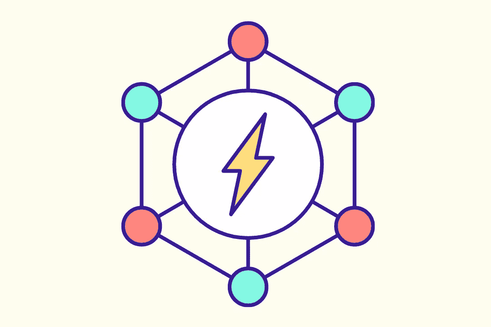
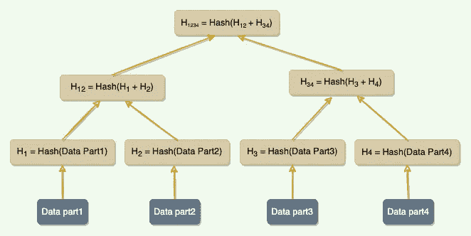

# 系统设计教程:3 个必须知道的分布式系统概念

> 原文：<https://medium.com/geekculture/system-design-tutorial-3-must-know-distributed-systems-concepts-279d4e9718e8?source=collection_archive---------2----------------------->

让你的下一次系统设计面试有一个好的开始。

在本帖中，我们将讨论三个系统设计概念，它们可以用来解决与分布式系统相关的设计问题。**由于这些概念可以应用于各种分布式系统，所以在** [**系统设计面试**](https://levelup.gitconnected.com/system-design-interview-survival-guide-2023-preparation-strategies-and-practical-tips-ba9314e6b9e3) **时非常有用。**

下面是我们将要讨论的概念列表:

1.  心跳
2.  分裂的大脑
3.  Merkle 树

# 1.心跳

## 背景

在分布式环境中，数据(或工作)分布在服务器之间。这种设置要求服务器知道系统中还有哪些服务器，以便有效地路由请求。此外，服务器应该能够判断其他服务器是否启动并运行。在分散式环境中，每当请求到达服务器时，服务器应该能够决定哪个服务器负责处理该请求。这样，及时检测服务器故障至关重要，使系统能够采取纠正措施，将数据(或工作)移动到另一台健康的服务器，并阻止环境进一步恶化。

## 定义

在分布式环境中，每台服务器都会定期向中央监控服务器或系统中的其他服务器发送心跳消息，以表明它仍在运行。

## 解决办法

[心跳](https://designgurus.org/path-player?courseid=grokking-the-system-design-interview&unit=grokking-the-system-design-interview_1627054470615_16Unit)是分布式系统中检测故障的机制之一。如果有中央服务器，所有服务器都会定期向其发送心跳消息。如果没有中心服务器，所有服务器随机选择一组服务器，每隔几秒钟向它们发送一次心跳消息。这样，如果有一段时间没有从服务器接收到心跳消息，系统可以怀疑服务器可能已经崩溃。如果在配置的超时期限内没有心跳，系统可以断定服务器不再活动，并停止向其发送请求，并开始处理其替代品。

## 例子

**谷歌文件系统(GFS)** 和 **HDFS** 使用心跳与系统中的服务器相互通信，以给出指令和收集状态。

# **2。裂脑**

## **背景**

在有中央(或领导)服务器的分布式环境中，如果中央服务器死了，系统必须迅速找到替代品；否则，系统会迅速恶化。

其中一个问题是，我们无法真正知道领导者是已经永远停止了，还是已经经历了间歇性的故障，比如 stop-the-world GC 暂停或临时网络中断。然而，集群必须继续前进，选择新的领导者。如果最初的领导者有间歇性的失败，我们现在发现自己有一个所谓的**僵尸领导者**。僵尸领导者可以被定义为被系统认为已经死亡并且已经重新联机的领导者节点。另一个节点已经取代了它的位置，但是僵尸首领可能还不知道。该系统现在有两个活跃的领导者，他们可能会发出相互冲突的命令。系统如何检测这样的场景，使得系统中的所有节点可以忽略来自旧引导者的请求，并且旧引导者本身可以检测到它不再是引导者？

## 定义

分布式系统中有两个或更多活跃领导者的常见场景被称为[裂脑](https://designgurus.org/path-player?courseid=grokking-the-advanced-system-design-interview&unit=grokking-the-advanced-system-design-interview_1626009059028_0Unit)。

裂脑是通过使用**一代时钟**解决的，它只是一个单调递增的数字来表示服务器的代。

## 解决办法

每次选出新的领导人，世代号就会增加。这意味着如果老领导的代号是“1”，那么新领导的代号将是“2”。这个代号包含在从领导者发送到其他节点的每个请求中。这样，节点现在可以通过简单地信任具有最高数字的领导者来容易地区分真正的领导者。世代号应该保存在磁盘上，以便在服务器重新启动后仍然可用。一种方法是将它与每个条目一起存储在预写日志中。

## 例子

**Kafka** :为了处理 Split-brain(我们可以有多个活动的控制器代理)，Kafka 使用了“**纪元编号**”，这是一个简单的单调递增的数字，用来表示服务器的代。

**HDFS** : ZooKeeper 用于确保任何时候只有一个 NameNode 是活动的。纪元编号作为每个事务 ID 的一部分进行维护，以反映 NameNode 的生成。

# **3。Merkle 树**

## **背景**

分布式系统在不同的服务器上维护多个数据副本(称为副本),以实现容错和更高的可用性。为了保持所有副本服务器之间的数据同步，系统需要一种有效的机制来比较两个副本之间的数据。在分布式环境中，我们如何快速比较驻留在两个不同副本上的一系列数据的两个副本，并准确找出哪些部分不同？

## 定义

副本可以包含大量数据。天真地分割整个范围来计算校验和进行比较是不太可行的；要传输的数据实在太多了。相反，我们可以使用 **Merkle 树**来比较一个范围的副本。

## 解决办法

一棵 [Merkle 树](https://designgurus.org/path-player?courseid=grokking-the-advanced-system-design-interview&unit=grokking-the-advanced-system-design-interview_1626009840592_0Unit)是一棵二进制散列树，其中每个内部节点是它的两个子节点的散列，每个叶节点是一部分原始数据的散列。

Merkle tree

比较 Merkle 树在概念上很简单:

1.  比较两棵树的根哈希。
2.  如果相等，停止。
3.  在左右孩子身上递归。

最终，这意味着复制品确切地知道范围的哪些部分是不同的，但是交换的数据量被最小化。Merkle 树的主要优点是可以独立检查树的每个分支，而不需要节点下载整个树或整个数据集。因此，Merkle 树最大限度地减少了同步所需传输的数据量，并减少了磁盘读取次数。

使用 Merkle 树的缺点是，当一个节点加入或离开时，许多键范围可能会改变，此时需要重新计算树。

## 例子

为了反熵和解决后台冲突，亚马逊的**发电机**使用了 Merkle 树。

# 结论

➡实践这些系统设计概念来使自己与众不同！

➡在“ [**探索系统设计面试**](https://designgurus.org/course/grokking-the-system-design-interview)**”****[**探索高级系统设计面试**](https://designgurus.org/course/grokking-the-advanced-system-design-interview) 中了解了更多关于这些方法的信息**

**➡在 Linkedin 上关注我，了解系统设计和编码面试的技巧。**

**阅读更多关于系统设计面试的信息:**

** [## 2022 年 Ace 系统设计面试完全指南

### 回答任何系统设计面试问题的 7 步流程。

medium.com](/codex/the-complete-guide-to-ace-the-system-design-interview-in-2022-2d21c9534905)  [## 12 大系统设计面试问题及答案(2022)

### 通过练习这些问题，你可以增加许多成功的机会！

medium.com](/geekculture/top-12-system-design-interview-questions-with-answers-2022-dc2b6599f39a) 

# 感谢阅读

*   👏请为这个故事鼓掌，然后跟我来👉
*   📰查看更多关于[编码和系统设计访谈](https://arslan-ahmad.medium.com/)的内容
*   🔔关注我:[LinkedIn](https://www.linkedin.com/in/arslanahmad/)|[Twitter](https://twitter.com/arslan_ah)|[时事通讯](https://designgurus.org/interview-noodle-page)**