# 系统神经科学角。(几乎)所有事物的简史

> 原文：<https://medium.com/geekculture/systems-neuroscience-pt-1-a-brief-history-of-almost-everything-3156a669df7?source=collection_archive---------10----------------------->

# 前言

我已经一年没写文章了。迄今为止，我只发表过与人工智能等技术相关的文章，但我决定写所有让我感兴趣的东西。

*因此，这将是一个关于系统神经科学的两部分系列，通过大脑疾病的镜头进行检查。我希望你喜欢这篇对历史上最有影响力的神经科学家及其发现的回顾，并期待下周的文章(我将在结论中讨论)。*

# 颅相学(弗朗兹·加尔)

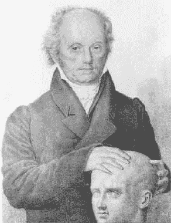

Franz Galfeltng the skull of one of his test subjects

颅相学发展于 1796 年，是我们所知的最早的脑成像形式之一。实质上，高尔发现了不同的人的“原型”(例如，牧师、罪犯、知识分子教授等。)并试图通过触摸头骨的外部来推断他们心理特征的差异。例如，如果 Gall 发现罪犯的头骨顶部倾向于异常突出(与那些从未犯罪的人相比)，他会将大脑顶部归因于人类的道德指南针。使用这种方法，他创建了一个广义的大脑“地图”，将大脑的不同部分归因于不同的精神特征，如雄心壮志、自我反省等。

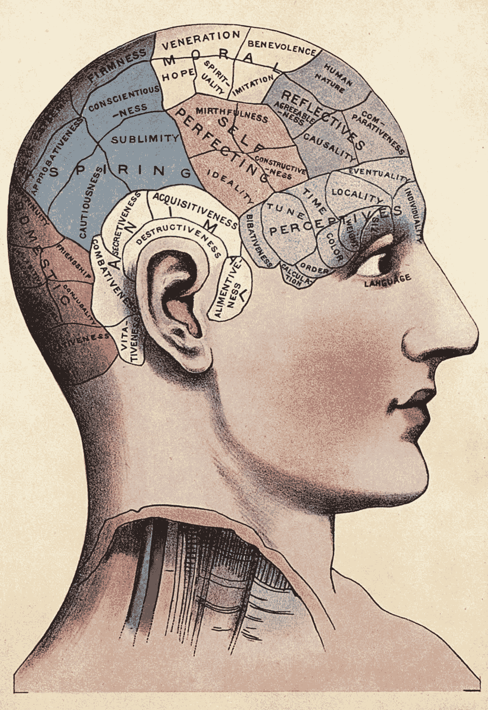

Gall’s proposed map of the brain

当然，我们现在知道这种大脑地图的方法几乎完全是伪造的，所以这一节与其说是其他任何东西，不如说是一段有趣的历史。

# 细胞建筑学(科尔比尼安·布罗德曼和圣地亚哥·拉蒙和卡哈尔)

## 科尔比尼安·布罗德曼

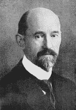

Korbinian Brodmann

接下来是细胞架构，这是一种更精确的研究大脑结构的方法，尤其是在 20 世纪初发展起来的。Brodmann 检查了在显微镜下死亡的人的脑组织，这使他能够比 Gall 等前辈更有效地绘制出大脑。他仔细绘制了大脑不同部分的细胞数量，这些部分连接的密度，以及大脑不同层的样子。然而，最值得注意的是，Brodmann 在 Brodmann 区域定义了 52 个不同的大脑区域。

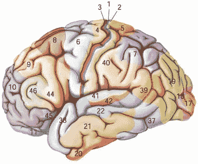

The 52 Brodmann areas

事实证明他的画非常准确:直到今天，Brodmann 区域仍然被用来识别大脑的不同部分。例如，我们知道 Brodmann 区域 17 位于枕叶。然而，尽管对大脑的物理结构进行了高度精确的绘图，Brodmann 从未解决这些不同部分的功能。

## 圣地亚哥·拉蒙·卡哈尔

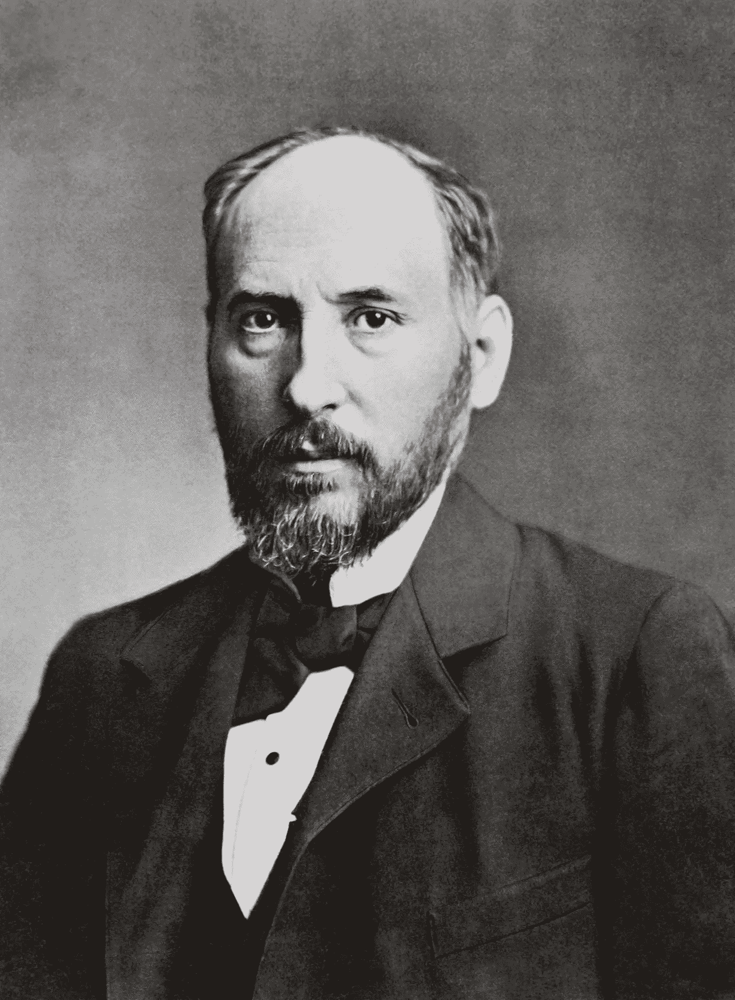

Santiago Ramón y Cajal

Ramón y Cajal 比 Brodman 做得更详细，在显微镜下检查了单个细胞。Ramón y Cajal 绘制出了单个细胞和细胞类型，而不是创建一个概括的系统来绘制大脑。同样，他非常详细和准确，直到今天，当讨论大脑细胞的解剖结构时，他的画仍然被引用。然而，和 Brodmann 一样，Ramón y Cajal 回避了大脑各部分的功能。

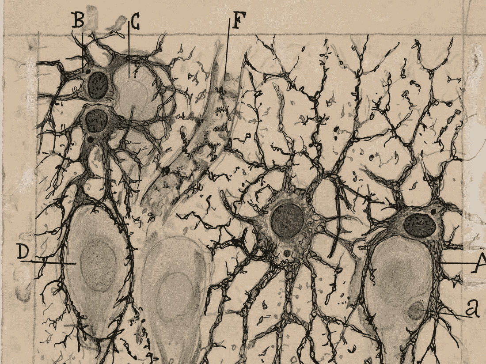

Ramón y Cajal’s drawing of a dead man’s hippocampus

# 功能映射(皮埃尔·布罗卡、古斯塔夫·弗里奇、爱德华·希齐格、怀尔德·潘菲尔德和井上辰司)

## 皮埃尔·布罗卡

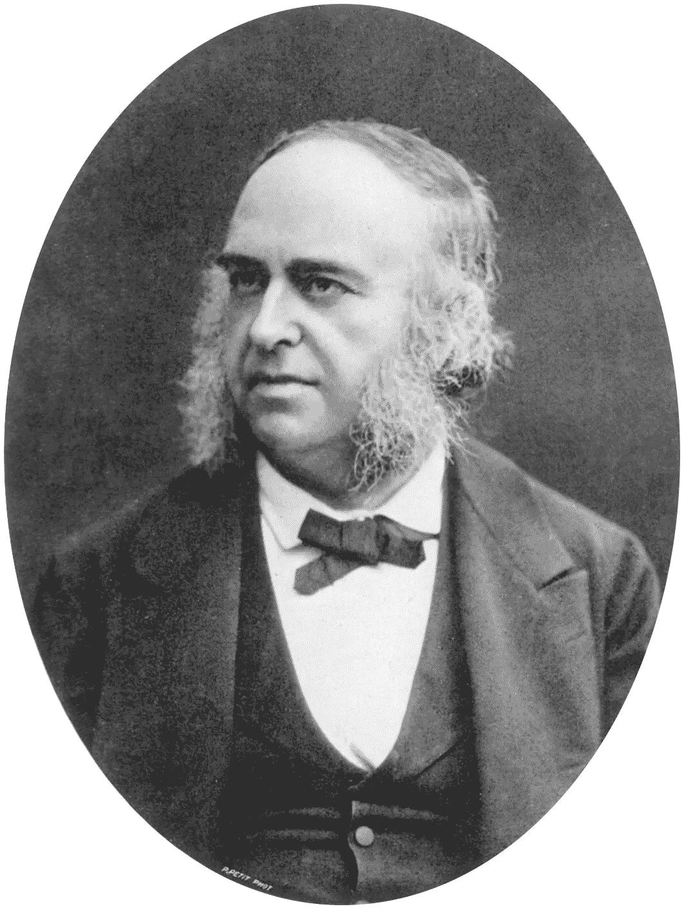

Pierre Broca

布罗卡第一个注意到大脑的不同部分有不同的功能。如标题所述，由于对大脑疾病的研究，许多神经科学成为可能。在 19 世纪中期，布罗卡研究了在颞叶某个部位中风的病人；每个在大脑这个部位中风的病人都失去了说话的能力。布罗卡由此得出结论，大脑的这个区域负责说话。这个结论被证明是正确的，我们仍然把大脑的这个区域称为“布罗卡区”。布罗卡区中风患者也被称为患有“布罗卡失语症”。

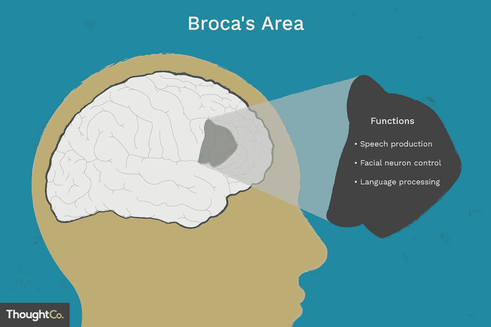

Broca’s area is vital for various functions related to speech

## 古斯塔夫·弗里奇和爱德华·希齐格

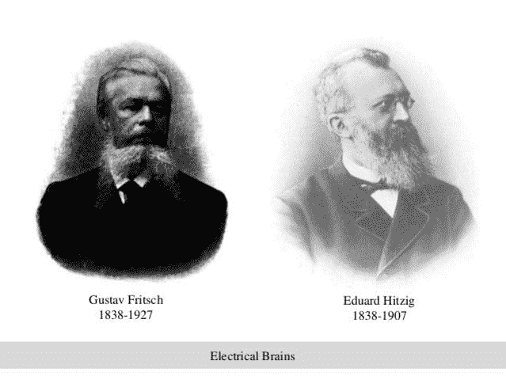

Fritsch & Hitzig

Fritsch 和 Hitzig 在 Broca 的工作基础上，通过电刺激狗大脑的不同部分，观察它的反应。具体来说，他们决定了初级运动皮层的功能；他们发现，通过电刺激大脑物质带的不同区域，他们可以引发某些运动。

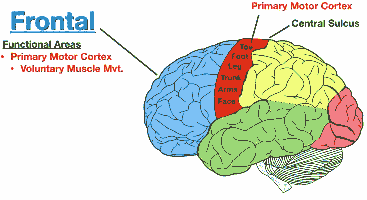

Different parts of the primary motor cortex are responsible for different body parts

## 怀尔德·潘菲尔德

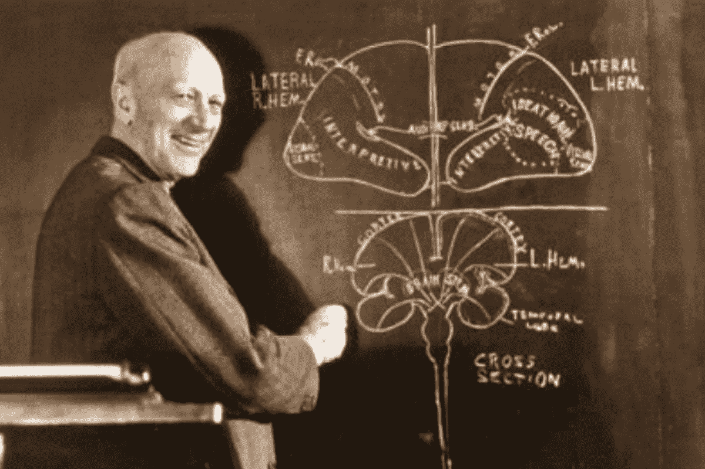

Wilder Penfield

同样，Penfield 电刺激癫痫患者的大脑来定位癫痫发作的位置。与此同时，他注意到，通过刺激大脑中被称为体感皮层的某个区域，他可以在身体的某些部位引发感觉。请注意，这与初级运动皮层不同，因为初级运动皮层引发运动，而躯体感觉负责接收和处理感觉信息。

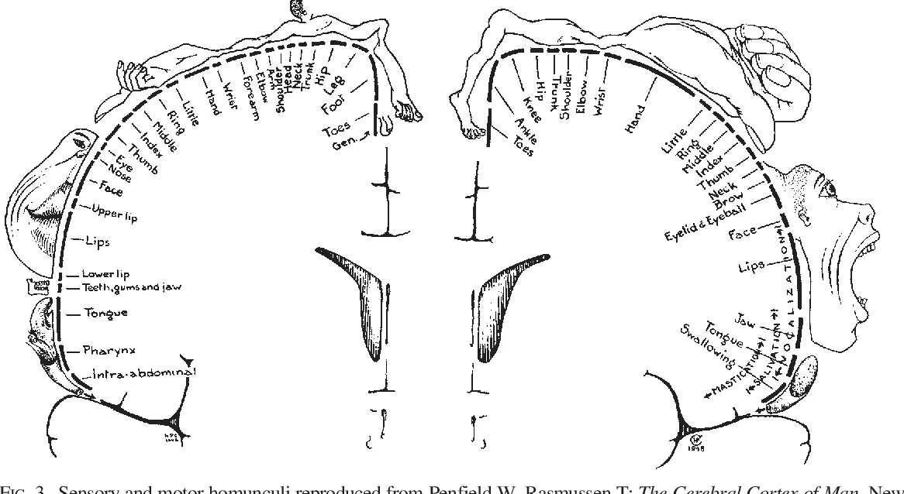

Penfield’s map of the somatosensory and motor areas of the brain. By electrically stimulating different parts of this area, certain feelings and movements can be elicited.

## 井上达治

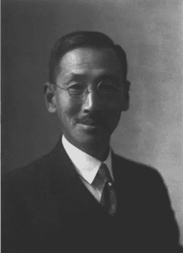

Tatsuji Inouye

虽然我们迄今为止谈论的神经科学家绘制了大脑中负责身体运动和身体感觉的区域，但井上 Tatsuji Inouye 的大部分工作都是在大脑中负责视觉的区域进行的，即所谓的枕叶。

井上的故事尤其有趣:作为一名军医，他能够通过观察日俄战争中不同的病人来理解视觉的机制。这场战争是士兵第一次使用装有特定类型子弹的特定类型的枪，这种子弹会在其他士兵的头盔上留下离散的损伤。这意味着当这种子弹接触到士兵的头部时，它们会对大脑的特定部位造成损伤，而较大的子弹会破坏更大的区域。巧合的是，井上治疗的许多损伤都是后脑的损伤，那里有枕叶。当枕叶的某些部分受损时，士兵会失去部分视野。利用这些知识，井上仔细绘制出了枕叶的哪些部分与视野的哪些部分相关联。

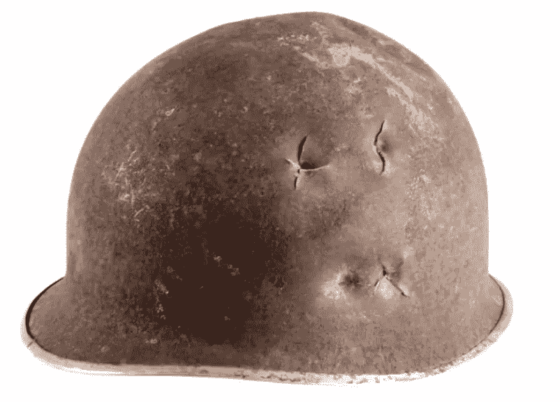

The higher-speed bullets used in the Russo-Japanese War produced more discrete lesions on helmets.

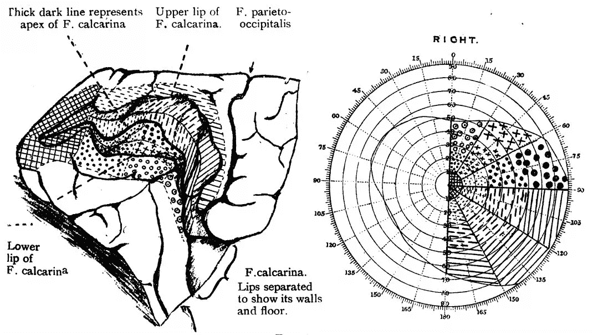

One of Dr Inouye’s maps that ascribes different parts of the occipital lobe to different parts of one’s field of vision.

# 结论

以上是系统神经科学历史上一些最重要的发展的简要回顾。同样，这是两部分系列的第一部分，我将发布的下一篇文章将全面分析大脑的不同部分，以及它们如何共同帮助我们发挥作用。

正如在这篇文章中所看到的，大脑疾病是我们进一步了解大脑内部机制的基础。这个想法将在本系列的第二部分中进一步探讨，所以请期待下周的某个时候。感谢阅读！

如果你有任何问题或想联系，随时给我发电子邮件:alexander.chow911@gmail.com

了解更多关于我的信息: [LinkedIn](https://www.linkedin.com/in/alexander-chow-6539771b3/)