# 系统神经科学角。2:视觉机制的全面崩溃

> 原文：<https://medium.com/geekculture/systems-neuroscience-pt-2-a-comprehensive-breakdown-of-the-mechanisms-of-vision-d9b6bfed6e5f?source=collection_archive---------10----------------------->

# 你的眼睛是如何与大脑交流的？

在你的眼睛里，你有几种不同的结构:瞳孔是你眼睛里的洞，所有的光都通过它；虹膜包围着瞳孔，给你眼睛颜色；晶状体将穿过瞳孔的光线聚焦到眼睛后部；你眼睛的后部有一层叫做视网膜的细胞。当检测到光线时，你眼睛后部的这些细胞被激活，并随后通过视神经向大脑发送信号。

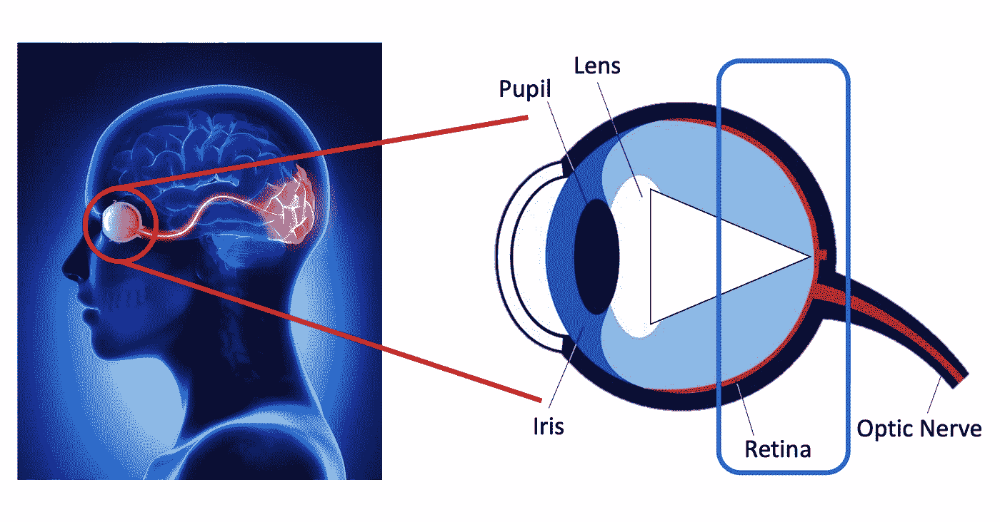

## 仔细观察视网膜

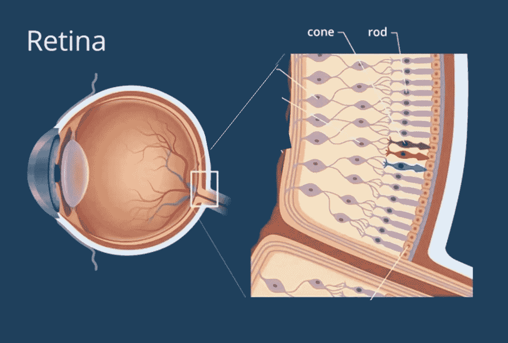

正如我之前所说，视网膜是由一层细胞组成的。这片细胞由两种不同类型的特殊细胞组成，称为光感受器:视锥细胞和视杆细胞。显然，锥体是圆锥形的，而杆状体的形状像杆。我之所以注意到这一点，是因为视杆细胞和视锥细胞有着重要但不同的用途:视杆细胞检测光和暗，而视锥细胞检测颜色。此外，虽然只有一种类型的视杆细胞，但有三种类型的视锥细胞:红色视锥细胞、蓝色视锥细胞和绿色视锥细胞。正如你可以满怀希望地推断的那样，红色视锥检测红光，蓝色视锥检测蓝光，绿色视锥检测绿光。

这些细胞中的每一个都负责检测你视觉中特定区域的光线或颜色。这意味着你的感光体越多，你的视觉分辨率就越高(想想 240 p vs . 480 p vs . 720 p)。人眼大约有 1 亿个视杆细胞和 600 万个视锥细胞，所以我们的视觉分辨率相当高。

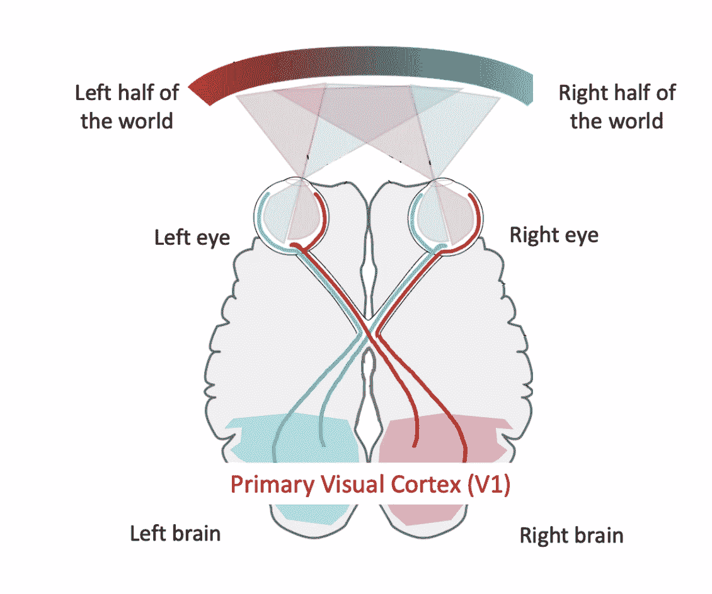

视网膜中的细胞检测到的所有信息然后通过视神经发送到初级视觉皮层，在那里进行处理。

## 盲区

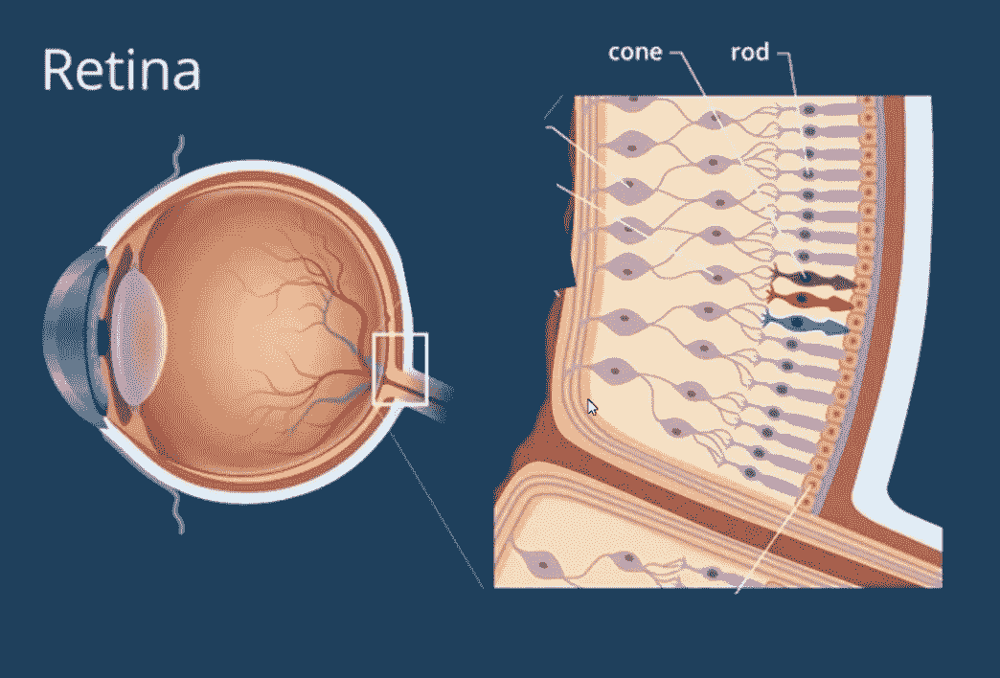

首先，重要的是要注意，在视神经离开视网膜的地方没有细胞或光感受器。我们视觉的每一部分都被某种光感受器所覆盖；这反过来意味着，在没有任何光感受器的地方，我们的视觉将会有一个盲点。因此，在你的双眼中有一个盲点，没有细胞可以检测到来自空间特定部分的光。

## 凹

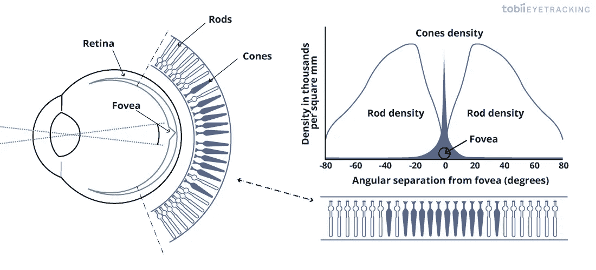

与我们的盲点相反，还有一个区域比正常情况下挤满了更多的光感受器。这个区域被称为视网膜中央凹；它帮助我们以更高的空间分辨率看到视野的中心。你可能还注意到，在这个区域，视锥细胞的密度比视杆细胞高得多。

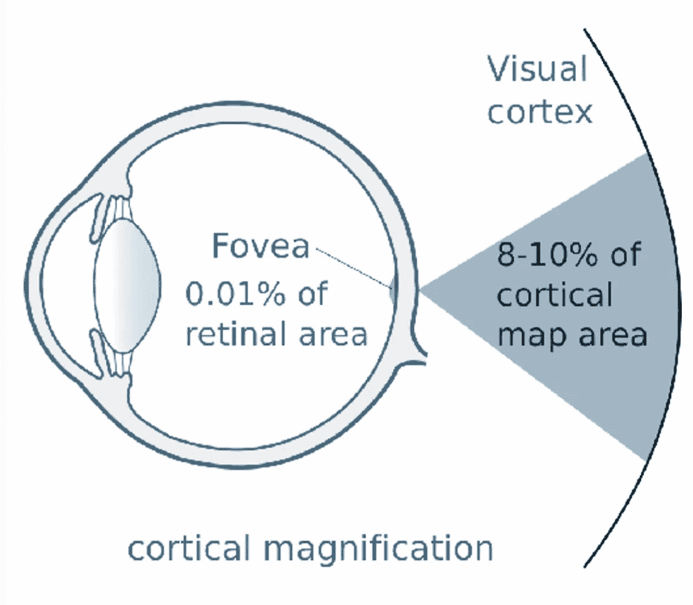

有趣的是，0.01%的视网膜覆盖了我们 10%的视野。

## 超越初级视觉皮层

正如我前面所说的，眼睛检测到的信息通过视神经发送到初级视觉皮层，在那里进行初步处理。

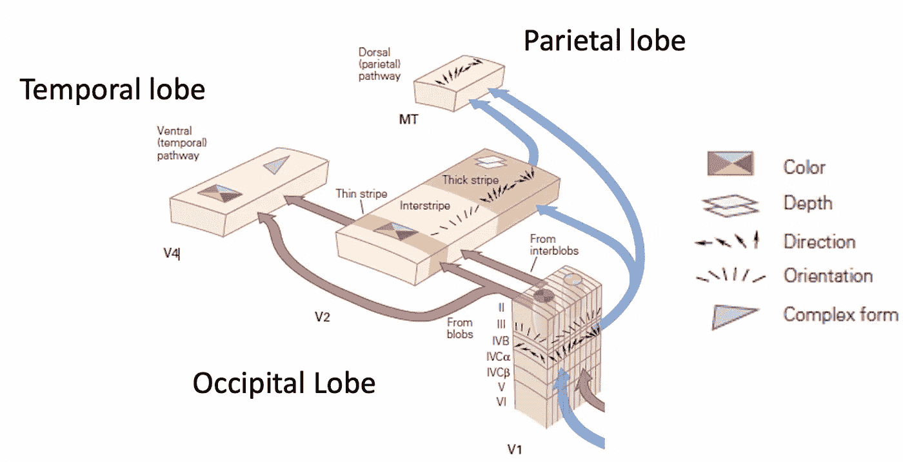

初级视觉皮层被称为 V1，位于枕叶。在 V1，有“blob”(V1 对颜色敏感的区域)和“inter lob”(V1 对物体方向敏感的区域)，检查方向和方向之类的东西。

这些细胞连接到 V2，枕叶的另一部分；在 V2，有“条纹”和“中间条纹”来检查更复杂的东西，如颜色和深度。

最后，V2 连接到 V4(在颞叶)和 MT(在顶叶)。V4 对于通过物体的形状和颜色来识别物体尤其重要，而 MT 则负责辨别物体的运动方向。

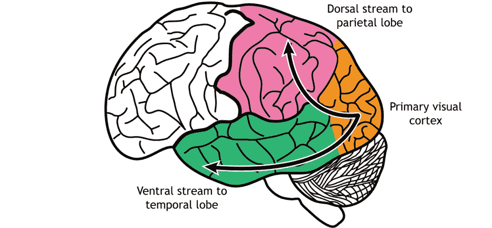

通向颞叶的连接流被称为“腹侧流”，通向顶叶的连接流被称为“背侧流”。腹侧流被称为“什么”路径(因为它允许你识别你正在看的东西)，背侧流被称为“哪里”路径(因为它允许你识别你正在看的东西在哪里以及它是如何移动的)。

与人工神经网络类似，大脑中从初级视觉皮层到顶叶/颞叶的每个后续区域都集成了越来越复杂的视觉信息，从基本的方向和方位到更复杂的形式识别和深度。当你从 V1 到 V2 再到 V3/MT，感受野的大小也会增加。

# 顶叶对视觉注意力很重要

注意力有两种类型:自下而上(非自愿)和自上而下(自愿)。自下而上的注意力可以被认为是注意到一组蓝色小方块中的一个红色大圆圈:这不是你必须有意识地去做的事情。相比之下，自上而下的注意力可以被认为是试图在一大群平民中找到瓦尔多——这是一个有意识完成的行动。

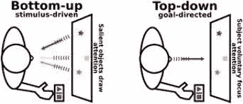

顶叶被发现对自上而下的、自主的注意力很重要。

## 半空间忽略

我们知道顶叶对自上而下的注意力很重要的一个原因是半空间忽略，这是一种导致患者视野一侧注意力和意识不足的情况；它最常与右顶叶损伤有关。

不出所料，当你让一个患有半空间忽略症的病人去找沃尔多时，他们只能注意自己视野的一边。奇怪的是，患者并不是看不到自己视野的另一面；只是他们的大脑下意识地选择不去关注它。一旦被提醒要看另一边，病人就能够主动将注意力转移到另一边。

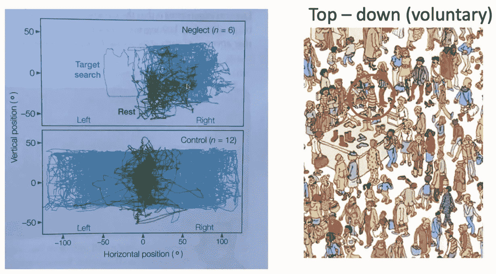

此外，当被要求抄下图纸或自己画画时，可以看到类似的效果，他们只能将注意力集中到自己视野的一半。有趣的是，他们的记忆以类似的方式工作:当被要求回忆某个地点或某个图像时，他们只会描述该地点/图像的一半。

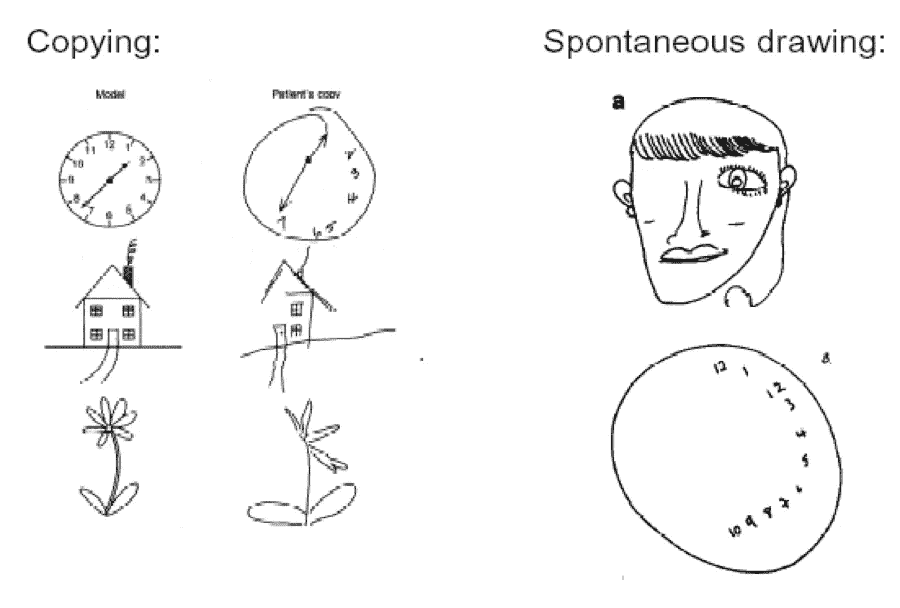

# 在“什么”和“哪里”路径上的显著的大脑紊乱

## 面容失认症:脸盲[“什么”路径]

这种疾病由梭状回(位于颞叶和枕叶)的损伤引起，导致患者失去辨别面孔的能力，甚至无法识别他们所爱的人和家人的面孔。事实上，病人甚至认不出他们自己的脸，经常会引起身份的挣扎。

## 感知失认症:缺乏物体空间意识[“什么”路径]

患有这种疾病的患者很难再现形成图像的线条，但可以很容易地识别他们正在看的图像。医生将这种情况与“什么”路径上的某个地方联系起来，在那里线条被整合成形状，而大脑中识别物体的部分没有受到伤害。

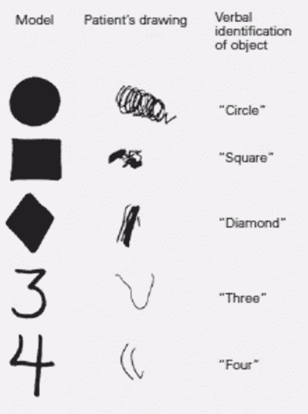

## 关联失认症:缺乏物体识别[“什么”路径]

相比之下，联合失认症患者可以毫无问题地复制图像，但不能在任何程度上识别物体。

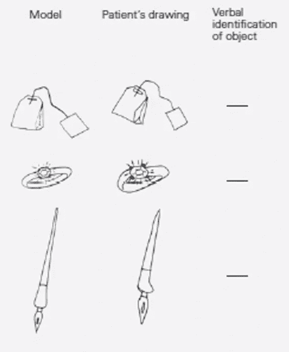

## 失视症:运动盲[“哪里”路径]

如果负责检测运动的 MT 区域受损，患者可能会出现运动不能症。从本质上说，患者将生命视为一组静止的帧，但这些帧并没有被放在一起或连接起来以创建平滑的运动。一位著名的病人描述说，她看到一个人，一眨眼的功夫，那个人就在房间的另一边:她对那个人走过房间的动作视而不见。

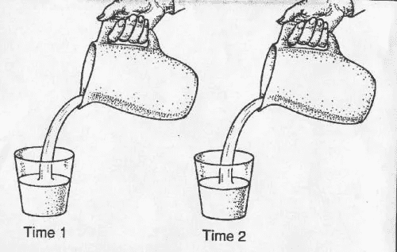

# 结论

感谢阅读！本系列的下一部分将讨论大脑的其他部分及其功能角色，再次通过大脑疾病的历史镜头进行检查。请期待下周的某个时候。

如果你有任何问题或想联系，随时给我发电子邮件:alexander.chow911@gmail.com

了解更多关于我的信息: [LinkedIn](https://www.linkedin.com/in/alexander-chow-6539771b3/)