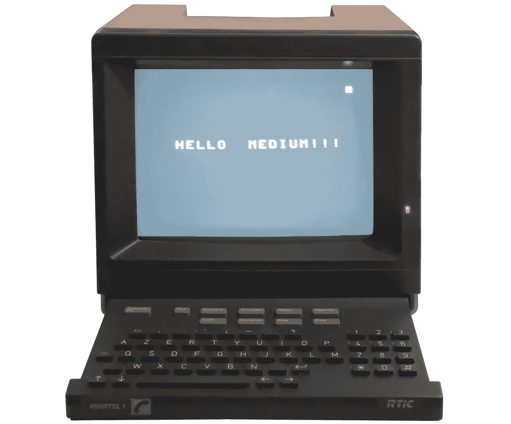

# 80 年代的法国互联网——它是如何运作的？

> 原文：<https://medium.com/geekculture/t%C3%A9l%C3%A9tel-the-french-internet-of-the-80s-how-did-it-work-f910666a80c1?source=collection_archive---------1----------------------->

我想，如果我说类似互联网的系统在 80 年代就已经在法国运行了，大多数读者不会相信我。但事实确实如此。

Minitel 1 © Image by author

怎么可能呢？让我们弄清楚。

# 历史

计算机在很多年前就已经连接到网络上了(TCP 和 FTP 协议，现在仍然是…