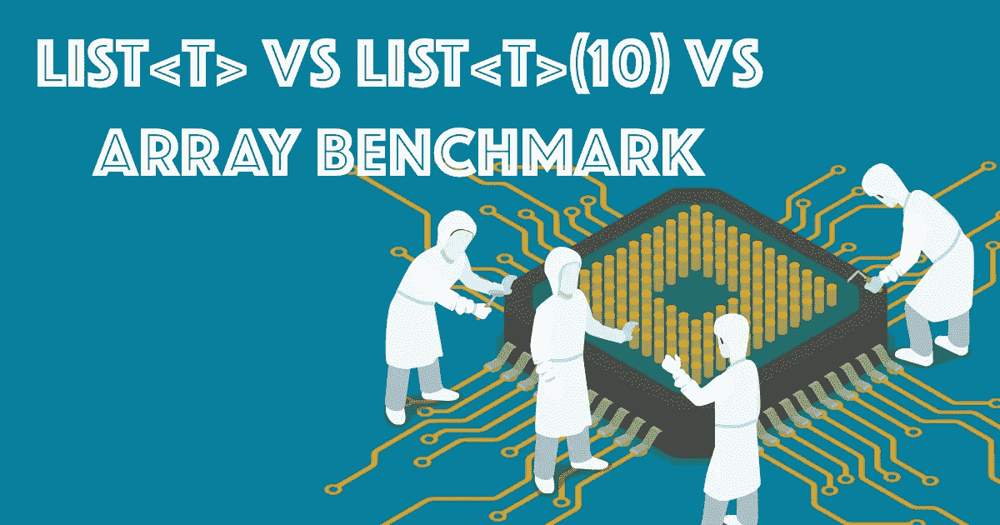
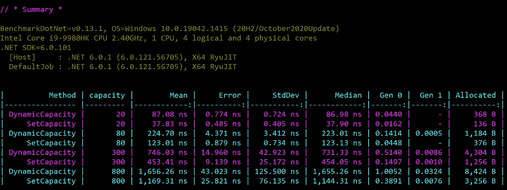
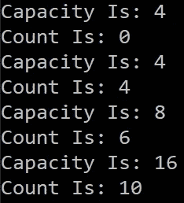
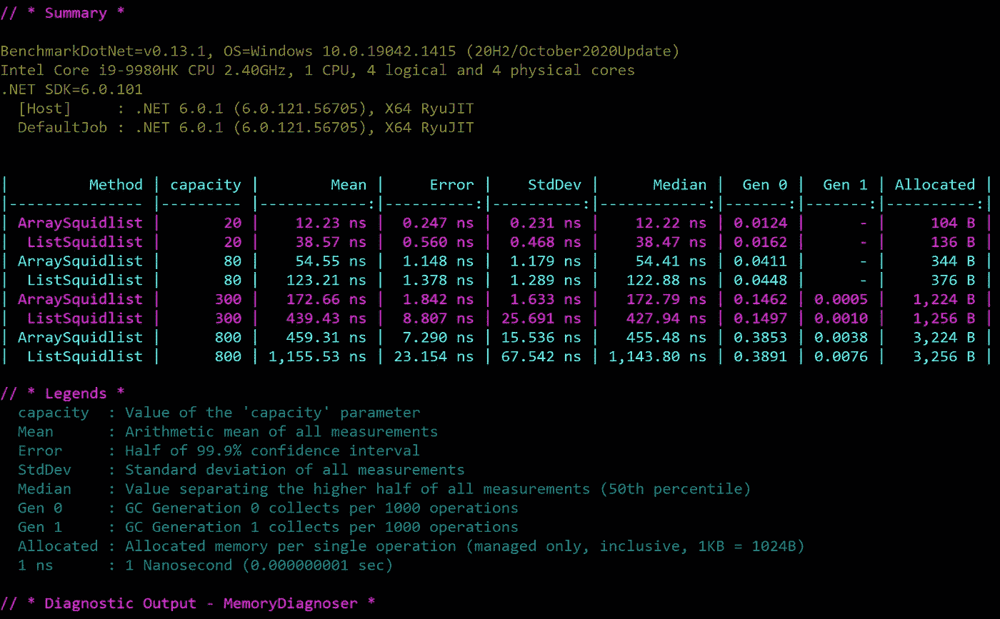

# 列表 <t>&列表<t>(容量)&数组基准</t></t>

> 原文：<https://medium.com/geekculture/list-t-list-t-capacity-array-benchmark-d911aa838b34?source=collection_archive---------3----------------------->



**Image Source:** [**og_cpu_benchmarks.png**](https://www.passmark.com)

嗨，今天我们将讨论动态列表<t>、大小特定列表 <t>(10)和基准测试的数组列表。</t></t>

首先，我们将创建一个. Net 6.0 控制台应用程序，我们将编写测试列表<t>、数组和列表<t>(计数)的基准。</t></t>

将“BenchmarkDotNet”包添加到项目中。

```
**dotnet add package BenchmarkDotNet --version 0.13.1**
```

在第一个场景中，我们将创建两个列表<>，其中一个是动态列表，在第二个场景中，我们将在列表的构造函数处设置容量。我们将多次向这两个列表添加不同的计数，并检查基准测试结果。

我们将创建一个“ListCapacityPerformance”类，并用[MemoryDiagnoser]属性对其进行标记。MemoryDiagnoser 允许测量分配的字节数和垃圾收集频率。

```
using BenchmarkDotNet.Attributes;
using BenchmarkDotNet.Running;[MemoryDiagnoser]
public class ListCapacityPerformance
{
  .
  .
}
```

使用[Params()]属性，您可以指定一组值。每个值都必须是编译时常数。因此，您将获得每个参数值组合的结果。

```
[Params(20, 80, 300, 800)]
public int capacity;
```

在下面的例子中，我们将创建列表<>，但不设置任何容量。毕竟，我们将为“count”数组的每个变量添加数字到这个动态列表中。最后，我们将检查内存分配、总时间等。

```
[Benchmark]
public List<int> DynamicCapacity()
{
     List<int> squidList = new List<int>();
     for (int i = 0; i < capacity; i++)
     {
        squidList.Add(i);
     }
     return squidList;
}
```

在第二个例子中，我们将用静态容量创建“List <int>(capacity)”。对于每个循环，我们将列表长度设置为容量值。</int>

```
[Benchmark]
public List<int> SetCapacity()
{
     List<int> squidList = new List<int>(capacity);
     for (int i = 0; i < capacity; i++)
     {
          squidList.Add(i);
     }
     return squidList;
}
```

内置“释放”模式。以及“不调试就启动”。下面，您可以看到静态容量列表分配得更少，速度更快。值越大，差距越大。



如果你在列表<> (x)中添加了一个条目，超过了它的容量，C#会为每个重载扩展列表的大小，是当前大小的 2 倍。列表<>总是在添加每个项目之前检查其限制。

名单上有一个障碍<>。在下面的例子中，我们将列表的容量设置为 4。如果我们添加到列表中的项目超过 4 个，它会在每次过载时自动增加两次容量。

让我们看看下面的例子:是的。没有 Main()方法的. Net 6 控制台应用程序:)

```
List<int> squidlist = new List<int>(4);Console.WriteLine("Capacity Is: " + squidlist.Capacity);
Console.WriteLine("Count Is: " + squidlist.Count);squidlist.Add(1);
squidlist.Add(2);
squidlist.Add(3);
squidlist.Add(4);Console.WriteLine("Capacity Is: " + squidlist.Capacity);
Console.WriteLine("Count Is: " + squidlist.Count);squidlist.Add(5);
squidlist.Add(6);Console.WriteLine("Capacity Is: " + squidlist.Capacity);
Console.WriteLine("Count Is: " + squidlist.Count);squidlist.Add(7);
squidlist.Add(8);
squidlist.Add(5);
squidlist.Add(9);Console.WriteLine("Capacity Is: " + squidlist.Capacity);
Console.WriteLine("Count Is: " + squidlist.Count);
```

如果您看到结果，在开始时，列表容量为 4，计数为 0。在我们添加了 4 个条目之后，列表容量又是 4，但是这次它的计数也是 4。在我们添加了 2 个条目并重载了长度列表之后，它的容量增加了，变成了 8(2*4)，计数为 6。最后，当我们再添加 4 个条目时，List <>计数为 10，容量增加为 16 (2*8)。



> **超过清单上限是有代价的。因此，在处理列表时应该非常小心，尤其是在处理大型数据时。**

# 列表与数组

有时与列表的许多优点相反，使用数组可能会更好。

让我们看看下面的例子:和上面的例子一样，我们在一个列表和一个数组中添加了从 1 到最大的计数。我们对计数数组的每个组合做了同样的事情。

正如我们在基准测试中看到的，阵列版本要快得多。我知道大多数开发人员更喜欢列表而不是数组。为什么？

**因为:**

*   List 有添加、移除、搜索和排序元素的特殊方法。
*   列表<t>是一个动态数据结构，这意味着我们在声明它的时候不需要知道元素的数量。因此列表大小可以在运行时扩大。</t>



数组没有 List 有用，但是速度更快，你可以通过数组的索引来搜索元素。但是列表需要迭代，这意味着列表的搜索时间很慢。与列表不同，数组需要更少的内存。但是列表有很多有用的特殊方法，所以它们比数组更好。

**结论:**

有许多不同的数据结构。每种数据结构都有优缺点，根据任务的不同会影响性能。今天我们讨论了数组和列表。我希望这篇文章能帮助你理解数组和列表的区别。新年快乐。2022 年下期文章再见。再见

*“如果您读到现在，首先感谢您的耐心和支持。欢迎大家来我的博客*[](http://www.borakasmer.com/)****了解更多！”****

****来源:****

*   **[https://adamsitnik.com/the-new-Memory-Diagnoser/](https://adamsitnik.com/the-new-Memory-Diagnoser/)**
*   **[https://www.thetechplatform.com/post/arrays-vs-lists-in-c](https://www.thetechplatform.com/post/arrays-vs-lists-in-c)**
*   **[https://medium . com/star-gazers/arrays-vs-lists-in-c-c 7 cafb 268 f 92](/star-gazers/arrays-vs-lists-in-c-c7cafb268f92)**
*   **[https://towards data science . com/linked-lists-vs-arrays-78746 f 983267](https://towardsdatascience.com/linked-lists-vs-arrays-78746f983267)**
*   **[https://benchmarkdotnet . org/articles/features/parameter ization . html](https://benchmarkdotnet.org/articles/features/parameterization.html)**
*   **[https://www . LinkedIn . com/posts/Roger maza _ software engineering-programming-coding-activity-6877930555896303616-jYHd/](https://www.linkedin.com/posts/rogermaza_softwareengineering-programming-coding-activity-6877930555896303616-jYHd/)**