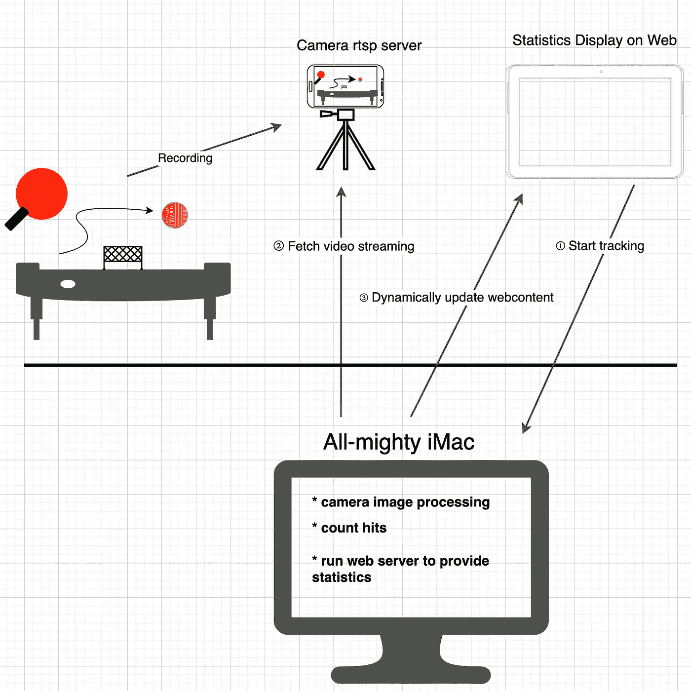
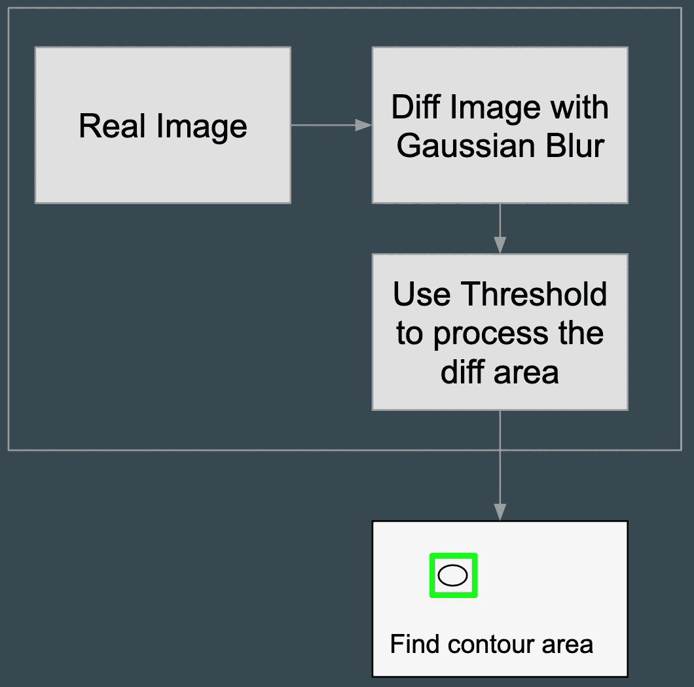
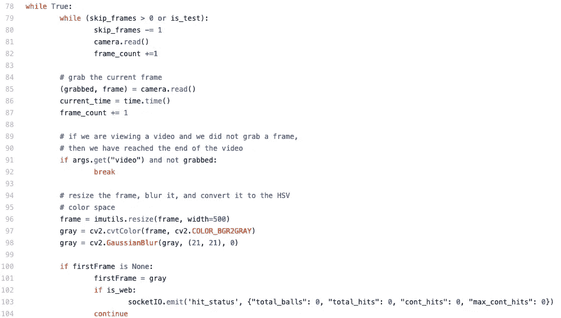
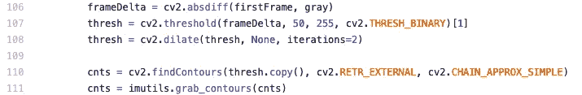
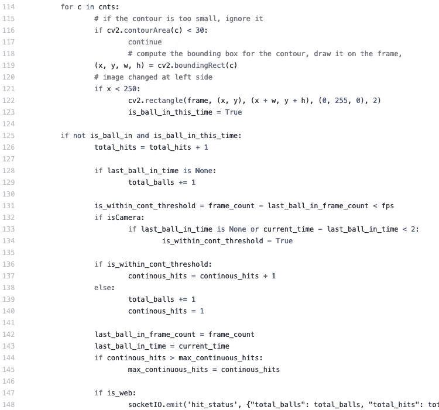
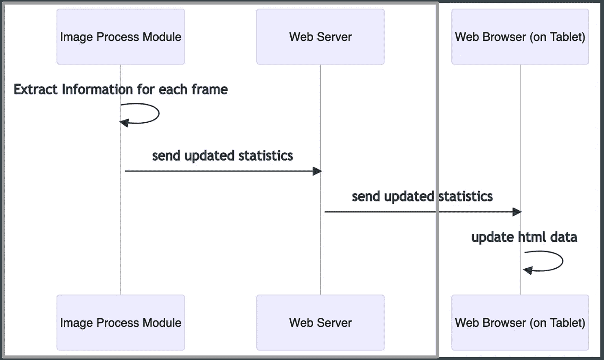
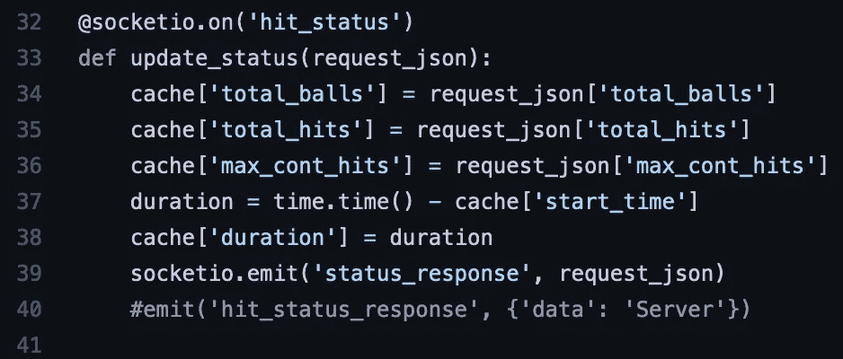
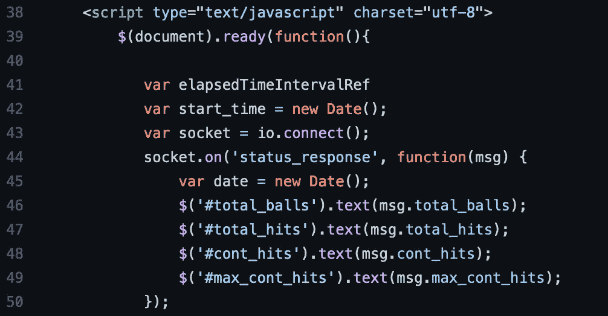
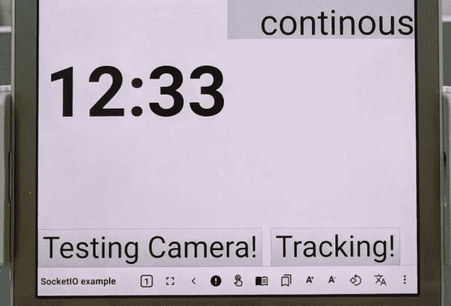
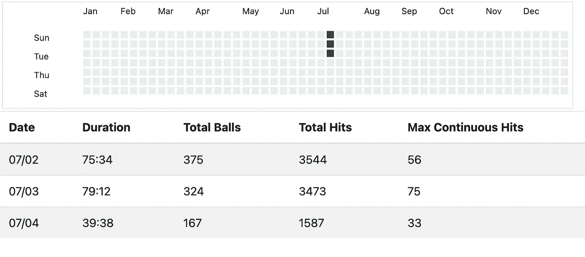

# 乒乓球练习跟踪仪表板

> 原文：<https://medium.com/geekculture/table-tennis-practice-tracking-dashboard-3c2535037f2b?source=collection_archive---------42----------------------->

由于最近在家工作的政策，我需要一种在家锻炼的方式。我买了一个 1/4 大小的乒乓球台，和一个练习板(视频中的红色矩形)来帮助将球反弹回来。虽然这是一种出汗的方式，但它并没有显示练习表现如何，以及我花了多少时间。我希望有一种方法可以跟踪每次练习的所有信息，作为后期改进的参考。而且，人类喜欢读数字。数字是激励人们做更多事情的魔法。

经过反复试验，我建立了一个系统来显示我实习期间最重要的数字:

*   **过了多少时间，**
*   **我用了多少球，**
*   **我点击了多少次，**
*   **当前连续点击量，**
*   **还有最大连续命中。**

现在，我将解释该系统是如何建立的。

# 体系结构

该系统由三部分组成:

1.  **一部手机**记录练习场景，作为 RTSP 流媒体服务器；
2.  **一台台式电脑**(我用的是 iMac)用于处理流媒体内容，同时也充当网络服务器；
3.  **和一个平板电脑**，或者另一个手机来显示当前的统计数据。

使用手机记录练习场景，并将视频传输到 iMac 机器，在 iMac 机器上运行 python 脚本来处理图像信息，然后在 iMac 上设置 web 服务器，将当前统计数据显示到靠近乒乓球台的远程 Android 平板电脑上。

# RTSP 流媒体

第一部分是最容易的部分；我从 Fdroid 网站下载了 Spydroid。这是一个移动应用程序，可以录制视频，并通过 RTSP 协议进行流传输，有几种灵活的配置。由于我计划将所有繁重的工作都放在电脑上完成，所以我只需要一个设备来连续捕捉练习图像并将它们发送到电脑上。Spydroid 正好完全符合我的需求。

 [## 免费和开源的 Android 应用程序库

### VLC 可以直接读取流*您可以启用/禁用声音或视频流*分辨率，比特率…

f-droid.org](https://f-droid.org/packages/net.majorkernelpanic.spydroid/)  [## fyhertz/spydroid-ipcamera

### Spydroid 是一个小 app。将你手机的摄像头和麦克风传到你的浏览器或 VLC！这很有趣…

github.com](https://github.com/fyhertz/spydroid-ipcamera) 

# 图像处理

图像处理由 python 脚本在 OpenCV 库的帮助下完成。OpenCV 库是一个非常成熟和流行的处理图像的解决方案。很多资源也可以在互联网上找到。

我使用 OpenCV 来检测图像左侧是否有任何图像差异(与球还没有进入屏幕的第一个图像相比)。平时我站在桌子右边，练习板放在左边。这就是为什么我只检测到图像的左侧。如果是这样，在图像差没了之后再算一击(也就是球又离开屏幕了)。

该算法引用自以下链接:

 [## 用 Python 和 OpenCV - PyImageSearch 实现基本的运动检测和跟踪

### 那个狗娘养的。我知道他拿走了我最后一瓶啤酒。这些话是一个男人永远不应该说的。但是我喃喃自语…

www.pyimagesearch.com](https://www.pyimagesearch.com/2015/05/25/basic-motion-detection-and-tracking-with-python-and-opencv/) 

图像处理的主要实现在`detact_area_change.py`。

 [## plateaukao/pingpongpad

### 在 GitHub 上创建一个帐户，为 plateaukao/pingpongpad 的发展做出贡献。

github.com](https://github.com/plateaukao/pingpongpad/blob/main/detect_area_change.py) 

这里有一个视频演示图像处理是如何进行的:

这个过程的简单解释是:

## 代码解释

在开始时，由于视频录制不稳定，跳过了几帧，对比度将在 1 到 2 秒后变得稳定，我在第 79 ~ 82 行跳过了这些帧。在第 96~ 98 行，每一帧都被调整到一个更小的尺寸，并转换成一个灰度图像(因为颜色是不相关的)，并应用高斯模糊来减少小噪声。

当所有这些都完成后，第一帧将被记住(在第 101 行)作为比较后面变化的背景。

在第 106 到 108 行，图像被比较并过滤一些阈值以确保结果是我想要的。然后，`callfindContours`进行后续动作。

测量每个轮廓数据以过滤掉太小的变化(在第 116 行)。仅考虑图像的左侧(第 121 行)。为该区域绘制一个矩形。然后 125 ~ 148 行是在计算是新球，新的安打，还是新的最大连续安打记录。

如果两次击中之间的时间差足够接近，比如说在 1 或 2 秒内，我假设它们是同一个球的连续击中(在第 132 ~ 134 行)。这就是我如何计算当前连续命中和最大连续命中。

当图像数据被处理时，结果应该被发送到某个地方，以便我在练习乒乓球时可以看到它(在第 148 行)。

# 基于 Python 和 Flask 的 Web 服务器

我决定在 iMac 上写一个 web 服务器，而不是为平板电脑或移动电话写一个应用程序，因为这样更容易。web 服务器是用 Python 和 Flask 写的。我还使用了`SocketIO`库来加快速度。

Sequence diagram for iMac and Tablet

当 Web 服务器通过 SocketIO 接收到来自`detect_area_change.py`的`hit_status`事件时，会向网页发出一个`status_response`事件来更新用户现在可以看到的内容。

# 在 Web 上显示统计数据

当从 web 服务器获取`status_response`时，网页会相应地更新内容。下面是代码片段:在网页上，有我需要的信息的专用元素。我只是在新值出现时修改文本。

下面是示例 web 内容演示:

# 开始和停止跟踪

网页底部会添加一个跟踪按钮。如果点击它，它将触发网络服务器开始从手机读取 RTSP 流数据，并开始整个过程。

再次单击同一按钮时，将停止图像处理，并将当前统计数据保存到本地文件。这些数据然后可以用于呈现训练趋势和努力。

代码写得不好，因为它只是一个概念验证的解决方案，用于个人使用。然而，我认为这个概念也可以很容易地应用到其他可能的场景中。希望这篇文章对你在家的体育锻炼有所帮助。

# 项目的源代码

 [## plateaukao/pingpongpad

### 在 GitHub 上创建一个帐户，为 plateaukao/pingpongpad 的发展做出贡献。

github.com](https://github.com/plateaukao/pingpongpad)