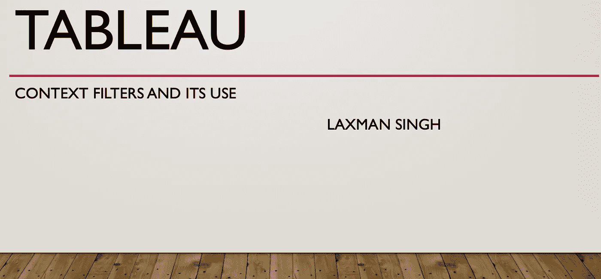

# Tableau:上下文过滤器及其用例

> 原文：<https://medium.com/geekculture/tableau-context-filter-with-its-use-case-c605d04ae34a?source=collection_archive---------21----------------------->

## 过滤器是有意义的:上下文过滤器是最好的

ableau 是新一代可视化工具。我认为这是为你的观众实现可视化最容易的方法。它有几个与其他现有工具不同的特性。它能够处理各种以不同格式表示数据的问题。

