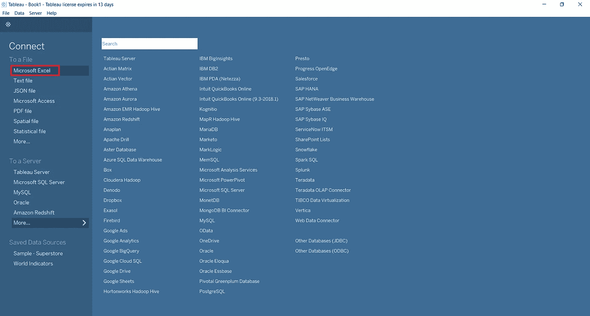
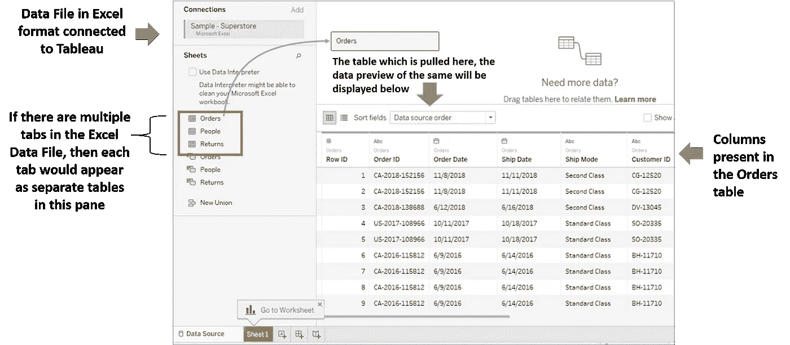
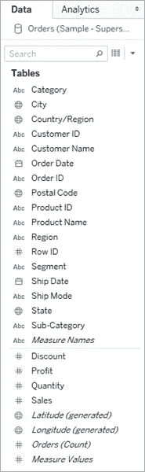
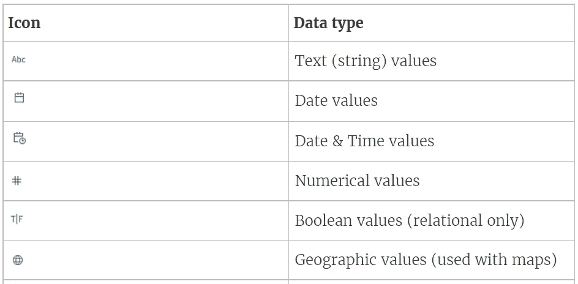
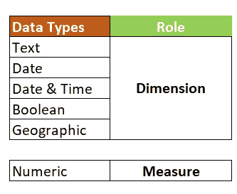

# 初学者 Tableau 教程—第 1 部分

> 原文：<https://medium.com/geekculture/tableau-data-visualization-tableau-tutorials-for-beginners-segment-1-24f3bf87cac9?source=collection_archive---------72----------------------->

众所周知，Tableau 是目前数据可视化工具的市场领导者。然而，Tableau 作为一种工具已经远远超出了数据可视化的定义。目前市场上对 tableau 开发人员有很多需求，因此有很多年轻的爱好者希望在这个平台上开发强大的基础技能。所以，朋友们，我的教程来了，我以一种简洁的方式设计了它，但它提供了关于 Tableau 的每个关键主题的强有力的概念。

对于这样有趣的话题，请访问我的**facebook.com/FBTrainBrain/脸书页面**@

我们开始吧！

在本教程的第一部分，我们将讨论以下主题:

*   **连接数据源和 Tableau**
*   **Tableau 中的数据类型**
*   **尺寸和测量值之间的差异**

**连接数据源和 Tableau**

**第一步**

一旦启动 Tableau，您将看到的第一个屏幕是连接到一个数据源。下面是您将看到的屏幕。(*在本文中，为了简化对主题*的解释，我们将使用 MS excel 作为我们的数据源)

Image1: Screen for connecting a Data Source

正如您所看到的，Tableau 提供了连接到大量数据库服务器以及离线文件的工具。

**第二步**

让我们以 tableau 附带的示例 Superstore excel 数据源为例进行说明。点击图 1 所示的 Microsoft Excel 选项，然后浏览并选择 Superstore excel 样本文件，您将看到如下屏幕:

Image 2 : Data Preview of the Table selected from the data source

根据上面的图片 2，请注意以下内容:

*   如果数据源包含多个表，您将在左侧窗格中看到表的列表。
*   如果数据源是一个 excel 文件，那么 tableau 会将该文件的每个页签视为一个表
*   您需要将想要处理的表拖放到顶部窗格，该表的数据预览将立即出现在底部
*   如果您想要独立处理表格，则在顶部窗格中一次只能拖动一个表格。如果你试图拖动一个以上的表格，那么它将调用一个表格连接(*我们将在教程*的后续章节中详细讨论)

第三步

完成步骤 2 后，单击屏幕底部的 Sheet1，如图 2 所示。

屏幕 1 打开后，您将在左侧窗格中看到字段列表。它将如下所示:

Image 3 : Data Fields with Data Types

请注意，上面的每个字段名都有一个与之关联的图标。这些图标代表字段的**数据类型**。

**Tableau 中的数据类型**

现在让我们了解 tableau 支持哪些不同的数据类型。以下是 Tableau 中的主要数据类型以及相关图标:

Image 4 : Tableau Data Types

**尺寸和测量值之间的差异**

现在我们知道了 Tableau 中的数据类型，我们需要知道另一个关键概念——维度和度量。

每当 tableau 连接到一个新的数据源时，该数据源的每个字段都会根据数据类型被标记为一种数据类型(如字符串、数字等)。然后，具有不同数据类型的一组字段被标记为一个角色。可以说，这些字段集合被分为两类:维度和度量。默认情况下，隔离如下:

Image 5 : Dimension vs Measure

这意味着在您的数据集中，所有数字列将出现在**度量**部分下，所有其他字段将出现在**维度**部分下。如果您看到图 3，您可以看到底部带有#图标的所有字段放在一起，其余的字段放在上面。此外，您还可以看到图标颜色的差异-绿色的测量图标和蓝色的尺寸图标。

**维度**通常表示定性数据列——可用于数据的分段或分类，但不能聚合(如总和、平均值等)。

**Measure** 表示可用于聚合(如求和、平均、最大、最小等)的数值字段，可用于执行+、—、*、/等数学运算。

**大脑化警报！** : *您可以通过拖动将字段从度量部分移动到维度部分，反之亦然，但是将字段从一个类别移动到另一个类别* ***不会改变数据类型(如数字、文本、日期等)。)的领域。它只是改变了该字段的角色定义。***

我们将在此结束本教程的第 1 部分。请继续关注下一部分( [**Tableau 初学者教程—第二部分**](/geekculture/tableau-tutorials-for-beginners-segment-2-af8ea25ee765?source=friends_link&sk=0c361e14dbb7307ffc85fa541fc56a8c) )