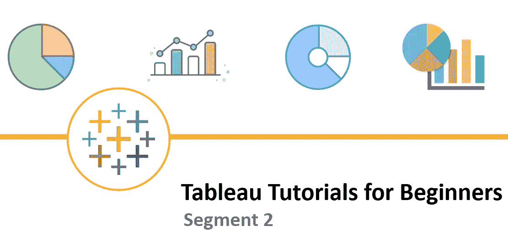
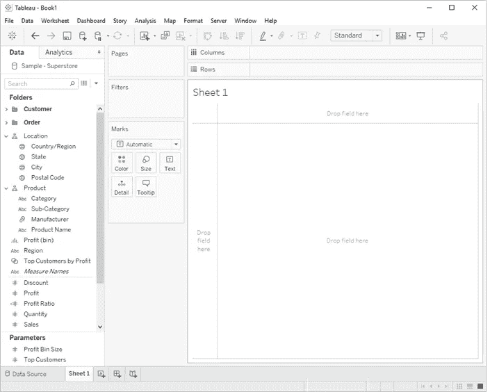
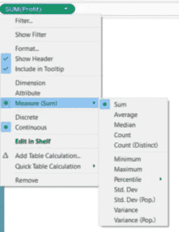

# 初学者 Tableau 教程—第 2 部分

> 原文：<https://medium.com/geekculture/tableau-tutorials-for-beginners-segment-2-af8ea25ee765?source=collection_archive---------40----------------------->

希望你已经阅读并喜欢本教程的第一部分。如果您还不了解，请抽出 10 分钟的宝贵时间来理解第 1 部分中解释的概念。您可以通过此链接( [Tableau 初学者教程—第 1 部分](/geekculture/tableau-data-visualization-tableau-tutorials-for-beginners-segment-1-24f3bf87cac9?source=friends_link&sk=e3ad17b926493502e27d859319e2fc10))获得它

对于这样有趣的话题，请访问我的**脸书页面**@【facebook.com/FBTrainBrain/】T4

在今天的环节中，我们将讨论以下主题:

*   **连续和离散的区别**
*   **尺寸与测量的更多概念 w.r.t .连续和离散**

**连续和离散的区别**

在一般定义中，**连续**数据是指那些可以取连续取值范围的数据。例如，如果我说学生的身高，这些值可能是 5.2、5.3、5.8、6.1、4.3 等等。

**离散**数据是指那些无法获取连续数据范围的数据——例如，如果我说学生排名——将会是第一、第二、第三、第四、第五、第六等。在类中可以有等级，如 1.5 或 2.6 等。

在深入了解如何理解 tableau 中的连续与离散之前，让我们看看 Tableau 画布是什么样子的。下图显示了 Tableau 画布，您可以在其中拖放字段。

Image 1 : Tableau Canvas

*   每当您将字段从维度部分拖到画布的行或列中时，默认情况下，字段名称将显示为蓝色
*   每当您将字段从测量部分拖到画布的行或列中时，默认情况下，字段名称将以绿色显示

见下图 2。由于“销售额”是“度量”部分的数值字段，因此显示为绿色，而“类别”是“维度”部分的非数值字段，因此显示为蓝色。

但是绿色和蓝色实际上意味着什么呢？**绿色**表示 tableau 将该场视为**连续**数据，而将蓝色场视为**离散**数据。

注意:在 Tableau 中，**连续**字段总是创建一个**轴**，而**离散**字段创建一个**表头**

Image 2 : Continuous — Green | Discrete — Blue

现在，让我们试着理解，当连续与离散随着尺寸和测量而改变时，行为是如何变化的

Image 3 : Changing Dimesion /Measure / Continuous/Discrete

让我们假设我们已经将一个**数字字段**拖放到画布中。默认情况下，它显示为绿色，表示它是一个连续的数据。所以，它是**测度——连续的。**下图给出了一个概念，当类型变为尺寸/离散时会发生什么。黄色部分表示默认行为:

类似地，当一个具有**文本/地理/布尔**数据类型的字段被从维度部分拖到画布中时——默认情况下，角色是维度，但是没有将数据类别更改为连续或维度的选项。

**另一个更有趣的数据类型是日期——我们将在下一节中看到日期在连续和离散之间变化时的行为如何变化( [**Tableau 初学者教程——第 3 节**](https://avikarbanik.medium.com/tableau-tutorials-for-beginners-segment-3-cc3a8cd22016?source=friends_link&sk=71d31dd7b5ef60b03523bc7c570cd710) )**