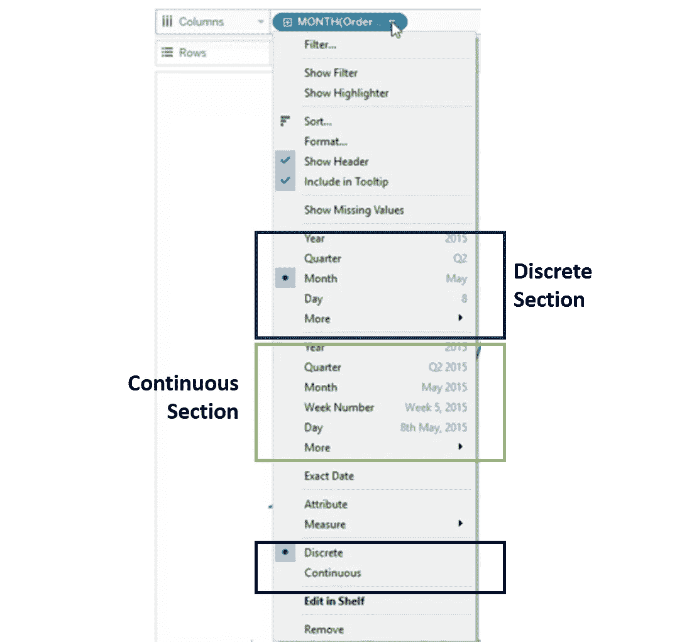
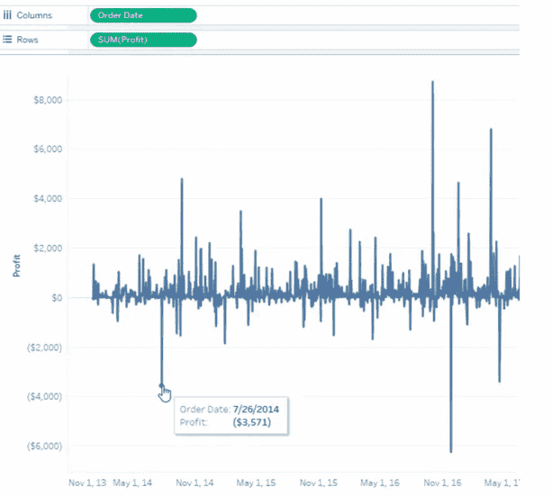

# 初学者 Tableau 教程—第 3 部分

> 原文：<https://medium.com/geekculture/tableau-tutorials-for-beginners-segment-3-cc3a8cd22016?source=collection_archive---------33----------------------->

嘿亲爱的朋友们！希望你已经阅读并喜欢本教程的第二部分。如果您还没有，请抽出 10 分钟的宝贵时间来理解**第二部分**中解释的概念。

您可以在此链接([**Tableau 初学者教程—第二段**](/geekculture/tableau-tutorials-for-beginners-segment-2-af8ea25ee765?source=friends_link&sk=0c361e14dbb7307ffc85fa541fc56a8c) )中访问

对于这样有趣的话题，请访问我的**facebook.com/FBTrainBrain/页面** @ [脸书](https://www.facebook.com/FBTrainBrain/)

在之前的教程中，我们已经了解了 Tableau 中**连续**与**离散**的概念。在今天的教程中，我们将看到 **Date** 数据类型在连续和离散模式下的表现。

每当日期字段被拖放到 Tableau 画布中时，默认情况下，它被视为离散变量，并以蓝色显示。但是，您始终可以从字段选项菜单将离散更改为连续，反之亦然。为了更清楚起见，请参考下图

Image 1 : Field Menu Option for Date Field

注意以下几点:

*   *当日期字段处于离散模式时——如果您想将其用作过滤选项，则它将只显示您可以基于其进行过滤的特定日期值列表。您不能选择这些日期值之间的任何日期进行筛选。*
*   *当日期字段处于连续模式时——如果您想将其用作过滤选项，那么它将显示一个日期范围作为过滤选项，您可以为该范围选择任何日期。*
*   *当日期处于离散模式时，它将显示标题，而如果处于连续模式，它将显示日期轴。*
*   *一旦日期从离散模式变为连续模式，字段的颜色就会变为绿色*

在图 1 中，表示离散部分的部分将改变日期的形式——仅是月或年等。(模式仍将保持离散)

还有另一个日期选项，称为精确日期。将格式更改为“精确日期”会使日期成为一个连续的字段，如果您正在绘制带有“日期”字段的图表，则日期轴将包含该字段中的所有日期值，图表也将相应地绘制出来。请参考下图，以了解更多信息

Image 2 : When **Exact Date** option has been selected from the Field Menu option of the Order Date field

由此，我们将得出离散、连续、量纲和测度的概念。我们将在教程的第 4 部分从新概念开始——所以请密切关注这一领域。

您可以在这里访问本教程的第 4 部分( [Tableau 初学者教程—第 4 部分](https://avikarbanik.medium.com/tableau-tutorials-for-beginners-segment-4-1ee06db32a75?source=friends_link&sk=0d96c354fc65dd5b2a3047f959b21698))