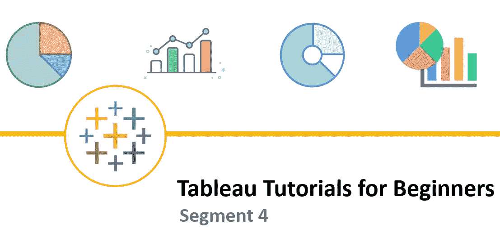

# 初学者 Tableau 教程—第 4 部分

> 原文：<https://medium.com/geekculture/tableau-tutorials-for-beginners-segment-4-1ee06db32a75?source=collection_archive---------26----------------------->

朋友们好！希望你已经阅读并喜欢了本教程的第三部分。如果您还没有，请抽出 10 分钟的宝贵时间来理解**第三部分**中解释的概念。

您可以在此链接([**Tableau 初学者教程—第三段**](/geekculture/tableau-tutorials-for-beginners-segment-3-cc3a8cd22016?source=friends_link&sk=71d31dd7b5ef60b03523bc7c570cd710) )中访问

对于这样有趣的话题，请访问我的**facebook.com/FBTrainBrain/页面** @ [脸书](https://www.facebook.com/FBTrainBrain/)

今天，我们将介绍几个基本操作要点，如下所示(在我们开始下一部分之前，先介绍实际创建可视化效果的主题):

*   **Tableau 中 TWB 和 TWBX 文件扩展名的区别**
*   **表单、仪表板和故事之间的差异**
*   **tableau 文件的向前/向后兼容性**
*   **Tableau Reader 以及为什么需要它**

**Tableau 中的 TWB 和 TWBX 文件扩展名**

Tableau 有两种文件类型—您可以将 tableau 工作簿保存为**。twb** 或**。twbx** 文件。

当您将文件另存为. **twb** 文件时，它仅包含您基于数据源创建的可视化、字段、仪表板等的结构或框架。但是，如果您想共享。twb 文件对某人来说没有共享数据也是没有意义的。这是因为如果没有喜欢的相关数据源，a . **twb** 文件将无法显示所创建的可视化的输出。因此，大小。 **twb** 总是很小(*大多数时候只有几千字节*)

当您将文件另存为. **twbx** 文件时，它不仅会保存您创建的可视化的结构或定义，还会将数据打包在一起。因此，如果您与某人共享. twbx 文件，该人将能够查看在 tableau 工作簿中创建的所有元素。一个. **twbx** 的大小将几乎等于数据的大小。

**表单、仪表板和故事之间的差异**

在 tableau 中——必须在**表**中创建单独的图表/可视化。如果需要创建多种不同类型可视化，您可以创建几个工作表。在图表类型、过滤条件、参数等方面，每个工作表都可以有自己的属性。

如果您想在一个地方显示多个可视化对象，那么 **Dashboard** 是一个好地方。Dashboard 可以称为**表的集合。**

同样，如果您想在一个视图中将多个仪表板组合在一起，那么 **Story** 就是实现这一点的地方。**故事**可以称为**仪表盘的集合。**

**tableau 文件的向前/向后兼容性**

这是一个需要记住的操作点，使用软件的较高版本创建的 Tableau 工作簿将不会在较低版本中打开(即，它不是向后兼容的)。然而，它是向前兼容的，即在较低版本中创建的 tableau 工作簿可以使用较高版本的软件打开。

注意:如果您使用较高版本的 tableau 打开用较低版本创建的文件，然后保存它，文件的属性将成为较高版本的属性。您将无法使用较低版本打开该文件

**Tableau Reader 以及为什么需要它**

假设您已经与业务/领导团队的某人共享了一个. TWBX 文件，因为您希望他们审阅它。如果他们有 Tableau 桌面许可证，他们将能够打开它，但请注意，他们的目的只是查看，而不是编辑任何内容。在这种情况下，获得 Tableau 许可不是一个可行的选择，因为许可是昂贵的。在这种情况下，Tableau Reader 是要使用的软件。它允许某人以只读模式打开 tableau 工作簿，浏览所有可视化元素，执行过滤等。—但他们将无法进行任何编辑。这是 Tableau 的免费产品，当您不打算制作和编辑工作簿时，它非常有用。