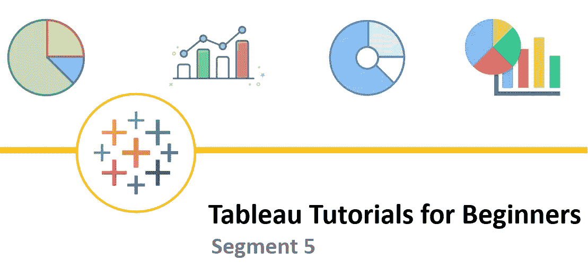
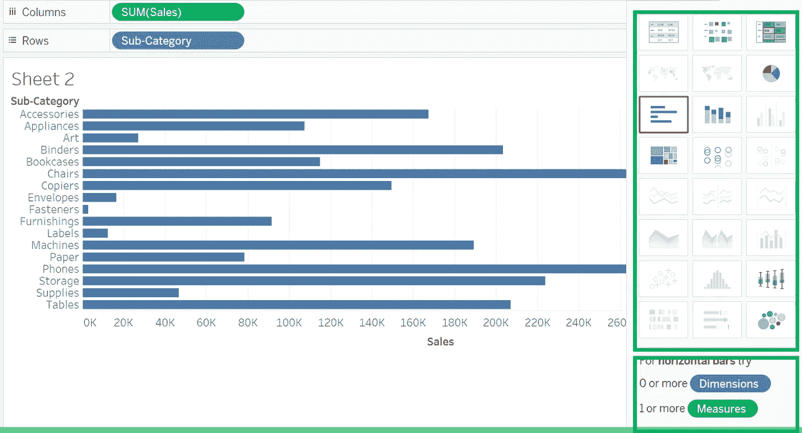
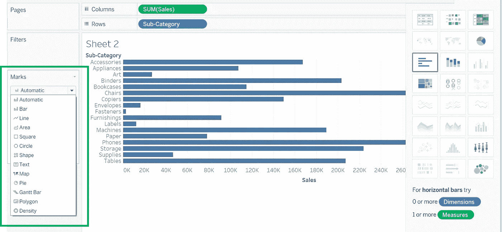

# 初学者 Tableau 教程—第 5 部分

> 原文：<https://medium.com/geekculture/tableau-tutorials-for-beginners-segment-5-54fdee46399d?source=collection_archive---------19----------------------->

朋友们好！希望你已经阅读并喜欢本教程的第 4 部分。如果您还没有，请抽出 10 分钟的宝贵时间来理解**第四部分**中解释的概念。

您可以通过此链接([**Tableau 初学者教程—第四部分**](/geekculture/tableau-tutorials-for-beginners-segment-4-1ee06db32a75?source=friends_link&sk=0d96c354fc65dd5b2a3047f959b21698) )获取

在今天的文章中，我们将开始学习如何开始在 Tableau 中创建基本的可视化。在 Tableau 中，有一组默认的内置图表，也有一些您可以根据自己的需求定制的图表。让我们从内置的开始。

Image 1

每当您将某个维度和度量值拖放到行和列中时，Tableau 将根据画布中拖动的数据类型自动创建一个图表。在上面的案例中，**子类**【维度】和**SUM(Sales)**【Measure】已经被拖动，默认情况下，Tableau 已经创建了一个条形图。

在右侧窗格中，它将自动启用其他内置图表，这些图表可以基于画布中的字段绘制。在右侧窗格的底部，它还将显示关于生成特定图表需要多少维度和度量字段的提示。

**注意**:在右侧窗格中，被禁用的图表是基于画布中当前的维度和度量字段数无法生成的图表

也可以从左侧标记卡的列表中更改图表类型，如下图所示

Image 2

正如我前面提到的，虽然 Tableau 显示了内置图表之间的选项，但这并不意味着只有这些图表可以使用。还有其他几种不同类型的图表可以定制。要查看如何构建自定义图表的示例，请查看此链接[如何使用 Tableau 构建帕累托图](/geekculture/how-to-construct-pareto-chart-using-tableau-695680ee9f08?source=friends_link&sk=c637e0a060e439718e868dedd491cab2)

在下一部分，我们将学习双轴和参考线的概念。