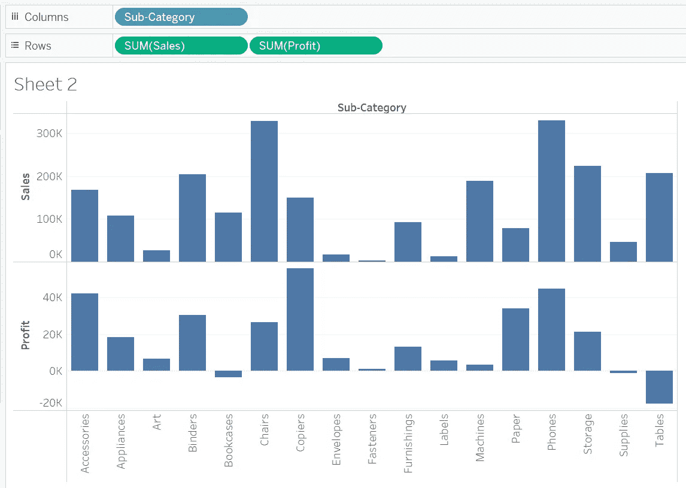
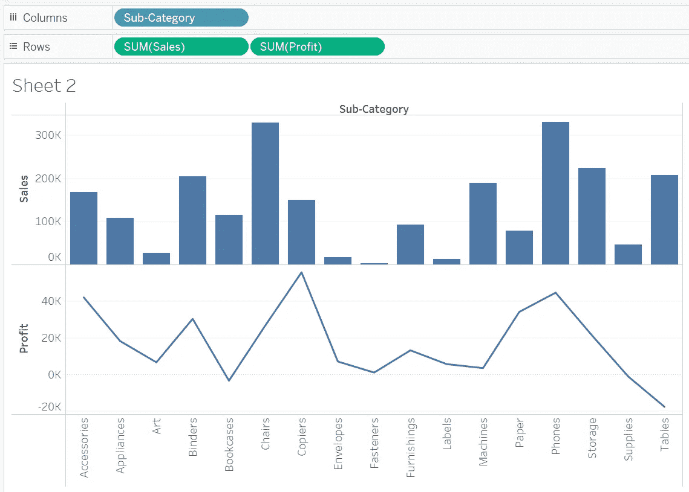
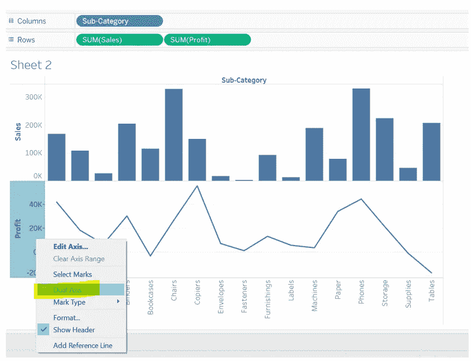
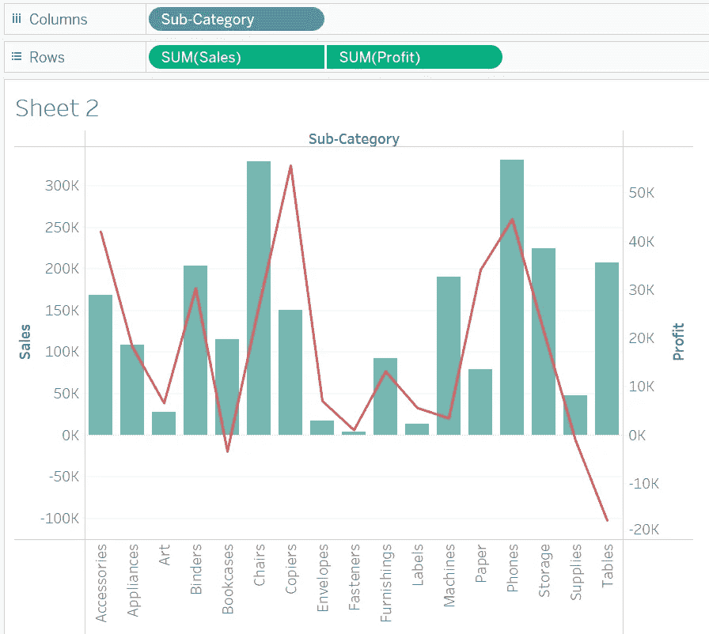

# 初学者 Tableau 教程—第 6 部分

> 原文：<https://medium.com/geekculture/tableau-tutorials-for-beginners-segment-6-a7a2154f78ce?source=collection_archive---------32----------------------->

朋友们好！希望你已经阅读并喜欢本教程的第 5 部分。如果您还没有，请抽出 10 分钟的宝贵时间来理解**第五部分**中解释的概念。

你可以在这个链接([**Tableau 初学者教程—第 5 段**](/geekculture/tableau-tutorials-for-beginners-segment-5-54fdee46399d?source=friends_link&sk=b7de109393b03c0a0fb39ff3c8944497) )获取。

在今天的文章中，我们将了解以下概念:

*   双轴

**双轴:**这是 tableau 中的一个特性，利用它，我们可以为图表创建一个副轴。例如，我们可能希望创建一个图表，其中主 Y 轴代表总销售额，次 Y 轴代表总利润。我们可以使用双轴特性来实现这一点。让我们看看如何。

在上面的例子中，我在主 Y 轴**上绘制了 **SUM(Sales)** ，在 X 轴上绘制了子类。我现在想在**次 Y 轴**中添加 **SUM(Profit)** 作为一行。**

首先，我将 **SUM(Profit)** 拖放到画布的行中。

接下来，我通过标记卡将 **SUM(Profit)** 的图表类型更改为线形:

图表现在看起来是这样的:

右键单击利润轴，然后单击双轴选项

点击双轴后，图表将形成利润的副轴:

**注意**:点击双轴后，如果没有出现条形，只需使用标记卡将 **SUM(Sales)** 的图表类型改为条形即可。