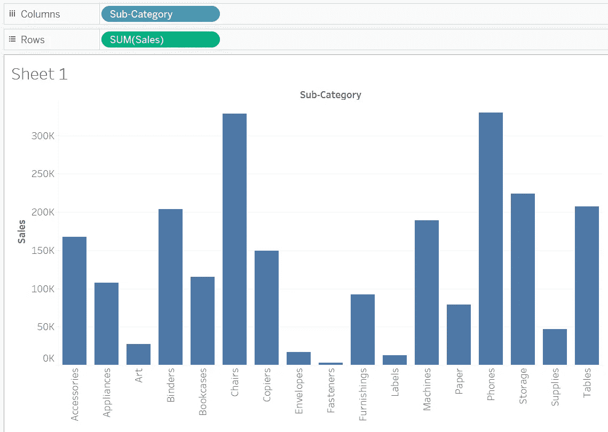
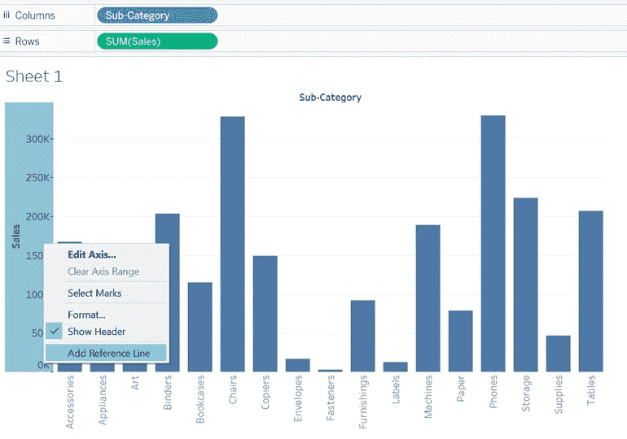
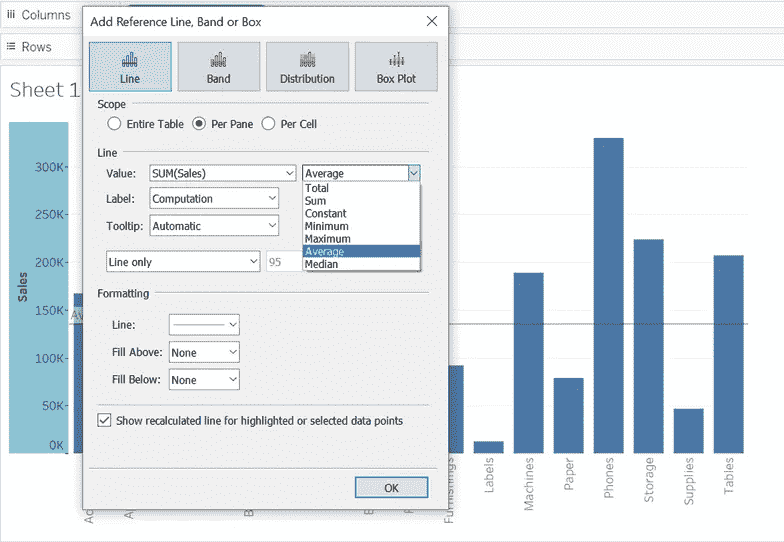
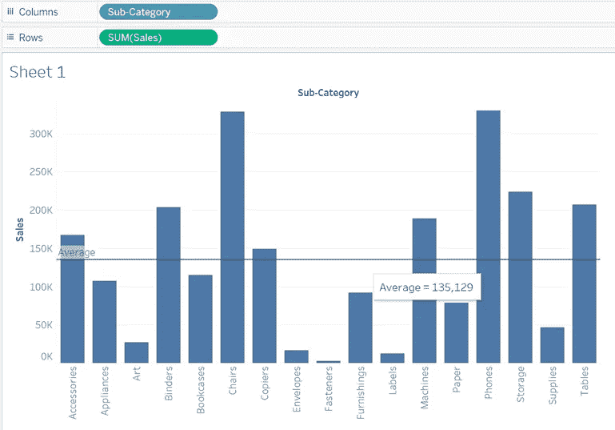
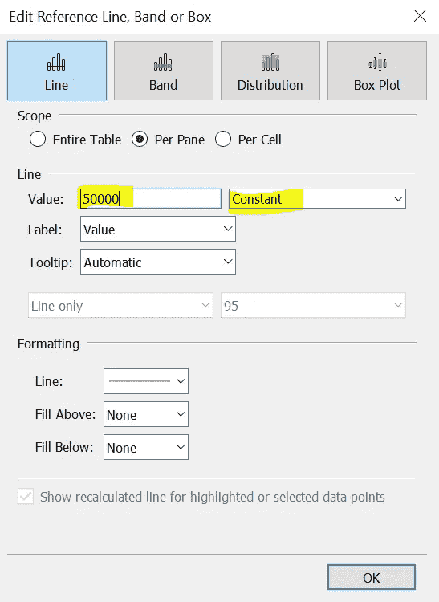
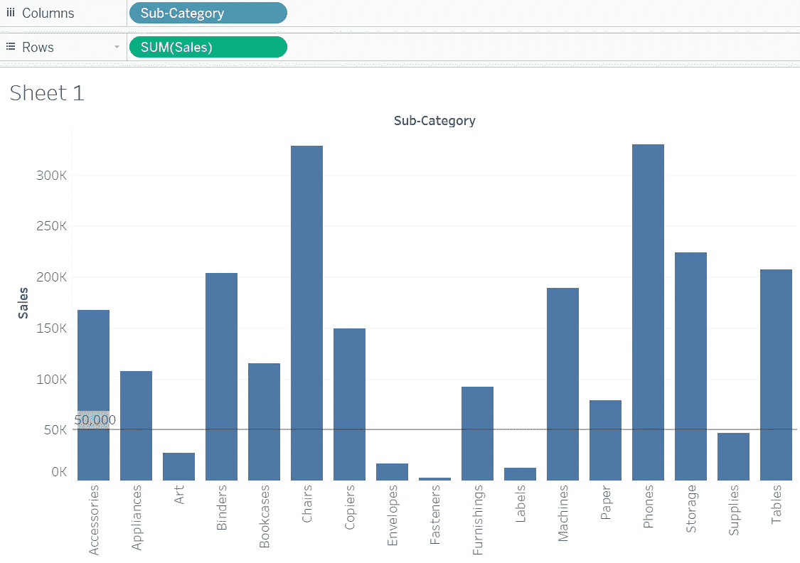
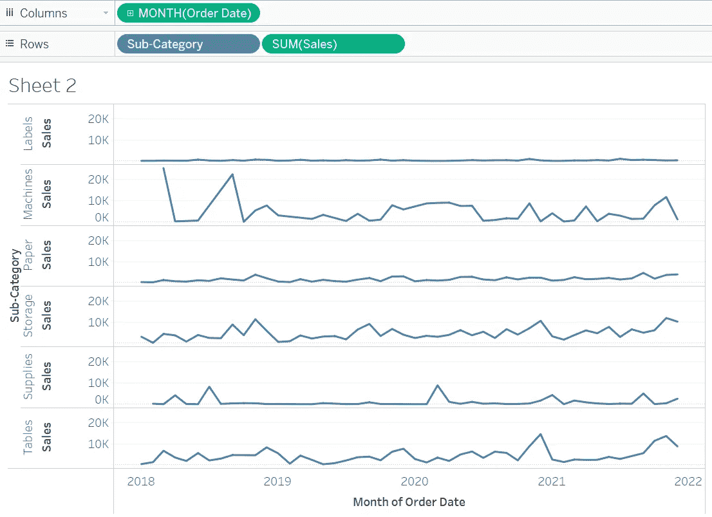
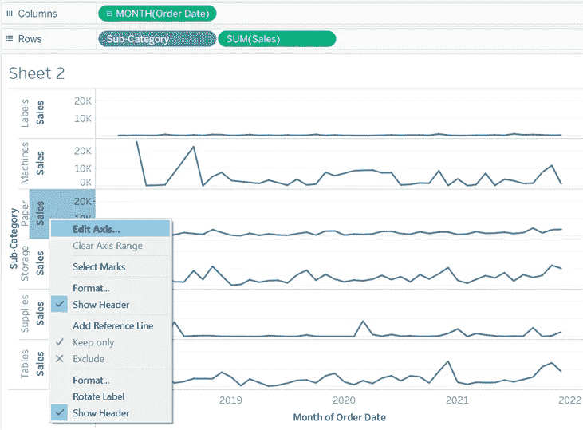
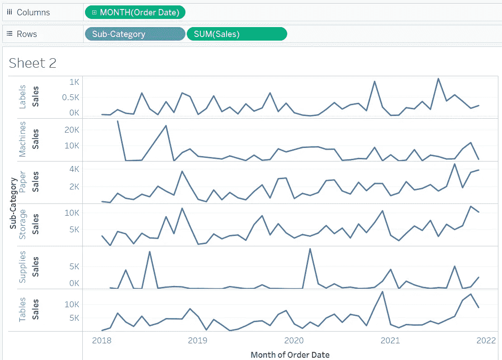

# 初学者 Tableau 教程—第 7 部分

> 原文：<https://medium.com/geekculture/tableau-tutorials-for-beginners-segment-7-2434c45fd4f2?source=collection_archive---------44----------------------->

朋友们好！希望你已经阅读并喜欢本教程的第 6 部分。如果您还没有，请抽出 10 分钟的宝贵时间来理解**第 6 部分**中解释的概念。

你可以在这个链接([**Tableau 初学者教程—第六节**](/geekculture/tableau-tutorials-for-beginners-segment-6-a7a2154f78ce?source=friends_link&sk=1f0c608110cbc139aedebed3a8b564dd) )获取。

在今天的文章中，我们将了解以下概念:

*   图表中的参考线
*   独立轴创建

**图表中的参考线:**在某些情况下，我们希望以恒定线的形式描绘图表中的某个值(如平均值)。Tableau 中的参考线选项有助于我们实现这一点。让我们看看如何

假设在下面的图表中，我想将平均值显示为一条常数线。

要添加参考线，右键单击 Y 轴，然后单击添加参考线

在弹出的窗口中，选择平均值选项

完成后，平均线将出现在图表中，如下所示:

您甚至可以将自定义值定义为参考线，如下所示:

**独立轴创建:**您可能已经创建了一个可视化，其中您的可视化中有多个图表具有共同的 X 轴，但 Y 轴不同。让我们先看一个例子:

如果您看到 Y 轴范围，所有子类别值的销售范围是相同的，而实际上每个子类别的范围值是不同的。由于 Y 轴的范围相同，这些线不能直观地反映正确的趋势。解决这个问题的选项是使用独立轴选项。让我们看看如何做这件事

右键单击 Y 轴并编辑轴:

在弹出的窗口中，选择“独立轴”选项

现在看看更新的可视化

