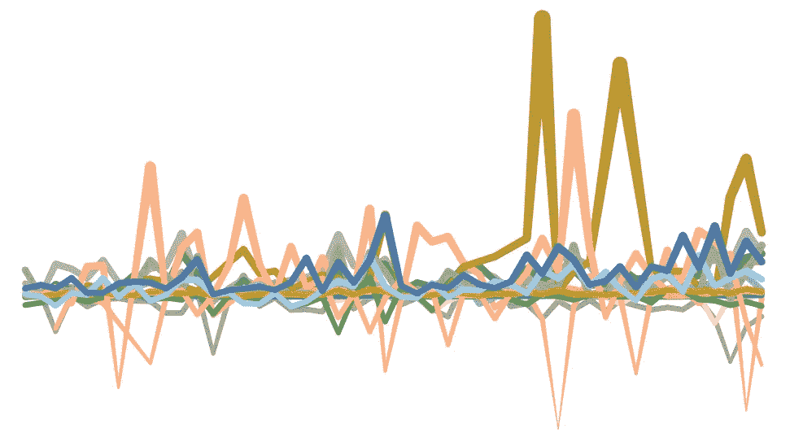
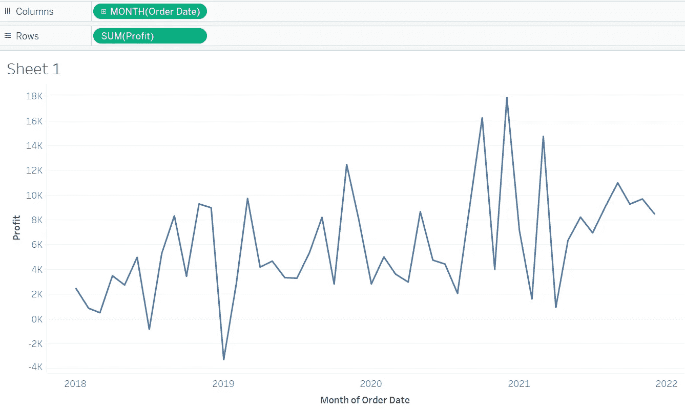
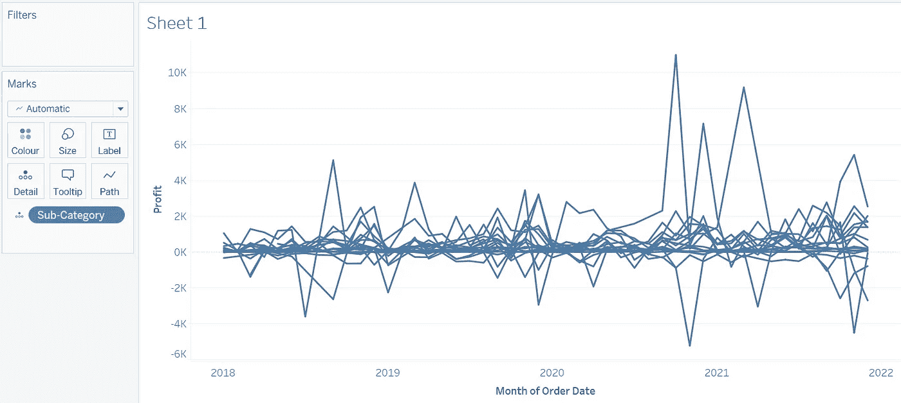
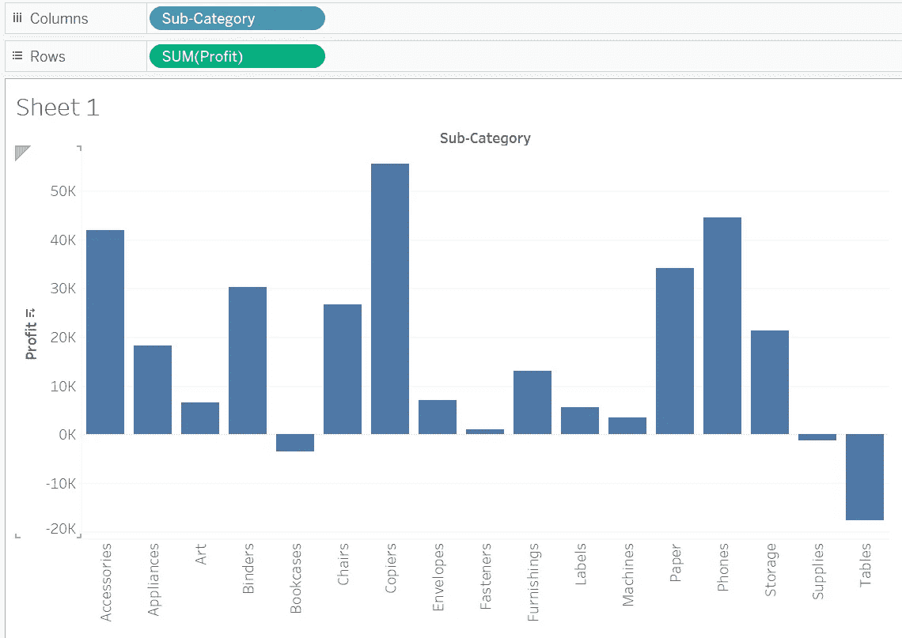
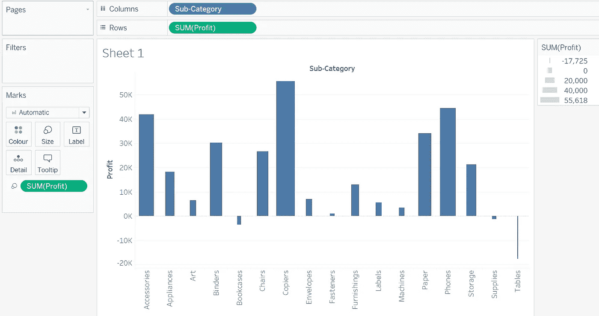
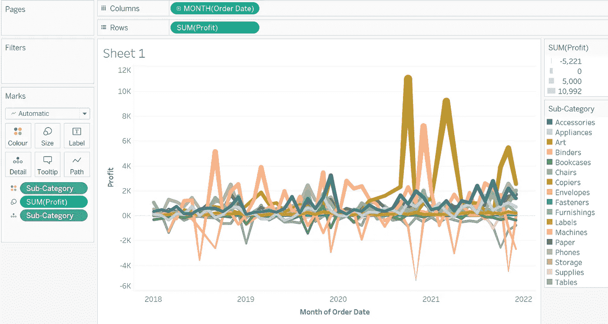

# 初学者 Tableau 教程—第 8 部分

> 原文：<https://medium.com/geekculture/tableau-tutorials-for-beginners-segment-8-f25d2a9ef7c1?source=collection_archive---------31----------------------->

朋友们好！希望你已经阅读并喜欢了本教程的第 7 部分。如果您还没有，请抽出 10 分钟的宝贵时间来理解**第 7 部分**中解释的概念。

你可以在这个链接([**Tableau 初学者教程—第七节**](/geekculture/tableau-tutorials-for-beginners-segment-7-2434c45fd4f2?source=friends_link&sk=75fdec5227b23c186f3e9a3e3107bbc7) )获取。

在今天的文章中，我们将了解以下概念:

*   “细节”选项卡在绘制图表中的使用
*   “尺寸”选项卡在绘制图表中的应用

**绘制图表时“细节”选项卡的用法**

“Detail”选项可用于在特定粒度级别绘制可视化图形。我举个例子解释一下。假设我想查看每个月的总利润，那么我的图表如下所示:

现在，我希望看到相同的视图，但是是在**子类别**的粒度上(我使用 Tableau 附带的默认超市数据集)。我的期望是每个子类都有一行，这样我就可以在同一个图表中查看每个**子类**的趋势。

这可以通过使用标记卡中的细节选项轻松实现。只需拖放详细信息选项中的子类别字段。完成后，图表将如下所示:

然而，从上面的图表中，我无法区分子类别值。这可以通过将子类别字段再次拖放到标记卡中的颜色选项来轻松解决。现在，图表将如下所示。我的要求完成了！

**绘制图表时“尺寸”选项卡的使用**

大小选项可用于使可视化更容易理解和解释。例如，让我们绘制一个简单的子类别与总利润的柱形图。

现在让我们把利润放在马克卡的尺寸选项中

您可以看到，列的大小已经根据它们各自的值进行了调整。所以，只要有人看到图表，甚至不用查看 Y 轴的细节，这个人就应该能够理解和解释利润或损失。

现在让我们在之前的图表上应用同样的东西，看看它看起来怎么样

