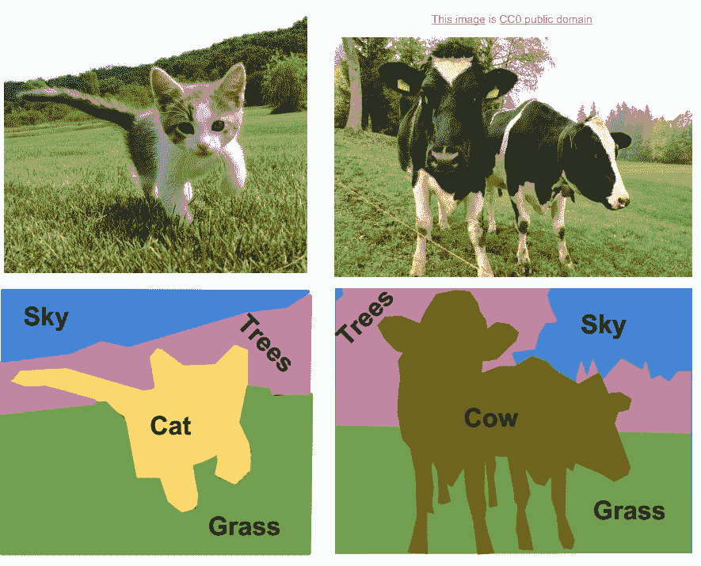
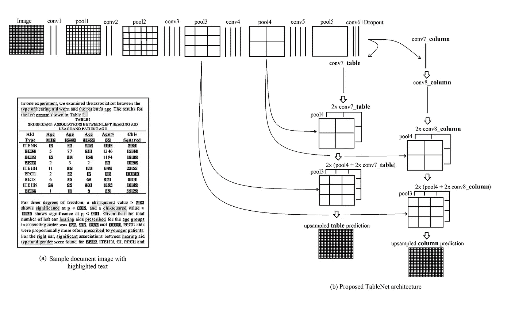
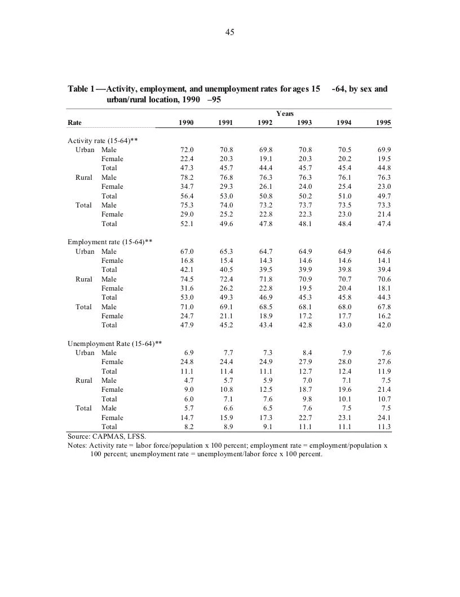
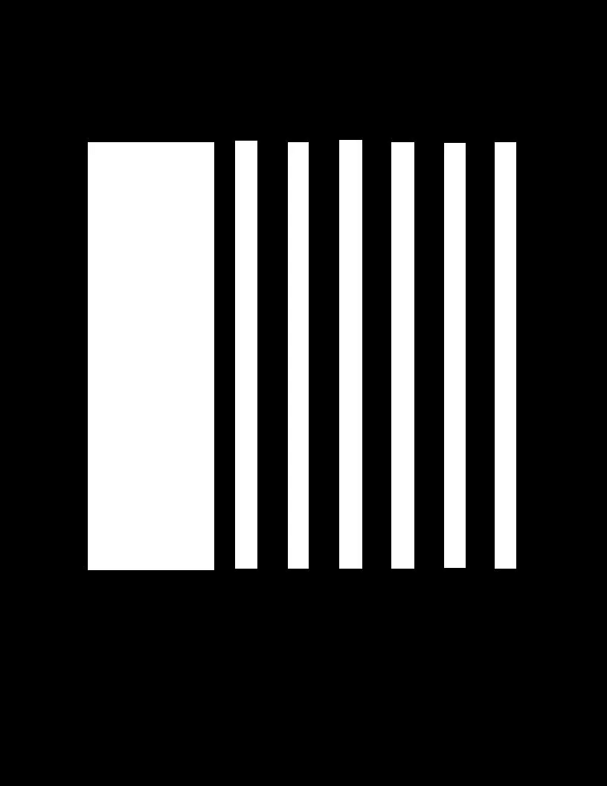
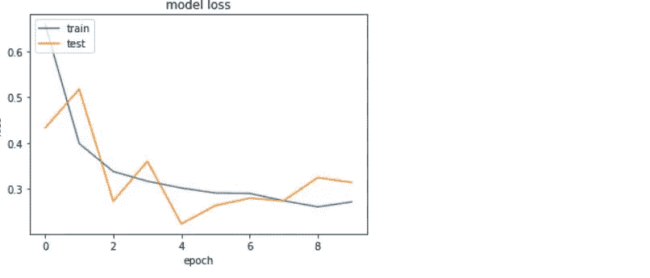
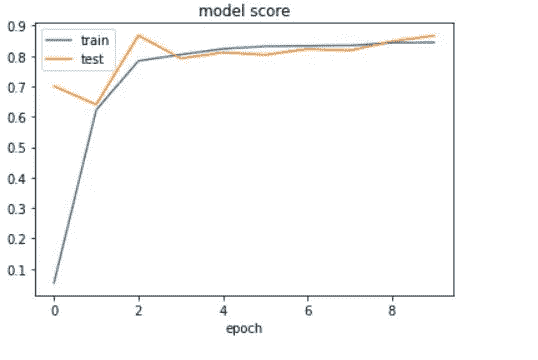
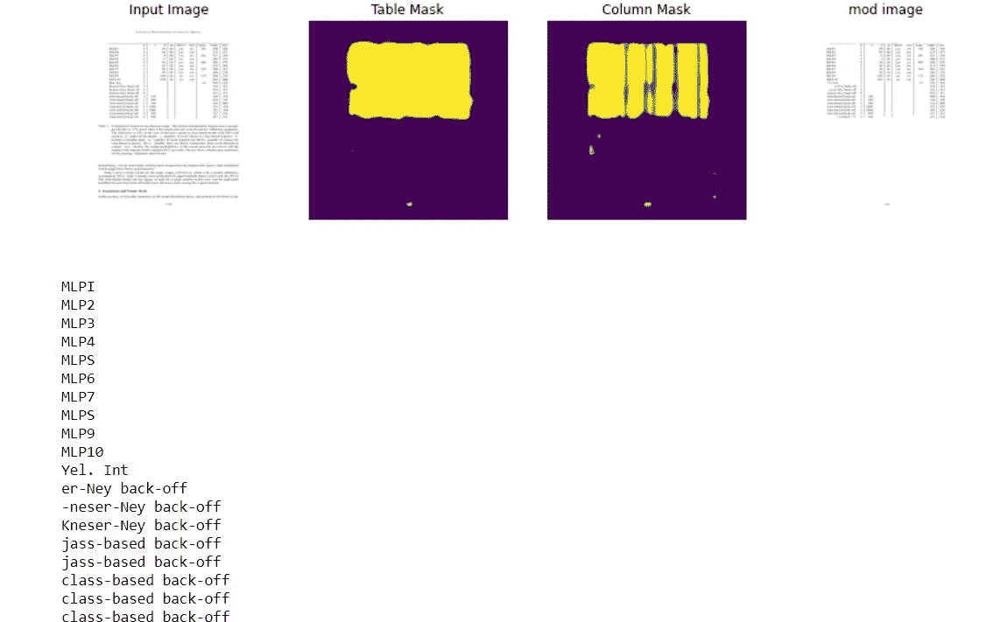

# 使用 Resnet 编码器从文档图像中提取信息的 TableNet 实现

> 原文：<https://medium.com/geekculture/tablenet-implementation-using-resnet-encoder-for-extraction-of-information-from-document-images-3004c27bc7c7?source=collection_archive---------35----------------------->

# 介绍

在过去的十年中，深度神经网络在模式识别问题上取得了巨大的成功，如计算机视觉、自然语言处理等。计算机视觉是计算机从数字图像和视频中获取高级信息的领域。计算机视觉已经应用于多个行业，从自动驾驶汽车的开发到取消细胞的检测。大多数计算机视觉应用的一个共同主题是图像分割。

图像分割是基于它们各自的类别将数字图像分割成多个片段的过程。在这篇文章中，我将解释一篇名为 [**TableNet**](https://arxiv.org/abs/2001.01469) 的研究论文，它使用图像分割深度学习模型从扫描图像中检测表格及其结构。虽然在表检测方面已经取得了一些进展，但是提取表内容仍然是一个挑战，因为这涉及到更细粒度的表结构识别。用 Resnet 模型代替 VGG19，实现了对原模型的改进。

# TableNet 架构

该模型基于 FCN(全卷积网络)模型。它没有任何致密层。它由卷积层、池层和上采样层组成。该模型使用 VGG 19 层作为基础层。VGG-19 的全连接层(池 5 之后的层)被替换为两个(1x1)卷积层。每个卷积层(conv6)都使用 ReLU 激活，后跟一个概率为 0.8 的漏失层(conv6+漏失，如图所示)。我已经用 Resnet121 层代替了 VGG19。在我的实验中，Resnet 层给出了更好的结果。

使用了“conv2_block6_concat”、“conv4_block9_0_relu”、“conv5_block1_0_relu”层。在这一层之后，附加了解码器网络的两个不同分支。(conv5_block1_0_relu + dropout)层的输出分配给两个解码器分支。在每个分支中，附加层被附加以过滤出相应的活动区域。在解码器网络的表分支中，在使用一系列分数步长卷积层来放大图像之前，使用一个额外的(1x1)卷积层，即 conv7 表。conv7 表层的输出也使用分数步长卷积进行放大，并附加了相同维度的 pool4 池层。

类似地，组合的特征地图再次被放大，并且 pool3 池被附加到其上。最后，最终的特征图被放大以满足原始图像的尺寸。在用于检测列的另一个分支中，存在具有 ReLU 激活函数的附加卷积层(conv7 列)和具有相同丢失概率的丢失层。在(1x1)卷积(conv8 列)层之后，使用分数步长卷积对特征图进行上采样。向上采样的要素地图与 pool4 池层组合，并且组合的要素地图向上采样并与相同维度的 pool3 池层组合。在这一层之后，特征地图被放大到原始图像。在两个分支中，在转置层之前使用多个(1x1)卷积层。

一个解码器分支用于进行表格区域的分割，另一个分支负责列区域的分割。检测到表格和列区域后，使用 Tesseract OCR **提取表格数据。**

# **数据集**

该模型在 Marmot 数据集上进行训练。Marmot 数据集由扫描的文档图像和指定表格位置的相应 xml 组成。表格列的注释由研究论文的作者完成，可通过以下链接获得。

 [## 数据集- Google Drive

### 标注的旱獭数据集

drive.google.com](https://drive.google.com/drive/folders/1QZiv5RKe3xlOBdTzuTVuYRxixemVIODp) 

# 问题陈述

*   给定扫描的文档图像，需要对表格及其列进行分割。
*   一旦确定了区域，就必须从表中提取信息

# 机器学习问题

对于给定的文档图像，我们必须通过将每个像素分类为表格或不分类来进行语义分割。这是一个深度学习的语义切分问题。

**绩效指标**

由于这是一个分类问题，f1 分数将用于衡量模型的效率。

# 数据准备

数据集由 bmp 格式的图像和 xml 文件组成。我们必须首先使用 xml 文件中给出的信息为所有图像创建一个表和列掩码。

Scanned image of document

Sample xml file

每个 xml 文件由<bndbox>标签组成，这些标签指定了表格及其相应列的坐标。这些坐标将用于根据图像创建蒙版。下面给出了创建掩码的代码。</bndbox>

图像遮罩基本上是原始图像的一部分，其中只有 yable 及其列是白色的，而图像的其余部分是黑色的。

Column mask

Table mask

接下来，对原始图像和两个掩模进行图像归一化。为了训练，图像和蒙版被分组以提供给模型。

# 模型准备

数据准备完成后，按照体系结构部分的指定为 tablenet 创建模型。它由以下两部分组成。

1.  编码器部分
2.  解码器部分

**编码器部分:**

这里，Resnet 模型与图像净重一起使用。图像尺寸调整为 1024、1024、3 维。三层 Resnet 被传递到解码器部分。编码器部分对图像进行降采样。

**解码器部分:**

在这个模型中有两个解码器。一个解码器用于检测表格位置，另一个解码器用于检测表格的列。经过两个 conv2D 层后的缩减采样图像，再次经过一个 1x1 conv2D 层处理。然后借助跳池技术，将解码器网络的低分辨率特征映射与编码器网络的高分辨率特征相结合。在向上采样之后，我们将得到形状(1024*1024*2)的输出表掩码。

Model loss

Model f1 score

# 信息提取

一旦训练完成，就对原始图像进行预测。为了提取信息，在原始图像上施加表格掩模。这样做是为了根据预测来确定表的位置。在这一步之后，使用 Tesseract ocr 提取信息并保存到 csv 文件中。

# 进一步改进:

我们需要更多的数据来提高模型的性能。对高分辨率图像的训练也需要更好的计算能力。

# 参考资料:

https://www.appliedaicourse.com

 [## TableNet:深度学习模型，用于端到端的表格检测和表格数据提取…

### 随着移动电话和扫描仪广泛用于拍摄和上传文档，提取文档的需求日益增加

arxiv.org](https://arxiv.org/abs/2001.01469) 

*可以在*[***Linkedin***](https://www.linkedin.com/in/durga-shankar-singh/)***&***[***GITHUB***](https://github.com/Rony75617/TABLENET_RESNET_IMPLEMENTATION/tree/master)***上与我联系。***