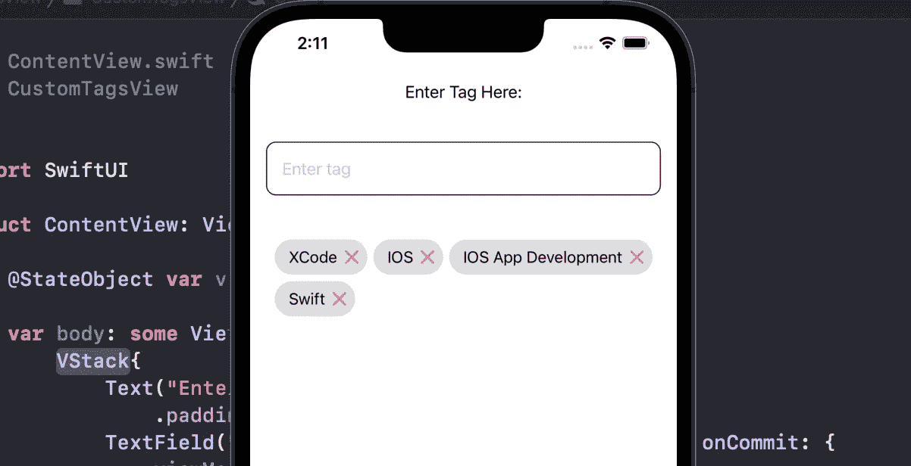

# SwiftUI 中的标签列表视图(芯片视图)

> 原文：<https://medium.com/geekculture/tags-view-in-swiftui-e47dc6ce52e8?source=collection_archive---------4----------------------->

嗨伙计们！在这篇博客中，您将学习如何在 SwiftUI 中创建标签视图。让我们开始吧。

在博客的最后，你可以获得该任务的完整 Github 源代码的链接。

现在，用 XCode 创建一个全新的 SwiftUI 项目，跟着我一起做吧。

# 第一步

首先创建一个具有 **id** 、**名称**和**大小**属性的结构**标签**。对于 **id** ，我们使用 **UUID** ，它将为每个**标签**提供唯一的 id。**名称**将是标签的名称，而**尺寸**我们将为每个**标签**计算。

# 第二步

创建 **UIScreen** 的**屏幕宽度**扩展，这将给出屏幕的**宽度**。

创建**字符串**的 **getSize** 扩展，这将给出给定字符串的**大小**。

# 第三步

创建一个 ContentViewModel，它将获取标签数组，并将其计算到标签的二维数组中。

## 属性:

此视图模型中使用了三个属性。

1.  **行**:标签二维数组
2.  **标签**:传递标签数组，标签数组将被 **getTags** 函数转换成标签的二维数组。
3.  **tagText** :将用于绑定 **ContentView** 中 **textfield** 的值。

## GetTags 方法

getTags 方法获取 Tags 数组并检查数组是否为空。如果不为空，则遍历 tags 数组，获取每个标记名的大小，并分别保存到 tags 数组中。

我们使用了一些临时变量。

1.  行:临时二维标记数组
2.  currentRow:将用于计算一行标签，稍后将追加到这些行中
3.  totalWidth:检查宽度标签并添加它们，检查一行中可以显示多少个标签
4.  屏幕宽度:通过减去水平填充获得屏幕宽度
5.  标签间距:用于获取标签之间的前导、尾随空格

之后，使用 forEach 迭代标记，逐个计算行，并将其附加到主行中，当调用该函数时，ViewModel 会将这些更改发布到视图中。

# 第四步

之后，调用 getTags 函数到 init 中，当 ContentViewModel 初始化时，该函数会将 Tags 数组转换成二维的 tags 数组。

使用 **addTag** 函数添加标签，使用 **removeTag** 函数删除内容视图模型中的标签。

# 最后一步

之后，使用内容视图模型进入内容视图。首先创建简单的 textfield，并将其与 ContentViewModel 的 tagText 变量绑定。

现在先遍历所有的行，然后每一行有多个标签，再遍历一行。首先使用 VStack，然后使用 ScrollView，并在 scrollView 中遍历行，然后使用 HStack，遍历每一行。

创建内容视图后，现在是运行并查看结果的时候了。

您将在屏幕上看到标签视图，如下图所示。

您可以删除任何标签，也可以通过将标签写入文本字段并按 enter 键来添加标签。

这就是我的博客，希望你理解如何使用 SwiftUI 创建 TagView。如果你有任何困惑，那么你可以在这个博客上发表评论或者查看源代码。

Inspired by Kavsoft

## 源代码:

 [## GitHub-muhammadabbas 001/TagsViewSwiftUI:swift ui 中的简单标记视图。用户可以添加或删除…

### 此时您不能执行该操作。您已使用另一个标签页或窗口登录。您已在另一个选项卡中注销，或者…

github.com](https://github.com/muhammadabbas001/TagsViewSwiftUI) 

## 帕特里翁:

 [## 米（meter 的缩写））阿巴斯正在创建 IOS 开发者| Patreon

### 立即成为 M.Abbas 的赞助人:获得世界上最大会员的独家内容和体验…

www.patreon.com](https://www.patreon.com/abbasgujjar)