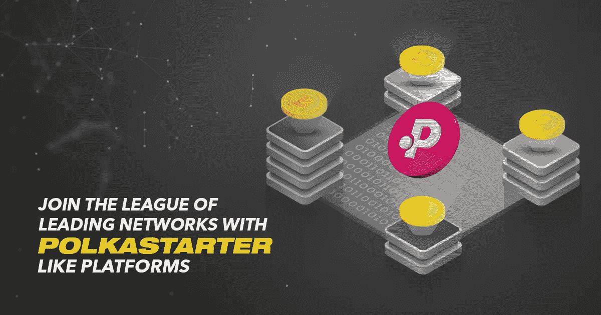

# 投身于分散式发射台开发，提高加密的门槛。

> 原文：<https://medium.com/geekculture/take-a-plunge-into-decentralized-launchpad-development-and-raise-the-bar-of-crypto-85aaedfba3b9?source=collection_archive---------21----------------------->

筹资发射台的开发成为提升加密市场空间的福音。由于 crypto 正在掀起一场革命，它为更大的机会铺平了道路。利用加密项目达到成功的顶峰，并通过专门举办论坛来吸引投资者的注意力来资助它们。

## 🔑**分散网络的突破:**

政府的不干预使分散的网络远离正常化。多年来，区块链为生存而战，因为人们只关心受管制的服务。然后，慢慢地，但稳步地，网民们意识到这些不受监管的系统提供的数据隐私和安全的重要性。许多国家也开始在日常生活中实施加密交易和货币。

加密项目筹资平台的出现扩大了市场空间。 [**分散式发射台开发**](https://www.appdupe.com/polkastarter-clone?utm_source=google&utm_medium=medium&utm_campaign=Monika&utm_id=monika) 成为崭露头角的企业家的首选。dApps 开始主导数字世界，并导致未来主义项目和收藏激增。从此，密码的火花从未暗淡。

## 🔑**聚焦加密筹款发射台开发:**

这种日益增长的热潮和趋势促使许多企业家基于密码建立他们的企业。如前所述，加密项目随着类似筹款平台的 Polkastarter 蓬勃发展。众筹的论坛叫 IDO 平台。高效的白标筹款发射台的开发也促进了数字空间的发展。

 [## 发展你的 Polkastarter 像筹款平台-福布斯今天

### 世界正稳步向数字化转变，并且几乎已经计算机化。数字世界展示了一个…

www.forbestoday.org](https://www.forbestoday.org/polkastarter-like-fundraising-platform/) 

## 🔑**对 IDO Token 的各种见解的全面审视&分散式发射台开发:**

IDO 为用户和所有者提供了双向的好处。投资者、交易者、用户、所有者和所有人都从平台的系统化设置中受益。加密项目和数字收藏品获得了牵引力，只是因为正在进行的元宇宙趋势。基于漫画、小说、动画、电影、迷因、诗歌等的各种数字收藏品突然出现了。

这些天来，网民们专注于获取独特的加密令牌，以在虚拟世界的个人资料中展示它们。

> 像 Polkastarter 这样的筹资平台是无风险的，可以成为新兴创业公司的一个很好的起点。

## **下面列出了筹款平台的一些基本特征和特点，以便获得清晰的洞察力。**

💡**互操作性:**它允许两个或多个区块链网络之间的操作机制，并促进通信和数据共享。

💡**数字钱包集成:**集成 API，支持无延迟的便捷交易。

💡**流动性:**通过将加密集合轻松转换为实时货币来维持可交易性

💡**多链设施:**内置配置，用于在不同的区块链网络级别创建和跟踪本地资产。

💡**用户友好的界面:**向您的用户呈现了一个简化的提要，其中包含了广泛的分类。根据价格值过滤项目，并执行更多分配，以使滚动时间有趣。

💡**防诈骗措施:**分散交换的多层次和固有的隐私特性，使用户的隐私数据安全可靠。

💡**白名单&无权限列表:**它为用户提供专属徽章，使他们成为白名单受众。密码保护协议和外部来源的不干涉使它们受到分散系统的基本标准的约束。

可以用合法的公式修改上面列出的特征和属性。有了现成的解决方案，任何额外的偏好和其他创新想法都很容易实现。

## 🔑该结束了！

由于这样一个论坛的最终目的是为未来主义项目创造空间，它最终成为每个艺术家和天才的讲台。所有这些事实加强了对未来正增长率的预测。

总之，非常清楚的是，未来完全是由去中心化的网络统治数字化世界。Crypto 已经被称为第三代语义网中的黄金 2.0。不再浪费时间，企业家可以抓住新兴的点对点技术和应用做大。