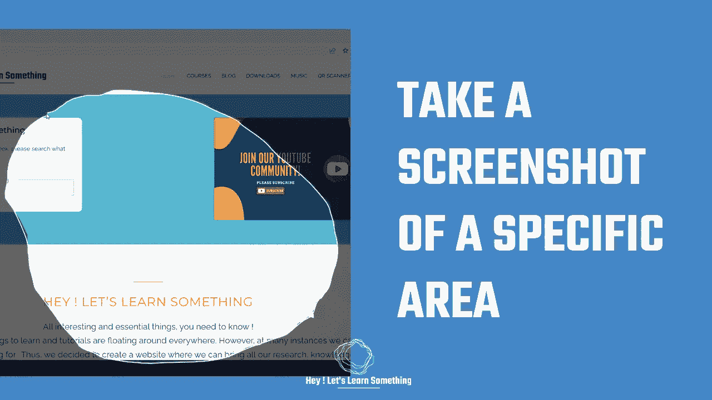

# 在 Windows 上截取特定屏幕的屏幕截图(默认工具)

> 原文：<https://medium.com/geekculture/take-a-screenshot-of-a-specific-screen-on-windows-default-tool-c5060bb7ef97?source=collection_archive---------8----------------------->

你知道吗，Windows 有一个免费的截图工具，可以截取你的屏幕截图。按下键盘上的“PrtScr”可以获得整个屏幕截图，但是截图工具给了你更多的选择。您可以选择正方形或矩形形状来截取屏幕截图，甚至可以使用自由形状的剪贴画来选择任何自定义区域来截取屏幕截图；然后，您可以将它保存在…