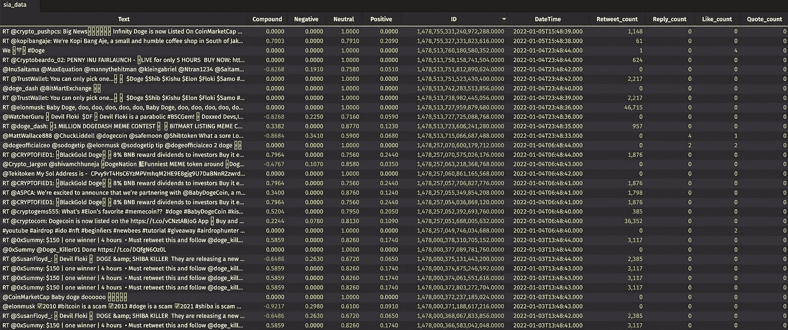
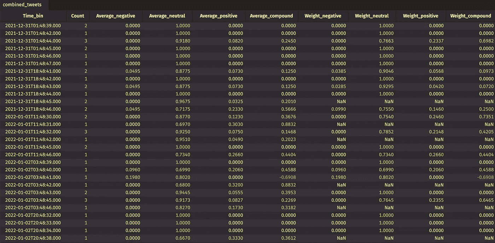
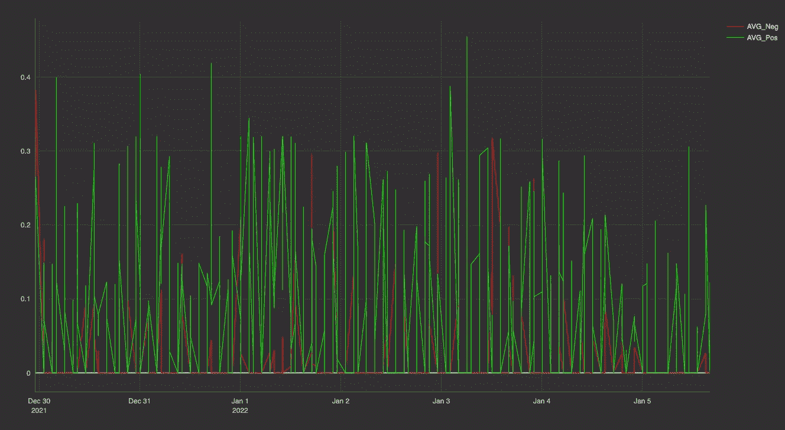

# 以 Twitter 的温度为例

> 原文：<https://medium.com/geekculture/take-twitters-temperature-1cf10c2c83fe?source=collection_archive---------21----------------------->

## 使用 Deephaven 的情感分析教程

阿曼达·马丁


Source: Image by author

Twitter 是社会情绪的数据宝库。在 meme 股票交易中赚到的钱是社区情感力量的一个惊人的例子。然而，你可能会花费数小时手动滚动社交媒体，却得不到有意义的见解。或者，你可以用自动化和 ML 来实时测量情绪，并产生有用的结果。

Python 和 TensorFlow 的自然语言处理库以及 Deephaven 的流和批处理表引擎共同应对这一挑战。下面，我分享我开发的一个应用程序的细节，这个应用程序对 Twitter feed 进行自然语言处理，并将其与股票价格信息结合起来——所有这些都是实时的。

这个启动程序查看关于加密货币的推文；然而，可能性是无限的，我们鼓励您根据自己的兴趣定制这些查询。

这里展示的[程序](https://github.com/deephaven-examples/twitter-sentiment)将 [Deephaven](http://deephaven.io/) 与 [Twitter](https://twitter.com/) 和 Python 的[自然语言工具包(NLTK)](https://www.nltk.org/) 集成在一起，以获取最近的推文并实时评估情绪。我们首先提取数据，并对每条推文运行一个`SentimentIntensityAnalyzer`。然后，我们汇总这些帖子，看看随着时间的推移，这个词在 Twitter 上的总体积极或消极程度。

# **先决条件**

要开始，请转到我们的[示例 repo](https://github.com/deephaven-examples/twitter-sentiment) 或运行以下命令来下载所有代码和依赖项，以便使用 [Docker](https://www.docker.com/) 。

```
*git* clone https://github.com/deephaven-examples/twitter-sentiment.git
cd twitter-sentiment
```

一个启动脚本将安装所需的 Python 模块并启动 Deephaven IDE。

要运行它，请执行:

```
./twitter-sentiment.sh
```

[Twitter](https://developer.twitter.com/en/docs/twitter-api) 提供了一个 API，使得拉取公共推文变得容易。为了按原样使用这些代码，您还需要有一个 Twitter 开发人员帐户，并复制您的不记名令牌。

导入适当的包以使用每个平台。我在深水港表演了一个`pip install`。这确保了我的程序运行不需要任何额外的修改。

```
import nltk
nltk.download('punkt')
nltk.download('vader_lexicon')from requests_oauthlib import OAuth1Session
import requests
from datetime import datetimeimport time
import re
import json
from nltk.sentiment.vader import SentimentIntensityAnalyzerfrom deephaven.DateTimeUtils import convertDateTime, minus, convertPeriod, currentTime
from deephaven import DynamicTableWriter
import deephaven.Types as dht
import threading
```

# 运行程序

该程序旨在进行微调，以满足您的数据需求。以下是您需要更改的值，以便为您的特定使用情形和信息定制该程序。

在这个例子中，我在一周的时间里对 Dogecoin 的推文进行了情感分析。

1.  首先，你需要我上面提到的令牌。重要提示:不记名令牌是由 Twitter 提供的，每个开发者都有一个月限额，所以保持这个令牌的私密性。
2.  我搜索任何包含术语`DOGE`的推文。
3.  因为有推文速率限制，我想看最近七天的推文，所以我用`max_results = 10`每次拉取只收集 10 条推文。我建议使用较低的数字进行测试。当您准备好生产时，根据需要增加，同时记住速率限制。
4.  接下来，为了看看推特上的情绪是如何随着时间变化的，我把这七天分成几个小部分`time_bins`。更多的垃圾箱将使你能够看到社会情绪的更精细的变化，但也会吸引更多的推文，这意味着你更快达到你的速率限制。
5.  我的 [Twitter 访问级别](https://developer.twitter.com/en/docs/twitter-api/getting-started/about-twitter-api)限制了我在七天内可以获取的历史推文数量，所以我设置了`time_history = 7`。这是非学术搜索的标准。

```
# Make sure you enter your token like this 'AAAD...JFH'
bearer_token = '<INPUT YOUR TOKEN HERE>'# Change this to search whatever term you want on Twitter
search_term = 'DOGE'# Max results per time bin
max_results = 10# Time intervals to split data
time_bins = 10# How many days to go back. Max 7 for non-academic searches
time_history = 7
```

# 配置您的功能[](https://docs-staging.deephaven.io/deploy-preview/413a2bb8d3b652dbfd4887a690328c4930e597e9/blog/2022/01/11/twitter-sentiment/#configure-your-functions)

在这段代码中，我们创建了从 Twitter 中提取数据所需的函数。

Twitter 提供了很多带有 v2 API 的示例代码。这些函数来自 Github Twitter-API-v2-sample-code repo,这样我们就可以通过适当的授权连接到所需的端点。

```
def create_headers(bearer_token):
        headers = {
            "Authorization": "Bearer {}".format(bearer_token),
            "User-Agent": "v2FullArchiveSearchPython"}
        return headerssearch_url = "[https://api.twitter.com/2/tweets/search/recent](https://api.twitter.com/2/tweets/search/recent)"def connect_to_endpoint(url, headers, params):
    response = requests.request("GET", search_url, headers=headers, params=params)
    if response.status_code != 200:
        raise Exception(response.status_code, response.text)
    return response.json()
```

推文包含大量有用的元数据。在这里，我设置了我喜欢使用的字段:只有`tweet.fields`和`user.fields`数据以保持简单。使用这些字段允许我根据推文或用户的受欢迎程度来衡量推文，而忽略位置信息。其余的留给您根据需要添加，如果您想将搜索限制在世界上的某些地方，这可能是有用的。

```
def get_query_params(start_time, end_time):
    return {'query': search_term,
                    'start_time': start_time,
                    'end_time': end_time,
                    'max_results': max_results,
    #                 'expansions': 'author_id,in_reply_to_user_id,geo.place_id',
                    'tweet.fields': 'id,text,author_id,in_reply_to_user_id,geo,conversation_id,created_at,lang,public_metrics,referenced_tweets,reply_settings,source',
                    'user.fields': 'id,name,username,created_at,description,public_metrics,verified',
    #                 'place.fields': 'full_name,id,country,country_code,geo,name,place_type',
                    'next_token': {}}
```

现在我们有了拉推的功能。我将它与之前的代码分开，以便更容易将`query_params`更改为您想要的日期区。

默认情况下，如果给定一个 7 天前的开始时间范围，那么只会拉取最近的推文。由于我希望保证存储箱中的日期，所以我为每个请求提供了确切的开始和结束日期。

这个函数为每个时间框调用，并返回所有以 JSON 格式请求的 tweet 数据。

```
def get_tweets(query_params):
    headers = create_headers(bearer_token)
    json_response = connect_to_endpoint(search_url, headers, query_params)
    return(json_response['data'])
```

# 清理推文[](https://docs-staging.deephaven.io/deploy-preview/413a2bb8d3b652dbfd4887a690328c4930e597e9/blog/2022/01/11/twitter-sentiment/#clean-the-tweets)

因为我正在对推文的内容进行情感分析，所以我清理了每条推文。这是可选的，但是为表中的 tweets 提供了更统一的外观。

```
def cleanText(text):
    #to lowercase
    text = text.lower()
    #correct spaces (e.g. "End sentence.Begin another" becomes "End sentence. Begin another")
    text = re.sub(r'\.([a-zA-Z])', r'. \1', text)
    text = re.sub(r'\?([a-zA-Z])', r'. \1', text)
    text = re.sub(r'\!([a-zA-Z])', r'. \1', text)
    #replace q1,2,3,4 with q
    text = re.sub("q[1-4]", "q", text)
    #replace 20xx with 2000
    text = re.sub("20[0-2][0-9]", "2000", text)
    return text
```

# 评估情绪[](https://docs-staging.deephaven.io/deploy-preview/413a2bb8d3b652dbfd4887a690328c4930e597e9/blog/2022/01/11/twitter-sentiment/#assess-sentiment)

接下来，我通过 NLTK `SentimentIntensityAnalyzer`运行每条推文。这将返回推文的极性分数——即推文的积极、消极和中立程度，以及综合分数。通常，一条推文会充斥着杜撰的词语、首字母缩写词等等。这些通常被评为中性，不影响分析。

```
def analyze_line(text):
    sid = SentimentIntensityAnalyzer()
    return(sid.polarity_scores(text))
```

# 把我们的数据放在一个表格里[](https://docs-staging.deephaven.io/deploy-preview/413a2bb8d3b652dbfd4887a690328c4930e597e9/blog/2022/01/11/twitter-sentiment/#put-our-data-in-a-table)

最后一个函数需要创建一个表来存储我们的数据。

我们使用 Deephaven 的 [DynamicTableWriter 类](https://deephaven.io/core/docs/reference/table-operations/create/DynamicTableWriter/)，它为动态表的每次迭代调用函数。

我们为每个`time_bins`添加到表中。通过用 [Deephaven Types](https://github.com/deephaven/deephaven-core/blob/main/Integrations/python/deephaven/Types.py) 格式化数据，我们使得在我们的表上连接、过滤、汇总、绘图和执行其他分析变得容易。

```
def thread_func():
    for i in range(1, time_bins):
        start_time = str(minus(currentTime(),convertPeriod("T"+str(int(i*(24*time_history)/time_bins))+"H")))[:-9]+'Z'
        end_time = str(minus(currentTime(),convertPeriod("T"+str(int((i-1)*(24*time_history)/time_bins))+"H")))[:-9]+'Z'
        query_params = get_query_params(start_time, end_time)
        all_text = get_tweets(query_params)
        for t in all_text:
            id = float(t['id'])
            combined = analyze_line(cleanText(t['text']))
            negative = combined.get('neg')
            neutral = combined.get('neu')
            compound = combined.get('compound')
            positive = combined.get('pos')
            dateTime = t['created_at'][:-1]+" NY"
            retweet_count = t['public_metrics']['retweet_count']
            reply_count = t['public_metrics']['reply_count']
            like_count = t['public_metrics']['like_count']
            quote_count= t['public_metrics']['quote_count']
            tableWriter_sia.logRow(t['text'], float(compound), float(negative), float(neutral), float(positive), float(id),convertDateTime(dateTime), int(retweet_count), int(reply_count), int(like_count), int(quote_count))
```

最后，我创建了`tableWriter_sia`并执行线程来运行上面的函数。这导致了`sia_data`表，其中填充了推文及其元数据，以及每条推文的情感。

```
tableWriter_sia = DynamicTableWriter(
    ["Text", "Compound", "Negative", "Neutral", "Positive", "ID", "DateTime", "Retweet_count", "Reply_count", "Like_count", "Quote_count"],
    [dht.string, dht.double, dht.double, dht.double, dht.double, dht.double, dht.datetime, dht.int_, dht.int_, dht.int_, dht.int_])
sia_data = tableWriter_sia.getTable()thread_sia = threading.Thread(target = thread_func)
thread_sia.start()
```



Deephaven table to store our results. Source: Image by author

# [分析数据](https://docs-staging.deephaven.io/deploy-preview/413a2bb8d3b652dbfd4887a690328c4930e597e9/blog/2022/01/11/twitter-sentiment/#analyze-the-data)

现在是有趣的部分。让我们对推文做一些分析，这样我们可以看到搜索词的积极和消极是如何随着时间而变化的。

首先，让我们汇总这些推文，这样我们就可以在我们选择的时间段内获得每条推文的摘要。

此代码:

1.  创建一系列平均值和加权平均值。
2.  创建`combined_tweets`表，向我们显示时间仓中每分钟的总体情绪。

```
from deephaven import Aggregation as agg, as_listagg_list = as_list([
    agg.AggCount("Count"),
    agg.AggAvg("Average_negative = Negative"),
    agg.AggAvg("Average_neutral = Neutral"),
    agg.AggAvg("Average_positive = Positive"),
    agg.AggAvg("Average_compound = Compound"),
    agg.AggWAvg("Retweet_count", "Weight_negative = Negative"),
    agg.AggWAvg("Retweet_count","Weight_neutral = Neutral"),
    agg.AggWAvg("Retweet_count","Weight_positive = Positive"),
    agg.AggWAvg("Retweet_count","Weight_compound = Compound")
])from deephaven.DateTimeUtils import expressionToNanos, convertDateTime, upperBincombined_tweets = sia_data.update("Time_bin = upperBin(DateTime, 10000)").sort("DateTime").aggBy(agg_list,"Time_bin").sort("Time_bin")
```



The combined_tweets table. Source: Image by author

桌子很酷，但不如一个阴谋有用。我使用 Deephaven 的绘图方法来创建我的数据的可视化效果。

```
from deephaven import Plotsia_averages = Plot.plot("AVG_Neg", combined_tweets, "Time_bin", "Average_negative")\
    .lineColor(Plot.colorRGB(255,0,0,100))\
    .plot("AVG_Pos", combined_tweets, "Time_bin", "Average_positive")\
    .lineColor(Plot.colorRGB(0,255,0,100))\
    .show()
```



sia_averages plot. Source: Image by author

# 轮到你了[](https://docs-staging.deephaven.io/deploy-preview/413a2bb8d3b652dbfd4887a690328c4930e597e9/blog/2022/01/11/twitter-sentiment/#your-turn)

这段代码提供了一个基本的入门。你可以用它来进行自己的搜索，绑定到其他程序，或者只是看看社交媒体做得怎么样。

我们希望这个[节目](https://github.com/deephaven-examples/twitter-sentiment)能激励你。如果你有自己的东西或者想法要分享，我们很乐意在 [Gitter](https://gitter.im/deephaven/deephaven) 上听到！