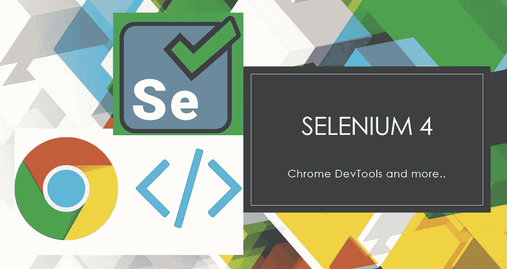
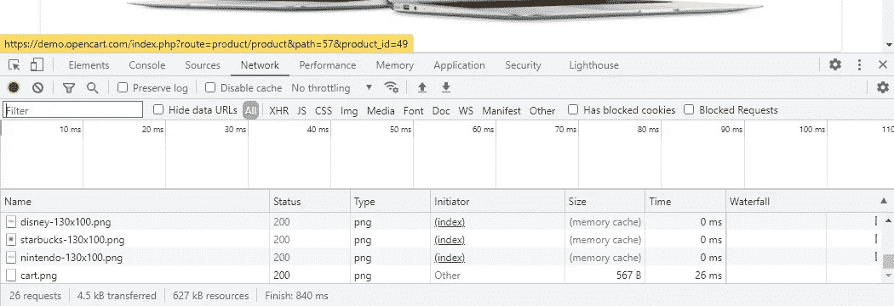
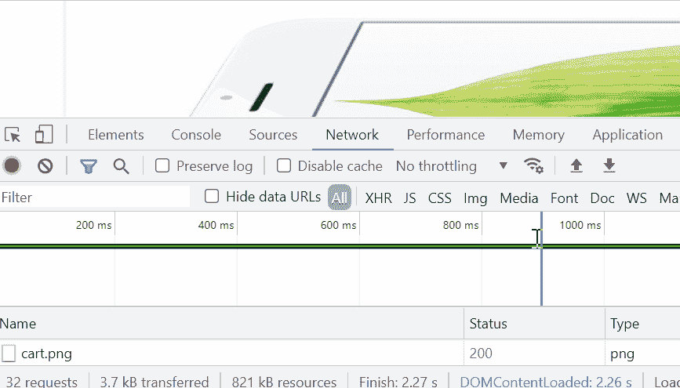
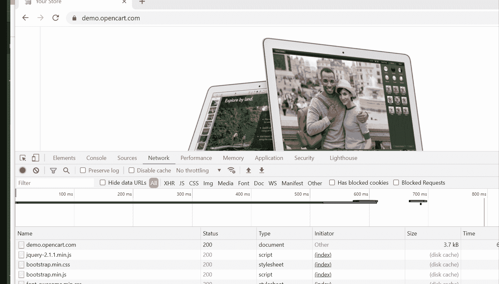
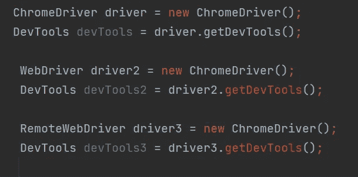

# 使用 Selenium 4 将您的测试自动化提升到一个新的水平

> 原文：<https://medium.com/geekculture/take-your-test-automation-to-next-level-with-selenium-4-c9835611b3de?source=collection_archive---------18----------------------->



你们中的许多人可能听说过最近关于发布新的 Selenium 4 的消息(在撰写本文时是测试版)。这里有一个很棒的链接，解释了 Selenium 4 的一些关键特性，下面是候选列表。

*   相对定位器
*   窗口和标签管理
*   Chrome DevTools 协议
*   可观察性
*   增强型例外

作为一个测试自动化爱好者，我很想了解新的特性，并且非常想尝试一下。我不得不说，新的特性确实很出色，并将测试自动化带到了一个新的高度。尤其是对 Chrome DevTools 的支持是一个游戏改变者！

在这篇博文中，我将特别关注你可以用 Chrome DevTools 做什么，以及这将如何极大地帮助测试社区。

# 背景和使用案例

如果你一直在测试自动化领域，我相信会有很多场合，我们会说:“这个特定的场景”是不可能自动化的，或者它太复杂了，不值得自动化。尽管我们喜欢自动化任何事情，但考虑到项目的时间和资源有限，这并不总是可能的。我们倾向于务实，并基于我们自动化工作的投资回报(ROI)来决定自动化测试用例。

其中一个领域就是测试 UI 上的错误场景。如今，大多数网站都是基于单页面应用模式构建的，使用 ReactJS 和 Angular JS 这样的框架。问题是，单页应用程序有许多彼此异步的组件，这些组件的外观变得不可预测。


Sample react loading skeleton

非常重要的是，我们必须确保用户体验不会受到影响，即使在 API、GraphQL 调用和网络问题的幕后出现任何延迟或错误，也能得到妥善处理。


Sample spinner component

有许多加载器组件，如微调器、加载骨架和其他动画，可以优雅地处理延迟和错误。我们如何确保它们在不同的情况和条件下都能正确一致地工作？

但是，我们从来没有费心去自动化这样的场景，因为模拟这些场景并在 UI 级别创建断言是非常复杂的，因为没有一个测试自动化工具能够轻松地自动化它们。因此，我们最终手动测试它，并希望它不会打破！

# Selenium 4 和 DevTools 助您一臂之力

现在，随着 Selenium 4 的发布，以及对 Chrome DevTools 的支持，创建和自动化复杂的测试条件和断言变得非常容易。在我们看例子之前，让我们先了解一些基本原理。

## Chrome 开发工具

Selenium 4 引入了一个新的 API，允许从自动化测试中直接访问 Chrome DevTools。这是通过 Chrome DevTools 协议(CDP)完成的，它本质上是一组工具，使您能够访问和控制基于 Chromium 的浏览器。



Chrome developer tools

这是不可思议的，因为它让你可以访问强大的 Chrome 开发者(右击并点击 Chrome 浏览器上的 inspect)功能，如控制台日志、网络、性能等。

让我们看一些测试代码，看看我是如何设法模拟上面讨论的真实用例，并使用 DevTools 为我的一个客户的一个项目进行自动化的。

## 用例 1:设置网络速度来模拟延迟

特定的测试用例将在不同的网络条件下执行，如蜂窝 2G、3G 和快速 WIFI 等。我们的期望是，当互联网访问很差时，页面显示微调器和加载框架，而当页面加载很快时，不显示。

在这个练习中，我将使用一个[演示电子商务网站](https://demo.opencart.com/)。我打算将网速设置为慢 3G，并希望在页面仍在加载时检查加载骨架是否显示。



正如您从下面的 java 代码示例中看到的，我们可以选择使用 DevTools，它为我们提供了选择不同网络连接类型的选项，如 2G、3G、4G、WIFI 等。

```
@Test
public void networkTest() throws Exception {
   ChromeDriver driver = new ChromeDriver();

    DevTools devTools = driver.getDevTools();
    devTools.createSession();
    devTools.send(Network.*enable*(Optional.*empty*(), Optional.*empty*(), Optional.*empty*()));

    //Set the desired network speed
    devTools.send(Network.*emulateNetworkConditions*(
            false,
            100,
            2000,
            50000,
            Optional.*of*(ConnectionType.*CELLULAR3G*)
    ));

    //Launch the site and see the test running at the speed as per the setting above
    driver.get(BASE_URL);//The assertion check for the loading skeleton to be displayed at this speed Assert.*assertTrue*( driver.findElement(By.*cssSelector*("skeleton")).isDisplayed(), "Loading skeleton is present");
}
```

## 用例 2:阻塞模拟错误条件的请求

在这个用例中，我们将模拟网站上的错误情况，并确保页面按照预期正确处理错误。Chrome DevTools 为我们提供了一个优秀的工具，叫做“阻塞请求”。您可以选择阻止特定的 URL 或整个域。当您启动带有 URL 块的网站时，该网站的行为将与特定后端服务出现问题时的响应完全相同。



Blocking request manually via Chrome devtools

如何通过 Selenium 4 devTools 功能实现同样功能的 Java 示例

```
@Test
public void blockingTest() throws Exception {
    ChromeDriver driver = new ChromeDriver();

    DevTools devTools = driver.getDevTools();
    devTools.createSession();
    devTools.send(Network.*enable*(Optional.*empty*(), Optional.*empty*(), Optional.*empty*()));
    String urlToBlock= BASE_URL+"/products/category=25";
    devTools.send(Network.*setBlockedURLs*(ImmutableList.*of*(urlToBlock)));
    driver.get(BASE_URL);
    Assert.*assertEquals*( driver.findElement(By.*cssSelector*(".error")).getText(), "Something went wrong, try again");
}
```

## 需要注意的主要发现:

我们已经在一个实时项目中使用了新的 Selenium4 特性。虽然功能很棒，但我们也意识到了一些局限性。如果您还没有开始将以下几点整合到您的项目中，那么它们可能会对您有所帮助。

1.  Chrome devTools 只能在 Chrome 浏览器上运行。因此，你需要确保你专门为这些测试初始化 Chromedriver。大多数测试人员将拥有一个全面的测试框架，在这个框架中，您可以隐藏整个驱动程序设置，并可以使用抽象方法来访问通用 WebDriver，以便在测试中直接使用。但是通用 WebDriver 或 RemoteWebDriver 不会给你 getDevTools()方法的选项！



2.你还不能在 Browserstack 或 CrossBrowserTesting 工具这样的云测试平台上使用 Chrome devtools 测试。这是因为 RemoteWebDriver 上还不支持 Selenium4 CDP 功能。不幸的是，在提供这种支持之前，我们只能在本地 Chrome 浏览器上运行测试。

3.您可能需要更新您的 Selenium4 和 devTools 库，以使其适用于最新版本的 Chrome。在我的例子中，我最初使用的是一个特定的 alpha 版本，但是几周后测试开始失败。这是因为旧的 alpha 版本与新的 Chrome 更新不兼容。所以我不得不将 selenium 升级到最新版本。

我希望你喜欢这篇文章，并祝你在项目中使用 Selenium4 好运！