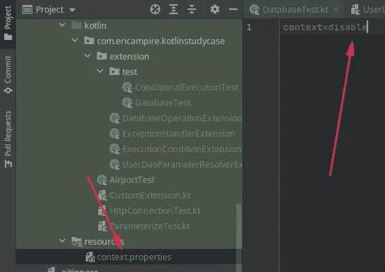
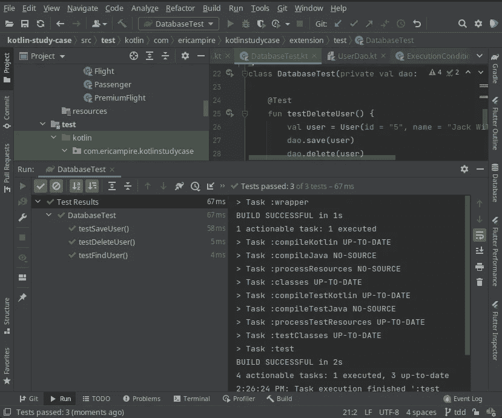

# 利用 Junit 5 扩展

> 原文：<https://medium.com/geekculture/taking-advantage-of-junit-5-extensions-4a9622184125?source=collection_archive---------2----------------------->

# 介绍

JUnit 5 是 JUnit 的下一代。目标是为 JVM 上的开发人员端测试创建一个最新的基础。这包括关注 Java 8 和更高版本，以及支持许多不同风格的测试。

在本文中，我们将重点关注 Junit 5 的特性之一，即扩展，在整篇文章中，您将发现如何使用扩展来定制测试的行为。

> **注:**通过阅读这篇文章，假设你已经熟悉 Junit 5，并想更进一步，如果你对 Junit 5 或 Junit 完全不熟悉，我建议你在深入文章之前先看一看。

# 什么是 Junit 5 扩展

在 Junit 5 之前，为了扩展测试的行为，有必要使用基于反射的**运行器**或**规则**，反射的问题是它破坏了封装，Junit 5 通过引入扩展的概念来克服这个问题，你很快就会发现，这使得使用 Junit 4 的代码与使用反射的代码强耦合，使得代码难以发展。

## Junit 5 的扩展

与 JUnit 4 中竞争的 **Runner** 、 **TestRule** 和 **MethodRule** 扩展点相比，JUnit 5 扩展模型由一个单一的、连贯的概念组成:扩展 API。但是，请注意，扩展本身只是一个标记接口。

## Junit 5 模块化

Junit 框架的发展需要一种模块化的方法，该架构必须允许 Junit 与使用不同工具和 ide 的不同编程客户机进行交互。需要对关注点进行逻辑分离

-编写测试的 API，主要供开发人员使用
-发现和运行测试的机制
-允许与 ide 和工具轻松集成以运行测试的 API。

Junit 5 中的扩展是允许 Junit 框架具有这种模块化的元素之一

## Junit 5 扩展模型

Junit 4 通过 **Runners** 和 **Rules** 提供了扩展，但是 Junit 5 只有一个概念:扩展 API。

扩展本身只是一个标记接口(或者标记或令牌接口)，一个内部没有字段或方法的接口。它用于标记这样一个事实，即实现此类接口的类有一些特殊的行为。最著名的 Java 标记接口有**可串行化的**和**可克隆的**

JUnit 5 可以扩展测试的类或方法的行为，并且这些扩展可以被许多测试重用。JUnit 5 扩展与测试执行期间特定事件的发生相关联。这种事件称为扩展点。

当测试的生命周期达到这样一个点时，JUnit
引擎会自动调用注册的扩展。

可用的扩展点如下:
-条件测试执行——控制测试是否应该运行
-生命周期回调——对测试生命周期中的事件做出反应
-参数解析——在运行时，解析测试接收到的参数
-异常处理——定义测试遇到特定类型的异常时的行为
-测试实例后处理——在创建测试实例后执行

请注意，扩展主要用在框架和构建工具中。它们也可以用于应用程序编程，但程度不同。扩展的创建和使用遵循共同的原则；本章将展示适合常规应用程序开发的例子。

## 创建您的第一个 Junit 5 扩展

我们将通过一个小而简单的程序来说明 Junit 5 提供的所有扩展的可能性，该程序将元素保存在数据库(内存数据库)中

## 1.条件测试执行

有时，我们需要测试只在特定的条件或上下文中运行，为了说明这一点，我们将创建一个“context.properties”文件，在该文件中，我们将放入表示上下文的信息，并且根据该上下文，我们将设置一个扩展，该扩展将根据上下文禁用或启用测试的执行

要创建条件执行扩展，我们只需创建一个实现 **ExecutionCondition** 接口的类，然后实现**evaluateExecutionCondition**方法，如下面的代码片段所示。

正如您所看到的，下面的代码读取了在 **context.properties** 文件中定义的上下文属性，根据该属性的值，我们返回**conditionevaluationresult . disabled(" Message ")**来禁用测试的执行，或者返回**conditionevaluationresult . enabled(" Message ")**来启用测试的执行。

做得好，您已经创建了您的第一个 Junit 5 扩展，现在要定义一个测试可以根据这个扩展定义的逻辑来执行，您只需使用 **ExtendWith** 注释，通过将扩展传递给它，如下面的代码所示，当测试将被启动时，任何使用这个扩展的测试将根据在 **context.properties** 文件中定义的上下文来执行或禁用

## 2.生命周期回调

假设您想要测试您的数据库，正如您已经知道的，要运行对数据库的查询，您需要建立到数据库的连接，然后在运行测试后立即关闭到数据库的连接，

使用 **BeforeAll** 或 **AfterAll** 注释可以很容易地完成这个操作，但是如果要在几个测试上完成这个操作，它可能会变得非常快速地重复，为了解决这个问题，我们将创建一个扩展，它将根据测试生命周期为我们执行一些操作，但是这会在我们的数据库周围建立不同的

为了简单起见，我们将使用 JDBC 和 H2 作为我们的数据库系统，让我们定义允许我们管理数据库的组件。

**连接管理器**

这个类将允许我们管理数据库版本连接，即建立到数据库服务器的连接，并在没有更多请求时关闭连接。

这个类将允许我们管理数据库中唯一的表，它有一个方法创建不存在的表，另一个方法删除存在的表。

**数据访问对象**

要发出请求，UserDao 类必须实现这个接口

**用户数据访问对象**

这个类实现了之前定义的 DAO，这个类将被用来向我们的数据库发出请求，为了工作，这个类需要依赖于允许我们执行 SQL 请求的“连接”对象。

**生命周期扩展**
现在，所有允许与我们的数据库交互的元素都可用了，现在是时候创建一个能够根据我们测试的生命周期执行某些操作的扩展了。

使用这个扩展，我们不必在每次运行与数据库相关的测试时都配置数据库，我们所要做的就是将这个扩展应用到相应的测试中，它将为我们处理配置和清理工作。

正如你已经注意到的，这个类实现了 4 个接口 **BeforeAllCallback** ， **AfterAllCallback** ， **BeforeEachCallback** ， **AfterEachCallback** ，并且它的每个接口都有一个根据其名称执行的方法。

-在所有测试之前执行的 **beforeAll** 方法中，我们建立到数据库的连接，并通过删除之前存在的表来创建表。

-在所有测试后执行的 **afterAll** 方法中，我们关闭了与数据库的连接。

-在每次测试前执行的 **beforeEach** 方法中，我们执行自动提交，然后保存状态。

-在每次测试后执行的 **afterEach** 方法中，我们执行回滚

您可能已经理解了，前面的方法对应于所有前的**、所有**后的**、每个**前的**、每个**后的**注释。**

**应用扩展**

现在我们的扩展已经准备好了，我们只需要像以前一样使用它。

使用这个扩展，我们不必在每次运行与数据库相关的测试时都配置数据库，我们所要做的就是将这个扩展应用到相应的测试中，它将为我们处理配置和清理工作(关闭数据库连接等)。

如果您尝试运行测试，您会注意到您将得到一个错误，这是由于 **DatabaseTest** 类将 **UserDao** 作为参数，而 Junit 不知道在哪里寻找它。我们将在下一节中解决这个问题。

## **3。参数解析**

在前面的部分中，当我们试图运行测试时，我们得到了一个错误，这是由于测试类接受了一个参数，而 Junit 不知道如何创建它，这个错误将允许我们引入另一种可以用 Junit 5 创建的扩展

我们将创建一个扩展，允许我们将依赖项注入到我们的测试类中，为此，让我们创建一个名为**userdaoparameteresolverextension**的扩展，它实现了 Junit 5 提供的 **ParameterResolver** 接口。

正如你所看到的，**参数解析器**有两个方法，第一个允许我们定义我们想要创建的依赖类型，第二个允许我们创建依赖，在我们的例子中它是一个类型为 **UserDao** 的对象

现在我们的扩展已经准备好使用了，我们只需要使用 **ExtendWith** 注释来应用这个扩展，为了将几个扩展应用到同一个类，你可以使用多个 **ExtendWith** extensions，也可以使用一个单独的扩展和一个扩展数组

现在，如果您再次执行测试，一切都按预期运行。

## 4.异常处理

有时，当出现异常时，我们需要更明确的错误消息，在这一节中，我们将看到 Junit 5 如何允许捕捉异常。

我们将创建一个异常，当我们试图添加一个 id 已经存在于数据库中的元素时，将引发该异常而不是 SqlException。

由于我们的异常已经准备好了，我们只需在 **UserDAO** 的 **save** 方法中使用它，如下面的清单所示。

我们所要做的就是创建一个能够捕捉这个异常的扩展，并执行适当的操作，在我们的例子中，我们将限制自己显示一个日志，如果这个异常不是我们定义的异常，我们只需重新抛出这个异常。

为此，我们将创建一个**exception handler extension**类，该类实现 Junit 5 提供的**TestExecutionExceptionHandler**接口，该接口迫使我们实现**handleTestExecutionException**方法，该方法有两个参数，即上下文和刚刚触发的异常

要使用这个扩展，我们按照你之前已经学过的方法来做。

现在，每次您尝试添加一个元素两次时，您都会看到一条消息，如下图所示。

# 结论

在本文中，我们探索了 Junit 5 框架带给我们的一个非常强大的特性，正如您很快理解的那样，Junit 5 允许我们以一种非常舒适的方式扩展我们的测试行为，同时带给我们一种在 Junit 5 之前没有的模块化，我希望本文会让您想了解更多关于 Junit 5 的知识，以便轻松地测试您的软件。

# 参考

 [## JUnit 5 用户指南

### 用法:console launcher[-h][-disable-ansi-colors][-disable-banner][-fail-if-no-tests][-scan-modules]…

junit.org](https://junit.org/junit5/docs/current/user-guide/#extensions)