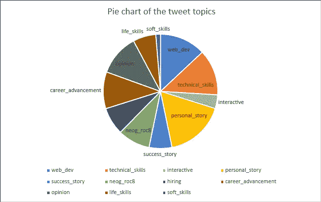
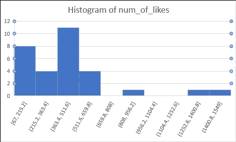
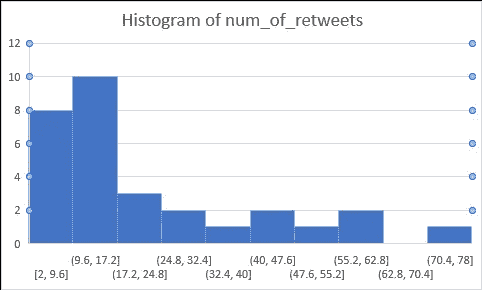
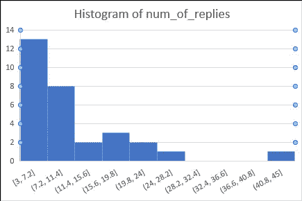

# Tanay 和 Twitter:启动

> 原文：<https://medium.com/geekculture/tanay-and-twitter-launching-off-dd17d3693afb?source=collection_archive---------52----------------------->

## 一系列博客分析了 Tanay Pratap 的推特账号

Photo by [Alexander Shatov](https://unsplash.com/@alexbemore?utm_source=medium&utm_medium=referral) on [Unsplash](https://unsplash.com?utm_source=medium&utm_medium=referral)

谁是 Tanay？
[塔奈·普拉塔普](https://tanaypratap.com/)白天是微软的高级软件工程师，晚上是数吨印度学生的导师。他创建了印度最大的编程社区，并以一种你无法想象的方式影响着印度的教育部门。他在 Twitter 上有 30000+粉丝，在 LinkedIn 上有 96000+粉丝，在 Instagram 上有 36000+粉丝(截至 2021 年 8 月 31 日)。

**那么 Twitter 呢？**
虽然 Tanay 关注人数最多的不是 Twitter，但却是他最活跃的平台。用他自己的话来说，“我不知道为什么，但比起其他 SM，我在这里更有家的感觉”

**为什么我会关心 Tanay 和他的 Twitter 句柄？嗯，因为我是他团队的一员，已经和他一起合作了一个多月。在不透露太多的情况下，我会说我工作的一部分是确保他的观众的增长。有多种方法，但我想到了好好利用我的统计学教育背景(终于！)并准备适当的报告、仪表板和其他分析他的 Twitter 手柄及其产生的牵引力的酷东西。是的，在你开始取消我之前，让我告诉你，我确实得到了他的许可来写这个博客系列。**

**这是如何工作的？在这篇具体的文章中，我将谈谈数据收集的方法和我用 MS Excel 做的初步分析。我用 MS Excel 来完成这个，因为这个博客系列将是一个工作证明，在未来的问题中，我计划展示我所知道的所有不同的工具和语言。此外，由于数据是持续生成的(因为 Tanay 确实经常发推文)，该系列将继续分析他未来推文的不同方面。**

**数据是如何收集的？**手动
。这些推文被逐一研究，并被标记为与 Tanay 的目标相关的不同类别。一些标签是网络开发、技术技能、个人故事等。，加起来是 11。这篇博客中讨论的数据集包含了截至 2021 年 8 月 5 日的最新 30 条推文。因为我刚刚开始收集数据，所以我选择 30 作为数据集的大小，因为任何大于 25 的数据都被认为是推断人口的良好样本大小。还收集了回复、转发和点赞的数量，添加了一个线程中 tweet 的值，并将其分配给该线程的主体或第一条 tweet。

**来分析！**
Tanay 在 Twitter 上写了很多主题，主要是个人故事、网络开发、技术技能、职业发展和观点。

点赞数、回复数和转发数的直方图都是正偏的，其中点赞数越少，频率越高。

> 正态或钟形分布是对称的，想象一下任何钟形的上倒 U 形。当分布偏离这种对称性时，称为偏斜。正偏度意味着曲线的右尾被拉长，而左尾几乎不存在，反之亦然。

当我们从点赞数到转发数再到回复数时，可以观察到分布的偏斜度增加。右尾巴保持拉长，但是你可以感觉到左尾巴变得越来越短。

点赞数和转发数之间的相关性度量(两个数值变量之间线性关联强度的度量)为 0.63，这意味着受众对帖子的点赞和转发反应相似。这符合预期，因为点赞越多的帖子通常会获得更多的分享或转发。

“neog_roc8”和“招聘”是表现最佳的推文中出现频率最高的标签，其次是“网络开发”和“技术技能”。

需要注意的是，只有一条推文在所有三个变量中排名前五，赞数、转发数和回复数:
*“上个月 Ek naya shabd sikha。Gyaaandu:没有给生活带来真正价值的人，就像社交媒体上的 gyaan hugte rehte hai 一样。可能是推特对印度大学生观众的随意态度和亲切感对其有利。*

为了开始这个系列，我试图保持基本的分析。更多的关系和因素将在以后的文章中研究。如果你想查看完整的数据集和 excel 文件，请点击以下链接:[https://1drv.ms/x/s!Ageuzh31nyhkihfJveMgSnBbcd3m?e=ah3a66](https://1drv.ms/x/s!Ageuzh31nyhkihfJveMgSnBbcd3m?e=ah3a66)

**还缺什么？** 几件事。

1.  这个博客系列的主要分析部分取决于主题标签是如何被赋予推文的。可能是偏向于我对事物的认知。
2.  一天中某条推文被分享的时间也会影响受众对它的接受程度。这个因素还没有研究过。
3.  分析是使用免费的 MS Excel 网络版完成的，它支持有限的功能。

我们下一步去哪里？我计划添加一些新的主题标签、变量，希望还有一个仪表板(或类似的东西)。敬请期待！

我希望你能对我的这个新项目提出反馈和想法，我也可以作为一名自由职业者为你的公司、组织或自己做这样的分析。只要在[ankita.prakash1998@gmail.com](mailto:ankita.prakash1998@gmail.com)发封邮件，我们一定能想出办法来！