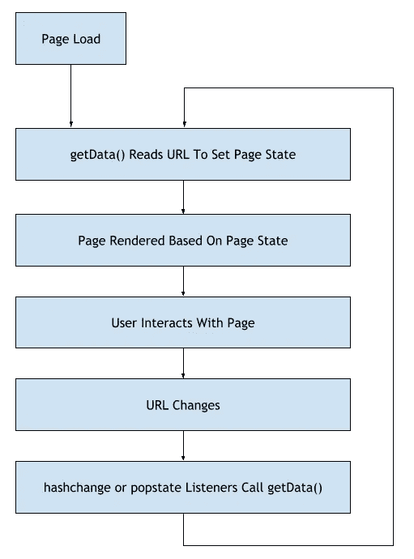
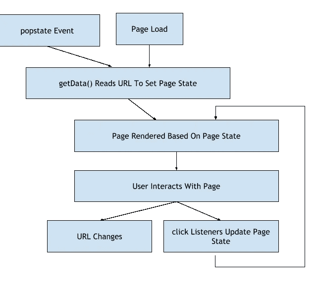

# 在下一次 SPA 中使用散列路由的切实好处

> 原文：<https://medium.com/geekculture/tangible-benefits-to-using-hashed-routes-in-your-next-spa-29da1a4edf24?source=collection_archive---------12----------------------->

## 这使得行为更加一致，代码更加整洁

A website that is probably an SPA

在设计 SPA 时，跨站点页面路由用户的方法是最先做出的决定之一。路由库非常灵活，支持您的任何选择，只要它配置正确，但是简单地让它工作并不意味着代码整洁或行为会大规模受损。我将概述在路由中使用散列的情况。

# 定义散列路由

我将散列路由定义为任何包含字符' # '的路由。更明确地说:

*   这是一条散列路线:[www.example.com/#/login](http://www.example.com/#/login)
*   这不是:【www.example.com/login】T2

通常，我们在基于散列的路由中看到它，上面的例子就是这种情况，但是我概述的好处并不要求散列就在主机名后面。只要 URL 有一个' # '，您就可以利用我概述的好处。

# 示例使用案例

对于一个样本用例，[看看我做的小 SPA](https://ww-hashed-routes.netlify.app/)。

SPA 有两个页面—主页和预测页面。主页上有一篇小文章。预测页面显示了 3 个城市的(模拟)天气数据。根据用户选择的国家和日期，显示的数据会有所不同。

对于预测页面，我希望通过以下内容获得良好的用户体验:

*   在页面的状态改变时，URL 应该被更新以反映页面的状态。在页面加载时，页面应该从 URL 获取其状态，因此允许页面在硬加载前后具有相同的状态，而不是返回到默认页面。
*   当在浏览器中使用前进和后退按钮时，我们应该恢复页面状态以匹配 URL。这意味着如果用户想快速回到之前的状态，可以点击 back。

*简而言之，URL 和页面状态应该一直保持同步。*

# 检测 URL 更改

哈希路由和非哈希路由之间的主要区别在于，每当带有' # '的 URL 在导航中发生变化时，它都会触发两种类型的事件，我们可以预测到这两种事件: [hashchange](https://developer.mozilla.org/en-US/docs/Web/API/Window/hashchange_event) 和 [popstate](https://developer.mozilla.org/en-US/docs/Web/API/Window/popstate_event) 。同时，在没有哈希的 URL 中，唯一触发事件的时间是当用户在浏览器中单击前进或后退时的 popstate 事件。

您可以在示例中测试所有这些。每当触发 popstate 或 hashchange 事件时，页面底部都会显示通知。

*一个小小的警告——使用 JavaScript 的历史 API(例如 History.pushState())对任何一种类型的 URL 进行更改都不会触发事件，因此在这种情况下两者都有相同的限制。*

能够监听事件的可预测性非常重要。

# 散列路由的实现

[你可以在 GitHub 上看到确切的代码。虽然它写得很简洁，但应该足够容易理解，即使对那些不熟悉它的人来说也是如此。](https://github.com/weimingw/hashed-routes-example/tree/main/src/hash)

我们可以利用哈希路由的可预测调度事件来保持状态更改的逻辑流程单向进行:

[你可以在预测文件](https://github.com/weimingw/hashed-routes-example/blob/main/src/hash/subcomponents/Forecasts.svelte)里自己看。一堆简单的锚标签改变了 URL。状态变化发生在单个处理程序中。逻辑简单，代码干净。

# 非散列路由的实现

你可以在 GitHub 上看到确切的代码。

因为非哈希路由没有用于监听 URL 更改的事件，所以我们必须使用我们可以监听的事件，也就是用户的点击。在点击监听器中，我们同步 URL 的状态。这导致了一个相当分支的逻辑流:

[看看这里的实现](https://github.com/weimingw/hashed-routes-example/blob/main/src/normal/subcomponents/Forecasts.svelte)。仅仅从图上看，很容易看出这个设计的额外复杂性。

以下是我的问题:

*   每次开发人员想要添加可以改变状态的东西时，他们都需要创建一个好的 URL *和*来更新状态。您必须这样做，以便在刷新时恢复页面状态。
*   第二，国家起源于两个地方。您需要 click 处理程序来正确地更新页面，并且您必须保留 popstate 处理程序来在用户单击 Forward 和 Back 时更新页面。

简而言之，通过选择不使用散列路由，您强迫自己包含这些容易解决的事情。您给开发人员增加了额外的考虑和精神负担，这可能会导致 bug 出现。本质上，你是在给自己设置失败。

# 结论

虽然没有什么可以阻止您使用非散列路由来实现，但是散列路由有明显的好处。这两者之间的主要区别在于，当 URL 发生变化并且涉及到散列时，抛出的事件打开了许多工作的可能性。这些可能性让我有一个更简单的逻辑流程和更干净的代码。这些都是实实在在的好处，不应该打折扣，尤其是对你的下一次水疗。