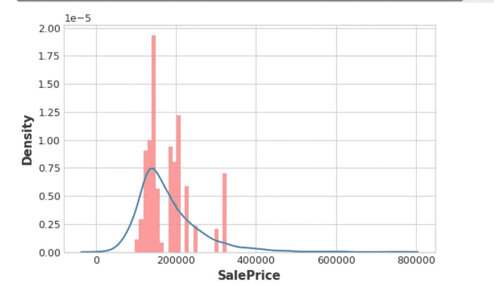
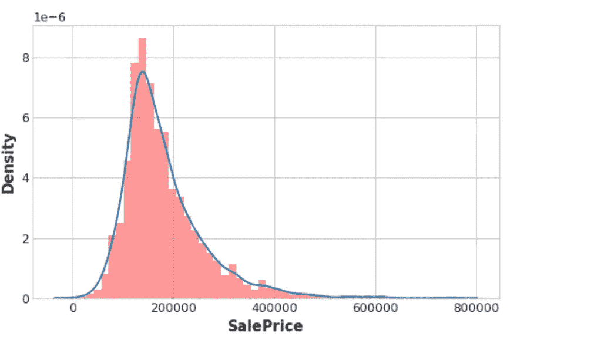

# 特征工程中的目标编码

> 原文：<https://medium.com/geekculture/target-encoding-in-feature-engineering-bc7b738026ce?source=collection_archive---------12----------------------->


Photo by [Arseny Togulev](https://unsplash.com/@tetrakiss?utm_source=medium&utm_medium=referral) on [Unsplash](https://unsplash.com?utm_source=medium&utm_medium=referral)

本文将解释**目标编码**的概念，它在**特征工程**中的意义，以及代码实现。

这是我过去两周上传的**特征工程**系列的最后一部分。在**目标编码**的最后部分，我们将处理**分类特征**而不是**数字特征**。这是一种将类别编码为数字的技术，就像 **one-hot 或标签编码**，它也使用**目标**来创建编码。这就是为什么它属于**监督** **特征工程**技术的范畴。

## **目标编码的用例**

目标编码非常适合:

**高基数特性**:具有**大量类别的特性**编码起来会很麻烦:一个**单热编码**会产生太多的特性和替代方案，比如标签编码，可能不适合那个特性。一个**目标编码**使用特性最重要的属性:它与目标的**关系，为类别导出数字。**

**领域驱动的特性**:根据以前的经验，您可能会怀疑分类特性应该是重要的，即使它在特性度量中得分很低。目标编码有助于揭示一个特征真正的信息量。

## **目标编码的代码实现**

我们将通过探索[**Ames**](https://www.kaggle.com/c/house-prices-advanced-regression-techniques/data)**房价数据集来了解目标编码的应用。**

```
import matplotlib.pyplot as plt
import numpy as np
import pandas as pd
import seaborn as sns
import warnings
from category_encoders import MEstimateEncoder
from sklearn.model_selection import cross_val_score
from xgboost import XGBRegressor

# Set Matplotlib defaults
plt.style.use("seaborn-whitegrid")
plt.rc("figure", autolayout=True)
plt.rc(
    "axes",
    labelweight="bold",
    labelsize="large",
    titleweight="bold",
    titlesize=14,
    titlepad=10,
)
warnings.filterwarnings('ignore')

# Model scoring
def score_dataset(X, y, model=XGBRegressor()):
    # Label encoding for categoricals
    for colname in X.select_dtypes(["category", "object"]):
        X[colname], _ = X[colname].factorize()
    # Metric for Housing competition is RMSLE (Root Mean Squared Log Error)
    score = cross_val_score(
        model, X, y, cv=5, scoring="neg_mean_squared_log_error",
    )
    score = -1 * score.mean()
    score = np.sqrt(score)
    return score

df = pd.read_csv("ames.csv")
```

**上面的代码是我们在 [**PCA**](/geekculture/principal-component-analysis-pca-in-feature-engineering-472afa39c27d) 上一部分的代码。模型评分完成，在这种情况下也使用 **RMSLE** 。让我们选择**目标编码**可以应用到哪些特性。**类别特征**具有**大量类别** ( **高基数**)通常是很好的候选。**

```
df.select_dtypes(["object"]).nunique()

MSSubClass       16
MSZoning          7
Street            2
Alley             3
LotShape          4
LandContour       4
Utilities         3
LotConfig         5
LandSlope         3
Neighborhood     28
Condition1        9
Condition2        8
BldgType          5
HouseStyle        8
OverallQual      10
OverallCond       9
RoofStyle         6
RoofMatl          8
Exterior1st      16
Exterior2nd      17
MasVnrType        5
ExterQual         4
ExterCond         5
Foundation        6
BsmtQual          6
BsmtCond          6
BsmtExposure      5
BsmtFinType1      7
BsmtFinType2      7
Heating           6
HeatingQC         5
CentralAir        2
Electrical        6
KitchenQual       5
Functional        8
FireplaceQu       6
GarageType        7
GarageFinish      4
GarageQual        6
GarageCond        6
PavedDrive        3
PoolQC            5
Fence             5
MiscFeature       6
SaleType         10
SaleCondition     6
dtype: int64
```

**这里，**高基数**的要素是**邻域、ms 子类、外部第二、外部第一和销售类型。**现在检查其中一个特性的**类别数量**(假设**销售类型**)代码是。**

```
df["SaleType"].value_counts()

WD       2536
New       239
COD        87
ConLD      26
CWD        12
ConLI       9
ConLw       8
Oth         7
Con         5
VWD         1
Name: SaleType, dtype: int64
```

**目标编码被应用于特征。现在为了**避免过度拟合**，我们需要将编码器拟合到训练集中的数据上。**

```
# Encoding split
X_encode = df.sample(frac=0.20, random_state=0)
y_encode = X_encode.pop("SalePrice")

# Training split
X_pretrain = df.drop(X_encode.index)
y_train = X_pretrain.pop("SalePrice")
```

**将目标编码应用于分类特征的选择。在这种情况下使用平滑参数 **m=1** 。**

```
# Create the MEstimateEncoder
# Choose a set of features to encode and a value for m
encoder = MEstimateEncoder(
    cols=["Neighborhood"],
    m=1.0,
)

# Fit the encoder on the encoding split
encoder.fit(X_encode, y_encode)

# Encode the training split
X_train = encoder.transform(X_pretrain, y_train)
```

```
feature = encoder.cols

plt.figure(dpi=90)
ax = sns.distplot(y_train, kde=True, hist=False)
ax = sns.distplot(X_train[feature], color='r', ax=ax, hist=True, kde=False, norm_hist=True)
ax.set_xlabel("SalePrice");
```

****

**Distribution plot of encoding feature in comparison to the target(SalePrice) (image from Kaggle)**

**[**RMSLE**](https://www.quora.com/What-is-the-difference-between-an-RMSE-and-RMSLE-logarithmic-error-and-does-a-high-RMSE-imply-low-RMSLE) 编码数据集与基准数据集相比的得分。**

```
X = df.copy()
y = X.pop("SalePrice")
score_base = score_dataset(X, y)
score_new = score_dataset(X_train, y_train)

print(f"Baseline Score: {score_base:.4f} RMSLE")
print(f"Score with Encoding: {score_new:.4f} RMSLE")

Baseline Score: 0.1428 RMSLE
Score with Encoding: 0.1402 RMSLE 
```

**根据选择的特征，分数比基准分数差**。在这种情况下，通过编码获得的额外信息可能无法弥补编码所丢失的数据。****

**这里我们将探讨目标编码的**过拟合问题**。这将说明**训练适合目标编码器**对**训练集**提供的数据的重要性。**

**因此，让我们看看当我们在**相同的**数据集上**安装编码器和模型**时会发生什么。为了强调过度拟合会有多戏剧性，我们将对一个与销售价格没有关系的特征进行编码。**

```
# Try experimenting with the smoothing parameter m
# Try 0, 1, 5, 50
m = 5

X = df.copy()
y = X.pop('SalePrice')

# Create an uninformative feature
X["Count"] = range(len(X))
X["Count"][1] = 0  # actually need one duplicate value to circumvent error-checking in MEstimateEncoder

# fit and transform on the same dataset
encoder = MEstimateEncoder(cols="Count", m=m)
X = encoder.fit_transform(X, y)

# Results
score =  score_dataset(X, y)
print(f"Score: {score:.4f} RMSLE")

Score: 0.0291 RMSLE
```

```
plt.figure(dpi=90)
ax = sns.distplot(y, kde=True, hist=False)
ax = sns.distplot(X["Count"], color='r', ax=ax, hist=True, kde=False, norm_hist=True)
ax.set_xlabel("SalePrice");
```

****

**Distribution plot of Count in comparison to SalePrice (Image from Kaggle)**

****RMSLE** 这次有所改进，并且**分布图**与之前的情况相比也非常吻合。**

**由于**计数**从不具有任何重复值，所以平均编码的**计数**本质上是目标的精确副本。换句话说，**意味着编码**把一个完全没有意义的特征变成了**完美的特征**。**

**现在，这有效的唯一原因是我们**在我们用来**训练编码器**的同一套设备上训练 XGBoost** 。如果我们使用一个**保持集**来代替，这些“假”编码就不会转移到训练数据中。**

**因此，简而言之，当使用**目标编码器**时，使用**单独的数据集**用于**训练编码器和训练模型**非常重要。否则结果可能会很差！**

**这就是 Kaggle 整个 [**特色工程**](https://www.kaggle.com/learn/feature-engineering) 课程系列的结束。**的目标编码**部分是 [**这里的**](https://www.kaggle.com/code/ryanholbrook/target-encoding) 。**

**务必通过 [**这本笔记本**](https://www.kaggle.com/code/ryanholbrook/feature-engineering-for-house-prices/notebook) 和实验来更多地了解特征工程。这将有助于尝试现实生活中最近的 [**数据集**](https://archive.ics.uci.edu/ml/index.php) 。**

**请查阅我的其他 [**文章**](/@abhi2652254) ，说 [**嗨**](https://www.linkedin.com/in/obhinaba17/) **。**还有，看看我的 [**GitHub**](https://github.com/abhigyan631) **。如果你喜欢我的作品，你可以给我捐赠几杯咖啡，这样我就可以在写作的道路上不断提高内容的质量。****