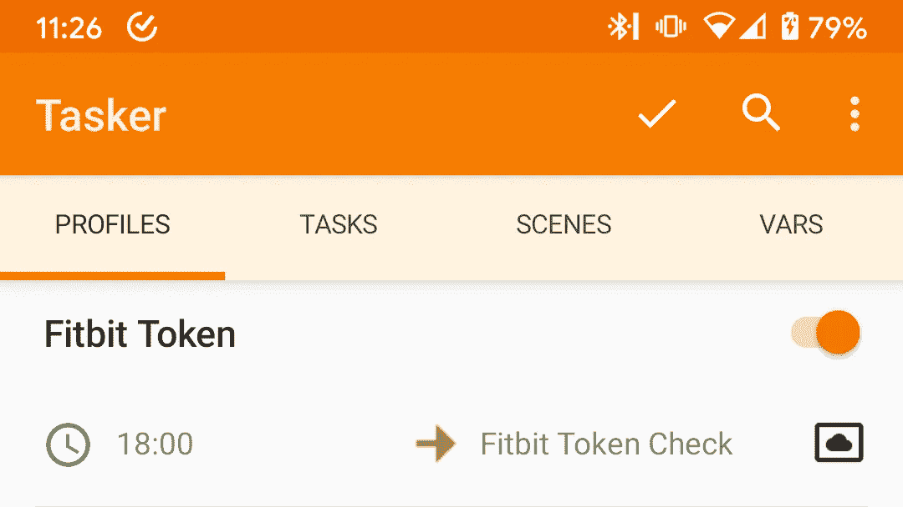
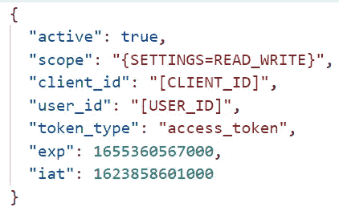
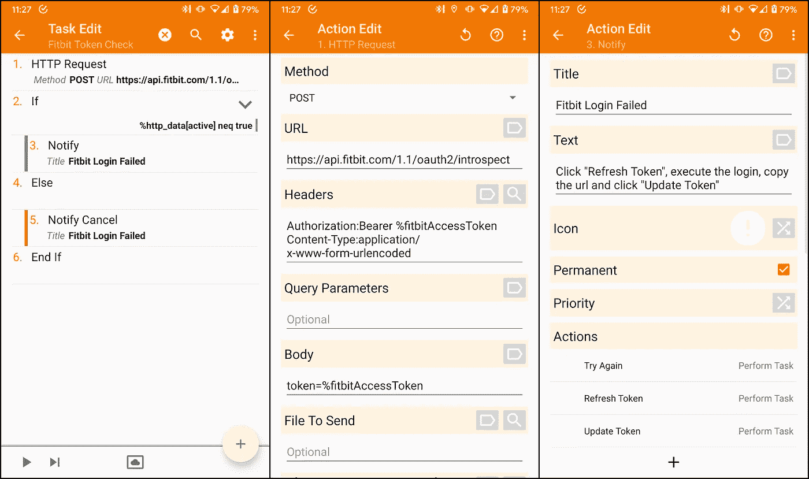
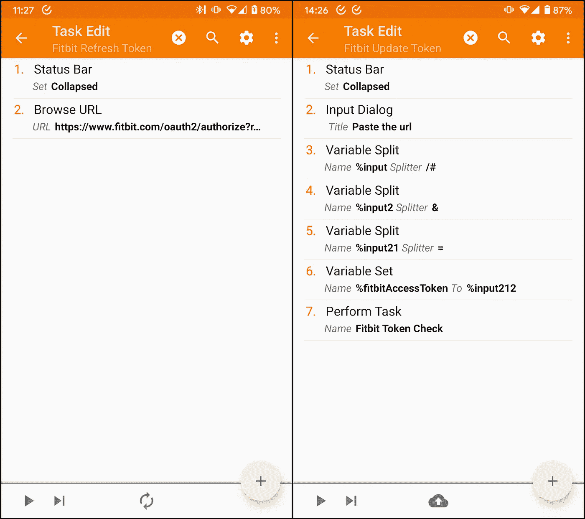
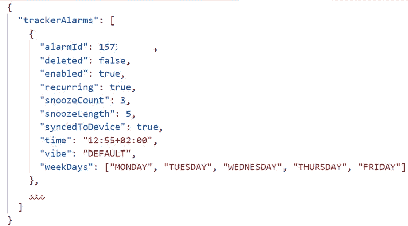
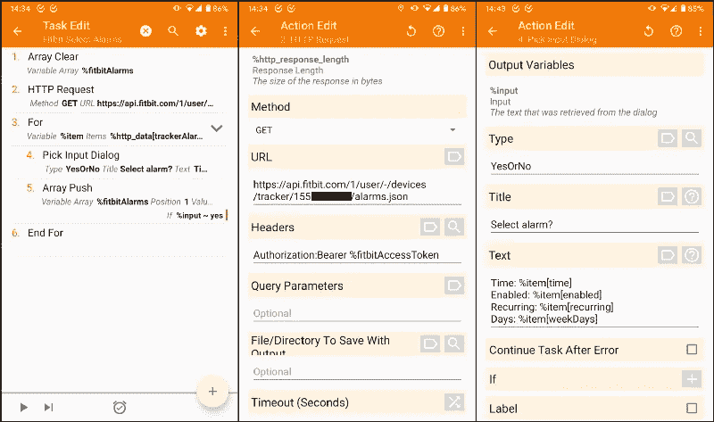
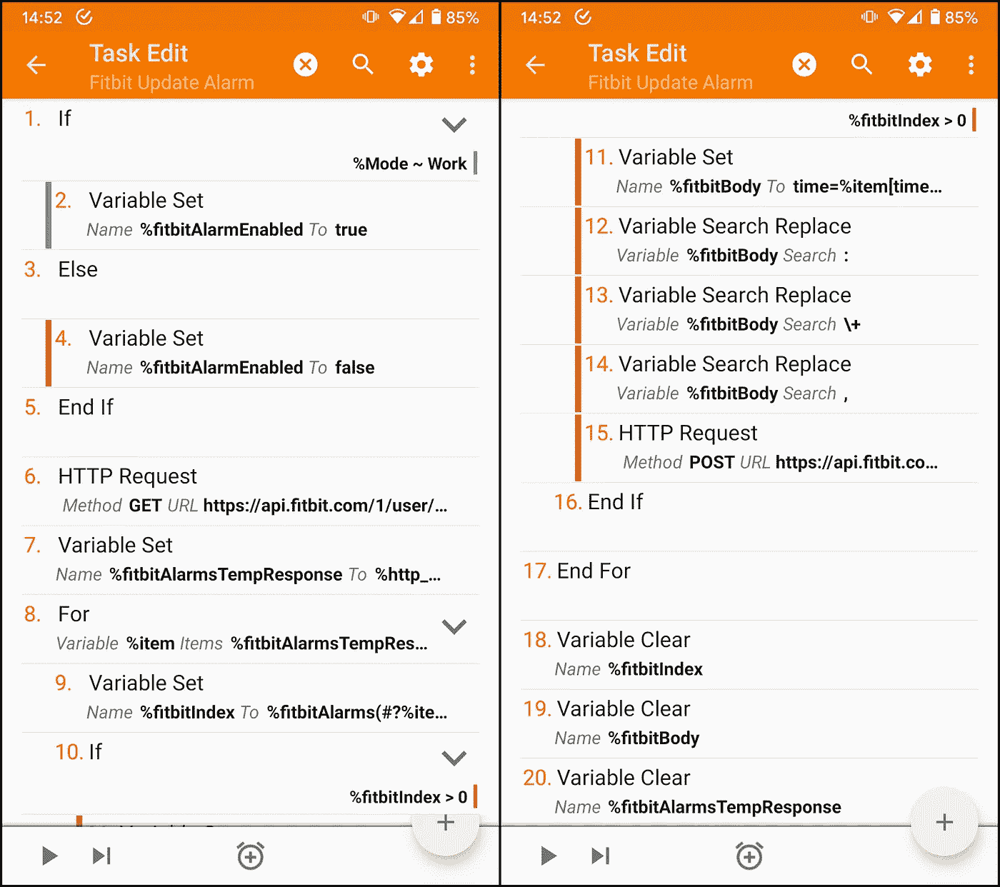
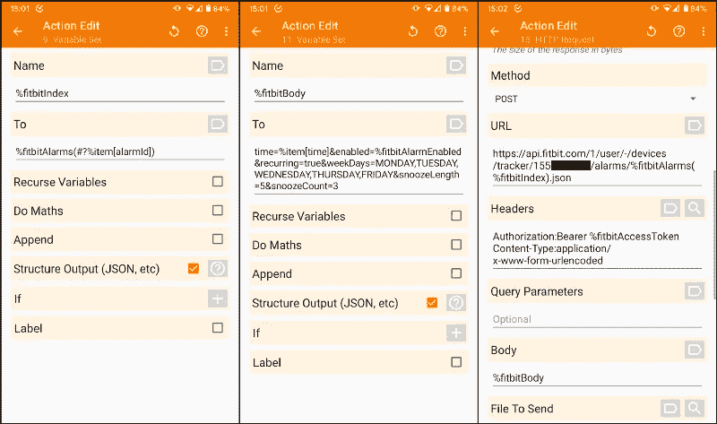

# Tasker 和 Fitbit 集成:任务概述

> 原文：<https://medium.com/geekculture/tasker-and-fitbit-integration-tasks-overview-4d752c027a77?source=collection_archive---------36----------------------->

在本文中，我将展示并详细解释我在故事 [Tasker 和 Fitbit Integration](/geekculture/tasker-and-fitbit-integration-4fc51d6eb186) 中描述的任务。

# 检查并更新 Fitbit 令牌

一个概要文件和两个任务是用来完成这些操作的元素。

该配置文件具有基于时间的简单条件。它调用 *Fitbit 令牌检查*任务。

*Fitbit 令牌检查*任务调用 Fitbit 来验证存储的令牌是否仍然有效。

该调用是对[自省 API](https://dev.fitbit.com/build/reference/web-api/explore/#/Auth/introspect) 的 HTTP 请求。请求的响应存储在 *%http_data* 中，是一个具有以下结构的 JSON。通过检查*有效*键的值，可以验证令牌有效性。

如果*的值为$。活动*为假，它显示一个具有三个动作的通知:

*   *再试一次*:重新启动任务。
*   *刷新令牌*:运行 *Fitbit 刷新令牌*任务。
*   *更新令牌*:运行 *Fitbit 更新令牌*任务。

In the second screenshot, the **%fitbitAccessToken** is a variable that stores the token.

*Fitbit 刷新令牌*任务打开带有 URL 的浏览器，以执行登录并获取令牌。网址如下， *%fitbitClientId* 为 app *clientId* 。

> [https://www.fitbit.com/oauth2/authorize?response_type=token&client _ id = % fitbitClientId&scope = settings&expires _ in = 31536000](https://www.fitbit.com/oauth2/authorize?response_type=token&client_id=%fitbitClientId&scope=settings&expires_in=31536000)

*Fitbit 更新令牌*任务打开一个输入，让用户在登录后粘贴 URL。然后，它拆分 URL 以获取令牌，并将其存储到 *%fitbitAccessToken* 。它完成调用 *Fitbit 令牌检查*任务。

The first screenshot is the ***Refresh Token*** *task; the second is the* ***Update Token*** task.

# 选择要切换的警报

*Fitbit 选择报警*是一个简单的任务，它查询[获取报警 API](https://dev.fitbit.com/build/reference/web-api/explore/#/Devices/getAlarms) 。请求的响应存储在 *%http_data* 中，是一个具有以下结构的 JSON。

在*$ http _ data[tracker alarms]()*数组上有一个用于周期的[，它询问用户应该管理哪些报警。它将被管理对象的*报警*保存在 *%fitbitAlarms* 数组变量中。](https://tasker.joaoapps.com/userguide/en/flowcontrol.html)

In the second screenshot, the **%fitbitAccessToken** is a variable that stores the token, and the black rectangle is the **%fitbitDeviceId**.

# 更新选定的警报

*Fitbit Update Alarm* 是一个定义是否启用或禁用告警的任务，调用 [Get Alarms API](https://dev.fitbit.com/build/reference/web-api/explore/#/Devices/getAlarms) 检索告警信息，调用 [Update Alarms API](https://dev.fitbit.com/build/reference/web-api/explore/#/Devices/updateAlarms) 更新告警。

在前五个动作中，它根据条件将 *%fitbitAlarmEnabled* 设置为 true。第六个动作执行与前面任务相同的请求，并将输出保存在*% fitbitAlarmsTempResponse*变量中。

在循环的*中，*第 9 个动作检查报警是否在 *%fitbitAlarms* 数组变量中，如果是，任务更新它。

The project you can download in the other story does not set the **%fitbitAlarmEnabled** variable as in this screenshot. Assign the value true or false to it before calling the task.

下图第一张截图是第 9 个动作。如果报警在数组中，它会在 *%fitbitIndex* 变量中将索引设置为大于 0 的数字。[变量](https://tasker.joaoapps.com/userguide/en/variables.html)用户指南中的*变量数组*部分详细解释了其工作原理。

第二张截图是第 11 个动作。它将*更新警报*调用的请求体设置为 *%fitbitBody* 变量。前一幅图像中从 12 到 14 的动作使用*变量搜索替换*动作将此变量转换为[编码 URL](https://en.wikipedia.org/wiki/Percent-encoding#Reserved_characters) 。

In the third screenshot ***%fitbitAlarms(%fitbitIndex)*** *stores the* ***alarmId*** *it is updating,* and the black rectangle is the **%fitbitDeviceId**.