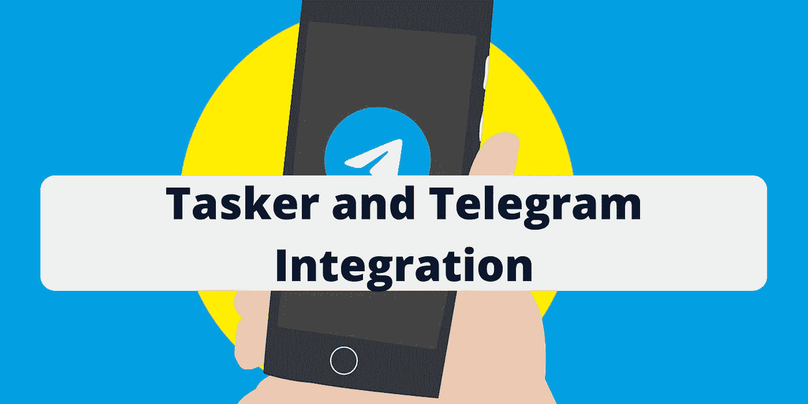
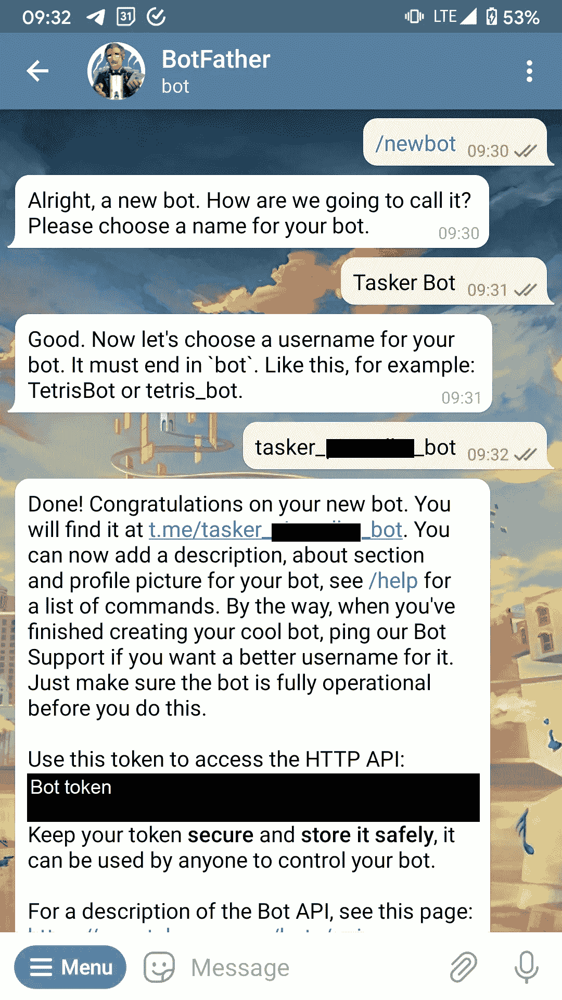
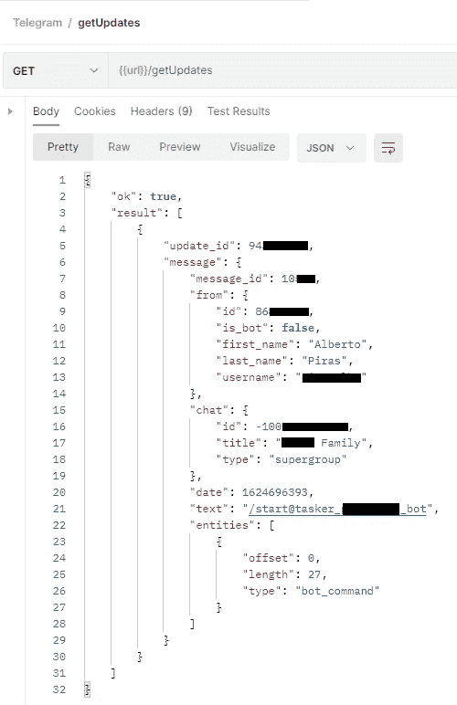
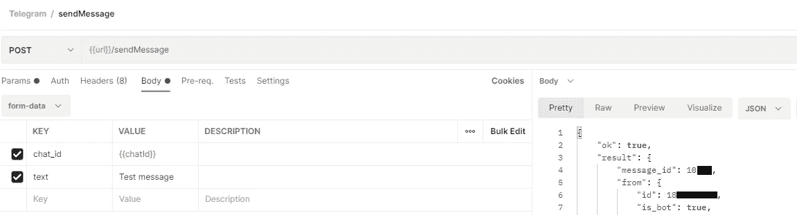
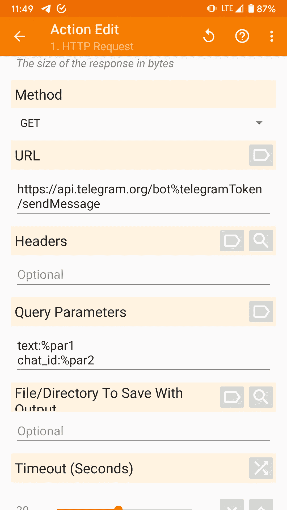
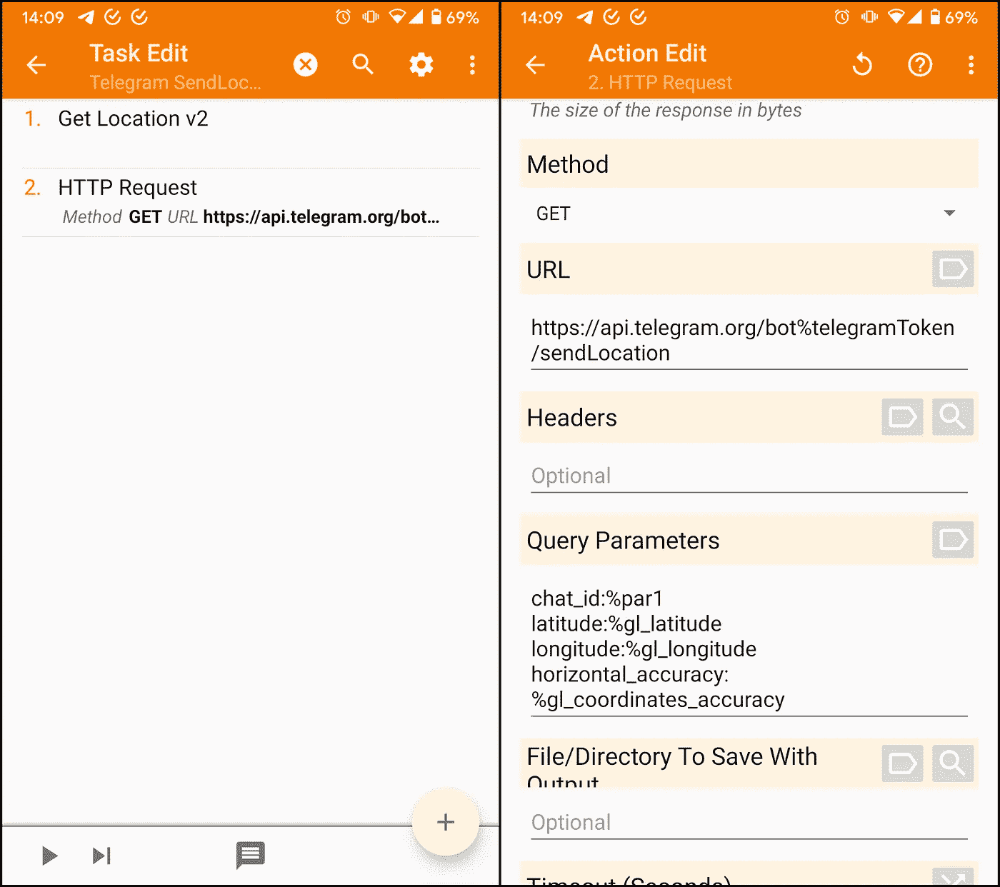
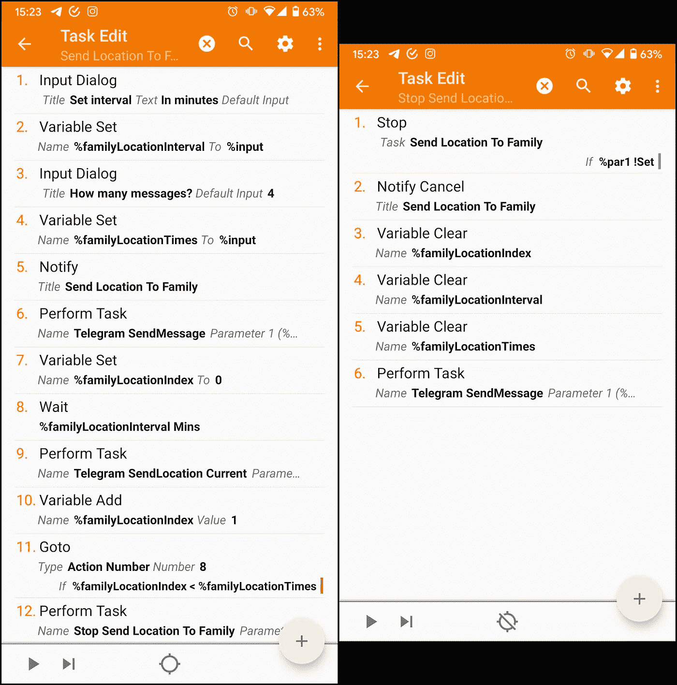
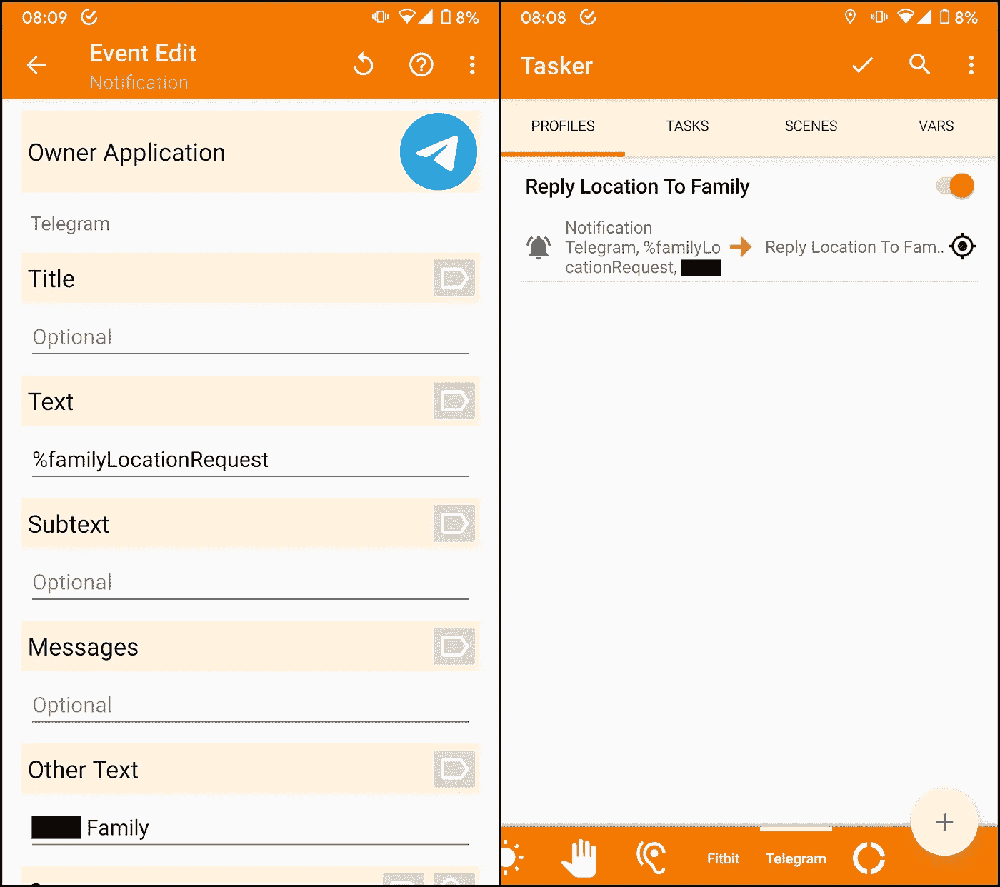

# Tasker 和电报集成

> 原文：<https://medium.com/geekculture/tasker-and-telegram-integration-278c53ab1d00?source=collection_archive---------3----------------------->

Foto di [Ümit Solmaz](https://pixabay.com/it/users/usnotv-3807928/?utm_source=link-attribution&amp;utm_medium=referral&amp;utm_campaign=image&amp;utm_content=5348490) da [Pixabay](https://pixabay.com/it/?utm_source=link-attribution&amp;utm_medium=referral&amp;utm_campaign=image&amp;utm_content=5348490)

今天，我将解释如何使用 Tasker 在电报上发送信息。我将特别展示发送短信的方法和您的位置。

我发现这有助于为我的家人安排信息，例如，当我到达某个地方时。

# 要求

*   Tasker 5.12.22
*   电报

我将展示的所有通话以及更多内容都可以在 Telegram 提供的 [Telegram Bot API](https://core.telegram.org/bots/api#making-requests) 网站上找到。

# 第一步。创建一个电报机器人

为了在电报上发送信息，我们需要使用[机器人父亲](https://t.me/botfather)创建一个机器人。你可以在这里找到如何使用它的官方指南。

通过发送命令 **/newbot** ，机器人父亲将指导你创建一个机器人。

在这个过程的最后，它将提供一个令牌来使用您的 bot 发送消息。

# 第二步。尝试 API 并创建任务

发送电报消息的 URL 结构如下。

> https://api.telegram.org/bot<token>/方法 _ 名称</token>

我已经创建了一个 Postman 项目来测试我需要的所有调用。你可以用[这个文件](https://gist.github.com/pirasalbe/299fdd541ffc694879eee014cfe2768e)导入它们。

## 获取您的 chatId

*chatId* 参数是任何调用的目标的唯一标识符，因此它总是必需的。

要找到你的 chatId，你可以通过电报向机器人发送信息。要找到一个群组/频道，你必须在聊天中发送这样的消息: **/start@bot_username** 。

发送消息后，您可以使用 [getUpdates](https://core.telegram.org/bots/api#getting-updates) 调用来查看您的 bot 收到的消息。

关键美元。result[]message . chat . id 具有您的 id 的值。

The URL is ***https://api.telegram.org/bot<token>***.

## 可用的方法

机器人可以发送几种信息。你可以在[可用方法](https://core.telegram.org/bots/api#available-methods)上阅读它们。

我用 *Postman* 创建了一些 **POST** 调用，但是 **GET** 调用在 Tasker 中更容易使用。电报允许两种方法。

> Bot API 中的所有方法都不区分大小写。我们支持 **GET** 和 **POST** HTTP 方法。使用 [URL 查询字符串](https://en.wikipedia.org/wiki/Query_string)或 *application/json* 或*application/x-www-form-urlencoded*或 *multipart/form-data* 在 Bot API 请求中传递参数。
> 成功调用后，将返回一个包含结果的 JSON-object。

## 方法发送消息

你需要发短信的电话是 [sendMessage](https://core.telegram.org/bots/api#sendmessage) 。在这里你可以看到如何使用它。

The URL is ***https://api.telegram.org/bot<token>***.

下面的截图展示了如何在 Tasker 中做同样的事情。

*%telegramToken* 是 *BotFather* 给我的令牌， *%par1* 和 *%par2* 是我的任务收到的参数。您可以在[执行任务](https://tasker.joaoapps.com/userguide/en/help/ah_run_task.html)用户指南中了解更多信息。

## 方法发送位置

您需要发送位置的电话是 [sendLocation](https://core.telegram.org/bots/api#sendlocation) 。在下面的截图中，你可以看到如何获得你的当前位置，并将其发送到你的聊天。

*%telegramToken* 是 *BotFather* 给我的令牌， *%par1* 是我的任务收到的参数，其他变量在[获取位置 v2](https://tasker.joaoapps.com/userguide/en/help/ah_get_current_location.html) 用户指南中解释。

你可以在这里下载我解释过的[的任务。](https://taskernet.com/shares/?user=AS35m8nzU8Z2OxB1WGqHbYHDLajdlq0DG%2B8k8f7L2XfQM3eHbHEAthA2xNvalA2%2FZaJvRZj2roE7ow%3D%3D&id=Project%3ATelegram#)

# 第三步。发挥创造力

现在，您可以创建更多的呼叫，并在任务中使用它们。

例如，我编写了这样一个任务，每隔 **m** 分钟发送我的位置信息 **n** 次。

左边的任务询问用户消息之间的间隔以及发送次数，然后给我发送一个通知，通知我运行另一个消息，然后开始通知小组。

右边的任务停止第一个任务并重置变量。

**编辑:**阅读[这篇文章](https://pirasalbe.medium.com/tasker-and-telegram-integration-live-location-e375c71da882?sk=72487a7f8f525626521ee366aeddaeb9)使用现场位置查看更新版本。

另一个例子是下面的配置文件，当我从我的家庭组收到带有特定关键字的消息时，它会发送我的位置。

On the left, the notification event; on the right, the profile.

在通知事件中，*文本*字段是关键字，而*其他文本*是组名。我用了*其他文本*而不是*标题*因为后者是确切的通知标题，而前者在标题中寻找一些单词，Telegram 根据消息的发送者改变标题。