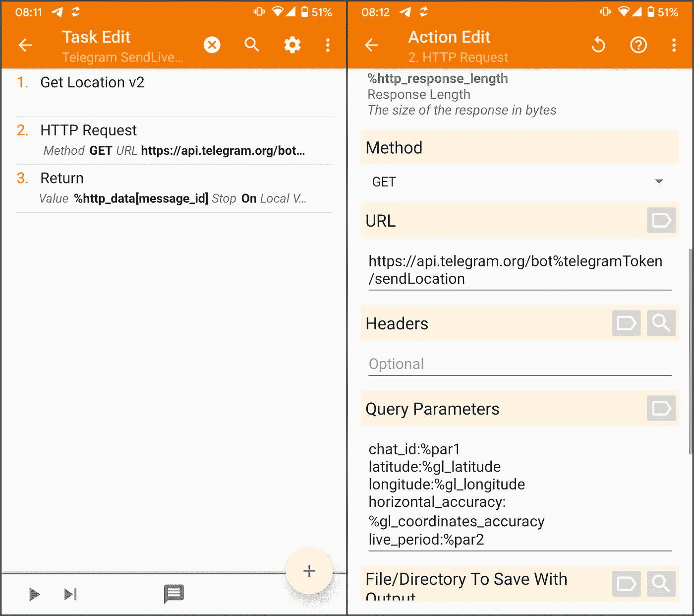
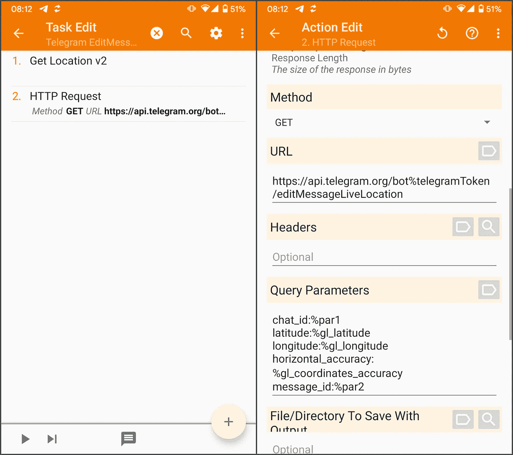
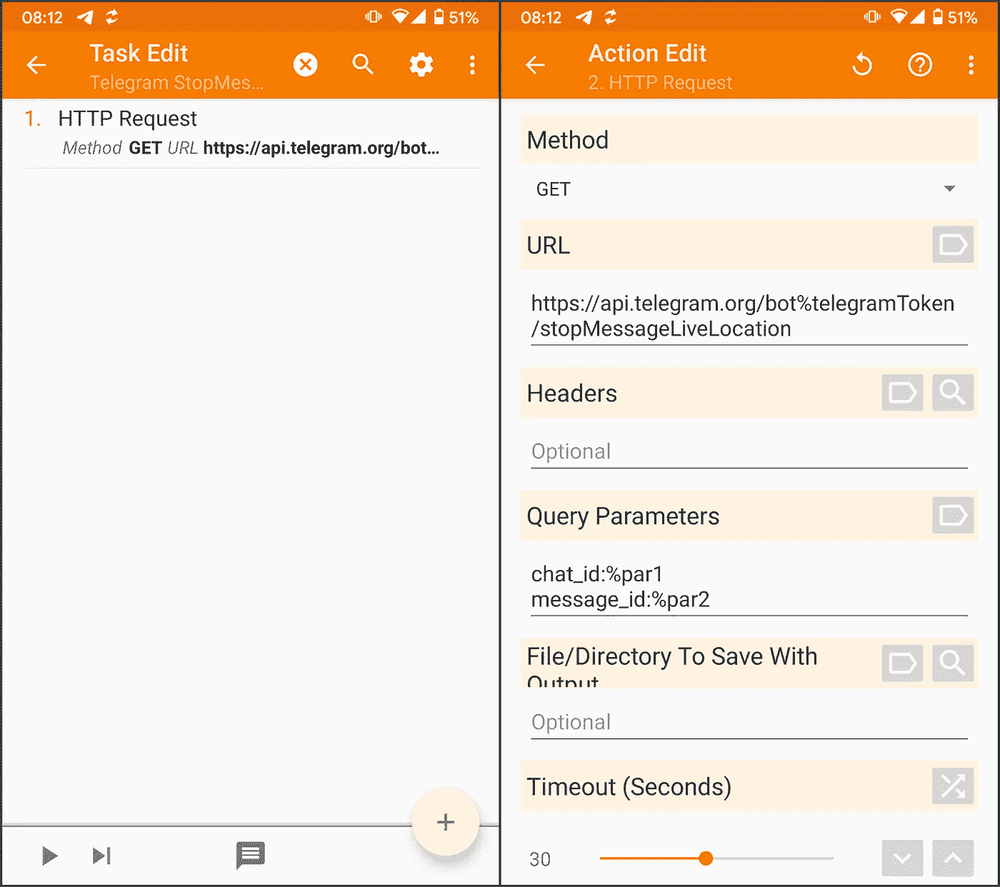
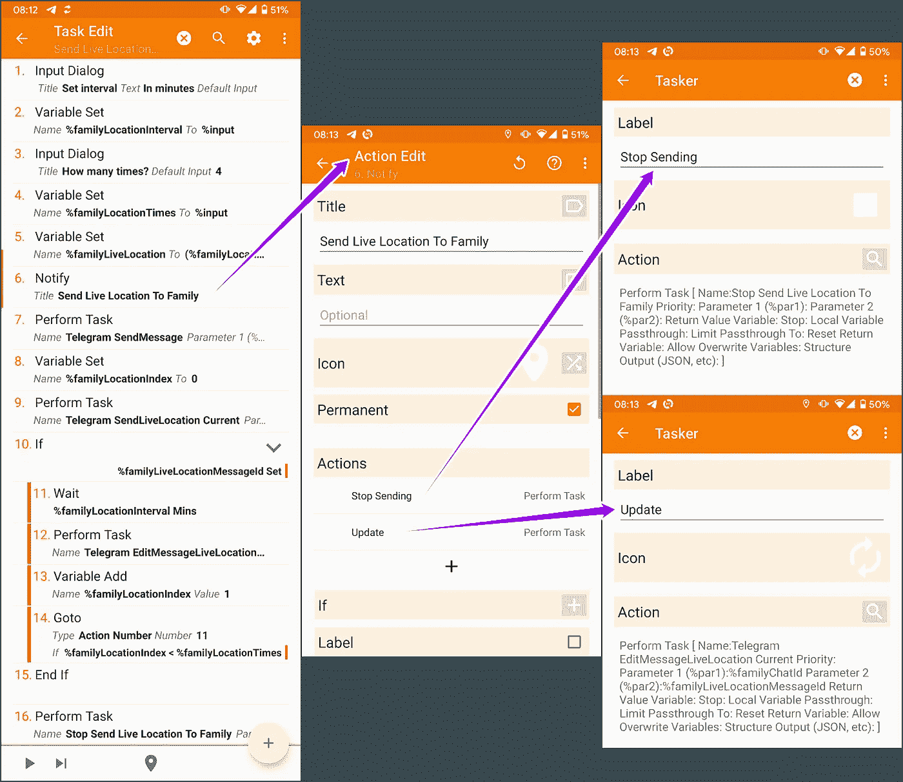
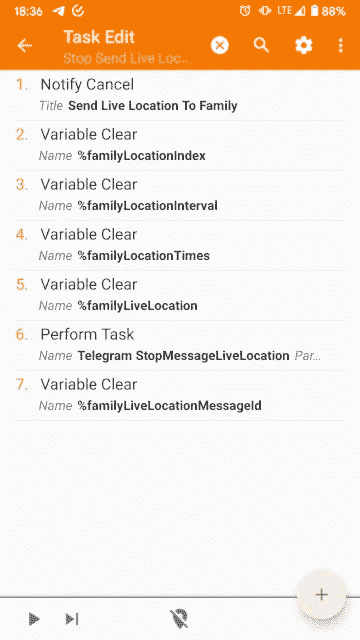

# Tasker 和电报集成:现场位置

> 原文：<https://medium.com/geekculture/tasker-and-telegram-integration-live-location-e375c71da882?source=collection_archive---------8----------------------->

在这个故事中，我将整合任务以共享您在 [Tasker 中显示的位置，并将电报整合](/geekculture/tasker-and-telegram-integration-278c53ab1d00?sk=3dd91b2aa2ebaf534c0688dc9d0a9335)改为发送实时位置。

要理解的基本事情是，机器人不能自己更新实时位置。任务不得不做。

# 电报机器人 API

您可以在下面的[可用方法](https://core.telegram.org/bots/api#available-methods)页面上找到所有使用的 API。

以下任务中的 *%par1* 是聊天标识。看了开头链接的文章就明白怎么弄了。

## 方法发送位置

调用 [sendLocation](https://core.telegram.org/bots/api#sendlocation) 具有可选参数 *live_period* ，允许我们通过指定 60 (1 分钟)和 86400 (24 小时)之间的正数秒数来发送实时位置。

在下面的截图中，可以看到调用这个方法的任务。

它执行以下操作:

1.  **获取位置 v2** :获取我的当前位置。您可以在[获取位置 v2](https://tasker.joaoapps.com/userguide/en/help/ah_get_current_location.html) 用户指南中了解更多详情。
2.  **HTTP 请求**:调用 API，如右图截图所示。 *%telegramToken* 是 *BotFather* 给我的令牌， *%par1* 和 *%par2* 是任务收到的参数。
3.  **Return** :给调用者任务一个值。使用 *%http_data[message_id]* ，它返回消息标识符，以便稍后更新和/或停止实时位置。

## 方法 editMessageLiveLocation

调用[editMessageLiveLocation](https://core.telegram.org/bots/api#editmessagelivelocation)允许机器人更新使用先前方法发送的实时位置。除了 *message_id* 是直播位置消息的标识符之外，其他参数完全相同。

在下面的截图中，可以看到调用这个方法的任务。

它执行以下操作:

1.  **获取位置 v2** :获取我的当前位置。
2.  **HTTP 请求**:调用右边截图所示的 API 更新 *%par2* 标识的 live location 消息。

## 方法 stopMessageLiveLocation

在 *live_period* 结束之前，调用 [stopMessageLiveLocation](https://core.telegram.org/bots/api#stopmessagelivelocation) 结束用第一种方法发送的 live 位置。它需要参数*消息 id* 。

在下面的截图中，可以看到调用这个方法的任务。

它执行一个调用 API 的 **HTTP 请求**，如右边截图所示，以结束由 *%par2* 标识的实时位置消息。

你可以在这里下载[讲解的所有任务。](https://taskernet.com/shares/?user=AS35m8nzU8Z2OxB1WGqHbYHDLajdlq0DG%2B8k8f7L2XfQM3eHbHEAthA2xNvalA2%2FZaJvRZj2roE7ow%3D%3D&id=Project%3ATelegram#)

# 发送实时位置任务

现在可以发送实时位置信息，更新它并最终停止它。

下面的任务询问用户应该多久更新一次实时位置，更新多少次，并显示一个通知，以便随时更新或停止更新。

它执行以下操作:

1.  **输入对话框**:询问用户多久更新一次位置，以分钟为单位。
2.  **变量集**:将用户输入保存在*% familyLocationInterval*变量中。
3.  **输入对话框**:询问用户应该更新多少次位置。
4.  **变量集**:将用户输入保存在 *%familyLocationTimes* 变量中。
5.  **变量集**:这样计算 *live_period* 参数:(*% familyLocationInterval**(*% familyLocationTimes+*1))* 60。它增加了一个时间，以确保慢速网络不会干扰。
6.  **通知**:发送通知，让用户手动更新和停止位置。
7.  **执行任务**:向群组发送电报消息，通知他们正在做什么。
8.  **变量集**:将 *%familyLocationIndex* 变量设置为 0。
9.  **执行任务**:使用之前解释的第一种方法将实时位置发送给群组。它将返回值保存在*% familyLocationMessageId*变量中。
10.  **If** :检查消息是否已发送，id 是否已返回。
11.  **等待:**等待*% familyLocationInterval*分钟。
12.  **执行任务**:使用*editMessageLiveLocation*方法更新实时位置。
13.  **变量添加**:将 *%familyLocationIndex* 变量增加 1。
14.  **转到**:如果索引小于次数，则回到位置 11 的**等待**动作。

最后一个操作调用以下任务。

它取消通知，清除变量，并使用 *stopMessageLiveLocation* 方法来停止实时位置消息。