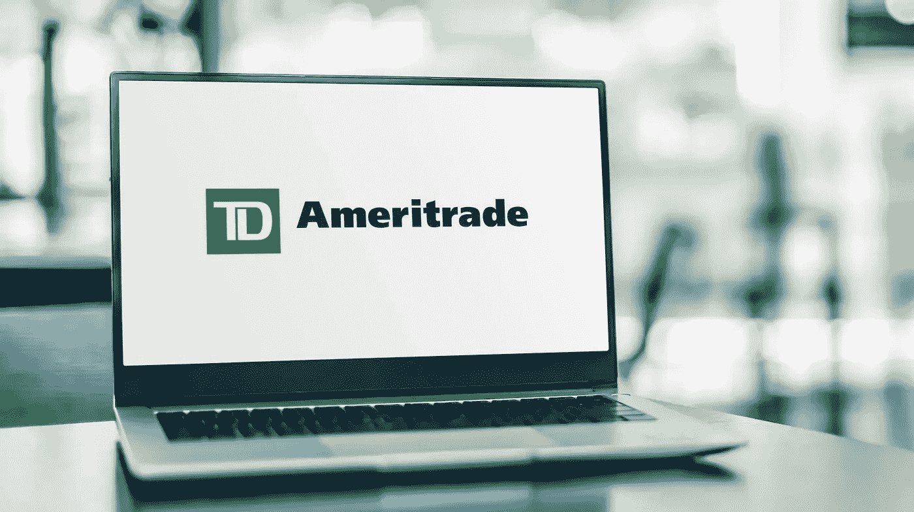
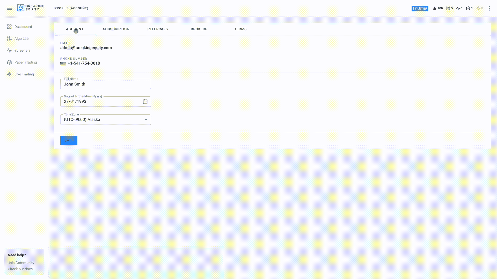
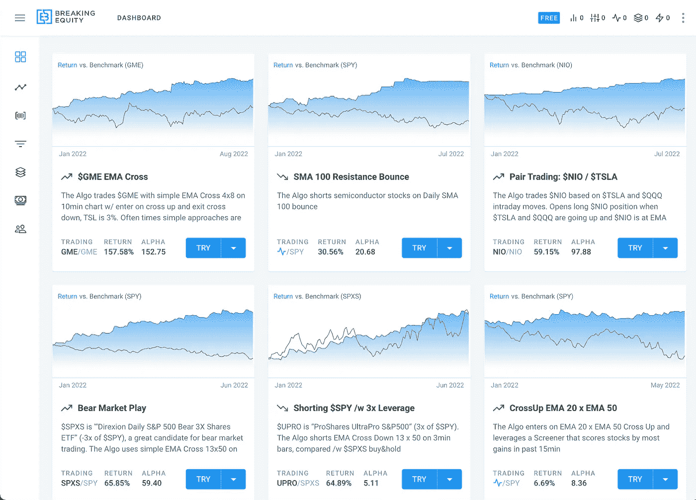

# TD Ameritrade 算法-交易指南

> 原文：<https://medium.com/geekculture/td-ameritrade-algo-trading-guide-6d470fb40e2?source=collection_archive---------10----------------------->

你来到这里，所以你应该听说过算法交易。这是第一步，也可能是最重要的一步，做得好。让我们深入了解一下用 TD Ameritrade 进行算法交易需要什么。

你需要的第一件事是一个 TD Ameritrade 账户。你不需要成为美国公民就能获得一个账户，这个过程非常简单。这里有一些例子:阿尔巴尼亚，巴哈马，加拿大，中国，古巴，埃及，伊朗，泰国，英国，梵蒂冈城。你可以在他们的网站上找到更多。

**你需要的第二件事**是为你的账户存钱。在美国，25，000 美元仍然是每日活跃交易的必要条件。你可能想要至少稍微多一点，以防有任何临时损失。

**第三件事**你需要一个打破公平算法实验室账户。如果你还没有注册[这里](https://app.breakingequity.com/#/signup)。

# 将 TD 帐户与打破平衡联系起来

一旦你有了一个账户，就去[https://app.breakingequity.com/#/profile/3](https://app.breakingequity.com/#/profile/3)然后简单地唱一下就可以链接到你的 TD 账户。就这样，你现在准备好和 TD Ameritrade 进行算法交易了。

# TD 不提供算法纸交易，但我们为您提供服务

TD Ameritrade 拥有世界级的演示交易平台 PaperMoney。这是最好的票据交易平台之一。坏消息是它不适用于算法交易。TD 不提供任何指导，如果他们打算让它工作或没有，但我们得到了你的掩护。打破股权有纸交易引擎，工程不依赖于任何经纪人的集成。

你可能想看看我们在[博客](https://breakingequity.com/blog/the-importance-of-backtesting-in-day-trading-routine)中关于回溯测试和纸上交易重要性的文章。

# 我在哪里可以买到 Algos？

有几个好地方。查看 [twitter 账户](https://twitter.com/BreakingEquity)，了解经过回溯测试的策略和示例。你也可以导航到[https://app.breakingequity.com/#/dashboard](https://app.breakingequity.com/#/dashboard)并选择其中一个例子。最后，你可以创建一个新的打破公平算法实验室。回溯测试、票据交易和 TD 交易直播都在同一个网络界面中进行。

永远记住，巨大的回报伴随着巨大的风险。亏损是不可避免的，但如果你管理好风险，你可以通过复合效应让你的账户增长。祝你的算法交易之旅好运。

永远记住，巨大的回报伴随着巨大的风险。亏损是不可避免的，但如果你管理好风险，你可以通过复合效应让你的账户增长。祝你的算法交易之旅好运。