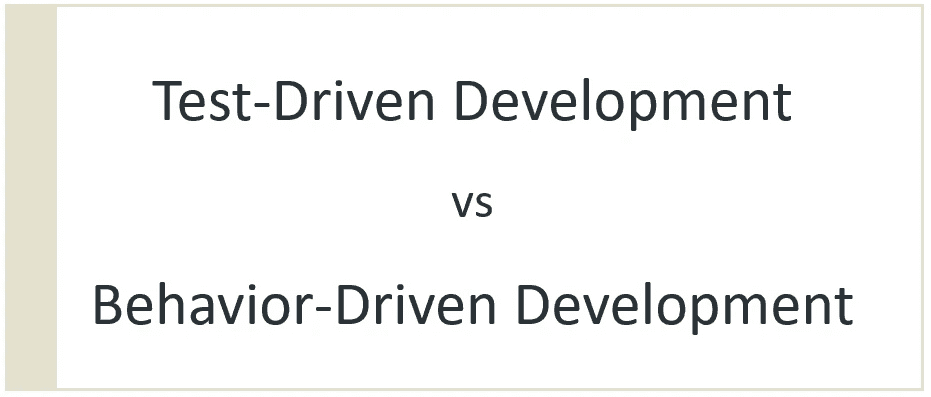

# TDD 与 BDD——有什么区别

> 原文：<https://medium.com/geekculture/tdd-vs-bdd-whats-the-difference-778b8f60c963?source=collection_archive---------12----------------------->

## 软件开发过程比较

随着程序规模的增大，无论是开发新功能还是重构、优化现有代码等。自动化测试可以用来确保程序的现有功能不受影响(旧的行为不被改变)，也可以减少开发过程中的错误数量。尤其是当…