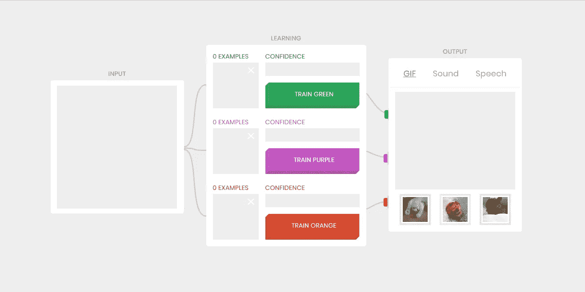
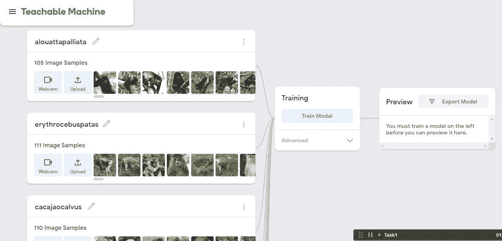
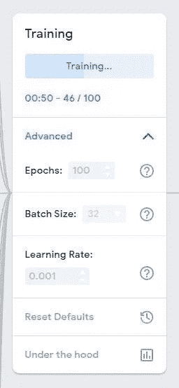
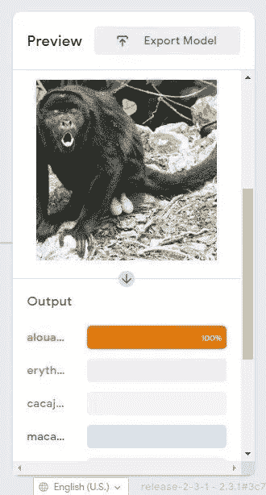
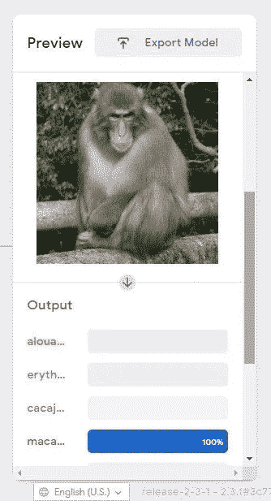
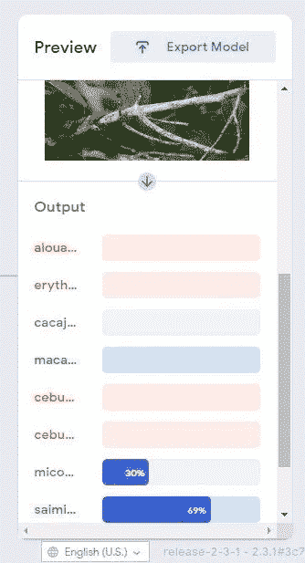
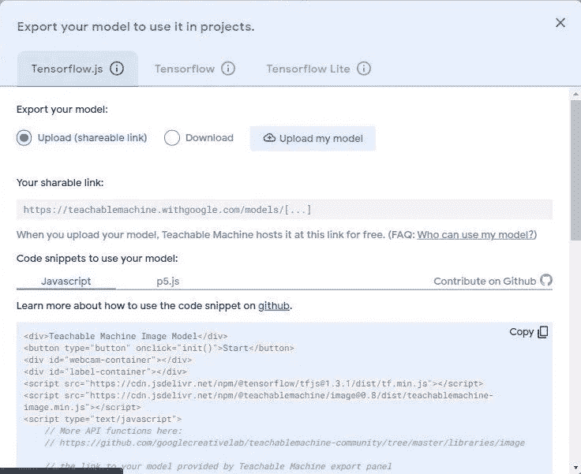

# 可教机器——谷歌的无代码机器学习平台

> 原文：<https://medium.com/geekculture/teachable-machine-googles-no-code-machine-learning-platform-3d8e9b21e891?source=collection_archive---------11----------------------->

# 概述:

Teachable Machine 是 Google 的 AutoML 平台，这是一个基于网络的工具，可以让每个人快速、轻松地创建机器学习模型。你可以建立模型来对图像、音频甚至姿势进行分类。完成同样的操作后，您可以下载训练好的模型并将其用于您的应用程序。

在本文中，我将带您创建一个机器学习模型来对猴子品种进行分类。这是一个基本的图像分类问题。因此，作为开始，我将转到可教机器并打开一个[图像项目。](http://teachablemachine.withgoogle.com/train/image)

# 标记数据:

首先，我们需要收集数据来训练模型。在本文中，我使用了 Kaggle 上公开的 10 种猴子的数据集。在 TeachableMachine 中，您也可以通过使用网络摄像头点击图片来创建数据集。

**数据集:** [10 种猴子](https://www.kaggle.com/slothkong/10-monkey-species)

为了开始训练机器学习模型，我们首先必须创建不同的类别或类来教授它。我将在这里为 10 种猴子创建 10 个类，并将图片上传到相应的类中。

现在我已经用样本图像准备好了所有的类，我可以进一步训练模型…

# 火车:

收集数据后，我们只需点击一个按钮就可以训练模型。在 TeachableMachine 的帮助下，不需要做任何平滑或预处理，Teachable Machine 将根据您提供的示例训练一个模型。所有的训练都在我们的浏览器中进行，所以一切都在我们的电脑上。然后立即对其进行测试，看看它是否能够按照先前用于训练的输入对新样本进行分类。

如上图所示，在高级选项中，我们可以根据我们的要求更改要训练的时期数、批量大小和学习率。在这个分类问题中，我将历元数设置为 100，批量大小设置为 32，学习率设置为默认值。

# 预览:

成功训练模型后，我们可以从预览窗格测试模型。在预览窗格中，有两个选项来预测图像类，如使用文件或网络摄像头。因此，在本例中，我们将选择作为一个文件，并尝试进行预测。

正如我们在上面的图中看到的，模型在测试数据集上表现得非常好。

# 导出:

我们还可以为我们的项目导出经过训练的模型:网站、应用程序等等。我们可以从这里免费下载我们的训练模型或在线托管它。

如上图所示，主要有三个选项，如 Tensorflow.js、Tensorflow 和 Tensorflow Lite。因此，我们可以根据自己的需求导出或下载我们的模型。

# 在可示教机器后面工作:

Teachable Machine 使用 [Tensorflow.js](https://www.tensorflow.org/js) ，一个 Javascript 的机器学习库，来训练和运行你在网络浏览器中制作的模型。看看 [GitHub](http://github.com/googlecreativelab/teachablemachine-community/) 上基于 Tensorflow.js 构建的可教机器库。

这些模型使用一种叫做**的技术，转移学习**。有一个预先训练好的神经网络，当你创建自己的类时，你可以想象你的类正在成为神经网络的最后一层或最后一步。具体来说，图像和姿态模型都是从预先训练的移动网络模型中学习的，而声音模型是建立在[语音命令](https://github.com/tensorflow/tfjs-models/tree/master/speech-commands)上的。

# 优势:

1.易于培训和部署。

2.训练模型花费的时间非常少。

3.开源，所以我们可以玩多个类。

4.现在简单的步骤，如 ML knowledge 要求，即使一个孩子想做一个模型，然后他可以在新的例子上检查它。

# 缺点:

有些情况下，您的模型可能不会按照您想要的方式工作。以下是一些例子:

1.变化的背景/环境。

2.构建你的例子。

3.更换话筒/空间。

4.捕捉带有高噪声的音频样本。

5.理解偏差。

6.令人困惑的新例子。

# 源链接:

**项目链接:**[https://drive . Google . com/file/d/1 novty 9v 6 o 1 plzd 88 vukvecclxc 1 wvsj/view？usp =共享](https://drive.google.com/file/d/1nOCTY9V6o1PLzD88vUKveCClCxC1WVSJ/view?usp=sharing)