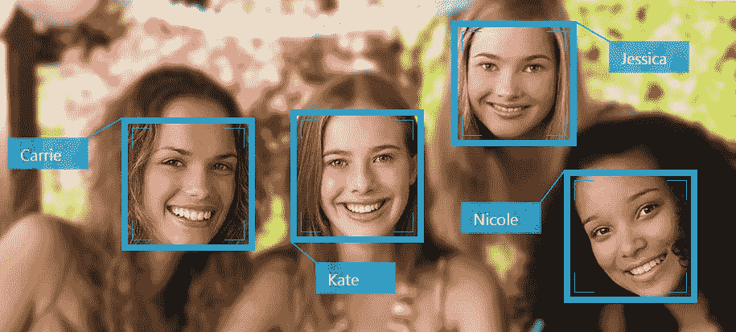
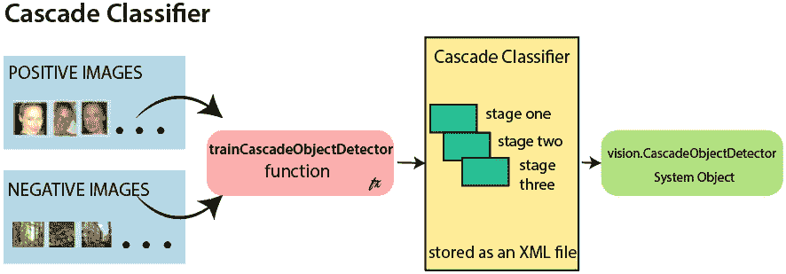
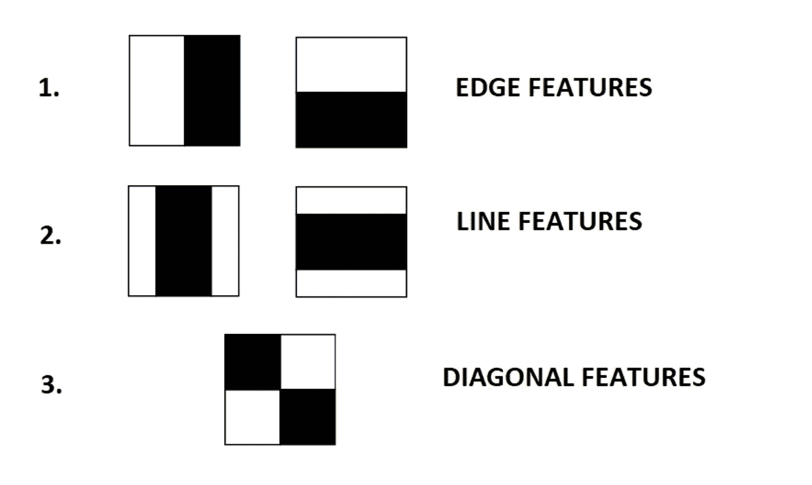
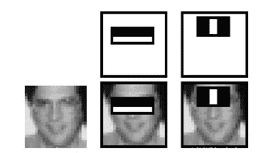
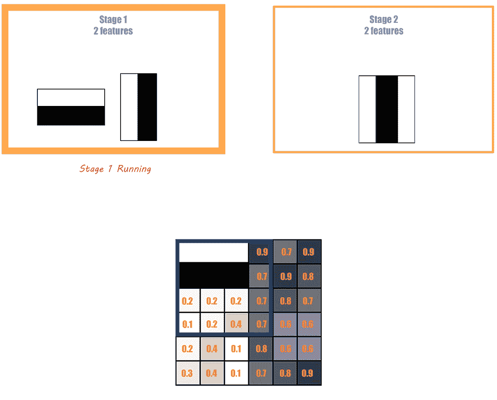

# 教我的电脑识别人脸。

> 原文：<https://medium.com/geekculture/teaching-my-computer-to-recognize-faces-a93a211ddad7?source=collection_archive---------54----------------------->



Example of Face Recognition

**人脸识别**是一项技术**全世界**🌎就现在！我相信你们都用过很多次了，不管是解锁手机的时候📱，或者在检查一个人的身份时(警察在某些情况下会用这个)。我知道人脸检测很酷，但它到底是什么？它是如何工作的？

## 什么是人脸识别，它是如何工作的？

人脸识别是通过一系列不同的步骤来识别**特定个人的** **身份**的一种方式。这些步骤在识别一张脸的过程中起着很大的作用，我将在下面列出:

**第一步:人脸检测-** 人脸识别的第一步是检测和定位人脸。这是非常重要的一步，因为如果计算机/机器甚至不知道什么是人脸，那么它将如何检测出准确的坐标📈和位置。这实际上是第一步的全部内容(我将在后面详细讨论)。

**第二步:捕捉人脸指纹-** 第二步是开始训练计算机/机器识别特定的个人。更确切的说，这一步是了解特定人的面部特征。这方面的例子有，观察一个人的脸型，找出一个人两眼之间的距离，等等……这些特征对每个人来说都是独一无二的，也是把你和其他人区分开来的东西。你可以把这些独特的面部特征，称为面纹。这就是第二步的主要内容。

**第三步:寻找匹配——**第三步是最后一步，这是你的人脸指纹与他人百万张照片进行比对的步骤。如果你的面部指纹与照片中的人的相匹配，那么计算机会确定结果。

> 注意:这三个步骤对人脸识别都很重要，但是本文将主要关注第一步。这是因为我的项目主要基于第一步，即人脸检测。

# 人脸检测

正如我上面所说的，我的项目主要是检测人脸。现在我已经在上面谈到了人脸检测，我认为是时候展示代码了。在此之前，我想让你们知道，在这个项目中，我使用了一个非常有趣的物体检测算法。我文章后面的大部分将会讨论这个算法是如何工作的。所以现在让我们深入代码！


Let’s show the code!

我会试着解释代码的每一步，让你们都容易理解！

## 完整代码

```
import cv2face_detection = cv2.CascadeClassifier(cv2.data.haarcascades + 'haarcascade_frontalface_default.xml')cap = cv2.VideoCapture(0)
cap.set(3,640)
cap.set(4,480)while True:
    success, img = cap.read()
    img_gray = cv2.cvtColor(img, cv2.COLOR_BGR2GRAY) faces = face_detection.detectMultiScale(img_gray, 1.3, 6) for (x,y,w,h) in faces:
       rect = cv2.rectangle(img,(x,y),(x+w,y+h),(255,0,0),4) cv2.putText(rect, 'Face', (x, y-10), cv2.FONT_HERSHEY_SIMPLEX, 0.9, (36,255,12), 2) cv2.imshow("Video", img) if cv2.waitKey(1) & 0xFF == ord('q'):
        break
```

## 导入库

```
import cv2
```

任何编码项目的第一步都是导入所有必要的库。如果您不知道，编码中的库基本上是一组资源/函数，当您将它们导入到项目中时，它们允许您使用特殊的函数。我在项目中使用的库是 open cv，这是一个处理实时视频和图像时使用的计算机视觉库。

## 级联分类器

```
face_detection = cv2.CascadeClassifier(cv2.data.haarcascades + 'haarcascade_frontalface_default.xml'
```

在这部分代码中，我使用了级联分类器。这是我的代码中非常重要的一部分(我很快会谈到这一点)，因为它在实际的人脸检测中起着很大的作用。它是一个以**" Haar cascade front face "**文件为输入，帮助计算机识别人脸和物体的区别的分类器。

## 捕捉视频

```
cap = cv2.VideoCapture(0)
cap.set(3,640)
cap.set(4,480)
```

在这里，我用公开简历捕捉我的现场视频。我输入一个 0，让我的电脑知道我想从我的笔记本电脑的摄像头捕捉我的视频。另外两行“cap.set”用于定义我稍后运行代码时将打开的窗口的尺寸。

## While 循环

```
while True:
    success, img = cap.read()
    img_gray = cv2.cvtColor(img, cv2.COLOR_BGR2GRAY) faces = face_detection.detectMultiScale(img_gray, 1.3, 6) for (x,y,w,h) in faces:
       rect = cv2.rectangle(img,(x,y),(x+w,y+h),(255,0,0),4) cv2.putText(rect, 'Face', (x, y-10), cv2.FONT_HERSHEY_SIMPLEX, 0.9, (36,255,12), 2) cv2.imshow("Video", img) if cv2.waitKey(1) & 0xFF == ord('q'):
        break
```

这是我的代码中非常重要的一部分，我将一起解释这一部分。首先，我在这里选择了一个 while 循环，因为我想显示实时视频。一个视频不能在 open cv 中单独显示，所以我把直播视频分割成**帧的图像**。由于 while 循环，这些图像将不断重复，并导致视频能够稍后显示。现在希望你已经理解了 while 循环的目的，所以我将开始解释循环内部的代码。

```
success, img = cap.read()
```

从**“success，img = cap.read()”开始，**这部分代码是在告诉计算机理解视频捕捉(意思是要读出来)，并引用为 img。另外，这里的**成功**是一个**布尔(真或假)**，让你知道计算机是否成功理解了视频捕获。

```
img_gray = cv2.cvtColor(img, cv2.COLOR_BGR2GRAY)
```

下一行有一个名为 **img_gray** 的变量，它将实时视频的每一帧转换成灰度。这样做的原因是为了让计算机能够轻松地检测到正在观看我的直播视频的人脸。但是，如果一幅图像有颜色，那么计算机处理事情就要复杂得多。因此，将实时视频帧/图像转换为灰度是一个好主意。

```
faces = face_detection.detectMultiScale(img_gray, 1.3, 6)
```

我现在要讲的这条线非常重要。这一行有两层意思。它可以让您知道实况视频中面部的**坐标，并使您能够检测不同大小的面部(多尺度)。只是如果你不知道我在说什么，这里是代码:**“faces = face _ detection . detect multi scale(img _ gray，1.3，6)”**。这个函数中的参数非常重要。我想大多数人都知道， **img_gray** 只是让计算机知道将所有这些应用到灰度图像，所以我将继续解释 **1.3** 和 **6** 在这里做什么。**

**1.3** 这里被称为**比例因子**，它让计算机知道，它应该**调整现场视频中每一帧**的大小，以便计算机更有效和准确地检测。

这里的 **6** 是**minneighborhood，**你需要知道的是，它在减少错误的面部检测方面发挥了作用。所以你可以说它结束了大部分的随机人脸检测，留下了准确的人脸检测。

```
for (x,y,w,h) in faces:
       rect = cv2.rectangle(img,(x,y),(x+w,y+h),(255,0,0),4) cv2.putText(rect, 'Face', (x, y-10), cv2.FONT_HERSHEY_SIMPLEX, 0.9, (36,255,12), 2)
```

现在我将开始谈论更容易和更有趣的部分！这里的代码非常简单，我们有一个 for 循环，它从 faces 变量中获取人脸的坐标。然后我们使用命令 **cv2.rectangle** 在脸部周围放置一个**边界框**。这里的参数也很简单，一个是定义厚度，另一个是颜色。其他人只是指定坐标，并围绕面绘制边界框。

画完包围盒，本想在上面贴个**标签**，说脸。这就是下一行要做的，它在我的边界框上放了一个标签。

```
cv2.imshow("Video", img)
```

好了，现在唯一剩下要做的事情就是实际显示所有发生的事情，这就是 **imshow 函数**所做的！它显示实时视频，同时检测人脸，并放置边界框。

```
if cv2.waitKey(1) & 0xFF == ord('q'):
        break
```

最后，我们来到了最后一部分。所以最后一部分是一个 if 语句，告诉电脑在按下 q 键的时候关闭直播视频的窗口！

# 哈尔级联分类器

哇，你还在这里？好吧，祝贺你🎉！现在我在这篇文章的最后部分，我告诉你，这将是非常有趣的！记得我在上面说过，我将如何谈论级联分类器，现在是时候了。所以请坐好，我来解释一下！



Diagram of a haar cascade classifier

好吧，首先让我们开始谈论哈尔卡斯克德。所以如果你不知道 **haar cascade** 是一个**物体检测算法**，它以人脸检测而闻名。这是一种原始的人脸检测技术，由 Paul Viola 和 Michael Jones 介绍给我们。

haar 级联算法需要一组正图像和一组负图像来训练**级联分类器**。用 haar 算法训练级联分类器是一个完整的过程。

这个过程需要三个主要因素:

1.  哈尔特征
2.  整体图像
3.  adaboost 算法
4.  阶段

当这个过程完成后，您最后需要实现级联分类器。在我更彻底地解释这个过程之后，我将回到这一点。

> 注意:我只是想说，在这个解释中，我不会包括数学。这是因为我希望这篇文章更多的是一个介绍，也因为我不能完全理解所有的数学。

## 哈尔特征



Haar Features

哈尔级联算法真正重要的部分是**哈尔特征**。这些是**黑白相邻矩形**，在**检测边缘**中起作用。这些特征类似于卷积神经网络中的一个**内核**(如果你不知道我在说什么，就忽略这个)，它们在图像周围移动，从左到右。当哈尔特征发现图像的一部分一边是暗的，另一边是亮的，它就可以判断出这是一个边缘。



Example of haar features being implemented

正如你在上面的图像中看到的，这是一个 haar 特征如何在人脸上实现的例子。希望现在你对 haar 特征有了更好的理解，因为我将继续讨论积分图像。

## 整体图像


Integral Image

**积分图像**是一个概念，允许您添加值，并以更简单有效的方式计算 haar 特征。这个我前面没讲，但是要检测边缘，haar 特征要加很多值。将每个 haar 特征的所有这些值相加，需要很多时间。这就是为什么积分图像是训练级联分类器过程中的一个重要部分。

## **AdaBoost**

现在我将谈论 **AdaBoost** ，这是 3d，也是训练级联分类器的最后步骤之一。如果你不知道，有超过 160，000 个以上的 haar 特性，并且它们都不是最有效的。这就是为什么我们使用 AdaBoost，这是一种获得最有效的 haar 特征的技术，因此我们可以使检测过程更加快速有效。

在这种技术中，每个 haar 特征在图像上实现，并且产生最低错误率的特征被选择在检测人脸时使用。

是啊。这是 Adaboost，所以现在我将转移到阶段。

## 阶段



Stages Exmaple

为了检测一张脸，正如我所说的，我们必须使用 haar 特征，即使在我们使用 AdaBoost 之后，还剩下大约 6000 个特征。为了使这个过程更加简单有效，我们使用了所谓的**阶段**。

我们有阶段，其中每个阶段都有一组实现到窗口(图像的一部分)的功能。随着阶段的推移，更复杂的 haar 特性被实现。这意味着每个阶段都使用更复杂的功能。等等，什么？这如何使流程更加高效？

这使得该过程更有效，因为如果窗口在一个阶段中没有检测到任何东西，那么它就移动到下一个阶段，所以它花费更多的时间来使用实际人脸上的特征，所以人脸检测更快。尽管如此，如果 haar 特征检测到该窗口中的边缘，那么该阶段被声明为**“通过”**，并且您可以继续到下一个阶段(为了更好地理解，请看上面的 gif)。

## 级联分类器的实现

好了，现在要做的就是实际实现级联分类器！经过训练的模型存储为 xml 文件格式，可用于对实时视频中的人脸进行实际分类。

# 训练你自己的哈尔瀑布

haar cascade 文件并不适用于所有情况。因此，如果您想为您的项目使用级联分类器，您可以创建自己的 haar 级联文件！实际上，我原本打算这么做，但是由于一些问题，我没能实现它。

我不打算深入探讨这个问题，但如果感兴趣，请查看:

[](https://docs.opencv.org/3.4/dc/d88/tutorial_traincascade.html) [## OpenCV:级联分类器训练

### 上一篇教程:级联分类器与弱分类器的增强级联一起工作包括两个主要阶段

docs.opencv.org](https://docs.opencv.org/3.4/dc/d88/tutorial_traincascade.html) [](https://amin-ahmadi.com/cascade-trainer-gui/) [## 级联训练器 GUI - Amin

### 级联训练器 GUI 1。介绍级联培训师图形用户界面是一个程序，可以用来培训，测试和改善…

amin-ahmadi.com](https://amin-ahmadi.com/cascade-trainer-gui/) 

# 社交+参考+结论👋

好了，这就是这篇文章的全部内容！希望你喜欢，并学到了新的东西！如果你喜欢这篇文章，那么考虑留下一个掌声，并评论你可能有的任何反馈:)

## 参考

在这里，我只想列出一些我用作参考的文章。

[](/analytics-vidhya/haar-cascades-explained-38210e57970d) [## 哈尔喀特解释道

### 简要介绍哈尔级联，它们的应用，以及它们如何在代码中实现。

medium.com](/analytics-vidhya/haar-cascades-explained-38210e57970d) [](https://towardsdatascience.com/face-detection-with-haar-cascade-727f68dafd08) [## 基于哈尔级联的人脸检测

### 探索即使在深度学习时代也被证明具有挑战性的有点老的算法

towardsdatascience.com](https://towardsdatascience.com/face-detection-with-haar-cascade-727f68dafd08) [](https://www.kaspersky.com/resource-center/definitions/what-is-facial-recognition) [## 什么是面部识别-定义和解释

### 面部识别是一种通过面部识别或确认个人身份的方法。面部识别…

www.kaspersky.com](https://www.kaspersky.com/resource-center/definitions/what-is-facial-recognition) 

## 社会

[](https://www.linkedin.com/in/yajat-mittal-82941b20a/) [## Yajat Mittal -知识社会的创新者-知识社会(TKS) | LinkedIn

### 你好。我是 Yajat，一个 12 岁的知识社会的创新者。目前，我正在探索许多不同的…

www.linkedin.com](https://www.linkedin.com/in/yajat-mittal-82941b20a/) 

电子邮件:mittalyajat@gmail.com