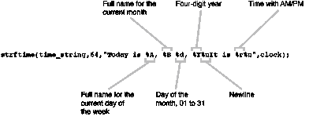

# 教你的电脑懂礼貌

> 原文：<https://medium.com/geekculture/teaching-your-computer-to-be-polite-3ccf5caba7f7?source=collection_archive---------17----------------------->

## 引用

## *出自* [*微型 C 项目*](https://www.manning.com/books/tiny-c-projects?utm_source=medium&utm_medium=referral&utm_campaign=book_gookin_tiny_9_29_21) *出自丹·古金*


Photo by [Lorenzo Herrera](https://unsplash.com/@lorenzoherrera?utm_source=unsplash&utm_medium=referral&utm_content=creditCopyText) on [Unsplash](https://unsplash.com/s/photos/computers?utm_source=unsplash&utm_medium=referral&utm_content=creditCopyText)

*这篇文章讲述了如何编写一个 C 程序，当你启动电脑时，它会根据一天中的不同时间为你写一个合适的问候语。*

在[manning.com](https://www.manning.com/books/tiny-c-projects?utm_source=medium&utm_medium=referral&utm_campaign=book_gookin_tiny_9_29_21)结账时，在折扣代码框中输入 **fccgookin** 即可享受 35%的折扣。

## **一句简单的问候**

所有主要的编程项目开始时都很简单，并且有发展成复杂丑陋的怪物的趋势。我敢肯定，Excel 最初是作为一个快速而肮脏的文本模式计算器而存在的，现在看看它。无论如何，不要在开始一个项目的时候就一次完成所有需要的东西，这是很好的编程实践。不，最好是增长项目，从简单愚蠢的事情开始，这是本节的重点。

## **编码问候**

你能做的最基本的问候程序是一个简单的愚蠢的 *Hello World* 程序的反流，它引领着自摩西以来每一本 C 编程入门书籍的页面。清单 1 展示了您可以为问候程序编写的版本。

**清单 1 greet01_basic.c**

```
#include <stdio.h>

 int main()
 {
     printf("Hello, Dan!\n");

     return(0);
 }
```

不要建。不要跑。如果你这样做了，使用这个命令构建一个名为 *greetings* 的程序:

```
clang -Wall greet01_basic.c -o greetings
```

你可以用你最喜欢的但不太好的编译器来代替`clang`。成功后，产生的程序被命名为`greetings`。将该程序设置到 shell 的启动脚本中，添加最后一行，如下所示:

```
Greetings
```

确保在程序名前面加上路径名，或者是完整的路径名，如下所示:

```
/home/dang/bin/greetings
```

或相对路径名:

```
~/bin/greetings
```

启动脚本不能神奇地定位程序文件，除非您指定一个路径，比如到我的个人~/bin 目录，如示例所示。(我还使用我的 shell 启动脚本将我的个人~/bin 目录放在搜索路径上——这是另一本书中找到的另一个 Linux 技巧。)

更新启动脚本后，您打开的下一个终端窗口将运行一个启动脚本，该脚本输出以下行，让您的一天更加愉快:

```
Hello, Dan!
```

如果你的名字不是丹，那么这种问候与其说令人愉快，不如说令人困惑。

## **增加一个名字作为参数**

最初版本的*问候*程序是不灵活的。这可能就是为什么你没有编码它，而是急于用一些定制来修改它。

考虑清单 2 中提供的适度改进。对代码的这一更新允许您用一个参数来表示程序，从而使它更加灵活。

**清单 2 greet02_basic.c**

```
#include <stdio.h>

 int main(int argc, char *argv[])
 {
     if( argc<2)    #A
         puts("Hello, you handsome beast!");
     else
         printf("Hello, %s!\n",argv[1]);    #B

     return(0);
 }
```

**#A 程序名的参数计数始终为 1。如果是，则输出默认消息。**

**#B 在程序名后输入的任何内容(只有一个单词)都表示为 argv[1]并在此输出。**

将这些代码构建成一个程序，并将其插入到您的 shell 的启动脚本中，正如在古代卷轴以及前面的章节中所写的那样。

```
greetings Danny
```

现在，当您打开新的终端窗口时，程序会输出以下消息:

```
Hello, Danny!
```

这个新消息比原来的要乐观得多，但仍需要一些改进。

## **一天中的时间**

每当我启动电脑时，我为旧的 DOS 电脑编写的第一批程序中的一个就会向我打招呼。遗憾的是，这个节目有点无聊。为了增加趣味，受我在现实生活中遇到的与人的口头交流的启发，我添加了代码来使问候反映一天中的时间。你也可以以不同的准确度来做这件事。

## **获取当前时间**

有人知道现在几点了吗？电脑可以猜测。它保持半精确的时间，因为它不时地与互联网时间服务器联系。否则，电脑的时钟每天都会慢几分钟。相信我，电脑制造的时钟很糟糕，但这个事实并不能阻止你从内部获取当前时间。

C 库中充斥着时间函数，它们都定义在`time.h`头文件中。标题中还定义了 *time_t* 数据类型。对于大多数编译器来说， *time_t* 数据类型是一个正整数值( *long* 数据类型， *printf()* 占位符`%ld`)，用于存储 Unix 纪元，即自 1970 年 1 月 1 日午夜以来流逝的秒数。

Unix epoch 在您的 greetings 程序中非常有用。例如，想象一下每天当你启动终端时，你看到以下快乐的消息时的喜悦:

```
Hello, Danny, it's 1624424373
```

当然， *time_t* 值必须被处理成更有用的东西。清单 1 显示了一些示例代码。注意许多时间函数，例如`time01.c`代码中使用的 *time()* 和 *ctime()* ，需要 *time_t* 变量的地址。是的，它们是指针。

**清单 3 time01.c**

```
#include <stdio.h>
 #include <time.h>    #A

 int main()
 {
     time_t now;

     time(&now);    #B
     printf("The computer thinks it's %ld\n",now);
     printf("%s",ctime(&now));    #C

     return(0);
 }
```

**#A 这个** `time.h` **头文件是必需的，以免编译器跟你生气。**

**# B*time()*函数需要 *time_t* 变量的地址，此处前缀为& address-of 运算符。**

函数需要一个指针参数，并返回一个附加了换行符的字符串。

**下面是结果程序的示例输出:**

```
The computer thinks it's 1624424373
 Tue Jun 22 21:59:33 2021
```

输出显示了自 1970 年以来的计时秒数。这个相同的值被函数 *ctime()* 接收，输出一个格式化的时间字符串。这个结果在您的问候语程序中可能是可以接受的，但是时间数据可以进一步定制。解开具体时间细节的关键在 *localtime()* 函数中，如清单 4 中的代码所示。

**清单 4 time02.c**

```
#include <stdio.h>
 #include <time.h>

 int main()
 {
     time_t now;
     struct tm *clock;    #A

     time(&now);
     clock = localtime(&now);
     puts("Time details:");
     printf(" Day of the year: %d\n",clock->tm_yday);
     printf(" Day of the week: %d\n",clock->tm_wday);    #B
     printf("            Year: %d\n",clock->tm_year+1900);    #C
     printf("           Month: %d\n",clock->tm_mon+1);    #D
     printf("Day of the month: %d\n",clock->tm_mday);
     printf("            Hour: %d\n",clock->tm_hour);
     printf("          Minute: %d\n",clock->tm_min);
     printf("          Second: %d\n",clock->tm_sec);

     return(0);
 }
```

**A#因为 *localtime()* 返回一个指针，所以最好将结构声明为指针。**

**B#周日一周的第一天为 0**

**C#必须将 1900 加到** `tm_year` **成员才能得到当前年份。你会忘记这一点。**

****D #成员范围从 0 到 11。****

**我用大量空格格式化了清单 4 中的代码，以便您可以容易地识别出`tm`结构的成员。这些变量表示 *localtime()* 函数从`time_t`值中提取的时间花絮。确保您记得调整一些值，如清单 2 所示:年份值`tm_year`必须增加 1900 以反映当前的有效年份；月份值`tm_mon`从零开始，而不是一。**

**输出是微不足道的，所以我不需要展示它——除非您给我一张 5 美元的支票。尽管如此，代码的目的是展示如何获得有用的时间信息，以便在终端问候中适当地加入一些内容。**

## ****在一天中的一般时间混合****

**我几年前为我的 DOS 电脑编写的程序叫做`GREET.COM`。它是我电脑的`AUTOEXEC.BAT`程序的一部分，每次我启动我那台值得信赖的 IBM 个人电脑时，它都会运行。因为我喜欢怀旧的东西，所以我保留了一份节目单。用 x86 汇编写的，还是在 DOSBox 下运行。啊，数字时代的甜蜜香水。闻起来像臭氧。**

**唉，我没有我的`GREET.COM`程序的源代码。根据记忆(和反汇编)，我看到代码获取一天中的当前时间并输出一个合适的时间问候:早上好、下午好或晚上好。你可以用同样的技巧编写代码——尽管是用 C 语言为你当前的计算机编写，而不是用 x86 汇编语言为一台老式的 IBM PC 编写。**

**清单 5 汇集了本章第一部分的资源，展示了我的旧 greetings 程序的当前版本。**

****清单 5 greet03_time.c****

```
#include <stdio.h>
 #include <time.h>

 int main(int argc, char *argv[])
 {
     time_t now;
     struct tm *clock;
     int hour;

     time(&now);
     clock = localtime(&now);
     hour = clock->tm_hour;    #A

     printf("Good ");
     if( hour < 12 )    #B
         printf("morning");
     else if( hour < 17 )    #C
         printf("afternoon");
     else    #D
         printf("evening");

     if( argc>1 )    #E
         printf(", %s",argv[1]);

     putchar('\n');

     return(0);
 }
```

****#A 这种说法是为了避免反复使用**`clock->tm_hour`**

******#B 中午之前，说“早上好”******

******#C 从中午到下午 5 点，说“下午好”******

******#D 否则，就是晚上了******

******#E 检查并输出第一个命令行参数******

****假设构建的程序名为 *greetings* ，用户键入 **Danny** 作为命令行参数，现在是下午 4 点，下面是代码的输出:****

```
**Good afternoon, Danny**
```

****这段代码有效地复制了我几十年前写的我的`GREET.COM`程序。输出是一个愉快的、与时间相关的问候，给出了当天的当前时间。****

****对于额外的幽默，您可以添加一个针对早期时间的测试，例如午夜到凌晨 4 点。输出一些异想天开的文本，如“工作到很晚？”或者“你还没睡吗？”哦，真滑稽！我希望你的两侧不疼。****

## ******添加具体时间信息******

****打开终端窗口时，另一种犒劳自己的方式是输出一个详细的时间字符串。完成这项任务的简单方法是输出问候语，后跟由 *ctime()* 函数生成的时间字符串。下面是两行相关的代码:****

```
**printf(“Good day, %s\n”,argv[1]);
 printf(“It’s %s”,ctime(&now);**
```

****这两条语句应该让您对代码的样子有所了解。尽管如此，该计划是懒惰的。最好包含 *strftime()* 函数，它根据您的规范格式化时间戳字符串。****

*****strftime()* 函数的工作方式类似于 *printf()* ，它使用一个特殊的字符串来格式化时间信息。该函数的输出保存在一个缓冲区中，您的代码可以在以后使用它。清单 6 中的代码演示了。****

******清单 6 greet04_time.c******

```
**#include <stdio.h>
 #include <time.h>

 int main(int argc, char *argv[])
 {
     time_t now;
     struct tm *clock;
     char time_string[64];    #A

     time(&now);
     clock = localtime(&now);    #B

     strftime(time_string,64,"Today is %A, %B %d, %Y%nIt is %r%n",clock);

     printf("Greetings");
     if( argc>1 )
         printf(", %s",argv[1]);
     printf("!\n%s",time_string);

     return(0);
 }**
```

******#存储由 *strftime()* 函数填充的字符串。******

******#B 您必须填充一个*local time()***`tm`**结构才能使 *strftime()* 函数工作。******

****你可以查看 *strftime()* 的 *man* 页面，发现所有有趣的占位符以及它们的作用。像 *printf()* 函数一样，占位符以一个`%`字符为前缀。格式化字符串中的任何其他文本按原样输出。下面是清单 6 中的 *strftime()* 语句的亮点:****

********

****输出反映了产生并存储在`time_string[]`缓冲器中的时间字符串。如本文前面所述，时间字符串出现在常规问候语之后:****

```
**Greetings, Danny!
 Today is Wednesday, June 23, 2021
 It is 04:24:47 PM**
```

****此时，有人可能会说，所有这些输出都可以通过使用 shell 脚本语言轻松完成，不管怎样，shell 脚本语言是 shell 启动和配置文件的母语。尽管如此，作为一名 C 程序员，你的工作是为问候语提供更多的洞察力和力量。当使用一种可悲的小 shell 脚本语言时，这样的添加是不可能的。****

****本文到此为止。如果你想了解这本书的更多信息，请点击这里查看。****