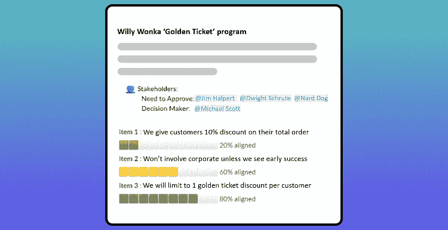
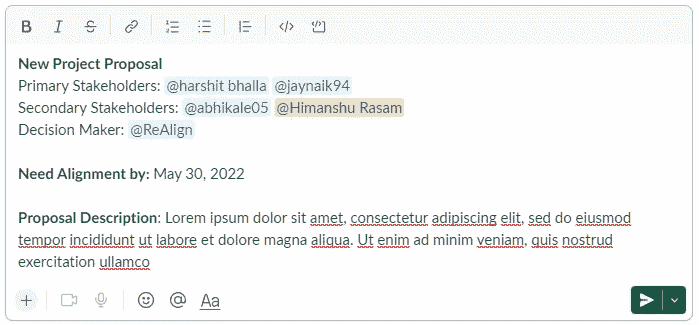
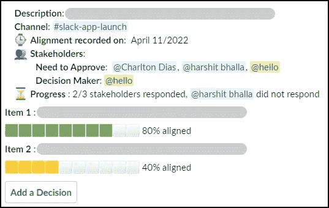

# 团队协调会议应该更多地关注澄清，而不是说服！

> 原文：<https://medium.com/geekculture/team-alignment-sessions-should-focus-more-on-clarifying-less-on-convincing-3d0de7eeab2d?source=collection_archive---------15----------------------->

## “混合团队和远程团队的协调”系列的第 3 部分

还记得上一次你收到关于你参与的一个项目的电子邮件/松弛线程寻求调整吗？你脑海中通常会出现的问题是- *我在这里被要求做什么？我的回答应该有多详细或简短，也就是说，我应该多强烈地表达我的观点？*

当寻求利益相关者的支持时，你应该清楚地说明你需要他们的什么样的反馈，以及做出决定的途径是什么。例如，发送“预读”或链接以前的(通常是长时间运行的)电子邮件线程对于上下文来说是很好的，但上下文不一定会转换为清晰。

Sample alignment proposal with clear stakeholder roles and items proposed

在本系列的前几篇文章中，我们讨论了[如何构建对齐冲刺](https://bootcamp.uxdesign.cc/how-alignment-sprints-can-help-remote-teams-stay-in-sync-f64aa8347ec9)，以及[如何写一份简明的建议书](/geekculture/how-to-run-alignment-sprints-64aa2091dbb8)。在这篇总结性文章中，我们将讨论如何使流程变得清晰，以及如何消除源于以下方面的协调摩擦:

*   利益相关者的等级不明确。
*   决策缺乏透明度。

以下各节重点介绍两个宽泛的概念:

1.  在协调过程中为利益相关者分配特定的角色。
2.  决策日志，用于记录某个决策的组成部分。

> 问:大多数团队在什么地方缺乏一致性？
> 
> 答:明确规划决策链中的角色

## 快速调整的重要角色

组织通常用于决策的两个框架是快速框架(通常有助于确定决策结构)和 RACI 框架(构建流程中关键利益相关者的可视化表示)。从这些[框架](https://www.indeed.com/career-advice/career-development/rapid-vs-raci#:~:text=RAPID%20and%20RACI%20are%20two,each%20stage%20of%20the%20process.)中获得灵感，您的调整冲刺应该有这 3 个关键角色:关键/主要利益相关者、次要利益相关者和决策者

Stakeholder roles overlaid on a cross-functional team structure

1.  **关键或主要利益相关者**:这些利益相关者是推进协调决策的关键贡献者。他们通常在项目中执行，或者负责项目的目标和关键结果(okr)。在你的 RACI 图表上，把他们想象成“负责任的”和“负责任的”成员。为了推进决策，您可以选择为关键利益相关者的一致性设置一个大约%的阈值(例如，如果至少 80%的关键利益相关者一致，您可以推进提案)。

> 提示 1: *尽管感觉每个人的一致都是必要的，但是避免给每个利益相关者分配“关键利益相关者”的角色。想一想提案结果会对哪些利益相关者产生最大的影响。*

2.**次要利益相关者:**这些利益相关者需要随时了解提案，但他们的一致性与关键利益相关者的一致性相比具有不同的权重。想想你的 RACI 图表上的“咨询”和“知情”成员。次要利益相关者的同意是必不可少的，但不应该减慢调整的速度。

3.**决策者**:这个人最终会签署导致后续行动的提议。建议决策链中只有一个决策者。但是，让决策者了解主要和次要利益相关者如何在您的提案上达成一致，以便他们做出明智的决策，这可能会有所帮助。

> 提示 2: *如果利益相关方的总数超过 10 个，进行* ***分阶段调整*** *可能会有所帮助，在这种情况下，建议将分阶段分发给您的主要和次要利益相关方。这有助于在早期识别重要的障碍和瓶颈，并按照重要性顺序处理任何反馈。*

## 付诸实践:将角色添加到您的协调提案中

我们现在要回顾一下从这篇文章和[上一篇文章](/geekculture/how-to-run-alignment-sprints-64aa2091dbb8)中学到的东西。发出协调建议时:

1.  清楚地陈述利益相关者的不同角色。
2.  起草一份简明扼要的提案(参考上一篇文章)。
3.  允许利益相关者以低调的方式做出回应(参考上一篇文章)。
4.  时间盒流程。

下面是在提案中添加利益相关者角色的示例。这给利益相关者一个清晰的概念，他们被要求做什么，他们的回答应该有多详细。

Tagging stakeholder roles on a slack post along with a sample proposal

一旦主要和次要利益相关者做出回应，项目/产品经理就可以跟进决策者。包括利益相关者如何回应向决策者提供额外数据以帮助减轻任何固有偏见的建议的信息。

Decision-maker can add a decision after understanding how the stakeholders aligned

> 提示 3: *对于你的关键利益相关者和决策者，建议一个候补成员或一个人在他们忙于其他项目时填补他们的角色。*

## 决策日志

决策日志应该能够为您提供 3 个关键问题的答案:

*   提案的目标是什么？
*   调整后做出了哪些决策？
*   决策的主要考虑因素是什么？

一个简单的决策日志可以是一个 excel 表格的 3 列，上面有 3 个标题。决策日志的目标应该是为将来再次做出决策的人提供有用的背景。这可能是一名新员工、项目的新利益相关者或者组织中正在处理类似问题的另一名员工。

做出特定决定的原因不需要很长很详细。它可以简单地用 1-2 行提到影响关键利益相关者或决策者推理的主要因素。

*   决策日志可以用于季度回顾。产品的当前状态是各种利益相关者做出的所有决策的总和。项目或产品经理的决策日志类似于开发人员用来调试代码的错误日志。
*   以可搜索和可查找的方式存储决策日志非常重要。如果决策停留在分发的文档中，它们往往会迷失在文档池或交流路径中。
*   尽管如此，拥有决策日志背后的意图不应该是指责或分配责任。发展一种基于决策日志来分配责任的文化可能会损害记录决策的真正目的，即带来透明度和诚实地记录决策。

Sample decision log from [Atlassian Decision Blueprint](https://confluence.atlassian.com/doc/decisions-blueprint-339739406.html)

## **结论**

关于混合和远程团队的团队联合的 3 部分系列到此结束。该工具包主要面向项目、产品、营销和工程经理，他们希望改进团队中的协调过程。您可以在这里查看本系列之前的文章:

1.  第 1 部分- [“协调冲刺”如何帮助远程团队保持同步](https://bootcamp.uxdesign.cc/how-alignment-sprints-can-help-remote-teams-stay-in-sync-f64aa8347ec9)
2.  第二部分- [如何跑“直线冲刺”？](/geekculture/how-to-run-alignment-sprints-64aa2091dbb8)

请随时在 LinkedIn 上与我联系，讨论您使用什么工具/流程来保持团队一致，以及您如何解决不一致的问题。