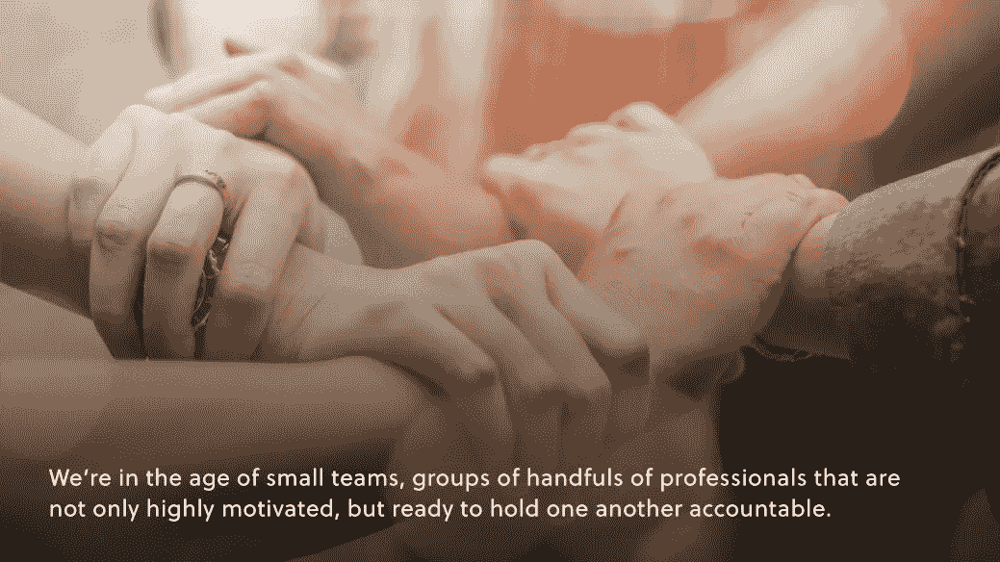

# 电子商务企业的新组织结构图

> 原文：<https://medium.com/geekculture/teams-the-golden-philosophy-for-e-commerce-785c7874e77b?source=collection_archive---------23----------------------->

## **小型企业组织**

众所周知，电子商务现象正在掀起波澜，T2 将会停留在 T3，而 T4 将会颠覆 T5。自然，这种颠覆包括采用新的商业战略和放弃传统模式，这是一些传统企业难以跟上的趋势。

新的战略和新的游戏计划是新的组织哲学——新的电子商务组织结构图——的有机前身。和往常一样，对于一个组织的具体情况，没有放之四海而皆准的标准，但是有几个关键趋势值得注意。

让我们来探索成功的电子商务企业如何彻底改变一个组织的哲学，以及如何让你的企业走向成功。

# 指挥链上的团队

随着自动化全面展开，庞大的部门正迅速成为过去。我们处在一个小团队的时代，一群专业人士不仅积极性很高，而且愿意让彼此承担责任。

我们也处于多学科合作的时代，这使得我们很容易摆脱传统指挥链的孤立地带。以前，营销部门和 IT 部门的成员可能从来不会交往，但现在，这两种技能必须协同工作，随时沟通。

将工作集中在一个团队结构中也有助于集中总体理念，这是整个行业中容易观察到的趋势。例如，市场营销曾经花费大量的时间和金钱来开发本地活动，而现代市场营销策略已经放弃了本地化而转向个性化。

当我们有技术、工具和技巧来迎合每一个特定的个人时，为什么还要迎合特定的地区呢？营销的这种演变使品牌能够同时更加集中精力和更加积极地瞄准目标，这是一个产生结果的秘诀。

# 分解图表

团队结构正在流行，传统的自上而下的指挥链正在过时，但仍然需要某种总体结构来确保商业模式平稳运行。具体情况将取决于每个品牌、环境和愿景，但我喜欢将理想的现代结构视为自然功能层级的两个部分。

**全球层级**与公司方向和基础设施有关。这些团队将通过他们的工作影响整个公司，或者为结构的其余部分奠定基础。

在这里，我们可能会找到致力于整体品牌文化和个性、公司目标、不同渠道导航、虚拟商店设计和基础设施以及网站安全的团队。这是制定指导原则的地方。

**底层**是电子商务精神的支柱。在这里，原则被付诸实践，公司的方向符合消费者的基础，更重要的是，从这些互动中学习。

您可以将这一级别进一步分为两个部分，*开始、*和*结束。从开发团队到创意和营销团队以及分析人员，一楼的*开幕*面都是关于建立销售的。*收尾*方面是关于销售后的跟进，这可能意味着客户服务、库存和物流以及付款的专门团队。*

这种结构最终如何寻找每一个特定的案例有很大的灵活性，但是基本原理应该是清楚的。将有才华的个人组织成专注的团队有助于朝着明确的方向努力。团队成员还以合作的方式让彼此承担责任，这是传统的指挥链往往缺乏的一项重要特权。

打破通常分离的学科之间不必要的障碍可以实现更好的沟通和更顺畅的工作流程。虽然这可能是老生常谈，但在电子商务时代，团队合作让梦想成真。