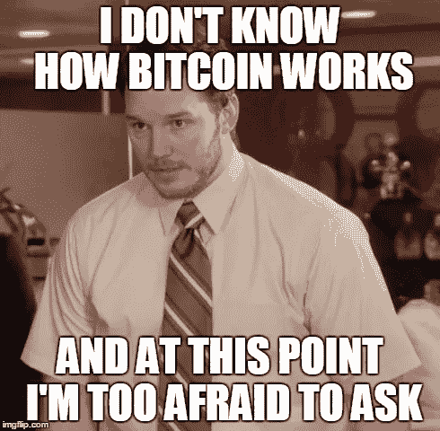
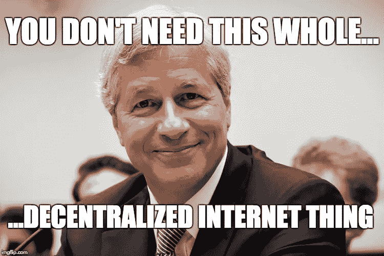
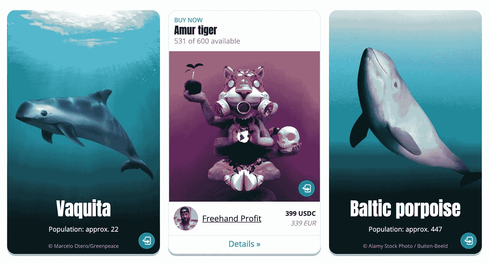

# 科技为善:非政府组织如何使用加密货币？

> 原文：<https://medium.com/geekculture/tech-for-good-how-can-ngos-use-cryptocurrencies-d9a8bb252d24?source=collection_archive---------15----------------------->

It’s never too late to learn something new.

# 不是骗局

阅读关于比特币和加密货币的新闻，很容易认为这都是一个骗局。我也是这样想的，直到三个月前，当我对加密货币、NFT、以太坊等感到好奇的时候..我自学为区块链编码，发现这一切都是非常真实的；悄悄地但迅速地改变世界。

当然有骗局，人们会被骗，但人们也会通过短信、电子邮件甚至电话被骗。每一项技术都可以用来行善或作恶。所以，保持开放的心态，今天花点时间阅读来自可信来源的加密货币信息，如 [WSJ](https://www.youtube.com/watch?v=ALnnsC4l2yM) 。

**快速介绍** 在我们进入本文的主题之前，让我给你快速介绍一下你应该熟悉的主要术语。人们就这些话题中的每一个都写了书，所以这实际上只是为了建立这些术语，以便我们稍后理解它们。此外，还有大量其他术语，开始时可能会让人不知所措:-)

*   **区块链(** [**讲解视频**](https://www.youtube.com/watch?v=kHybf1aC-jE) **):** 区块链本质上是一个交易的数字账本，它被复制并分布在区块链的整个计算机系统网络上。这使得它不仅非常安全，而且非常透明，这意味着每个人都可以看到每个交易。
*   **加密货币/代币(** [**讲解人视频**](https://www.youtube.com/watch?v=422HORNUfkU) **):** 基本上是一种数字货币。他们最著名的是比特币，波动很大，但也有“稳定币”，与美元挂钩，所以非常稳定。最后，还有非加密货币的代币(例如视频游戏中的货币)。
*   **NFT(**[**解说视频**](https://www.youtube.com/watch?v=4dkl5O9LOKg) **):** 不可替代的代币是 2021 年的年度词汇。它们现在最常与独特的图像联系在一起，但你需要知道的是，它是一个独特的、不可互换的单元。假设你有一张数码照片，并且有证据证明这张照片只有一份拷贝。
*   **道(** [**讲解人视频**](https://www.youtube.com/watch?v=KHm0uUPqmVE) **):** 是以编码为计算机程序的规则表示的组织，是透明的，由组织成员控制，不受中央政府的影响。
*   **Web 3.0 (** [**讲解人视频**](https://www.youtube.com/watch?v=nHhAEkG1y2U) **):** 目前少数大公司(亚马逊、脸书、谷歌等)控制着互联网的大块地盘。他们控制着数据和信息。Web 3.0 是一个新的去中心化的互联网，所以信息存储在一个巨大的网络上，每个人都可以访问它。

我再次感到我遗漏了很多重要的东西，但希望这将是这篇文章足够的“速成课程”。

# 对非政府组织的好处？

那么，为什么非政府组织应该考虑采用加密货币或推出自己的代币呢？与传统货币相比，加密货币没有什么优势:

**可追溯性/透明性** 实现这一点有多种方法(工作证明、利益证明)，但你必须知道的是，每笔交易都保存在区块链上，并将永远存在。例如，每个人都可以看到有多少捐款，这些钱去了哪里。相比之下，在网站上捐款，并相信它会到达预期的接收者，你很快就会明白为什么这是非常强大的。

对于非政府组织来说，尽可能多的捐款应该送到预期的受益者手中，节省行政费用和尽快交付资金应该是优先考虑的问题。

加密货币的另一个普遍好处是，没有中间人从中提成或花时间处理交易。像马士基这样的物流供应商已经通过采用这项技术将他们的文件处理时间减少了 40%,并因此每年节省数百万美元。

你可以直接向任何人发送加密货币，如果他们有一个加密钱包地址，它会在几秒钟内到达。

Cryptocurrencies are becoming a threat to existing business models, so not everyone is supporting them.

不是每个人都有银行账户或者有资格申请信用卡。试着想象你的生活不能在互联网上交易。这对贫穷国家的人们来说很难，并造成了障碍，因为他们无法参与互联网经济(他们可能有一些东西可以在网上出售，但如果无法进入银行系统，他们就无法收到钱，等等)。).

是的，你也需要工具来访问你的加密货币，但门槛要低得多。这就是我认为有很多未开发的机会的地方:一个非政府组织可以创建自己的令牌系统，并向需要它的人提供访问权限。为一个正在结束塑料垃圾的非政府组织工作，我可以想象给垃圾收集者代币来换取他们收集的垃圾数量，然后他们可以兑换成实际的商品或现金。

**社区** 非政府组织通常是围绕一个社区发展起来的。团结在一项事业后面并支持这项事业的一个社区或一个伙伴网络。

分散自治组织(DAO)是 NFTs 已经建立的一个概念，在这个概念中，所有持有相同令牌的人都可以对某些事情进行投票，例如他们应该如何处理自己的收入。此外，所有持有人拥有道拥有的部分资产。这就是所谓的细分。例如，如果道拥有价值 100 万美元的资产，有 1000 名 NFT 持有者，每个持有者拥有 1000 美元，甚至可以获得“分红”。

所有这些都是以分散的方式管理的，这降低了管理成本，但同时让每个人都最终了解道的决定。我可以在这里看到一些非政府组织的申请。

# **案例分析**

**Worldcoin**
虽然严格来说不是 NGO，但这家公司的使命是让每个人都能接触到加密货币(目前只有 4%的世界人口拥有它)。他们指出:“技术进步将导致前所未有的经济增长。让我们所有人都能享受这种繁荣将变得越来越重要。”他们通过扫描人们的虹膜来做到这一点，但这种方式不会收集任何个人信息。这是一项具有崇高使命的天才努力。
[在这里阅读他们是如何做到的](https://worldcoin.org/)

Screenshot from [https://www.wwf-nfa.com/en](https://www.wwf-nfa.com/en)

世界自然基金会把 NFT 稀有的概念应用到濒临灭绝的物种上，发行了和它们所剩动物一样多的 NFT。这不仅有助于筹集资金来保护这些濒危物种，还传达了一个令人悲伤的事实，即剩下的动物数量有限。
[从 WWF 这里读到一个 NFT](https://www.wwf-nfa.com/en)

奥里卡
这是 NFT 的一个市场。他们的“使命是通过数字资产加速财富平等”。他们通过让艺术家更容易通过 NFT 的销售筹集资金，并将收入捐给慈善机构来做到这一点。
[点击此处了解更多信息](https://orica.io/)

快速的谷歌搜索显示，有很多非政府组织已经在尝试这种相对较新的技术。这太令人惊讶了，或许这只是过去两年生活在新冠肺炎主导的世界中的结果，这个世界教会了我们为了生存需要改变和适应。

# **结论**

我们只是处在一个新时代的开端。

这感觉就像 90 年代的互联网，每个人都在他们的网站上做实验，尽管创建一个网站非常复杂(你需要一个 HTML 开发人员，这在当时是罕见的)。现在你可以在几个小时内在 Shopify.com 创建一个网上商店，而不需要知道任何关于网站建设的知识。

加密货币、NFT、去中心化金融等也会出现同样的情况。每个人都会有一个“电子钱包”，可以存储不同的代币，你可以用它在网上或商店里支付。这不是另一个没有给人们的生活带来任何价值的“3D”炒作(除了痛苦的鼻子)，这些技术已经在改变企业和人们的生活(这在一些日本城市已经是现实)。所以，如果你是一个非政府组织，或者不是，花一些时间去了解它。这可能是你的一个业务问题的解决方案。

如果你喜欢这篇文章，请不要忘记“鼓掌”并关注我。谢谢大家！