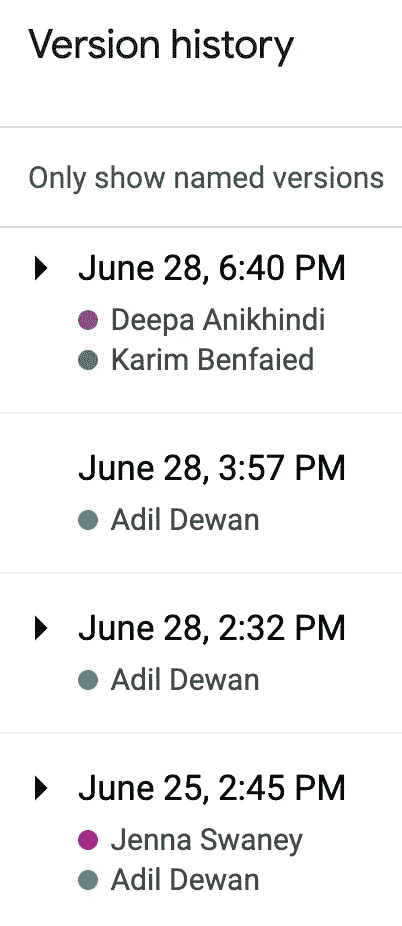
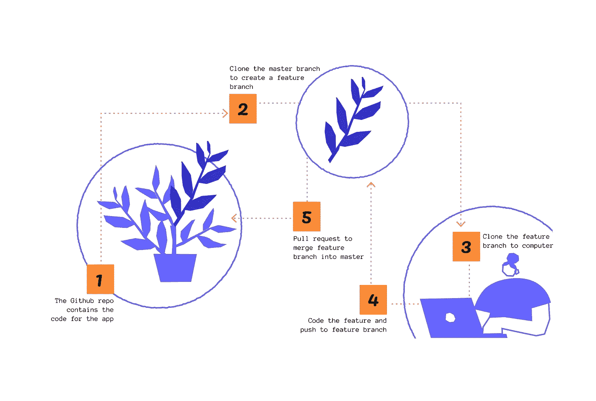

# PMs 技术—什么是提交、分支和拉请求？

> 原文：<https://medium.com/geekculture/tech-for-pms-github-branches-and-pull-requests-77b1d341b09a?source=collection_archive---------12----------------------->

如果你曾经在软件开发人员的听力范围内，你可能听说过以下一些术语:push，pull，pull request (PR)，peer review(也称 PR)，code review，commit，merge，revert，repo，branch，master，feature，Git，GitHub，GitHub Actions，Gitlab…

在我产品生涯的早期，我认为这些是开发人员需要知道的编码术语，只要最终有一个好的特性发布给客户，我就可以应付过去。

但是，随着时间的推移，我开始明白，了解开发人员所做工作的基础知识让我能够在问题出现时感同身受，帮助团队做出权衡，并管理利益相关者的期望。

这是我希望开始时读过的文章…

# TL；速度三角形定位法(dead reckoning)

GitHub 是一个代码库。当开发人员构建一个应用程序时，他们使用 GitHub 来托管应用程序的代码并对其进行更改。有点像共享演示的谷歌幻灯片。

在 GitHub 中，客户看到的最终代码保存在主分支上。开发人员不会直接在主分支中编码。相反，在将代码推送到 GitHub 之前，他们在自己的计算机上编码，通常是推送到一个特性分支。

在功能分支合并到主分支之前，代码必须由另一个开发人员进行审查。这被称为“拉请求”，并确保进入主分支的代码符合团队的标准。

对于一个项目经理来说，了解开发人员如何使用 GitHub 是很有用的，以便在出现问题时能够感同身受。

# 类比

*假设你和 10 位产品经理同事需要为你公司的管理团队制作一份很长的幻灯片演示文稿(设想超过 200 张幻灯片)，展示产品团队在过去一个季度取得的进展&展示下一季度的计划。*

*制作这套幻灯片的一个很好的工具是谷歌幻灯片，因为它可以让你:*

*   *与你的同事同时工作，实时观察你的变化和他们的变化*
*   *轻松定期保存您的更改*
*   *恢复到该副牌的任何先前版本*

一群项目经理搭建一个幻灯片与开发人员编写应用程序没什么不同。

用最简单的话来说，GitHub 就是开发者的 Google Slides。这是一个公共空间(一个代码**“存储库”**或**“回购”**)，供一组开发人员在他们正在开发的应用程序上进行协作。

# **准备您的幻灯片—克隆**

*处理重要的幻灯片时，不太可能直接在最终演示文稿中创建幻灯片。只有干净、高质量的幻灯片才能在那里出现。在开始制作幻灯片之前，第一步是在记事本上为您的幻灯片勾勒出一个大致的结构&故事情节。*

同样，作为一名开发人员，你不会马上就开始在主代码库中编码。相反，你可以复制(**“克隆”**)你在团队的 GitHub repo 中找到的代码，并下载到你自己的电脑 **(** 你的**“本地机器”)。**你的电脑现在就像一个沙箱(或记事本),你可以在这里进行修改，而不会弄乱代码库的其他部分。

# **你的初稿——提交&版本控制**

现在代码在你的电脑上。每当你写了几行代码，并且对它们感到满意时，你就可以保存你所做的。这就是所谓的**“提交”**或**“提交**您的代码**”**。

提交最酷的一点是，它不会覆盖您现有的版本，而是将您的工作保存为一个全新的版本。有点像“另存为”而不是标准的“保存”。因此，如果你搞砸了，需要回到以前的版本，你可以只寻找你想返回的提交。这叫做**“还原”。**

这对开发者来说是一个重要的增值。如果他们发现他们编写的一些代码与代码库的其余部分不兼容(一个**“突破性改变”**)，他们可以简单地恢复到以前的提交。

它类似于谷歌幻灯片中的“版本历史”功能(见下文)。

好了，现在你已经开始在你的电脑上编写你的特性了，一边做一边提交。一旦你为你的特性编写了有意义的部分，你会想尝试将这些代码从你的电脑转移到 GitHub repo，看看它是如何与应用程序的其他代码一起工作的。

# **质量控制—分支和拉动请求**

回到我们的幻灯片类比。假设你的项目经理小组(3 个人)负责展示你的产品范围。

在你们之间，你们可以决定建立一个临时幻灯片平台，这样小组中的每个人都可以添加他们的幻灯片，而其他小组看不到你们的工作进度。只有当你对幻灯片的质量感到满意时，你才会将它们移到主演示文稿中。

这就是“**分支”**的工作原理。主代码库(客户看到的)位于树的主干中🌳，又称**【大师分支】**。只有质量控制的代码才能进入主分支，否则应用程序可能会崩溃。

因此，在开始之前，处理特定特性的子团队克隆主分支，创建**【特性分支】****，这样他们就可以在不影响主代码库的情况下处理特性。**

****

**因此，作为一名开发人员，在你的计算机上开发一个特性，一旦你编写了这个特性中有意义的部分，你就可以**把它从你的计算机上“推”到特性分支。一旦有了它，您就可以看到它与您的子团队的其他变更配合得有多好。****

****一旦您和您的子团队对特性在特性分支上的工作方式感到满意，下一步就是将您的代码放到主分支上。但没那么快…****

****—****

*****如果你要向公司的高管团队展示什么东西，这不仅关系到你的声誉，还关系到团队中每个人的声誉。所以你可以想象，为了进入最终演示，所有的幻灯片都要经过严格的质量检查。质量差的幻灯片的后果可能是灾难性的。*****

****为了将您的代码从 feature 分支转移到 master 分支，您的一位同事需要对它进行质量检查。为此，你需要开一个**“拉请求”或“公关”。**这是你*请求*一个队友检查你的代码是否符合你在团队中设定的标准&，如果符合的话，*将特征分支拉入(或* ***【合并】*** *)* 主分支。****

****你的同事可能会对你的代码有一些反馈，所以你需要在他们给你的公关开绿灯之前先采取行动。这一步对于保持高质量的代码库至关重要&减少应用程序中出现错误的机会。****

****这也是你运行集成测试的时候。你可能还记得 CI/CD 上一篇[文章中的内容。](https://techforpms.medium.com/tech-for-pms-what-is-ci-cd-d85534428693)****

# ******将所有东西放在一起——合并******

*****由于项目管理小组一直在各自独立的部分工作，当幻灯片在最终演示中组合在一起时，可能需要一些调整来使它们组合在一起&确保故事情节流畅。*****

****同样，由于子团队一直在他们的功能分支上独立工作，当他们试图将这些功能分支合并到他们的主分支时，并不总是顺利的。团队经历了**“合并冲突”** 分支不能很好地合作——这些可能是真正的痛苦，有时需要几天时间并延迟对客户的发布****

# ******分享最终版本—发布分支******

****一旦您解决了任何合并冲突，并且确信您的主分支处于良好状态，就该向客户发布您的新功能了。****

****一些团队为此创建了一个单独的分支，称为“**发布分支”。把发布分支想象成一个新版本的应用程序，用户可以从应用商店下载。******

# ****总而言之…****

****…过程看起来有点像这样。****

*   ****获得 GitHub 存储库的访问权限****
*   ****克隆代码库并将其下载到您的计算机上****
*   ****编写代码，每隔几行提交一次****
*   ****将您的代码从计算机推送到功能分支****
*   ****向队友提出拉动请求，对他们的反馈做出反应****
*   ****将特征分支合并到主分支中，解决任何合并冲突****
*   ****创建一个发布分支，并向客户发布应用程序的新版本****

# ****作为项目经理，这对你有什么影响？****

****作为一名项目经理，GitHub、分支和版本控制的来龙去脉在你的日常工作中并不重要。但是拥有这些知识有助于与团队中的开发人员建立建设性的关系。****

****当团队即将发布一个期待已久的特性时，出现了一些复杂的合并冲突。****

****知道一个合并冲突可能是复杂的和非常耗时的，你会同情开发人员的工作。你表现出耐心和理解，放弃常规的冲刺工作来创造能力，管理内部利益相关者对即将到来的发布的期望。从长远来看，你可以和你的团队一起进行回顾，努力实现一个最佳的分支策略。****

****此外，(如果您有一点时间的话)登录 GitHub 并关注 pull 请求也是有益的。前端开发人员经常附上他们在 PR 中编码的截图或 gif。如果你发现有些事情不太对劲，你可以给他们一些反馈。或者简单地记录他们在构建的功能上取得了多少进展。****

# ****进一步阅读****

****你可以想象，这是对真实情况的简化。有些团队甚至不用 GitHub。****

****如果你想更深入地研究这个主题:****

*   ****一如既往，我会推荐贾斯汀·盖奇的精彩博客****
*   ****这篇[产品部的文章](https://www.departmentofproduct.com/blog/github-explained-for-product-managers/)对产品经理来说是稍微详细一些的初级读本****
*   ****你也可以看看这个来自 GitHub 的[精彩解说视频](https://www.youtube.com/watch?v=w3jLJU7DT5E)****