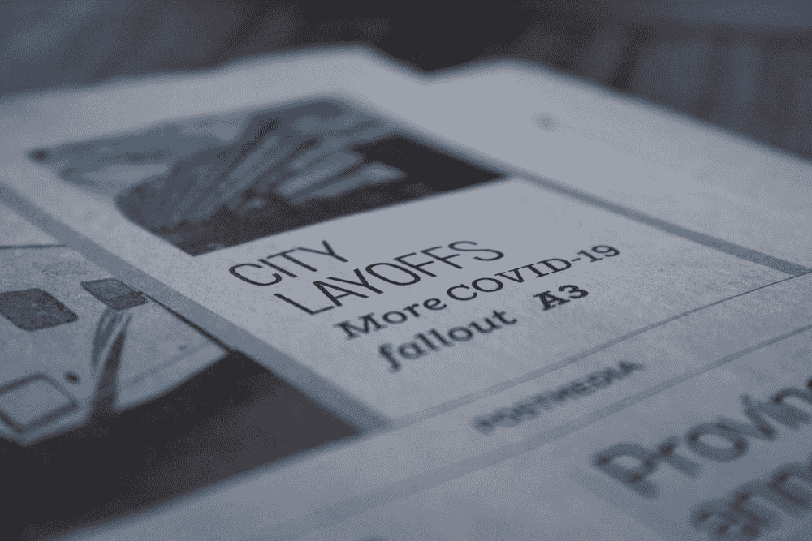

# 技术裁员描述了一个简单的故事:在技术行业工作并不总是有利可图

> 原文：<https://medium.com/geekculture/tech-lay-offs-paint-a-simple-story-it-doesnt-always-pay-to-work-in-tech-7163bd6856ab?source=collection_archive---------4----------------------->

## 初创设计师的观察

History is but a cycle of the same events over and over. Image by [James Yarema](https://unsplash.com/@jamesyarema).

随着最近的裁员，我的 LinkedIn feed 上充满了同情的专业影响者，他们联系那些受到裁员影响的人，为他们找到下一份工作。