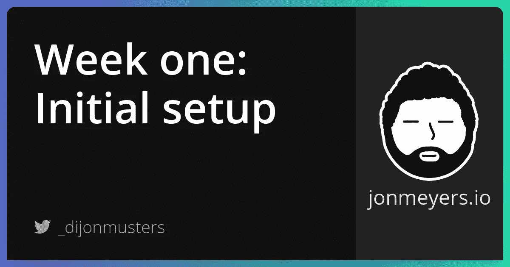

# 构建 SaaS 项目第一周:技术堆栈和初始项目设置

> 原文：<https://medium.com/geekculture/tech-stack-and-initial-project-setup-9abd7baee347?source=collection_archive---------8----------------------->

## 本周的主题是选择我们的技术组合并建立我们的初始项目。我们将使用 Next.js、API routes(无服务器函数)、Prisma、PostgreSQL with Supabase 和 Tailwind。我们 SaaS 项目的大部分将是静态的，因此，我们将在构建时使用 Next 的预生成来生成静态内容。



第一周结束了！多刺激啊！这一周都是关于提出一个想法和配置新项目。我将在构建这个项目的过程中保持 GitHub repo 的最新状态，所以请务必查看！

## 想法

我将建立一个视频教程/课程平台，包含免费和付费课程的集合。创建帐户后，您就可以观看任何免费课程。对于优质内容，您可以选择购买单一课程以永久拥有，或者按月或按年订阅以访问所有优质课程。

## 自述驱动开发(RDD)

我将遵循 Tom Preston-Werner 的[自述驱动开发](https://tom.preston-werner.com/2010/08/23/readme-driven-development.html)方法，即你创建的第一件事是描述你的项目的自述。我从 Tom 的文章中获得的关键信息是:

*   如果不提供价值，为用户制造产品就是浪费时间
*   思考你的软件将如何被使用会给你一条有可实现的里程碑的道路
*   帮助制定技术决策
*   在其他开发人员和利益相关者之间创建共享语言和理解。

你可以查看我的[自述](https://github.com/dijonmusters/courses/blob/master/README.md)来看看我打算建造什么。

## 堆

由于这个项目的大部分可以提前静态生成，我将建立一个 Jamstack 应用程序。这将有助于保持用户的加载速度快，并保持免费的托管成本下降！

## Next.js

因为大部分内容可以在构建时生成，所以我热衷于使用一些东西来简化这个过程——next . js 或 Gatsby。我选择了 Next.js，因为它给了我所追求的所有 SSG(静态站点生成)魔力，而且如果我的应用程序将来确实需要它，它还提供了 SSR(服务器端呈现)!

此外，我非常喜欢 Next 用于生成静态内容的 API。您只需声明一个 getStaticProps 函数，与使用数据的页面组件放在一起。Next.js 将遍历任何声明该函数的组件，并在构建时发出这些请求。我发现这个工作流比 Gatsby 更方便，并且比跳出组件并在 gatsby-node.js 中实现一些数据获取需要更少的上下文切换。

不过这只是个人喜好。这两个框架都非常棒，完全能够构建我们需要的东西！

设置 Next.js 非常简单。只需创建一个新的文件夹，并将其初始化为 NPM 项目。我的项目将被称为“课程”。

```
mkdir courses && cd courses && npm init -y
```

现在来安装 Next.js 及其依赖项。

```
npm i next react react-dom
```

让我们添加一些脚本来构建和运行应用程序。在 package.json 文件中，用下面的代码替换测试脚本(没有人在辅助项目中使用它)。

```
"scripts": {
  "dev": "next dev",
  "build": "next build",
  "start": "next start",
  "export": "next export"
},
```

Next.js 使用基于文件的路由，所以我们可以简单地通过将 React 组件放在 pages 目录中来创建页面。

```
mkdir pages
```

现在创建一个 index.js 文件，并添加以下代码来创建一个欢迎主页。

```
// pages/index.js

const HomePage = () => <h1>Welcome to Courses!</h1>

export default HomePage
```

我们现在有了一个全功能的 Next.js 应用程序。运行下面的命令，并在 [http://localhost:3000](http://localhost3000) 访问它。

```
npm run dev
```

## API 路线

我们将需要一些服务器端代码，以便处理与 Stripe 支付和与数据库交互。这些服务器端代码块将是非常孤立和单一用途的。这是无服务器功能的完美用例，Next.js 让这变得超级简单！

只需在 pages 目录中创建一个 API 文件夹！

```
mkdir pages/api
```

并添加包含以下内容的 test.js 文件。

```
// pages/api/test.js

module.exports = async (req, res) => {
  res.send('it works!')
}
```

就是这样！搞定了！要运行这个无服务器功能，只需进入[http://localhost:3000/API/test](http://localhost:3000/api/test)。

> Next.js 会挑选任何。js 文件放在这个 api 文件夹中，并自动把它们变成无服务器函数！

超级爽！

## SQL 与文档数据库

我们将需要一个数据库来存储我们的用户信息，并记住他们购买了哪些课程。这里有大量的选项，但是首先我们需要决定是使用 SQL db(比如 PostgreSQL)还是文档 db(比如 MongoDB)。

在这两个选项之间需要考虑的最大因素是您希望如何对不同数据之间的关系进行建模。SQL db 可以使用一个复杂的查询将不同表中的数据缝合在一起，而您可能需要在一个文档 db 中执行多个查询，然后自己缝合在一起。

我们的应用程序将被托管在与我们的数据库不同的服务器上——可能在不同的洲——因此，发出一个请求，让数据库做一些艰苦的工作并发回一个较小的数据集可能会更有性能。

同样，这个应用程序的范围很小，所以这可能不是一个问题，但因为我们知道我们至少需要我们的用户和他们购买的课程之间的关系，我将使用 SQL 解决方案。

此外，Jamstack 的方法论完全是为了能够轻松地扩展，我认为随着事情变得越来越复杂，SQL 给了我们比文档数据库更多的选择！

## Supabase

同样，托管 SQL 数据库有一百万种选择。我在过去广泛使用过 Heroku，并强烈推荐，然而，我一直在寻找一个借口来尝试 Supabase，我认为这就是它！

Supabase 是 Firebase 的开源竞争对手。他们提供了一整套服务——数据库托管、查询构建器语言、认证等——然而，我们只是将它作为一个免费的数据库主机。

前往他们的网站并创建一个账户。

一旦你在仪表板上点击“创建一个新项目”——确保使用一个强密码(并将其复制到某个地方，因为我们很快会再次需要它！)并挑选一个地理上离你近的地区！

一旦它完成创建一个数据库，头部到设置>数据库，并复制连接字符串。我们将在下一步需要这个！

## 普里斯马

现在我们需要决定如何与数据库进行交互。我们可以只发送大型 SQL 查询字符串，但我们不再生活在黑暗时代了！

我有 Rails 的背景，并且非常喜欢与数据库交互的 ORM(对象关系映射)风格，所以我打算选择 Prisma！

Prisma 是一个查询生成器。它基本上抽象了复杂的 SQL 查询，并允许您编写 JavaScript 代码来与数据库对话。太牛逼了！你会看到的！

我们开始吧！首先，我们需要将它安装为一个开发依赖项

```
npm i -D prisma
```

现在我们在项目中初始化 Prisma。

```
npx prisma init
```

接下来，我们需要创建我们的模型——我们希望如何表示我们的数据。

```
// prisma/schema.prisma

generator client {
  provider = "prisma-client-js"
}

datasource db {
  provider = "postgresql"
  url      = env("DATABASE_URL")
}

model Course {
  id        Int      @id @default(autoincrement())
  title     String   @unique
  createdAt DateTime @default(now())
  lessons   Lesson[]
}

model Lesson {
  id        Int      @id @default(autoincrement())
  title     String   @unique
  courseId  Int
  createdAt DateTime @default(now())
  course    Course   @relation(fields: [courseId], references: [id])
}
```

在这里，我们正在创建一个包含一系列课程的课程。一节课属于一门课程。

我们现在只专注于我们的课程，用户可以稍后再来！

现在我们想更新我们的。env 和来自 Supabase 连接字符串。

```
// .env

DATABASE_URL="your connecting string"
```

确保将连接字符串中的密码替换为创建 Supabase 项目时使用的密码！

现在我们需要确保添加这个。env 文件到我们的。gitignore，这样就永远不会把我们的秘密交给 GitHub。

```
// .gitignore

node_modules/
.next/
.DS_Store
out/
.env
```

好了，现在我们已经将它连接到一个实际的数据库，我们想告诉它匹配我们的 schema.prisma 文件。我们通过推动变革来做到这一点。

```
npx prisma db push --preview-feature
```

我们需要传递— preview-feature 标志，因为这是一个实验性的特性，将来可能会改变。

现在我们要安装 Prisma 客户机，我们将使用它向我们的数据库发送查询。

```
npm i @prisma/client
```

并根据模式生成我们的客户端。

```
npx prisma generate
```

最后，让我们创建一个无服务器函数，在我们的数据库中创建一些数据，并确认一切都连接正确！

```
// pages/api/create-course

import { PrismaClient } from '@prisma/client'

const prisma = new PrismaClient()

module.exports = async (req, res) => {
  await prisma.course.create({
    data: {
      title: 'Learning to code!',
      lessons: {
        create: { title: 'Learn the terminal' },
      },
    },
  })
  // TODO: send a response
}
```

这将创建一个新的课程，标题为“学习编码！”，但也会创造出“学习终端”的第一课。

这就是使用 Prisma 这样的查询生成器的强大之处！SQL 中非常复杂的查询非常容易编写和推理！

让我们添加另一个 prisma 查询来选择我们已经写入 DB 的数据，并将其作为响应发送回去。

```
// pages/api/create-course.js

module.exports = async (req, res) => {
  // write to db
  const courses = await prisma.course.findMany({
    include: {
      lessons: true,
    },
  })
  res.send(courses)
}
```

我们的整个函数应该是这样的。

```
// pages/api/create-course.js

import { PrismaClient } from '@prisma/client'

const prisma = new PrismaClient()

module.exports = async (req, res) => {
  await prisma.course.create({
    data: {
      title: 'Learning to code!',
      lessons: {
        create: { title: 'Learn the terminal' },
      },
    },
  })
  const courses = await prisma.course.findMany({
    include: {
      lessons: true,
    },
  })
  res.send(courses)
}
```

太棒了。现在，我们可以通过导航到[http://localhost:3000/API/create-course](http://localhost:3000/api/create-course)来运行这个无服务器功能。

您应该恢复新创建的课程和课程。通过检查我们在 Supabase 仪表板中的数据，我们还可以看到这实际上已经被写入 DB。

我建议删除这个无服务器功能，避免以后不小心运行，增加不必要的课程！如果您想将其作为参考，只需注释掉创建该课程的代码。

```
// api/create-course.js

import { PrismaClient } from '@prisma/client'

const prisma = new PrismaClient()

module.exports = async (req, res) => {
  // await prisma.course.create({
  //   data: {
  //     title: 'Learning to code!',
  //     lessons: {
  //       create: { title: 'Learn the terminal' },
  //     },
  //   },
  // })
  // const courses = await prisma.course.findMany({
  //   include: {
  //     lessons: true,
  //   },
  // })
  // res.send(courses)
  res.send('This is only here as a guide!')
}
```

好吧！让我们把这个连接到下一个！

## SSG

回到我们的 pages/index.js 组件，我们希望查询所有课程的数据库，并在列表中显示它们。当用户访问我们的站点时，我们可以发出这个请求，但是由于这个数据不会经常改变，这将意味着对我们的 API 的大量不必要的请求，以及大量用户反复等待相同的数据！

如果我们只是在构建新版本的应用程序时请求这些数据，并将结果保存到一个简单的 HTML 页面中，会怎么样呢？这将大大加快速度，让我们的用户满意！快乐的用户就是想买课程的用户！

Next.js 通过一个名为 getStaticProps 的函数使这变得非常简单。让我们扩展 index.js 文件来导出这个函数。

```
export const getStaticProps = async () => {
  const data = await getSomeData()

  return {
    props: {
      data, // this will be passed to our Component as a prop
    },
  }
}
```

因为这将在 Next.js 构建我们的应用程序时运行，所以它将在节点进程中运行，而不是在浏览器中。这可能看起来令人困惑，因为它是从将在用户浏览器中运行的组件中导出的，但是在构建时没有用户——没有浏览器！

因此，我们需要一种方法从节点向我们的 API 发出请求。我打算用 Axios，因为我真的很喜欢这个 API，但是任何 HTTP 请求库都可以！

```
npm i axios// pages/index.js

import axios from 'axios'

// component declaration

export const getStaticProps = async () => {
  const { data } = await axios.get('http://localhost:3000/api/get-courses')

  return {
    props: {
      courses: data,
    },
  }
}

// component export
```

我们从 getStaticProps 返回的任何内容都将被传递到我们的组件中，所以让我们在组件中显示 JSON blob。

```
// pages/index.js

const Homepage = ({ courses }) => {
  return (
    <div>
      <h1>Courses</h1>
      <pre>
        {JSON.stringify(courses, null, 2)}
      </pre>
    </div>
  )
}

export default Homepage
```

> 我们可以传递 JSON.stringify 额外的参数(null 和 2)来打印我们的数据。

我们的整个组件应该是这样的。

```
// pages/index.js

import axios from 'axios'

const Homepage = ({ courses }) => {
  return (
    <div>
      <h1>Courses</h1>
      <pre>
        {JSON.stringify(courses, null, 2)}
      </pre>
    </div>
  )
}

export const getStaticProps = async () => {
  const { data } = await axios.get('http://localhost:3000/api/get-courses')

  return {
    props: {
      courses: data,
    },
  }
}

export default Homepage
```

现在我们只需要创建 get-courses 无服务器函数。

```
// pages/api/get-courses.js

import { PrismaClient } from '@prisma/client'
const prisma = new PrismaClient()

module.exports = async (req, res) => {
  const courses = await prisma.course.findMany({
    include: {
      lessons: true,
    },
  })
  res.send(courses)
}
```

就是这样！我们现在应该有一个端到端的完整系统了！

*   Next.js 在构建时从无服务器功能请求我们的课程
*   我们的无服务器功能是使用 Prisma 来查询 Supabase 数据库中的课程
*   结果是通过管道从 Supabase ->无服务器函数-> Next.js，这是烘焙成一个静态页面
*   用户请求此页面并可以看到课程

## 顺风

我也决定挑战我的观点，即顺风只是丑陋的内嵌样式，并实际尝试一下！如果我不喜欢，你会经常收到我的来信！

我们来装吧！

```
npm i -D tailwindcss@latest postcss@latest autoprefixer@latest
```

接下来让我们初始化一些配置。

```
npx tailwindcss init -p
```

我们还可以告诉 Tailwind 删除 prod 中任何未使用的样式。

```
// tailwind.config.js

module.exports = {
  purge: ['./pages/**/*.{js,ts,jsx,tsx}', './components/**/*.{js,ts,jsx,tsx}'],
  darkMode: false, // or 'media' or 'class'
  theme: {
    extend: {},
  },
  variants: {
    extend: {},
  },
  plugins: [],
}
```

我们要在每个页面上导入 Tailwind 的 CSS，所以将创建一个 _app.js 文件，它会自动包装每个页面组件。

```
import 'tailwindcss/tailwind.css'
import '../styles/globals.css'

const MyApp = ({ Component, pageProps }) => <Component {...pageProps} />

export default MyApp
```

最后，创建一个 styles/globals.css 文件来导入顺风位。

```
// styles/globals.css

@tailwind base;
@tailwind components;
@tailwind utilities;
```

太棒了，现在我们已经配置了顺风。查看[他们的文档](https://tailwindcss.com/docs)中的示例！

我不会在整个博客系列中关注这个项目的风格方面，但可以随意查看[回购](https://github.com/dijonmusters/courses)的漂亮例子。

## 巨大的资源

*   [自述驱动开发](https://tom.preston-werner.com/2010/08/23/readme-driven-development.html)
*   [Next.js 文档](https://nextjs.org/docs/getting-started)
*   [next . js app 中的 Prisma](https://www.prisma.io/docs/getting-started/setup-prisma/add-to-existing-project-typescript-postgres)
*   [超级文档](https://supabase.io/docs/guides/platform)

## 跟我来

[网站](https://jonmeyers.io/)

[推特](https://twitter.com/_dijonmusters)

[YouTube](https://www.youtube.com/channel/UCPitAIwktfCfcMR4kDWebDQ)

## 下星期

[托管在 Vercel 上，使用 GitHub 自动部署并配置自定义域](https://jonmeyers.io/blog/build-a-saas-platform-with-stripe/hosting-on-vercel-automatic-deploys-with-github-and-configuring-custom-domains)